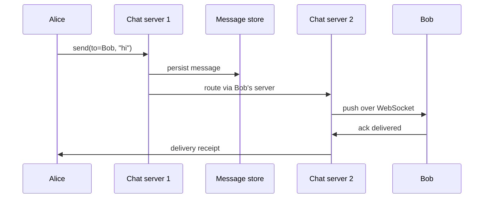

## Before you start

You need [http-https-websockets](http-https-websockets) — the transport choice is the first real decision. [message-queues](message-queues) and [consistency-models](consistency-models) both appear in the deep dive.

## In one sentence

A **chat system** delivers messages between users in near real time, guarantees each message is stored until every recipient has actually received it, and shows them in the same order to everyone in the conversation.

## Why it matters

Chat is the best test of whether you understand *stateful* connections. Every other design in this chapter is request/response — a client asks, a server answers, and nothing persists between calls. Chat inverts that: the server must push data to a client that isn't asking, which means holding millions of live connections and knowing exactly which server holds which user. That single difference is what interviewers are probing.

## Requirements clarification

**Functional:** one-to-one messaging; group chat with a bounded size; online/offline presence; delivery and read receipts; message history; push notification when the app is closed.

**Non-functional:** delivery latency under ~500ms; messages must never be lost; ordering consistent within a conversation; support ~50M daily active users.

**Ask the interviewer:** What's the maximum group size — 100 or 100,000? That changes fan-out completely. Do we store message history forever, or delete after delivery (WhatsApp's model) — this is the single biggest storage question. Do we need end-to-end encryption? Are read receipts required? Is strict global ordering needed, or just per-conversation?

## The intuition

HTTP is a vending machine: you insert a request, you get a response, the transaction ends. That works badly for chat, because the server has news for you at unpredictable times and has no way to hand it over.

The fix is to keep a phone line open. A **WebSocket** is a persistent, bidirectional connection: after an initial HTTP handshake, both sides can send whenever they like until someone hangs up. The cost is that the connection is *stateful* — one specific server is holding that socket, so to reach a user you must first find which server has their line.

Polling ("any messages? any messages?") is the alternative, and it is wasteful in both directions: too frequent and you burn battery and server capacity on empty answers, too infrequent and messages feel slow.

## How it actually works

Users connect to **chat servers** that hold their WebSocket. A **service discovery** layer records which server holds which user, usually in Redis. Sending a message means: persist it, look up where the recipient is connected, and forward it to that server, which pushes it down the socket.



If Bob is offline, there is no socket to push to. The message stays in a per-user **inbox** (a message queue keyed by recipient), and a push notification goes out via APNs or FCM. When Bob reconnects, he drains everything queued since his last acknowledged message.

Message IDs must be **sortable**, not random. A UUID gives uniqueness but no ordering, so clients can't sort a conversation correctly. Use a Snowflake-style ID — timestamp plus sequence — so sorting by ID sorts by time.

## Worked example

Capacity, and the number that surprises people — connection memory:

```js
const DAU = 50_000_000;
const messagesPerUserPerDay = 40;
const secondsPerDay = 86_400;

const messagesPerDay = DAU * messagesPerUserPerDay;
const avgQPS = messagesPerDay / secondsPerDay;
const peakQPS = avgQPS * 3;                     // chat is spiky (evenings)

console.log(`messages/day: ${(messagesPerDay / 1e9).toFixed(1)}B`);
console.log(`avg QPS:      ${avgQPS.toFixed(0)}`);
console.log(`peak QPS:     ${peakQPS.toFixed(0)}`);

// Storage, if history is kept
const bytesPerMessage = 200;                    // text + metadata
const storagePerYear = messagesPerDay * 365 * bytesPerMessage;
console.log(`storage/year: ${(storagePerYear / 1e12).toFixed(0)} TB`);

// The constraint people miss: concurrent WebSocket connections
const concurrentFraction = 0.2;                 // 20% connected at once
const concurrent = DAU * concurrentFraction;
const kbPerConnection = 10;                     // socket buffers + state
const connMemoryGB = (concurrent * kbPerConnection * 1024) / 1e9;
const connectionsPerServer = 100_000;           // realistic per-box ceiling

console.log(`concurrent conns: ${(concurrent / 1e6).toFixed(0)}M`);
console.log(`memory for conns: ${connMemoryGB.toFixed(0)} GB`);
console.log(`servers needed:   ${Math.ceil(concurrent / connectionsPerServer)}`);
```

Output:

```
messages/day: 2.0B
avg QPS:      23148
peak QPS:     69444
storage/year: 146 TB
concurrent conns: 10M
memory for conns: 102 GB
servers needed:   100
```

The interesting result is the last one. You need roughly 100 chat servers not because of CPU or message throughput, but purely to hold 10 million open sockets. Chat servers are sized by *connection count*, which is why they're kept deliberately thin — connection handling only — with business logic elsewhere.

146 TB/year is also why WhatsApp historically deleted messages once delivered: storage, not delivery, is the dominant long-run cost.

## A second example — when it gets harder

Two hard parts. The first: **guaranteeing delivery when the network is unreliable.**

A message can be lost after the server accepts it but before the client receives it, and the client can receive it but have its acknowledgement lost — in which case a retry delivers a duplicate. You cannot prevent both loss and duplication, so you choose: deliver **at least once** and make duplicates harmless by deduplicating on a client-generated ID.

```js
// Client generates the ID, so a retry of the SAME message is detectable
const seen = new Set();

function receiveMessage(msg) {
  if (seen.has(msg.clientMessageId)) {
    return { status: 'duplicate-ignored' };   // retry arrived; drop it
  }
  seen.add(msg.clientMessageId);
  return { status: 'delivered', text: msg.text };
}

const m = { clientMessageId: 'alice-7f3a', text: 'hello' };
console.log(receiveMessage(m));  // { status: 'delivered', text: 'hello' }
console.log(receiveMessage(m));  // { status: 'duplicate-ignored' }
```

The client generating the ID is what makes this work — a server-generated ID would differ on each retry, so the duplicate would be invisible.

The second hard part: **ordering.** Server receive-time ordering is wrong, because two messages sent milliseconds apart can arrive at different servers with clock skew between them and get flipped. Clients disagree, and a reply appears above the message it answers.

The practical fix is to scope ordering to what actually matters. Nobody can perceive global ordering across all conversations — they only notice it *within one conversation*. So assign each conversation a monotonically increasing sequence number from a single authority for that conversation (the shard that owns it), and order by that. This turns an impossible distributed-clock problem into a per-shard counter.

| Ordering approach | Guarantee | Problem |
|---|---|---|
| Client timestamp | None | Clocks lie; a device set wrong reorders everything |
| Server receive time | Weak | Clock skew across servers flips near-simultaneous messages |
| Per-conversation sequence | Strong within a conversation | Needs a single sequencer per conversation |
| Global sequence | Total order | Does not scale — one bottleneck for the whole system |

**At 10x scale**, group chat becomes the constraint. A 100,000-member group turns one message into 100,000 pushes — the same fan-out problem as the news feed, and the same answer applies: for very large groups, stop pushing and let clients pull on open. Shard chat servers by user ID with consistent hashing so a server dying doesn't scatter every user's routing entry. And keep presence cheap — broadcasting "user is online" to every contact of every user is an O(n²) storm, so update presence lazily and only for contacts with the conversation actually open.

## Quick reference

| Concern | Choice | Reason |
|---|---|---|
| Transport | WebSocket | Server must push; polling wastes battery and capacity |
| Message ID | Snowflake-style (time + sequence) | Sortable by ID; UUIDs are not |
| Delivery guarantee | At least once + client-side dedupe | Exactly-once is unachievable over a lossy network |
| Offline delivery | Per-user inbox queue + push notification | No socket exists to push to |
| Ordering scope | Per conversation | Global ordering doesn't scale and nobody perceives it |
| Server sharding | Consistent hashing on user ID | Limits routing churn when a server is added or lost |
| Storage | Delete after delivery, or tier to cold storage | 146 TB/year of history dominates cost |

## Common mistakes

- Choosing HTTP polling for real-time delivery, then discovering it costs more than WebSockets while feeling slower.
- Using random UUIDs as message IDs, leaving clients unable to sort a conversation.
- Promising exactly-once delivery — it is not achievable end-to-end; the honest answer is at-least-once plus idempotent handling.
- Sizing chat servers by CPU or message rate when the real limit is open connections per box.
- Forgetting the offline path entirely, so messages to a disconnected user vanish.
- Broadcasting presence updates to every contact, creating a quadratic message storm at login peaks.

## What interviewers ask

- **WebSockets or long polling, and why?** — WebSockets, because the server initiates delivery and a persistent bidirectional socket avoids the repeated handshakes and empty responses polling requires. Long polling is the fallback where WebSockets are blocked by intermediaries.
- **How do you find which server holds a given user's connection?** — A service discovery table (typically Redis) mapping user ID to chat server, written on connect and removed on disconnect. Sending a message is a lookup followed by a forward to that specific server.
- **How do you guarantee a message is never lost?** — Persist before acknowledging the sender, deliver at least once with retries until the recipient acks, and deduplicate on a client-generated message ID so retries are harmless. Loss and duplication are a trade-off; you pick duplication and neutralise it.
- **How do you keep message order consistent for both participants?** — Assign a per-conversation sequence number from the single shard that owns the conversation, and sort by it. Server clocks are not trustworthy for ordering, and global sequencing would be a system-wide bottleneck.
- **What happens when the recipient is offline?** — The message goes to a per-user inbox queue and a push notification is sent via APNs/FCM. On reconnect, the client sends its last acknowledged message ID and drains everything after it.
- **How would you support 100,000-member groups?** — Stop fanning out. Beyond a threshold, write the message once to the group's log and let clients pull it when they open the conversation, exactly as you would treat a celebrity account in a news feed.

## Practice

1. Recompute the server count if concurrent connections rise to 40% of DAU and each server holds only 50,000 sockets. What breaks first — memory or server count?
2. Extend `receiveMessage` so the dedupe set doesn't grow forever: bound it by conversation and expire old IDs, and describe what happens if a retry arrives after expiry.
3. Design the reconnect protocol. What exactly does the client send on reconnect, and how does the server determine which messages to replay without resending the entire history?

## Where to go next

[design-notification-system](design-notification-system) handles the offline half of this design — the push notification path — and generalises it to email and SMS with retries and deduplication.
