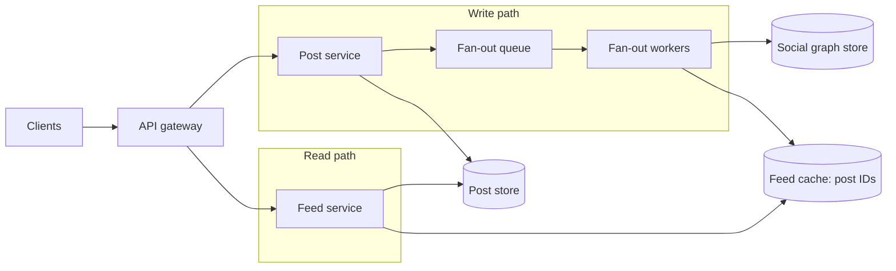
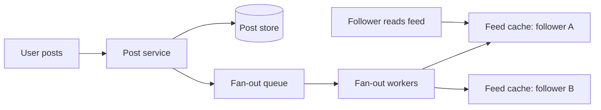

## Before you start

You need [caching-strategies](caching-strategies) and [message-queues](message-queues) — the whole design hinges on both. [database-sharding](database-sharding) helps for the storage layer.

## In one sentence

A **news feed** shows each user a personalised, reverse-chronological list of posts from the people they follow — and the entire design problem is deciding *when* to do the work of assembling it: at post time, or at read time.

## Why it matters

The feed is the canonical "there is no right answer, only trade-offs" question, which is why it appears so often at senior level. The naive design — query everyone you follow and merge the results when the user opens the app — works perfectly for a thousand users and collapses entirely at a million. Getting to the fan-out discussion unprompted, and then recognising that neither pure strategy works at scale, is the single clearest senior signal in this whole chapter.

## Requirements clarification

**Functional:** publish a post; view a feed of posts from people you follow, newest first; feed is paginated and loads incrementally.

**Non-functional:** feed loads in under ~200ms; eventual consistency is fine (a few seconds' delay before a post appears is acceptable); read-heavy; highly available over strictly consistent.

**Ask the interviewer:** Is the feed strictly chronological or ranked by relevance? What's the follower distribution — do we have celebrities with 100M followers? How fresh must the feed be? Can we show a slightly stale feed? Do we support media, or just text? The follower-distribution question is the important one: it determines whether the standard answer works at all.

## The intuition

Two ways to run a newspaper delivery service.

**Fan-out on write (push):** the moment a story is written, you print copies and post one through the letterbox of every subscriber. Delivery is expensive, but readers just pick up their mail — instant.

**Fan-out on read (pull):** you print nothing. When a reader wants news, they visit every publisher they subscribe to and collect the latest. Publishing is free, but reading is slow and gets slower the more you subscribe to.

Feeds are read far more than written, so pushing at write time is the default. The trouble starts when one publisher has 100 million subscribers.

Because the two paths are optimised for opposite things, they end up as two distinct halves of the architecture:



The feed cache is the seam between the halves: workers write into it, the read path only ever reads from it. That is what makes a feed read cheap — the expensive work already happened, in the background, before anyone asked.

## How it actually works

With **fan-out on write**, publishing a post triggers a background job that looks up the author's followers and appends the post ID to each follower's precomputed feed list — typically a capped list in Redis, holding a few hundred post IDs. Reading is then a single cache read.



The fan-out is asynchronous — the poster gets a response immediately, and workers deliver in the background. That's why a friend's post sometimes takes a few seconds to appear: you are seeing eventual consistency by design.

Feeds store **post IDs, not post content**. Storing the full post in every follower's feed would duplicate the same text millions of times; storing IDs keeps each feed tiny, and the client hydrates the actual content from a separate cache in one batch fetch.

## Worked example

The capacity numbers, and the fan-out cost that drives the whole design:

```js
const DAU = 300_000_000;              // 300M daily active users
const postsPerUserPerDay = 2;
const feedViewsPerUserPerDay = 10;
const secondsPerDay = 86_400;

const postsPerDay = DAU * postsPerUserPerDay;
const writeQPS = postsPerDay / secondsPerDay;
const readQPS = (DAU * feedViewsPerUserPerDay) / secondsPerDay;

console.log(`posts/day:  ${(postsPerDay / 1e6).toFixed(0)}M`);
console.log(`write QPS:  ${writeQPS.toFixed(0)}`);
console.log(`read QPS:   ${readQPS.toFixed(0)}`);

// The number that decides the architecture: fan-out writes per second
const avgFollowers = 200;
const fanoutWritesPerSec = writeQPS * avgFollowers;
console.log(`fan-out writes/sec: ${(fanoutWritesPerSec / 1e6).toFixed(2)}M`);

// Storage: feeds hold IDs, not content
const bytesPerPostId = 8;
const feedLength = 500;                       // cap each feed at 500 posts
const feedCacheBytes = DAU * feedLength * bytesPerPostId;
console.log(`feed cache: ${(feedCacheBytes / 1e12).toFixed(2)} TB`);

// A celebrity post is a single write that explodes into millions
const celebrityFollowers = 100_000_000;
const workerWritesPerSec = 10_000;
console.log(`celebrity fan-out: ${celebrityFollowers.toExponential(1)} writes`);
console.log(`at ${workerWritesPerSec}/s on one worker: ${(celebrityFollowers / workerWritesPerSec / 60).toFixed(0)} min`);
```

Output:

```
posts/day:  600M
write QPS:  6944
read QPS:   34722
fan-out writes/sec: 1.39M
feed cache: 1.20 TB
celebrity fan-out: 1.0e+8 writes
at 10000/s on one worker: 167 min
```

1.39 million fan-out writes per second is the headline number — the system does 200x more internal writes than user-facing ones. And a single celebrity post takes nearly three hours to deliver on one worker. That last line is the reason pure fan-out on write is not a viable design.

## A second example — when it gets harder

The **celebrity problem** is the deep dive, and it is where the interview is won.

Fan-out on write assumes follower counts are roughly uniform. They are not — they follow a power law. Most users have a few hundred followers; a handful have tens of millions. When a celebrity posts, one write becomes 100 million writes, which floods the queue, delays fan-out for every ordinary user behind it, and delivers the celebrity's own post minutes or hours late.

Making the workers parallel helps but doesn't solve it: 100 million writes at 10,000/sec still needs 167 worker-minutes of capacity, provisioned for a spike that happens unpredictably.

**The answer is a hybrid**, and every strong candidate arrives here:

| Author type | Strategy | Why |
|---|---|---|
| Normal user (< ~10k followers) | Fan-out on **write** | Cheap to push; keeps reads a single cache hit |
| Celebrity (> ~10k followers) | Fan-out on **read** | One write instead of millions; pulled on demand |

At read time, a user's feed becomes a merge of two sources: their precomputed feed cache (containing posts from all the normal accounts they follow), plus a live pull of recent posts from the handful of celebrities they follow. Because a user follows very few celebrities, that live pull is small and cheap — and the merge is a k-way merge of already-sorted lists.

```js
// Merging the pushed feed with live-pulled celebrity posts
function mergeFeed(pushedFeed, celebrityPosts, limit = 20) {
  return [...pushedFeed, ...celebrityPosts]
    .sort((a, b) => b.timestamp - a.timestamp)   // newest first
    .slice(0, limit);
}

const pushed = [
  { id: 'p1', author: 'alice', timestamp: 1000 },
  { id: 'p2', author: 'bob', timestamp: 950 },
];
const celebrity = [{ id: 'c1', author: 'celeb', timestamp: 980 }];

console.log(mergeFeed(pushed, celebrity).map(p => `${p.id}@${p.timestamp}`));
// [ 'p1@1000', 'c1@980', 'p2@950' ] — celebrity post slots in by timestamp
```

The threshold is a tuning knob, not a constant. Set it too low and you lose the read-performance benefit for too many users; too high and celebrity fan-outs still hurt. Say that out loud in an interview — recognising it as a tunable parameter rather than a magic number is the mark of someone who has operated a system like this.

**At 10x scale**, three more things break. Inactive users waste enormous fan-out effort — of 300M DAU you may have billions of registered accounts, so skip fan-out to anyone who hasn't logged in for 30 days and rebuild their feed lazily on return. Feed caches need sharding by user ID with consistent hashing so adding capacity doesn't invalidate every feed. And ranking (relevance instead of pure chronology) turns the read path into a scoring problem, usually solved by fetching a larger candidate set and ranking it with a model at read time.

## Quick reference

| Aspect | Fan-out on write (push) | Fan-out on read (pull) |
|---|---|---|
| Work done at | Post time | Read time |
| Read latency | Very low — one cache read | High — query N followees and merge |
| Write cost | O(followers) — huge for celebrities | O(1) |
| Wasted work | High — inactive users' feeds still built | None |
| Feed freshness | Slight delay (async workers) | Always current |
| Best for | Normal users, read-heavy workloads | Celebrities, inactive users |

## Tools & frameworks

These are the concrete technologies worth naming at the whiteboard for this design.

| Tool | What it's for | Reach for it when |
|---|---|---|
| [Redis](https://redis.io/docs/latest/) | Sorted sets holding precomputed per-user timelines | You fan out on write and reads must be O(1) |
| [Kafka](https://kafka.apache.org/documentation/) | The fan-out pipeline for new posts | You need "post created" decoupled from "N timelines updated" |
| [Cassandra](https://cassandra.apache.org/doc/latest/) | Wide rows of timeline entries | Timelines are too large to keep entirely in Redis |
| [PostgreSQL](https://www.postgresql.org/docs/current/) | Source of truth for posts and follows | The social graph and the content still need a consistent home |

The interview is really about fan-out-on-write versus on-read and the celebrity problem; the tools are secondary to that choice.

## Common mistakes

- Storing full post content in every follower's feed instead of post IDs, multiplying storage by the average follower count.
- Doing fan-out synchronously inside the post request, so posting blocks until millions of writes finish.
- Presenting fan-out on write as the answer without ever mentioning the celebrity problem — the single most common failure on this question.
- Forgetting that feeds must be capped; an uncapped feed list grows forever and eventually will not fit in cache.
- Fanning out to users who have not opened the app in months, burning most of your write capacity on feeds nobody reads.

## What interviewers ask

- **Fan-out on write or on read?** — Neither alone. Push for normal users to keep reads fast, pull for high-follower accounts to avoid write explosions, and merge the two at read time. Naming the hybrid is the expected senior answer.
- **What happens when a user with 100 million followers posts?** — A pure push design turns one write into 100 million, which at 10,000 writes/sec is over two and a half hours of work and starves every other user's fan-out. You exclude such accounts from fan-out and pull their posts at read time instead.
- **Why store post IDs in the feed rather than the posts themselves?** — Content duplicated across every follower's feed multiplies storage by hundreds and makes edits or deletions impossible to propagate. IDs keep feeds small and let a single canonical copy of the post be hydrated from cache.
- **How do you keep the feed consistent when a post is deleted?** — You don't remove it from millions of cached feeds. Filter at hydration time: the feed still holds the ID, but fetching the content returns nothing and the client skips it. Fixing the read path is far cheaper than rewriting every feed.
- **Why is eventual consistency acceptable here?** — Nobody can tell whether a post arrived instantly or three seconds ago, and the availability and throughput gained by asynchronous fan-out vastly outweighs the cost. This is a deliberate CAP trade-off, not a compromise.

## Practice

1. Recompute the fan-out write rate if average followers rise from 200 to 500. At what average follower count does fan-out on write stop being feasible on your worker fleet?
2. Extend `mergeFeed` to deduplicate posts appearing in both sources, and to page correctly using a cursor rather than an offset.
3. Design the logic that decides whether a given author is fanned out or pulled, including what happens when a user crosses the threshold mid-day — do their existing followers' feeds need rebuilding?

## Where to go next

[design-chat-system](design-chat-system) takes the opposite trade-off — it needs real-time delivery and per-message ordering guarantees a feed never requires, so comparing the two sharpens both.
