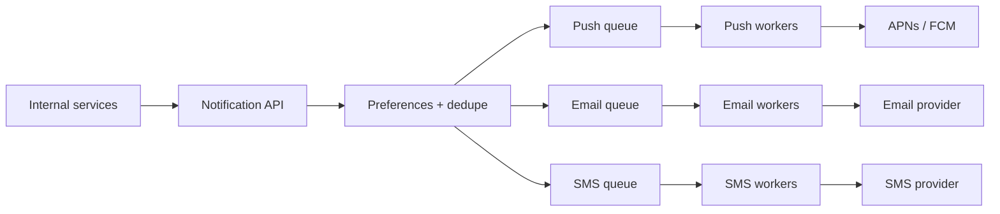

## Before you start

You need [message-queues](message-queues) — queues are the backbone of this entire design. [design-rate-limiter](design-rate-limiter) matters too, since throttling appears in two different places here.

## In one sentence

A **notification system** accepts events from many internal services and delivers them to users through whichever channel fits — push, email, SMS, or in-app — while surviving the fact that every one of those delivery channels is an unreliable third party.

## Why it matters

This design tests something the flashier ones don't: how you handle failure you cannot prevent. You do not own APNs, FCM, or your email provider, and they will be slow, rate-limited, or down. The interviewer is watching whether you build retries, deduplication, and isolation between channels, or whether you draw a straight line from service to provider and assume it always works.

It is also the design most likely to cause real harm when wrong. A retry bug here doesn't drop a request — it sends the same user 500 push notifications at 3am.

## Requirements clarification

**Functional:** accept notification requests from internal services; support push, SMS, email, and in-app; respect per-user preferences and opt-outs; support both immediate and scheduled sends; templating.

**Non-functional:** never lose a notification; never send an accidental duplicate; a slow channel must not block others; handle bulk sends of millions without starving time-critical ones.

**Ask the interviewer:** What's the priority model — is a 2FA code treated like a marketing blast? Those need completely different paths. Do we guarantee ordering? What's the acceptable delivery delay per channel? Do we need delivery-status tracking and read receipts? Are notifications ever aggregated ("5 people liked your post" instead of five notifications)?

## The intuition

Think of a postal sorting office. Letters arrive from many senders in many formats. The office does not deliver anything itself — it validates addresses, sorts by destination type, and hands each item to the right carrier: air mail, courier, local van. If one carrier is on strike, the others keep running, and the office holds the affected mail rather than throwing it away.

The critical design choice is that sorting is **decoupled** from delivery. The service asking for a notification gets an immediate acknowledgement and moves on; the actual sending happens later, in the background, with retries. Without that decoupling, a service posting an order confirmation would block on a slow SMS provider.

## How it actually works

A notification service accepts a request, applies user preferences, renders the template, and places a job on a **per-channel queue**. Workers dedicated to each channel consume those queues and call the third-party provider.



Separate queues per channel are the important structural decision. One shared queue means a backed-up SMS provider stalls email and push behind it — **head-of-line blocking**. Separate queues isolate failure to the affected channel.

Priority needs separate queues too. A 2FA code must not queue behind a ten-million-recipient marketing campaign, so high-priority traffic gets its own queue and its own workers.

When a provider fails, retry with **exponential backoff and jitter**: wait 1s, 2s, 4s, 8s, with a random offset so thousands of failed jobs don't all retry simultaneously and hammer a recovering provider. After a retry budget is exhausted, the job goes to a **dead letter queue** for inspection rather than being silently dropped.

## Worked example

Capacity, plus the retry schedule that keeps a struggling provider alive:

```js
const users = 100_000_000;
const notificationsPerUserPerDay = 5;
const secondsPerDay = 86_400;

const perDay = users * notificationsPerUserPerDay;
const avgQPS = perDay / secondsPerDay;
console.log(`notifications/day: ${(perDay / 1e6).toFixed(0)}M`);
console.log(`average QPS:       ${avgQPS.toFixed(0)}`);

// Bulk campaigns are the real load: sent in a short window, not spread out
const campaignSize = 10_000_000;
const campaignWindowMinutes = 30;
const campaignQPS = campaignSize / (campaignWindowMinutes * 60);
console.log(`campaign QPS:      ${campaignQPS.toFixed(0)}`);
console.log(`peak vs average:   ${(campaignQPS / avgQPS).toFixed(1)}x`);

// Worker fleet sizing, given provider latency
const providerLatencyMs = 200;
const perWorkerQPS = 1000 / providerLatencyMs;      // 5 sends/sec/worker
console.log(`workers for campaign: ${Math.ceil(campaignQPS / perWorkerQPS)}`);

// Exponential backoff with jitter
function backoffMs(attempt, baseMs = 1000, capMs = 60_000) {
  const exponential = Math.min(capMs, baseMs * 2 ** attempt);
  const jitter = Math.random() * exponential * 0.3;  // spread the retry storm
  return Math.round(exponential + jitter);
}

for (let attempt = 0; attempt < 6; attempt++) {
  const base = Math.min(60_000, 1000 * 2 ** attempt);
  console.log(`attempt ${attempt}: base ${base}ms, with jitter ~${backoffMs(attempt)}ms`);
}
```

Output (jitter values vary per run):

```
notifications/day: 500M
average QPS:       5787
campaign QPS:      5556
peak vs average:   1.0x
workers for campaign: 1112
attempt 0: base 1000ms, with jitter ~1174ms
attempt 1: base 2000ms, with jitter ~2431ms
attempt 2: base 4000ms, with jitter ~4626ms
attempt 3: base 8000ms, with jitter ~9091ms
attempt 4: base 16000ms, with jitter ~19167ms
attempt 5: base 32000ms, with jitter ~35019ms
```

The worker count is the useful result: 1,112 workers to push a 10-million campaign through in half an hour, entirely because each send waits 200ms on a third-party API. These workers are I/O-bound, not CPU-bound, so the answer is high concurrency per worker rather than more machines — a detail worth stating.

Note also that a single campaign matches the *entire system's* average QPS. Bulk sends, not steady traffic, are what you size for.

## A second example — when it gets harder

The hard part is **exactly-once delivery, which you cannot have.** Queues deliver at least once: a worker can send a notification, then crash before acknowledging the message, so the job is redelivered and the user gets it twice.

The fix is an **idempotency key** — a deterministic ID derived from what the notification actually is, checked before sending:

```js
const crypto = require('crypto');

function idempotencyKey({ userId, eventId, channel }) {
  return crypto.createHash('sha256')
    .update(`${userId}:${eventId}:${channel}`)
    .digest('hex')
    .slice(0, 16);
}

const sent = new Set();

function send(notification) {
  const key = idempotencyKey(notification);
  if (sent.has(key)) return { status: 'skipped-duplicate', key };
  sent.add(key);                       // in production: Redis SET NX with a TTL
  return { status: 'sent', key };
}

const n = { userId: 'u42', eventId: 'order-9981', channel: 'push' };
console.log(send(n));
console.log(send(n));                  // redelivered after a worker crash
console.log(send({ ...n, channel: 'email' }));  // different channel — allowed
```

Output:

```
{ status: 'sent', key: '9438dad2db4d41de' }
{ status: 'skipped-duplicate', key: '9438dad2db4d41de' }
{ status: 'sent', key: 'd92ce27a2d0a67ab' }
```

The key derives from the *event*, not from the delivery attempt — that's what makes a redelivered job recognisable as the same notification. Including the channel is deliberate: the same event legitimately produces one push and one email, and those must not deduplicate against each other. In production this set is Redis with a TTL, checked atomically with `SET NX` exactly as in the rate limiter.

The second hard part: **not annoying users.** Technical correctness isn't enough — a system that correctly sends 200 notifications for 200 likes has still failed. So aggregate ("5 people liked your post") on a short delay, apply per-user rate limits as a hard ceiling, and respect quiet hours in the user's own timezone. That last point creates an unusual scheduling requirement: a "9am" send is a different absolute moment in every timezone.

**At 10x scale**, three shifts matter. Provider quotas become the binding constraint, so rate-limit *outbound* per provider and support failover to a secondary provider when one degrades. Preference lookups happen on every single notification, so that store must be cached aggressively or it becomes the bottleneck. And handling bounced or invalid tokens matters more than it seems — devices uninstall apps, and repeatedly pushing to dead tokens wastes quota and can get you throttled, so feed provider failure responses back into cleaning your token store.

## Quick reference

| Concern | Choice | Reason |
|---|---|---|
| Coupling | Async queue, immediate ack | Callers must not block on third-party providers |
| Queue topology | One per channel, plus priority tiers | Prevents head-of-line blocking |
| Retries | Exponential backoff + jitter | Avoids synchronised retry storms |
| Exhausted retries | Dead letter queue | Preserves the failure for inspection |
| Duplicates | Idempotency key on event + channel | Queues are at-least-once by nature |
| User fatigue | Aggregation, per-user caps, quiet hours | Correct delivery can still be a bad outcome |
| Provider limits | Outbound rate limiting + failover | Quotas bind before your own capacity does |

## Common mistakes

- Calling the provider synchronously inside the caller's request, so an order confirmation blocks on a slow SMS gateway.
- Using one queue for every channel, letting one failing provider stall all notifications.
- Retrying immediately and without jitter, producing a thundering herd against a provider that is already struggling.
- Assuming queue delivery is exactly-once and skipping idempotency, so a crashed worker double-sends.
- Deriving the idempotency key from the delivery attempt rather than the event, which makes it useless.
- Ignoring quiet hours and per-user caps, producing a technically correct system users disable.
- Dropping permanently failed notifications with no dead letter queue, so failures are invisible.

## What interviewers ask

- **Why put a queue between the API and the providers?** — Providers are slow and unreliable third parties. A queue lets you acknowledge the caller instantly, retry failures without involving them, absorb bursts, and isolate one channel's outage from the others.
- **Why one queue per channel?** — Head-of-line blocking. A single shared queue means a backed-up SMS provider delays every email and push behind it, even though those channels are perfectly healthy.
- **How do you prevent duplicate notifications?** — An idempotency key hashed from user, event, and channel, checked atomically before sending and stored with a TTL. Queues guarantee at-least-once delivery, so deduplication has to happen in your own logic.
- **How do you retry without making an outage worse?** — Exponential backoff with jitter and a capped ceiling, then a dead letter queue. Without jitter, every failed job retries at the same instant and re-overwhelms a recovering provider.
- **A 2FA code and a marketing campaign hit the system together. What happens?** — With one queue, the 2FA code waits behind millions of marketing messages and arrives after it expires. You need separate priority queues with dedicated workers so latency-critical traffic is never queued behind bulk sends.
- **How do you avoid overwhelming users?** — Aggregate related notifications on a short delay, enforce a per-user rate limit as a hard ceiling, and honour quiet hours in the user's local timezone. This is a product requirement enforced in the system, not an afterthought.

## Practice

1. Recompute the worker count if provider latency rises to 500ms and the campaign must finish in 10 minutes instead of 30.
2. Extend `send` so the idempotency record expires after 24 hours, and describe what happens if a delayed redelivery arrives after expiry.
3. Design the aggregation window for "N people liked your post": how long do you wait, what happens when a new like arrives mid-window, and how do you avoid delaying the first notification of a quiet day?

## Where to go next

[design-search-autocomplete](design-search-autocomplete) closes the chapter with the opposite constraint — where this system may take seconds, autocomplete must answer within a single keystroke.
