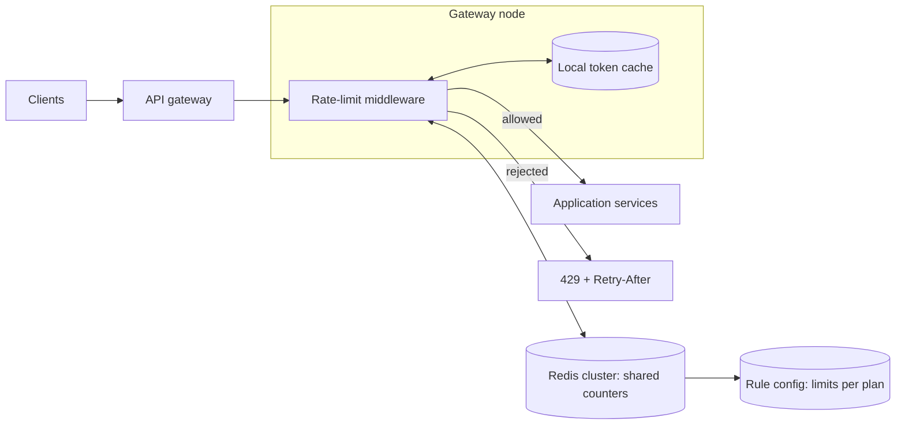
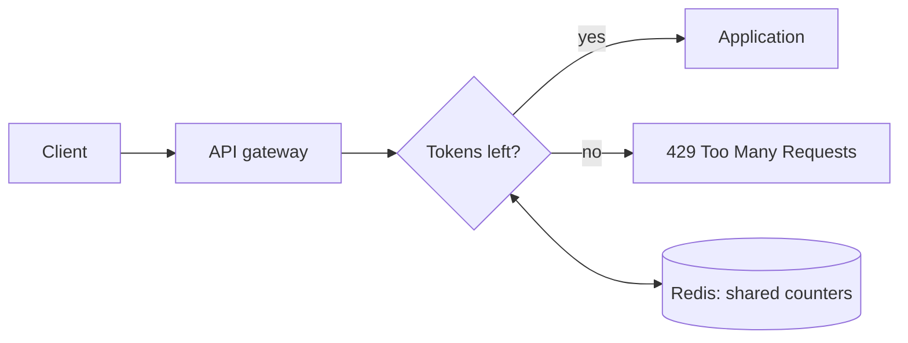

## Before you start

You need [api-design](api-design) for where a limiter sits in a request path, and [caching-strategies](caching-strategies) since Redis does the real work here.

## In one sentence

A **rate limiter** caps how many requests a given client may make in a time window, rejecting the excess so that one caller cannot exhaust resources everyone else depends on.

## Why it matters

Rate limiting is the cheapest protection against abuse, runaway retry loops, and accidental self-inflicted outages, and it appears in almost every backend interview — sometimes as the whole question, often as a follow-up to another design. It is also deceptively subtle: the obvious counter-based implementation has a boundary flaw that lets clients send double their limit, and the naive distributed version breaks the moment you run more than one server. Both traps are exactly what the interviewer is checking for.

## Requirements clarification

**Functional:** limit requests per client (by API key, user ID, or IP); return a clear rejection with `429 Too Many Requests`; support different limits per endpoint or per pricing tier.

**Non-functional:** adds under ~5ms to a request; must not become a single point of failure; accurate enough that clients cannot meaningfully exceed their limit; works across many application servers.

**Ask the interviewer:** Do we limit per user, per IP, or per API key? Is a small overshoot acceptable, or must the limit be exact — that decides whether you can use fast approximate counters. Should rejected requests be queued or dropped? Client-side or server-side? Is this a shared library in each service, or a separate gateway?

## The intuition

Picture a bucket with a hole in it. Tokens drip in at a steady rate — say 10 per second — and the bucket holds at most 100. Every request removes one token. If the bucket is empty, the request is refused.

Two properties fall out, and both are desirable. The steady drip enforces the *average* rate. And the bucket's capacity permits a **burst** — a client who has been idle accumulates tokens and can briefly spend them all at once. That matches how real clients behave: a page load firing twenty requests at once is normal, not abusive, so long as it doesn't continue indefinitely.

This is the **token bucket** algorithm, and it is the default answer for good reason.

Where the buckets live matters as much as how they work, so place the components first:



The limiter sits *before* the application, so a rejected request costs almost nothing. And the counters sit outside the gateway node, in Redis — the local cache next to the middleware is only a latency optimisation, never the source of truth.

## How it actually works

The limiter sits in front of the application — usually in an API gateway — so rejected requests never consume application resources.



The counters must live in **shared** storage, not in each server's memory. With three servers each keeping a local count, a client limited to 100 requests effectively gets 300, because no single server sees the whole picture.

Tokens are not refilled by a background timer — that would need a job per client. Instead refill is computed **lazily**: on each request, work out how much time has passed since the last one and add the tokens that would have accrued. No timers, no background work, and clients who never return cost nothing.

Always return `X-RateLimit-Remaining` and `Retry-After` headers. A client that knows when to retry backs off correctly; one that doesn't hammers you continuously and makes the problem worse.

## Worked example

A real token bucket, with the lazy refill that makes it practical:

```js
class TokenBucket {
  constructor(capacity, refillPerSecond) {
    this.capacity = capacity;
    this.refillPerSecond = refillPerSecond;
    this.tokens = capacity;            // start full
    this.lastRefill = Date.now();
  }

  allow(now = Date.now()) {
    // Lazy refill: add tokens for the elapsed time, no background timer
    const elapsedSeconds = (now - this.lastRefill) / 1000;
    this.tokens = Math.min(
      this.capacity,
      this.tokens + elapsedSeconds * this.refillPerSecond
    );
    this.lastRefill = now;

    if (this.tokens >= 1) {
      this.tokens -= 1;
      return true;
    }
    return false;                      // bucket empty — reject
  }
}

// 5-token bucket refilling at 1 token/sec
const bucket = new TokenBucket(5, 1);
const t0 = Date.now();

// Burst of 7 requests at the same instant
const burst = [];
for (let i = 0; i < 7; i++) burst.push(bucket.allow(t0));
console.log('burst of 7:', burst.join(' '));

// Wait 3 simulated seconds — 3 tokens drip back in
console.log('after 3s: ', [0, 1, 2, 3].map(() => bucket.allow(t0 + 3000)).join(' '));
```

Output:

```
burst of 7: true true true true true false false
after 3s:  true true true false
```

The first five requests pass because the bucket started full; the sixth and seventh are rejected. After three seconds exactly three tokens have accrued, so precisely three more requests pass and the fourth fails. The burst allowance and the steady average rate are both visible in one run.

## A second example — when it gets harder

The first hard part: **the fixed-window boundary flaw.** The simplest limiter increments a counter keyed by the current minute and resets each minute. It is one Redis `INCR`, and it is wrong.

```js
// Fixed window: 100 requests per minute
function fixedWindowKey(userId, now) {
  return `rl:${userId}:${Math.floor(now / 60000)}`;  // key changes each minute
}

const t = new Date('2026-01-01T00:00:59.000Z').getTime();  // 59s into minute 0
console.log(fixedWindowKey('u1', t));           // minute bucket N
console.log(fixedWindowKey('u1', t + 2000));    // 2s later: bucket N+1
```

Output:

```
rl:u1:29453760
rl:u1:29453761
```

Two seconds apart, but a different bucket. A client can send 100 requests at 00:00:59 and another 100 at 00:01:01 — **200 requests in two seconds** while never violating "100 per minute". At a window boundary the effective limit doubles.

The fixes, in increasing cost:

| Algorithm | Accuracy | Memory per client | Allows bursts |
|---|---|---|---|
| Fixed window counter | Poor — 2x at boundaries | 1 integer | Yes, accidentally |
| Sliding window log | Exact | One timestamp per request | No |
| Sliding window counter | Very good approximation | 2 integers | Smoothed |
| Token bucket | Good, burst-aware by design | 2 values | Yes, deliberately |

The sliding window log stores every request timestamp in a Redis sorted set and trims old entries — exact, but memory grows with request volume, which is dangerous precisely when you're under attack. The sliding window counter weights the previous window by how much of it still overlaps: if you're 25% into the current minute, count 75% of last minute's total plus this minute's. Two integers, no boundary flaw, and the standard production compromise.

The second hard part: **races across servers.** Reading a counter and then writing it back is not safe when many servers do it concurrently — two servers can both read 99, both decide the request is allowed, and both write 100.

The check and the decrement must be one atomic operation. Redis `INCR` is atomic natively; anything more complex — token bucket refill logic, for instance — needs a Lua script, which Redis executes atomically as a single unit. This is the same race you meet claiming a driver in [design-ride-sharing](design-ride-sharing), and it has the same answer.

**At 10x scale**, the limiter itself becomes the bottleneck: every request now needs a Redis round trip. The standard answer is a two-tier limiter. Each server keeps a local bucket holding a *slice* of the global allowance and serves most decisions from memory, syncing with Redis periodically rather than per request. You trade exactness for latency and throughput — the limit may be slightly overshot during a sync interval, which is why "is a small overshoot acceptable?" was worth asking at the start. Also shard limiter keys across Redis nodes by client ID, and decide deliberately what happens if Redis is unreachable: **fail open** (allow traffic, risking overload) or **fail closed** (reject everything, causing an outage). Most systems fail open, because a rate limiter taking down the entire service is worse than briefly unlimited traffic.

## Quick reference

| Decision | Choice | Reason |
|---|---|---|
| Default algorithm | Token bucket | Handles bursts naturally; cheap state |
| Highest accuracy | Sliding window log | Exact, but memory scales with traffic |
| Best production balance | Sliding window counter | No boundary flaw, two integers |
| Counter storage | Redis (shared) | Local memory multiplies the limit by server count |
| Atomicity | `INCR` or Lua script | Read-then-write races between servers |
| Redis is down | Fail open | An unavailable limiter shouldn't cause an outage |
| Response | `429` + `Retry-After` | Lets clients back off instead of hammering |

## Common mistakes

- Keeping counters in each server's memory, so the real limit is your limit multiplied by the number of servers.
- Using a fixed window and not noticing clients can send double the limit across a boundary.
- Doing read-then-write instead of an atomic operation, allowing concurrent requests to slip past the cap.
- Returning `500` or `403` instead of `429`, so clients can't tell they should back off.
- Omitting `Retry-After`, which guarantees clients retry immediately and worsen the overload.
- Failing closed when Redis is unreachable, turning a limiter outage into a total outage.

## What interviewers ask

- **Which algorithm would you pick and why?** — Token bucket by default: it permits legitimate bursts, enforces a correct average rate, and needs only a token count and a timestamp. Sliding window counter if bursts must be smoothed out.
- **What's wrong with a fixed-window counter?** — At a window boundary a client can send a full window's worth of requests just before the reset and another full window immediately after, achieving twice the intended rate in a very short interval.
- **Why can't the counters live in application memory?** — Each server would see only the requests it handled, so with N servers a client gets N times the limit. Any correct distributed limiter needs shared state.
- **How do you avoid race conditions between servers?** — Make the check-and-decrement a single atomic operation: Redis `INCR` for simple counters, or a Lua script for token-bucket logic, since Redis runs scripts atomically.
- **What if Redis goes down?** — Decide in advance. Failing open allows traffic through unlimited (risking overload but preserving service); failing closed rejects everything (protecting backends but causing an outage). Most choose fail open, sometimes with a degraded local limiter as a fallback.
- **The limiter adds a Redis round trip to every request. How do you fix that?** — Two-tier limiting: each server holds a local slice of the allowance and decides from memory, reconciling with Redis periodically. You accept a small overshoot in exchange for removing a network hop from the hot path.

## Practice

1. Implement the sliding window counter: given the previous window's count, the current window's count, and how far into the current window you are, compute the weighted total and compare it against the limit.
2. Extend `TokenBucket` to return the number of seconds until the next token is available, so you can populate `Retry-After` accurately.
3. Design the two-tier limiter. How large is each server's local slice, how often does it sync, and what is the worst-case overshoot with 10 servers syncing every second?

## Where to go next

[design-notification-system](design-notification-system) applies rate limiting for real — you must throttle per user to avoid flooding them, and per provider to respect third-party API quotas.
