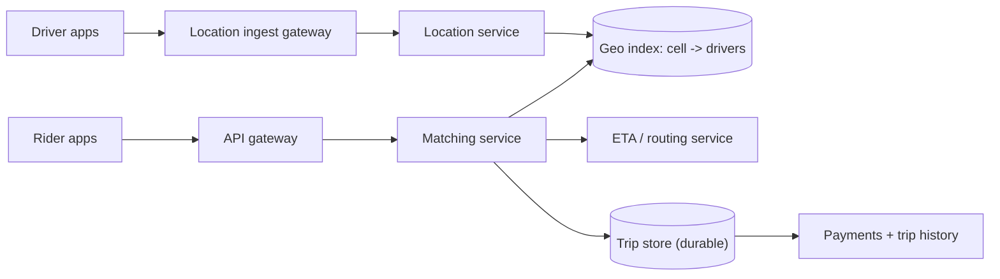
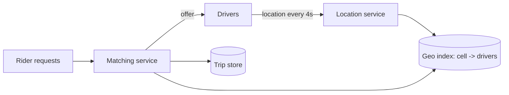

## Before you start

You need [indexing-and-transactions](indexing-and-transactions) — the whole problem is building an index for a query type ordinary indexes can't serve. [database-sharding](database-sharding) covers the partitioning strategy.

## In one sentence

A **ride-sharing system** continuously tracks the location of every available driver, finds the nearby ones the instant a rider requests a trip, and matches exactly one driver to that rider without ever double-booking either party.

## Why it matters

This is the only design in the chapter where the core difficulty is a *data structure* rather than an architecture. "Find drivers near this point" is a query a normal B-tree index cannot answer efficiently, because proximity is two-dimensional and indexes are one-dimensional. Candidates who reach for a standard SQL `WHERE` clause and never notice the problem lose the interview in the first five minutes.

## Requirements clarification

**Functional:** drivers publish location continuously; riders request a ride from a pickup point; the system matches a nearby driver; both parties track the trip live; the trip completes and is billed.

**Non-functional:** matching in under a few seconds; location updates must not overwhelm the system; a driver is never assigned two rides simultaneously; high availability in each city.

**Ask the interviewer:** How often do drivers report location — every 4 seconds or every 30? That single number drives the entire write-volume calculation. Is matching purely nearest-driver, or does it optimise for ETA, driver rating, or overall fleet efficiency? Do we need surge pricing? Is the system global, or is each city effectively independent? That last question matters — cities are naturally isolated, which makes sharding unusually easy.

## The intuition

Imagine finding the nearest taxi on a paper map covering a whole country. Checking the distance to every taxi is hopeless. Instead you overlay a grid, work out which square you're standing in, and look only in that square and the eight around it. You've replaced "compare against everything" with "look in a handful of buckets".

That is exactly what **geospatial indexing** does. The trick is turning a two-dimensional coordinate into a one-dimensional key — a grid cell ID — because a one-dimensional key is something a normal database index can handle. A **geohash** does this by repeatedly halving the world: each character added to the string narrows the box, so nearby places share a prefix, and "find things near me" becomes "find keys starting with this prefix".

The index sits at the centre of a system with two very differently-shaped inflows:



Drivers and riders enter through **different front doors** on purpose: location updates are a firehose of disposable writes, ride requests are rare and must be durable. Follow the two arrows out of the geo index and the split is clear — ephemeral data on the left, money and records on the right.

## How it actually works

Two data flows with wildly different volumes. Location updates are enormous and constant; ride requests are comparatively rare.

Drivers stream location into a service that writes to an in-memory store keyed by geohash cell. Location is ephemeral — a position from thirty seconds ago is worthless, so it never needs to touch a durable database. Trips, by contrast, are financial records and go to a durable store.



Matching: compute the rider's cell, gather candidate drivers from that cell plus its neighbours, rank them by actual road ETA rather than straight-line distance, and offer the ride to the best candidate. If they decline or time out, offer it to the next.

Neighbouring cells must be included. A rider standing just inside a cell boundary may have the closest driver a few metres away but on the other side — searching one cell alone would miss them entirely.

## Worked example

The write volume is what makes this design distinctive, and a working geohash shows why the index works:

```js
const activeDrivers = 1_000_000;
const updateIntervalSeconds = 4;

const locationWritesPerSec = activeDrivers / updateIntervalSeconds;
console.log(`location writes/sec: ${(locationWritesPerSec / 1e3).toFixed(0)}k`);

const ridesPerDay = 20_000_000;
const rideQPS = ridesPerDay / 86_400;
console.log(`ride requests/sec:   ${rideQPS.toFixed(0)}`);
console.log(`write ratio:         ${(locationWritesPerSec / rideQPS).toFixed(0)}:1`);

// Location is ephemeral — keep it in memory, not on disk
const bytesPerDriverLocation = 50;               // id, lat, lng, timestamp
console.log(`geo index size: ${(activeDrivers * bytesPerDriverLocation / 1e6).toFixed(0)} MB`);

// Trips ARE durable — this is the financial record
const bytesPerTrip = 1_000;
console.log(`trip storage/year: ${(ridesPerDay * 365 * bytesPerTrip / 1e12).toFixed(1)} TB`);

// --- Geohash: encode a 2D coordinate into a 1D prefix-searchable key ---
const BASE32 = '0123456789bcdefghjkmnpqrstuvwxyz';

function geohash(lat, lng, precision = 6) {
  let latRange = [-90, 90], lngRange = [-180, 180];
  let hash = '', bits = 0, bit = 0, useLng = true;

  while (hash.length < precision) {
    if (useLng) {                       // alternate: lng, lat, lng, lat...
      const mid = (lngRange[0] + lngRange[1]) / 2;
      if (lng > mid) { bits = (bits << 1) | 1; lngRange[0] = mid; }
      else           { bits = bits << 1;       lngRange[1] = mid; }
    } else {
      const mid = (latRange[0] + latRange[1]) / 2;
      if (lat > mid) { bits = (bits << 1) | 1; latRange[0] = mid; }
      else           { bits = bits << 1;       latRange[1] = mid; }
    }
    useLng = !useLng;
    if (++bit === 5) { hash += BASE32[bits]; bits = 0; bit = 0; }
  }
  return hash;
}

const rider  = geohash(37.7749, -122.4194);   // San Francisco
const nearby = geohash(37.7760, -122.4180);   // ~150m away
const far    = geohash(40.7128, -74.0060);    // New York

console.log(`rider:  ${rider}`);
console.log(`nearby: ${nearby}  shared prefix: ${sharedPrefix(rider, nearby)}`);
console.log(`far:    ${far}  shared prefix: ${sharedPrefix(rider, far)}`);

function sharedPrefix(a, b) {
  let i = 0;
  while (i < a.length && a[i] === b[i]) i++;
  return i;
}
```

Output:

```
location writes/sec: 250k
ride requests/sec:   231
write ratio:         1080:1
geo index size: 50 MB
trip storage/year: 7.3 TB
```

```
rider:  9q8yyk
nearby: 9q8yyk  shared prefix: 6
far:    dr5reg  shared prefix: 0
```

Two numbers define the design. Location writes outnumber ride requests roughly 1,000:1 — so the location path must be optimised ruthlessly and must never touch a durable database. And the entire live geo index is only 50 MB, which comfortably fits in memory on a single machine, making Redis the obvious choice.

The geohash output shows why the scheme works: two points about 150m apart land in the *same* 6-character cell, while San Francisco and New York share not a single leading character. Proximity search becomes prefix matching.

## A second example — when it gets harder

The first hard part: **the write volume of location updates.** 250,000 writes per second into any durable database is expensive and completely unnecessary — nobody ever queries where a driver was two minutes ago, and the trip record captures what actually matters.

So treat location as ephemeral state, not data. Keep it in memory with a short TTL, so a driver whose app dies simply ages out of the index instead of requiring an explicit "offline" event. You can also cut volume at the source: report less often when a driver is stationary or has no passenger, since a parked car does not need four updates a second.

The second hard part, and the one candidates most often fumble: **matching must not double-book.** Two riders requesting simultaneously can both see the same nearby driver, and a naive design offers that driver to both.

This is a race condition, and it needs an atomic claim:

```js
// Simulating the atomic claim a real system does in Redis/a database
const driverStatus = new Map([['driver-7', 'available']]);

function tryClaimDriver(driverId) {
  // Must be atomic: check-and-set in ONE operation.
  // In Redis this is SET key value NX; in SQL it's a conditional UPDATE.
  if (driverStatus.get(driverId) !== 'available') return false;
  driverStatus.set(driverId, 'assigned');
  return true;
}

console.log(tryClaimDriver('driver-7')); // true  — rider A wins
console.log(tryClaimDriver('driver-7')); // false — rider B must try another driver
```

The comment is the important part. Reading the status and then writing it in two separate steps leaves a window where both riders read "available" and both write "assigned". The check and the set must be a single atomic operation — `SET ... NX` in Redis, or `UPDATE drivers SET status='assigned' WHERE id=? AND status='available'` in SQL, where the row count tells you whether you won.

Also add a timeout. A driver who neither accepts nor declines must release automatically, or a single unresponsive phone strands riders indefinitely.

**At 10x scale**, shard by city or region — rides are inherently local, so a rider in London never needs data about drivers in Tokyo, making this the cleanest sharding key in the entire chapter. Watch for hotspots: a stadium at closing time puts thousands of drivers and riders into a handful of cells, so precision must adapt — coarse cells in rural areas, fine cells downtown. And prefer a **quadtree** over fixed geohash precision if density varies sharply, since a quadtree subdivides only where objects actually are.

## Quick reference

| Concern | Choice | Reason |
|---|---|---|
| Geo index | Geohash prefix (or quadtree) | Turns 2D proximity into 1D prefix search |
| Location storage | In-memory, short TTL | Ephemeral; 250k writes/sec must not hit disk |
| Trip storage | Durable database | Financial record; must survive everything |
| Search area | Own cell + 8 neighbours | Boundary riders would otherwise miss close drivers |
| Ranking | Road ETA, not straight-line | A driver across a river is close but unreachable |
| Assignment | Atomic check-and-set + timeout | Prevents double-booking and stranded requests |
| Sharding key | City / region | Rides are local; near-zero cross-shard traffic |

## Tools & frameworks

These are the concrete technologies worth naming at the whiteboard for this design.

| Tool | What it's for | Reach for it when |
|---|---|---|
| [Redis geospatial](https://redis.io/docs/latest/develop/data-types/geospatial/) | `GEOADD`/`GEOSEARCH` over nearby drivers | Live driver locations need sub-second proximity queries |
| [Uber H3](https://h3geo.org/docs/) | Hexagonal geospatial indexing | You are bucketing space into cells for matching and surge pricing |
| [PostGIS](https://postgis.net/documentation/) | Spatial types and indexes in Postgres | You need persistent geo queries, routes and polygons |
| [Kafka](https://kafka.apache.org/documentation/) | High-volume location-update ingest | Every driver emits a ping every few seconds |

## Common mistakes

- Querying `WHERE lat BETWEEN ? AND ? AND lng BETWEEN ? AND ?` and assuming an index makes it fast — a standard index handles one dimension, so the database filters a huge candidate set.
- Writing every location update to a durable database, creating 250,000 writes/sec of data nobody will ever read.
- Searching only the rider's own cell, missing closer drivers just across a boundary.
- Ranking by straight-line distance, which routinely picks a driver on the wrong side of a river or motorway.
- Doing check-then-set as two operations, allowing two riders to be assigned the same driver.
- Using one fixed cell size everywhere, so downtown cells hold thousands of drivers while rural cells hold none.

## What interviewers ask

- **Why can't a normal database index find nearby drivers?** — B-tree indexes are one-dimensional. Proximity is two-dimensional, so a range query on latitude and longitude produces a large intermediate set the database must then filter row by row. Geohashing collapses two dimensions into one sortable key so a prefix scan does the work.
- **What is a geohash and why does prefix matching work?** — It encodes a coordinate by recursively halving the world, alternating longitude and latitude, so each added character narrows the box. Nearby points therefore share a leading prefix, and "find everything near me" becomes "find keys with this prefix".
- **How do you prevent two riders being matched to the same driver?** — An atomic check-and-set: `SET NX` in Redis or a conditional `UPDATE` guarded by `WHERE status='available'`, where success is determined by rows affected. Reading then writing separately leaves a race window. Add a timeout so an unresponsive driver releases the claim.
- **Where do you store driver locations, and why not a database?** — In memory with a TTL. The data is worthless within seconds, the write rate is roughly 1,000x the ride-request rate, and the entire index is only ~50 MB. A TTL also handles crashed apps for free.
- **How do you shard this system?** — By city or region. Ride matching never spans continents, so geography gives almost perfect isolation with negligible cross-shard queries — a rare luxury compared to sharding a social graph.
- **What breaks at a stadium after a concert?** — Cell hotspots: thousands of drivers and riders in a few cells, so the candidate list per query explodes and one shard takes disproportionate load. Adapt cell precision to density, or use a quadtree that subdivides only where it needs to.

## Practice

1. Recompute location write volume if updates drop to every 10 seconds when a driver is idle, assuming 70% of drivers are idle at any moment. How much write capacity does that save?
2. Extend `geohash` with a `neighbours()` function returning the eight surrounding cells at the same precision, and prove a driver 50m across a boundary is found.
3. Design the matching timeout: what happens when a driver neither accepts nor declines, how long do you wait, and how do you avoid offering the same driver repeatedly to the same rider?

## Where to go next

[design-rate-limiter](design-rate-limiter) covers the atomic-counter problem you just met in `tryClaimDriver`, generalised — the same race condition appears whenever distributed servers contend for shared state.
