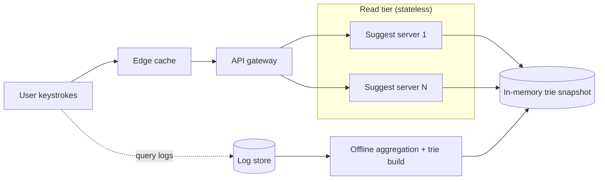
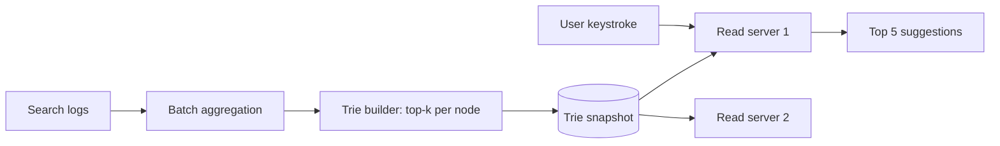

## Before you start

You need [tries](tries) — the data structure is the heart of this design. [caching-strategies](caching-strategies) explains how the latency budget is actually met.

## In one sentence

**Search autocomplete** returns the most popular complete queries beginning with whatever the user has typed so far, fast enough to appear before they type the next character.

## Why it matters

This design is defined by a brutal latency budget. People type at roughly 5 characters per second, so a suggestion arriving 200ms late is already stale and useless. It is also enormously read-heavy — every keystroke is a query, so typing "system design" alone produces thirteen requests. Interviewers use it to see whether you understand that some systems are so read-dominated that you precompute everything and treat writes as a completely separate offline problem.

## Requirements clarification

**Functional:** given a prefix, return the top 5-10 most popular matching queries, ranked by frequency; suggestions update as popularity shifts.

**Non-functional:** under ~100ms per keystroke; extremely read-heavy; suggestions may be slightly stale (hours is fine); must handle typos gracefully if scoped in.

**Ask the interviewer:** How fresh must suggestions be — real-time trending, or is a daily rebuild acceptable? That single answer changes the entire pipeline. Do we personalise per user, or is one global ranking enough? Do we support typo tolerance and multiple languages? Are suggestions filtered for offensive content? Personalisation is the biggest scope trap here — it multiplies storage by the user count.

## The intuition

Picture a library index where books are filed by the letters of their titles. All titles starting with "s" sit in one drawer; inside it, a divider for "sy", then "sys". Finding everything starting with "syst" means walking four dividers deep, then reading what's behind that one — never scanning the whole library.

That is a **trie** (prefix tree): each node is one character, and the path from the root spells a prefix. Finding a prefix costs time proportional to the prefix's length, not the number of stored queries.

But a trie alone isn't enough. Once you reach the "syst" node, everything beneath it could be thousands of queries, and gathering and sorting them per keystroke is far too slow. So you **precompute** the answer: each node stores its own top suggestions, already ranked. Lookup becomes "walk to the node, read the list" — no searching at all.

Precomputation splits the system into a fast online half and a slow offline half:



The dotted line is the only connection between the halves, and it runs the *long* way round — through logs and a batch job, not back through the request. Nothing on the read path writes anything, which is why those servers can be cloned freely.

## How it actually works

Two separate systems, and keeping them separate is the design.

The **read path** must be sub-100ms: a request walks a trie held in memory and returns a precomputed list. Nothing is computed at request time.

The **write path** is an offline pipeline. Search logs are aggregated in batch, query frequencies counted, and a fresh trie built with top-k lists baked into every node. That trie is then shipped to the read servers, replacing the old one atomically.



Suggestions are therefore **stale by design** — often by hours. That's acceptable because popular queries change slowly, and it buys an enormous simplification: the read path never writes anything, so read servers are trivially replicated.

The client helps too. Debounce input so a fast typist doesn't fire a request per character, and cache responses in the browser — a user deleting a character should get the previous result instantly with no network call.

## Worked example

The trie with precomputed top-k, plus the latency arithmetic:

```js
class TrieNode {
  constructor() {
    this.children = new Map();
    this.top = [];                  // precomputed [query, frequency], best first
  }
}

class AutocompleteTrie {
  constructor(k = 5) { this.root = new TrieNode(); this.k = k; }

  // Build step (offline): insert a query and update top-k along its whole path
  insert(query, frequency) {
    let node = this.root;
    this.#merge(node, query, frequency);
    for (const ch of query) {
      if (!node.children.has(ch)) node.children.set(ch, new TrieNode());
      node = node.children.get(ch);
      this.#merge(node, query, frequency);   // every prefix node caches this
    }
  }

  #merge(node, query, frequency) {
    node.top.push([query, frequency]);
    node.top.sort((a, b) => b[1] - a[1]);
    node.top = node.top.slice(0, this.k);    // keep only the best k
  }

  // Read step (online): walk to the prefix node, return its cached list
  suggest(prefix) {
    let node = this.root;
    for (const ch of prefix) {
      if (!node.children.has(ch)) return [];   // no match at all
      node = node.children.get(ch);
    }
    return node.top.map(([q]) => q);           // no sorting at request time
  }
}

const t = new AutocompleteTrie(5);
t.insert('system design', 9000);
t.insert('system design interview', 7000);
t.insert('systemd', 4000);
t.insert('sysadmin', 1200);
t.insert('python tutorial', 8000);

console.log('sys  ->', t.suggest('sys'));
console.log('syst ->', t.suggest('syst'));
console.log('p    ->', t.suggest('p'));
console.log('zz   ->', t.suggest('zz'));

// Latency budget: why precomputation is mandatory
const typingCharsPerSec = 5;
console.log(`budget/keystroke: ${(1000 / typingCharsPerSec).toFixed(0)}ms`);

const DAU = 100_000_000, searchesPerUser = 5, charsPerSearch = 15;
const keystrokeQPS = (DAU * searchesPerUser * charsPerSearch) / 86_400;
console.log(`keystroke QPS: ${(keystrokeQPS / 1e6).toFixed(2)}M`);
```

Output:

```
sys  -> [ 'system design', 'system design interview', 'systemd', 'sysadmin' ]
syst -> [ 'system design', 'system design interview', 'systemd' ]
p    -> [ 'python tutorial' ]
zz   -> []
budget/keystroke: 200ms
keystroke QPS: 0.09M
```

Note what `suggest` does *not* do: no traversal of the subtree, no sorting, no ranking. It walks at most `prefix.length` nodes and returns a list that was computed hours ago. That is the whole trick.

The QPS figure — about 87,000 keystroke queries per second — is 15 times the search rate, because each search is a whole word typed one character at a time. Every keystroke being a query is what makes this read path so extreme.

## A second example — when it gets harder

The first hard part: **the trie doesn't fit on one machine.** Billions of distinct queries, each node carrying a top-k list, easily exceeds a single server's memory.

Sharding by first character is the obvious idea and it is wrong — query distribution across letters is wildly uneven, so the "s" shard is enormous while "z" is nearly empty. Instead shard by **prefix ranges balanced by observed traffic**, so each shard handles a comparable query volume regardless of how many letters it covers.

The second hard part: **updating without a rebuild.** A full offline rebuild is simple but slow, and trending queries — a breaking news term nobody searched yesterday — won't appear for hours.

The practical answer is a two-tier read: the large precomputed trie for the stable long tail, plus a small, frequently-refreshed structure holding recent trending queries, merged at read time.

```js
// Merge stable precomputed suggestions with fresh trending ones
function mergeSuggestions(stable, trending, k = 5) {
  const scores = new Map();
  for (const [q, f] of stable) scores.set(q, f);
  // Trending gets a recency boost so genuinely new queries can surface
  for (const [q, f] of trending) scores.set(q, (scores.get(q) ?? 0) + f * 3);

  return [...scores.entries()]
    .sort((a, b) => b[1] - a[1])
    .slice(0, k)
    .map(([q]) => q);
}

const stable   = [['election results', 5000], ['electric car', 4000]];
const trending = [['election results 2026', 2500], ['electric car', 500]];

console.log(mergeSuggestions(stable, trending));
```

Output:

```
[ 'election results 2026', 'electric car', 'election results' ]
```

"election results 2026" jumps to the top with 7,500 (2,500 x 3) despite the lowest raw count of any entry, because the recency multiplier reflects that it is rising fast. "electric car" appears in both lists, so its scores combine to 5,500 and it overtakes the previously dominant "election results" — showing that the boost rewards sustained momentum, not just novelty. The merge runs over tiny lists, a handful of entries each, so it stays within budget despite happening on every request.

**At 10x scale**, three things change. Push the top few thousand prefixes to a CDN or edge cache, since a small set of prefixes covers a huge share of traffic — "a", "ho", "you" are typed constantly. Handle typos with fuzzy matching, but do it as a *fallback* only when the exact prefix returns nothing, because running edit-distance matching on every keystroke would blow the latency budget. And if personalisation is required, keep it as a thin per-user layer reranking the global results, never a per-user trie — one trie per user multiplies storage by the user count and is unworkable.

## Quick reference

| Concern | Choice | Reason |
|---|---|---|
| Data structure | Trie with top-k per node | Prefix lookup in O(prefix length), no sorting at read time |
| Ranking | Precomputed offline | Sorting per keystroke cannot meet a 100ms budget |
| Freshness | Batch rebuild + trending overlay | Popular queries move slowly; trends need a fast path |
| Sharding | Prefix ranges balanced by traffic | First-letter sharding is badly skewed |
| Client | Debounce + local cache | Cuts request volume; backspace needs no network call |
| Hot prefixes | Edge cache | A small prefix set carries most traffic |
| Typos | Fuzzy fallback only on empty result | Fuzzy matching every keystroke is too slow |
| Personalisation | Rerank global results | A per-user trie multiplies storage by user count |

## Tools & frameworks

These are the concrete technologies worth naming at the whiteboard for this design.

| Tool | What it's for | Reach for it when |
|---|---|---|
| [Redis](https://redis.io/docs/latest/) | Sorted sets for prefix-scored suggestions | You want single-digit-millisecond prefix reads |
| [Elasticsearch](https://www.elastic.co/docs) | FST-based completion suggester | You need fuzziness and weighting, not just prefixes |
| [Typesense](https://typesense.org/docs/) | Typo-tolerant instant search | The corpus is small-to-medium and you want this working today |
| [Algolia](https://www.algolia.com/doc) | Managed instant-search service | Latency and relevance matter and you will not operate a cluster |

The underlying data structure is a trie or FST — no tool teaches you that, so study it directly.

## Common mistakes

- Traversing the subtree and sorting results at request time, which cannot meet the latency budget at scale.
- Sharding by first letter and creating hugely imbalanced shards.
- Treating autocomplete as a database query problem — a `LIKE 'prefix%'` scan is orders of magnitude too slow here.
- Building a trie per user for personalisation, exploding storage.
- Ignoring the client, so every keystroke from a fast typist becomes a separate request.
- Demanding real-time freshness when hours-old suggestions are perfectly acceptable, and paying enormous complexity for it.

## What interviewers ask

- **Why a trie rather than a hash table or SQL query?** — Prefix search is the entire access pattern. A hash table can look up exact keys but cannot enumerate everything sharing a prefix, and `LIKE 'prefix%'` forces a scan. A trie finds the prefix node in time proportional to prefix length, independent of how many queries are stored.
- **Why precompute top-k at every node?** — Because at read time you cannot afford to traverse a subtree containing thousands of queries and sort them. Precomputing turns a search into a pointer walk and a list read, moving all the expensive work offline where latency doesn't matter.
- **How do you keep suggestions fresh?** — Rebuild the trie in batch from aggregated search logs and ship it to read servers atomically. For trending queries that can't wait, keep a small, frequently-updated trending structure and merge it into results at read time with a recency boost.
- **The trie is too big for one machine. How do you shard it?** — By prefix ranges balanced against observed traffic, not by first character. Letter frequency is very uneven, so first-letter sharding produces a massively overloaded "s" shard and an idle "z" one.
- **How do you handle typos?** — As a fallback: if the exact prefix yields no suggestions, run fuzzy matching within a small edit distance. Doing fuzzy matching on every keystroke would exceed the latency budget for the common case where the user typed correctly.
- **What does the client do to help?** — Debounce keystrokes so a fast typist doesn't generate a request per character, and cache responses locally so deleting a character re-renders instantly with no network round trip.

## Practice

1. Extend `suggest` to fall back to the longest matching ancestor prefix when the exact prefix has no node, so "systemz" still returns "system design" rather than nothing.
2. The `#merge` method sorts on every insert, which is wasteful during a build over billions of queries. Replace it with a bounded min-heap and explain the complexity improvement.
3. Design the atomic swap: read servers hold a trie in memory and a new snapshot arrives. How do you switch over with zero dropped requests and no period serving a half-loaded trie?

## Where to go next

You've now worked through all eight designs. Revisit [design-url-shortener](design-url-shortener) and compare its read path to this one — both are read-heavy and cache-first, but one optimises a point lookup and the other a prefix scan, and noticing why they diverge is the clearest sign the chapter has landed.
