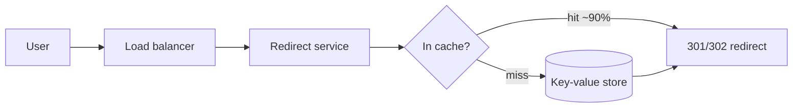

## Before you start

You need [caching-strategies](caching-strategies) and [database-sharding](database-sharding) — both show up in the answer. [scalability-and-performance](scalability-and-performance) covers the peak-vs-average arithmetic this topic leans on.

## In one sentence

A **URL shortener** takes a long URL, stores it under a short unique key, and redirects anyone who visits the short link back to the original — which sounds trivial until you realise it is a globally distributed, read-heavy key-value store that must never hand out the same key twice.

## Why it matters

This is the most common opening system design question at senior level, and interviewers use it precisely *because* it looks easy. The naive answer takes ninety seconds; the remaining forty minutes are spent on the parts that actually matter — how you generate keys without collisions across many servers, why the read path and write path need completely different architectures, and what breaks at ten times the scale. Candidates who treat it as a CRUD app fail. Candidates who find the hard parts unprompted pass.

## Requirements clarification

Ask before designing. The questions signal seniority more than the answers do.

**Functional:** shorten a long URL to a short one; redirect a short URL to the original; optionally support custom aliases and link expiry.

**Non-functional:** highly available (a dead redirect breaks every link ever shared); redirect latency under ~100ms; links are effectively permanent; **read-heavy** — roughly 100 reads per write.

**Ask the interviewer:** How long do links live? Do we need custom aliases? Do we need click analytics? Can the short key be predictable, or must it be unguessable? Is 7 characters acceptable? That last pair matters enormously — "unguessable" rules out the simplest design entirely.

## The intuition

Think of a cloakroom at a theatre. You hand over a coat (the long URL) and get a small numbered ticket (the short key). The number is meaningless by itself; it's just an index into a rack only the cloakroom can see. Handing back the coat is a lookup by ticket number — fast, and identical every time.

Two properties fall out of the analogy. Tickets must be unique, or two people get the same coat. And the cloakroom does far more coat *retrievals* than coat *deposits*, so the retrieval path is what you optimise.

## How it actually works

The key insight is that a short URL is a **base62 encoding** of a number. Base62 uses `0-9a-zA-Z` — 62 characters, all URL-safe with no escaping. Give each URL a unique integer ID, encode that integer in base62, and the short key falls out.

The character count sets your ceiling: 62⁷ ≈ 3.5 trillion distinct 7-character keys. That is enough for any realistic service, which is why 7 is the near-universal answer.



The write path is separate: a shorten request gets a unique ID from an ID generator, base62-encodes it, writes the mapping, and returns the key. Writes are rare, so they can afford to be slower and strongly consistent.

Use **302 (temporary)** rather than 301 for the redirect. A 301 is cached by the browser forever, which is faster but destroys your click analytics and removes your ability to ever change or disable a link.

## Worked example

Capacity estimation with real arithmetic, plus the base62 encoder that produces the key:

```js
// --- Capacity estimation ---
const writesPerDay = 10_000_000;          // 10M new links/day
const readWriteRatio = 100;               // read-heavy: 100 reads per write
const secondsPerDay = 86_400;

const writeQPS = writesPerDay / secondsPerDay;              // 115.7
const readQPS  = (writesPerDay * readWriteRatio) / secondsPerDay; // 11,574
const peakReadQPS = readQPS * 2;                            // peak ~2x average

const bytesPerRecord = 500;               // long URL + key + metadata
const storagePerYear = writesPerDay * 365 * bytesPerRecord; // bytes

console.log(`write QPS:      ${writeQPS.toFixed(0)}`);
console.log(`read QPS:       ${readQPS.toFixed(0)}`);
console.log(`peak read QPS:  ${peakReadQPS.toFixed(0)}`);
console.log(`storage/year:   ${(storagePerYear / 1e12).toFixed(2)} TB`);

// --- Base62 encoding: turn a unique integer into the short key ---
const ALPHABET = '0123456789abcdefghijklmnopqrstuvwxyzABCDEFGHIJKLMNOPQRSTUVWXYZ';

function encodeBase62(num) {
  if (num === 0) return ALPHABET[0];
  let out = '';
  while (num > 0) {
    out = ALPHABET[num % 62] + out;  // take the remainder, prepend, shrink
    num = Math.floor(num / 62);
  }
  return out;
}

function decodeBase62(str) {
  return [...str].reduce((acc, ch) => acc * 62 + ALPHABET.indexOf(ch), 0);
}

console.log(encodeBase62(1));           // '1'
console.log(encodeBase62(125));         // '21'
console.log(encodeBase62(3_521_614_606_208)); // '10000000' — the first 8-char key
console.log(decodeBase62('bcD'));       // 43067 — round-trips exactly
console.log(62 ** 7);                   // 3521614606208 — the 7-char key space
```

Output:

```
write QPS:      116
read QPS:       11574
peak read QPS:  23148
storage/year:   1.82 TB
```

Those four numbers drive every decision that follows. 1.82 TB/year fits comfortably on a single well-provisioned database for the first few years — so sharding is a *later* concern, and saying so demonstrates judgement. But 23,000 peak reads per second does not fit on one database, which is why the cache sits in front and carries most of the load.

## A second example — when it gets harder

The genuinely hard part is **key generation without collisions**. Three approaches, and the trade-off is the whole discussion.

**Hash the URL and truncate.** Take MD5 of the long URL, keep the first 7 base62 characters. Simple, stateless, and the same URL always yields the same key. But truncation creates collisions, and by the birthday paradox they arrive far earlier than intuition suggests:

```js
// Birthday-paradox estimate: expected inserts before the first collision
// in a key space of size N is roughly sqrt(pi/2 * N)
const keySpace = 62 ** 7;
const expectedInsertsBeforeCollision = Math.sqrt((Math.PI / 2) * keySpace);

console.log(`key space:                 ${keySpace}`);
console.log(`~inserts before collision: ${expectedInsertsBeforeCollision.toExponential(2)}`);
// key space:                 3521614606208
// ~inserts before collision: 2.35e+6
```

Roughly 2.35 million inserts — about five and a half hours at our write rate of 116/sec. So a hash-and-truncate design needs a collision check on every single write: read before write, and on collision append a salt and retry. That extra read is the cost, and it grows as the table fills.

**A single auto-increment counter.** Zero collisions by construction, and the shortest possible keys. But one counter is a single point of failure and a write bottleneck, and the keys are sequentially guessable — anyone can enumerate every link on your service by counting upward. That is disqualifying if privacy matters.

**A distributed ID generator (the strong answer).** Give each server a pre-allocated *range* of IDs from a coordination service — server A takes 1–1,000,000, server B takes 1,000,001–2,000,000. Each server then hands out IDs from its own range with no coordination at all, so there are no collisions, no per-write lookup, and no shared bottleneck. A [Snowflake-style ID](https://en.wikipedia.org/wiki/Snowflake_ID) (timestamp + machine ID + sequence) achieves the same thing without any central service.

To fix guessability, keep the counter but encode `id XOR secret` (or run the ID through a bijective permutation) so keys look random while remaining collision-free and reversible.

**At 10x scale** the read path dominates. Push redirects to edge PoPs so the lookup never crosses an ocean; shard the key-value store by hash of the short key (the access pattern is a pure point lookup, so hash sharding is ideal and range sharding is wrong); and move analytics off the critical path entirely — fire click events into a message queue and aggregate asynchronously, so a slow analytics pipeline can never slow down a redirect.

## Quick reference

| Decision | Options | Pick when |
|---|---|---|
| Key generation | Hash + truncate | Simplicity matters; write volume is low |
| | Single counter | Never at scale — SPOF and guessable |
| | Ranged/Snowflake IDs | Default at scale — no collisions, no coordination |
| Redirect code | 301 permanent | Maximum speed, no analytics needed |
| | 302 temporary | Default — preserves analytics and control |
| Database | Relational | Small scale; you want transactions |
| | Key-value store | Default — the workload *is* a point lookup |
| Sharding key | Hash of short key | Always — access is by key, never by range |
| Cache | LRU on read path | Always — 90%+ hit rate on a Zipfian access pattern |

## Common mistakes

- Jumping straight to architecture without asking whether keys must be unguessable — it changes the entire key-generation design.
- Proposing a single auto-increment counter at scale, then not noticing it is both a bottleneck and a privacy leak.
- Ignoring the birthday paradox and claiming a 7-character hash "won't collide in practice" — it collides after a few million writes.
- Putting analytics writes on the synchronous redirect path, making every redirect wait on an unrelated system.
- Sharding by creation time or user ID when every single query is a lookup by short key.

## What interviewers ask

- **How do you handle key collisions?** — Either avoid them structurally with a distributed ID generator (ranged allocation or Snowflake), or detect them with a read-before-write and retry with a salt. Say which you'd choose and why: the ID generator removes an entire failure mode and an extra read per write.
- **301 or 302, and why?** — 302, because a browser-cached 301 permanently bypasses your server: you lose all click analytics and can never disable or repoint a link. Choose 301 only if you have explicitly decided you don't need either.
- **How do you make keys unguessable without risking collisions?** — Keep a collision-free sequential ID internally, but apply a bijective transform (XOR with a secret, or a Feistel permutation) before base62 encoding. You get randomness in the output and a guaranteed-unique input.
- **Your database can't handle 20,000 reads per second. What now?** — Cache the hot keys; link access is heavily Zipfian so a small cache absorbs most traffic. Then shard by hash of the key, and push reads to edge locations. Note the order: cache first, shard only when caching stops being enough.
- **What actually breaks first as you grow?** — Not storage (under 2 TB/year), but read QPS and tail latency for geographically distant users. That's why the answer is a CDN/edge cache long before it's a bigger database.

## Practice

1. Recompute the capacity table for 100M writes/day at a 500:1 read ratio. Does 7 characters still suffice for 10 years? Does storage still fit on one machine?
2. Implement `encodeBase62` with a XOR-based obfuscation step so sequential IDs 1, 2, 3 produce non-adjacent keys — and verify decoding still round-trips.
3. Design the click-analytics pipeline so a total analytics outage causes zero redirect failures. Name the component that guarantees it.

## Where to go next

[design-rate-limiter](design-rate-limiter) is the natural follow-up — a shortener needs one to stop abuse, and it reuses the same distributed-counter reasoning you just applied to ID generation.
