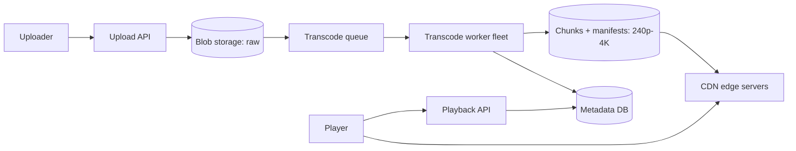

## Before you start

You need [caching-strategies](caching-strategies) and [dns-load-balancing](dns-load-balancing) — CDN routing depends on both. [message-queues](message-queues) explains the transcoding pipeline's backbone.

## In one sentence

A **video streaming service** ingests uploaded video, converts it into many resolutions and small time-sliced chunks, distributes those chunks to servers near viewers, and lets each player pick the quality its current bandwidth can sustain.

## Why it matters

This is the design where bandwidth and cost dominate everything, and candidates who only ever think about QPS get lost. The video files never touch your application servers on the read path at all — nearly all traffic is served by a CDN. Recognising that the real system is a *pipeline plus a distribution network*, not a request/response API, is what separates a good answer from a confused one.

## Requirements clarification

**Functional:** upload video; transcode into multiple resolutions; stream smoothly with quality that adapts to network conditions; seek to any point; resume where you left off.

**Non-functional:** playback starts in under ~2 seconds; minimal rebuffering; global availability; upload-to-watchable within minutes for user-generated content.

**Ask the interviewer:** Is this YouTube (millions of creators, unpredictable long tail) or Netflix (a curated catalogue transcoded once, ahead of time)? The answer completely changes the pipeline's priorities. Do we need live streaming, or only video on demand? Live adds a latency budget that changes every component. What's the read/write ratio? Do we need DRM?

## The intuition

Think of a bakery that ships worldwide. You do not bake a loaf when an order arrives — the customer would wait hours. You bake in advance, in several sizes, and stock local shops near customers so collection is quick.

Video works the same way. **Transcoding** (baking in several sizes) happens once at upload, producing 240p through 4K. The **CDN** is the network of local shops. And the video is cut into chunks of a few seconds each so a player can switch size mid-meal — starting at 480p, moving to 1080p when the network proves fast enough, dropping back down when it doesn't. That's **adaptive bitrate streaming**.

Crucially, chunks are just files fetched over ordinary HTTP. There is no exotic streaming protocol — which is exactly why CDNs, built for caching HTTP files, work so well here.

The bakery and the shops are genuinely separate systems, joined only by storage:



Trace the player's arrows: it talks to the playback API once for metadata, then fetches every chunk straight from the CDN. No request for actual video ever reaches your servers, which is the reason this design carries so much traffic on so little infrastructure.

## How it actually works

Upload and playback are two almost entirely separate systems.

On upload, the raw file lands in blob storage, then a job is queued. Workers split the video into segments, transcode each segment in parallel into every target resolution, and write the results back along with a **manifest** — a small text file listing every available quality and the URL of every chunk.


Playback: the player fetches the manifest, measures its own throughput, and requests chunks at whichever bitrate it can sustain. All decisions live in the *client* — the server just serves files. That is why this design scales: the hard part is stateless.

Transcoding is parallel because segments are independent. A 1-hour video split into 10-second segments is 360 independent jobs, so wall-clock time drops from hours to minutes given enough workers.

## Worked example

The arithmetic that dominates this design is bandwidth, not QPS:

```js
const DAU = 100_000_000;
const watchMinutesPerUserPerDay = 60;
const secondsPerDay = 86_400;

// Average bitrate across quality tiers (bits per second)
const avgBitrateMbps = 3;                     // ~720p-1080p mix

const totalWatchSeconds = DAU * watchMinutesPerUserPerDay * 60;
const avgConcurrentViewers = totalWatchSeconds / secondsPerDay;
const avgBandwidthTbps = (avgConcurrentViewers * avgBitrateMbps) / 1e6;
const peakBandwidthTbps = avgBandwidthTbps * 2;

console.log(`concurrent viewers: ${(avgConcurrentViewers / 1e6).toFixed(1)}M`);
console.log(`avg egress:  ${avgBandwidthTbps.toFixed(1)} Tbps`);
console.log(`peak egress: ${peakBandwidthTbps.toFixed(1)} Tbps`);

// Storage: every upload is stored once per quality tier
const uploadsPerDay = 500_000;
const avgMinutes = 10;
// Sum of bitrates across tiers (240p..4K), in Mbps
const tierBitrateSum = 0.4 + 1 + 2.5 + 5 + 16;
const bytesPerUpload = (avgMinutes * 60 * tierBitrateSum * 1e6) / 8;
const storagePerYear = uploadsPerDay * 365 * bytesPerUpload;

console.log(`per upload (all tiers): ${(bytesPerUpload / 1e9).toFixed(2)} GB`);
console.log(`storage/year: ${(storagePerYear / 1e15).toFixed(1)} PB`);

// Why the CDN is not optional
const originCostPerGB = 0.08, cdnCostPerGB = 0.02;
const egressGBperDay = (avgBandwidthTbps * 1e12 * secondsPerDay) / 8 / 1e9;
console.log(`egress/day: ${(egressGBperDay / 1e6).toFixed(1)}M GB`);
console.log(`origin-only: $${(egressGBperDay * originCostPerGB / 1e6).toFixed(1)}M/day`);
console.log(`via CDN:     $${(egressGBperDay * cdnCostPerGB / 1e6).toFixed(1)}M/day`);
```

Output:

```
concurrent viewers: 4.2M
avg egress:  12.5 Tbps
peak egress: 25.0 Tbps
per upload (all tiers): 1.87 GB
storage/year: 340.8 PB
egress/day: 135.0M GB
origin-only: $10.8M/day
via CDN:     $2.7M/day
```

12.5 Tbps of sustained egress is the entire story. No origin cluster serves that — it must come from CDN edges. And storing all tiers costs 1.87 GB per ten-minute upload, so a single quality tier is never the storage figure to quote.

## A second example — when it gets harder

The first hard part: **adaptive bitrate selection**, which is genuinely a control problem. Switch up too eagerly and you stall when bandwidth dips; switch too conservatively and you show 480p on a fibre connection.

Real players combine measured throughput with **buffer level** — how many seconds of video are already downloaded. A healthy buffer permits optimism; a draining buffer forces an immediate drop regardless of what throughput suggests.

```js
const TIERS = [
  { name: '240p', mbps: 0.4 },
  { name: '480p', mbps: 1 },
  { name: '720p', mbps: 2.5 },
  { name: '1080p', mbps: 5 },
  { name: '4K', mbps: 16 },
];

function selectBitrate(throughputMbps, bufferSeconds) {
  // Panic: buffer nearly empty, drop to the lowest tier immediately
  if (bufferSeconds < 5) return TIERS[0];

  // Use only a fraction of measured throughput as safety margin
  const safety = bufferSeconds > 20 ? 0.9 : 0.7;
  const budget = throughputMbps * safety;

  const affordable = TIERS.filter(t => t.mbps <= budget);
  return affordable.length ? affordable[affordable.length - 1] : TIERS[0];
}

console.log(selectBitrate(10, 30).name);  // '1080p' — fast link, healthy buffer
console.log(selectBitrate(10, 3).name);   // '240p'  — buffer draining, panic
console.log(selectBitrate(6, 30).name);   // '1080p' — healthy buffer, 0.9 margin
console.log(selectBitrate(6, 10).name);   // '720p'  — same link, thinner buffer
console.log(selectBitrate(30, 30).name);  // '4K'
console.log(selectBitrate(0.5, 30).name); // '240p'  — nothing else affordable
```

Note `selectBitrate(6, 10)` picking 720p while `selectBitrate(6, 30)` picks 1080p on identical bandwidth. The buffer, not the bandwidth, made that decision: 6 Mbps with a healthy buffer yields a 5.4 Mbps budget (enough for 1080p), but the same 6 Mbps with a thinner buffer tightens the margin to 4.2 Mbps and drops a tier.

The second hard part: **what to cache at the edge.** Edge storage is small relative to a full catalogue, and popularity is extremely skewed — a small fraction of videos generate most views. So cache by popularity, and cache *asymmetrically*: for a popular video, the first chunks matter far more than the last, because everyone watches the opening and most abandon partway. Caching chunk 1 of a thousand videos beats caching all thousand chunks of one.

**At 10x scale**, the shifts are economic. Pre-position content — Netflix ships hardware into ISP networks so popular titles are already inside the ISP before anyone presses play. Transcode lazily for the long tail: generate only 480p on upload for videos nobody watches, and produce higher tiers on first demand, since most user-generated video is never viewed. And use newer codecs (AV1, HEVC) which cut bitrate substantially for the same quality — at 12.5 Tbps, a 30% bitrate reduction is worth more than almost any other optimisation.

## Quick reference

| Component | Choice | Reason |
|---|---|---|
| Transport | HTTP chunks (HLS/DASH) | CDNs already cache HTTP; no special protocol needed |
| Chunk length | 2-10 seconds | Shorter switches faster; longer compresses better |
| Bitrate decision | Client-side | Only the client knows its real conditions; keeps servers stateless |
| Storage | Blob storage + CDN | Origin never serves viewers directly |
| Transcoding | Parallel, per segment | Segments are independent; turns hours into minutes |
| Long-tail videos | Lazy transcode | Most uploads are never watched |
| Cost lever | Codec efficiency + edge hit rate | Bandwidth dominates the bill |

## Tools & frameworks

These are the concrete technologies worth naming at the whiteboard for this design.

| Tool | What it's for | Reach for it when |
|---|---|---|
| [FFmpeg](https://ffmpeg.org/documentation.html) | Transcoding into ABR ladders | You are building the transcoding pipeline — everything else wraps this |
| [hls.js](https://github.com/video-dev/hls.js) | HLS playback in browsers | You are delivering HLS to browsers without native support |
| [Shaka Player](https://github.com/shaka-project/shaka-player) | DASH and HLS player with DRM | You need DRM such as Widevine or FairPlay, not just adaptive playback |
| [MDN Media Source Extensions](https://developer.mozilla.org/en-US/docs/Web/API/Media_Source_Extensions_API) | How adaptive playback works in the browser | You need to understand why ABR is a client-side decision |
| [Mux](https://www.mux.com/docs) | Managed video encoding and delivery | Video is not your product and you want an API |

## Common mistakes

- Serving video from application servers instead of a CDN — the bandwidth bill and latency both become impossible.
- Quoting storage for a single resolution when every video is stored at five or more.
- Putting bitrate selection on the server; only the client can measure its own link.
- Transcoding the whole file as one job, so a 2-hour upload takes hours instead of minutes.
- Ignoring that popularity is skewed, and sizing the edge cache as if all videos were equally likely.
- Forgetting the upload path entirely and designing only playback.

## What interviewers ask

- **Why chunk the video instead of streaming one file?** — Chunks let the player switch quality mid-playback, allow seeking without downloading everything before the target, enable parallel transcoding, and are cacheable as ordinary HTTP files by any CDN.
- **Who decides which quality to play, and why?** — The client, because only it can measure its actual throughput and buffer level. Server-side decisions would need per-viewer state, destroying the statelessness that lets a CDN serve millions of concurrent viewers.
- **How do you keep the CDN bill under control?** — Maximise edge hit rate by caching by popularity and favouring early chunks; adopt more efficient codecs to cut bytes per second of video; and pre-position popular content inside ISP networks. At 12.5 Tbps, a percentage point of hit rate is worth millions.
- **Upload-to-watchable is too slow. What do you do?** — Split the video and transcode segments in parallel across many workers, and publish the lowest quality tier first so the video is watchable while higher tiers are still encoding.
- **How would you handle live streaming instead?** — The pipeline stays the same but the latency budget collapses: segments shrink to a second or less, transcoding must be real-time rather than batch, and there is no opportunity to pre-populate the CDN, so you trade latency against buffer size much more aggressively.

## Practice

1. Recompute peak egress if average bitrate rises to 5 Mbps because more users watch in 1080p. What does that do to the daily CDN bill at $0.02/GB?
2. Extend `selectBitrate` with hysteresis so the player does not oscillate between two tiers when throughput sits exactly at a boundary.
3. Design the lazy-transcoding policy: which tiers do you generate on upload, what triggers generating the rest, and what does the viewer see if they request a tier that doesn't exist yet?

## Where to go next

[design-search-autocomplete](design-search-autocomplete) is the natural pairing — it's the other half of a video platform, and it optimises for a completely different resource: latency per keystroke rather than bandwidth.
