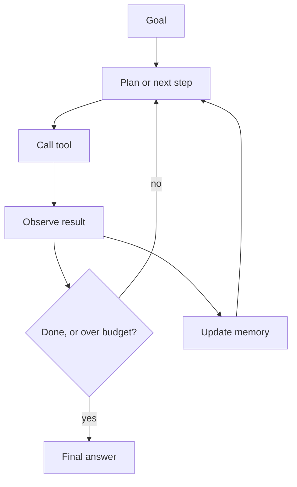

## Before you start

[tool-calling-and-function-calling](tool-calling-and-function-calling) is essential — an agent is a loop around tool calling. Familiarity with retries and timeouts from ordinary backend work will pay off immediately.

## In one sentence

**Agent orchestration** is the engineering around an LLM that runs in a loop — deciding what it can call, what it remembers, when it must stop, and what it costs — so that a system which chooses its own next step stays predictable enough to run in production.

## Why it matters

An agent is the first system you will build where **the control flow is decided at runtime by a probabilistic model**. Ordinary reliability tools assume you wrote the branches. Here you did not.

That inverts what goes wrong. Bugs stop being crashes and become an agent that quietly retries the same failing call forty times, burning $12 on one user request. Interviewers push on orchestration precisely because it separates people who have shipped an agent from people who have watched a demo.

## The intuition

You have a competent contractor who cannot see the clock or the budget. Give them a task and they work until finished — or until they hit something confusing, at which point they will keep trying variations indefinitely, because giving up is not in their nature.

Your job is not to do the work. It is to define the scope, hand over the right tools, set a deadline and a budget, check in at milestones, and require sign-off before anything irreversible. That is orchestration: everything around the worker, not the worker.

## How it actually works

**The core loop.** Give the model a goal and tools. It picks a tool; you execute; you feed the result back; it picks again. It ends when it produces a final answer, hits your step cap, hits your budget, or errors.

**Memory has three layers.** **Working memory** is the message history in the context window — accurate but bounded and re-billed every turn. **Summarised memory** compresses old turns to survive a long session, cheaper but lossy. **Long-term memory** is external storage the agent queries as a tool, which is just RAG.



**Termination needs four independent conditions**, because any one alone fails: a step cap, a token or cost budget, a wall-clock timeout, and no-progress detection (the same tool called with the same arguments twice in a row). Ship all four.

**Single agent versus multi-agent.** One agent with several tools is the right default and stays the right answer far longer than the discourse suggests. Multi-agent — a planner delegating to specialists — helps only when subtasks need genuinely different tools or prompts, or can run in parallel. The cost is real: agents communicate in natural language, which is lossy, and every handoff is another billed call. Reach for a second agent when one agent's tool list exceeds roughly fifteen tools or its system prompt is juggling contradictory instructions, not before.

## Worked example

A complete orchestrator with all four termination conditions:

```js
const LIMITS = { maxSteps: 8, maxCostUsd: 0.25, maxWallClockMs: 30_000 };
const PRICE = { promptPer1k: 0.00015, completionPer1k: 0.0006 }; // per 1k tokens

function costOf(usage) {
  return (
    (usage.prompt_tokens / 1000) * PRICE.promptPer1k +
    (usage.completion_tokens / 1000) * PRICE.completionPer1k
  );
}

async function runAgent(goal, tools, impl) {
  const messages = [{ role: 'user', content: goal }];
  const startedAt = Date.now();
  let spent = 0;
  let lastSignature = null; // for no-progress detection

  for (let step = 1; step <= LIMITS.maxSteps; step++) {
    if (Date.now() - startedAt > LIMITS.maxWallClockMs) {
      return { status: 'timeout', step, spent };
    }
    if (spent > LIMITS.maxCostUsd) {
      return { status: 'over_budget', step, spent };
    }

    const res = await fetch('https://api.openai.com/v1/chat/completions', {
      method: 'POST',
      headers: {
        'Content-Type': 'application/json',
        Authorization: `Bearer ${process.env.OPENAI_API_KEY}`,
      },
      body: JSON.stringify({ model: 'gpt-4o-mini', messages, tools, temperature: 0 }),
    });

    const data = await res.json();
    spent += costOf(data.usage);           // meter EVERY call, not just the last
    const msg = data.choices[0].message;
    messages.push(msg);

    if (!msg.tool_calls?.length) {
      return { status: 'done', answer: msg.content, steps: step, spent };
    }

    // No-progress: identical tool + arguments as last turn means it is stuck.
    const signature = JSON.stringify(
      msg.tool_calls.map((c) => [c.function.name, c.function.arguments])
    );
    if (signature === lastSignature) {
      messages.push({
        role: 'user',
        content: 'That call returned the same result. Answer with what you already have.',
      });
      lastSignature = null;
      continue;
    }
    lastSignature = signature;

    for (const call of msg.tool_calls) {
      let output;
      try {
        output = await impl[call.function.name](JSON.parse(call.function.arguments));
      } catch (err) {
        output = { error: String(err.message) }; // errors go to the model, not the stack
      }
      messages.push({
        role: 'tool',
        tool_call_id: call.id,
        content: JSON.stringify(output),
      });
    }
  }
  return { status: 'max_steps', spent };
}
```

Every exit path returns a status and the amount spent. That matters more than it looks: when an agent behaves oddly in production, "which limit did it hit and what had it cost by then" is the first question, and a system that cannot answer it cannot be debugged.

## A second example — when it gets harder

Cost is where agents surprise people, because history compounds. Model it before you deploy:

```js
function projectAgentCost({ steps, systemTokens, perStepTokens, answerTokens }) {
  const price = { promptPer1k: 0.00015, completionPer1k: 0.0006 };
  let contextTokens = systemTokens;
  let promptTotal = 0;
  let completionTotal = 0;

  for (let step = 1; step <= steps; step++) {
    promptTotal += contextTokens;        // ENTIRE history re-sent every step
    completionTotal += answerTokens;
    contextTokens += perStepTokens;      // tool call + result appended
  }

  const cost =
    (promptTotal / 1000) * price.promptPer1k +
    (completionTotal / 1000) * price.completionPer1k;

  return { promptTotal, completionTotal, cost };
}

for (const steps of [3, 8, 20]) {
  const r = projectAgentCost({ steps, systemTokens: 1200, perStepTokens: 700, answerTokens: 120 });
  console.log(
    `${steps} steps -> ${r.promptTotal} prompt tokens, $${r.cost.toFixed(4)} per request`
  );
}
```

Output:

```
3 steps -> 5700 prompt tokens, $0.0011 per request
8 steps -> 29200 prompt tokens, $0.0050 per request
20 steps -> 157000 prompt tokens, $0.0250 per request
```

Steps went up 6.7 times from 3 to 20; prompt tokens went up 27.5 times. **Agent cost grows quadratically with step count**, because each step re-sends everything before it. At a million requests a month, that gap is $1,100 versus $25,000.

Three fixes, in order of value. **Cap steps aggressively** — most tasks that need more than eight steps are tasks the agent is failing at, not tasks that are genuinely deep. **Use prompt caching**, which discounts the unchanging prefix heavily and directly attacks the re-sent history. **Summarise or drop old turns** once history exceeds a threshold, keeping the goal and the last few observations.

One more failure worth naming: **partial completion of side effects.** An agent that sends an email at step 4 and hits your step cap at step 8 has already sent the email. Unlike a database transaction, there is no rollback. Any irreversible tool needs an idempotency key and, for anything genuinely costly, a human approval gate — the loop provides no natural pause of its own.

## Quick reference

| Control | Why | Typical value |
|---|---|---|
| Max steps | Stops runaway loops | 5–10 |
| Cost budget | Caps worst-case spend per request | $0.10–0.50 |
| Wall-clock timeout | Protects user-facing latency | 30–60s |
| No-progress detection | Catches identical repeated calls | 2 identical in a row |
| Tool count per agent | Selection accuracy degrades | Under ~15 |
| History summarisation | Fights quadratic cost | Above ~8k tokens |

| Pattern | Use when | Watch out for |
|---|---|---|
| Single agent, many tools | Almost always — start here | Tool selection degrades past ~15 tools |
| Planner + workers | Subtasks need different tools or prompts | Lossy natural-language handoffs |
| Parallel agents | Independent subtasks (research N topics) | Cost multiplies by worker count |
| Sequential pipeline | Fixed known stages | If stages are fixed, you may not need an agent |
| Human in the loop | Irreversible or costly actions | Latency; needs a resumable design |

## Tools & frameworks

This layer churns faster than anything else in the chapter, so treat these as current defaults rather than settled choices.

| Tool | What it's for | Reach for it when |
|---|---|---|
| [LangGraph (JS)](https://docs.langchain.com/oss/javascript/langgraph/overview) | Graph-structured agent state machines | The agent needs cycles, checkpoints and human-in-the-loop, not a straight-line chain |
| [Vercel AI SDK](https://ai-sdk.dev/docs/introduction) | Typed tool-calling loops in TypeScript | You want a small TS-native agent loop and no framework to learn |
| [LangChain (JS)](https://docs.langchain.com/oss/javascript/langchain/overview) | Chain and retriever glue | You are prototyping quickly and want prebuilt integrations over your own abstractions |
| [Temporal](https://docs.temporal.io/) | Durable execution for long-running agents | The run takes hours and must survive a process restart |
| [CrewAI](https://docs.crewai.com/) | Role-based multi-agent teams | You genuinely need multi-agent role delegation — Python-only, with no JS equivalent |

The `js.langchain.com` host now redirects into `docs.langchain.com/oss/javascript/`, so link the new one.

## Common mistakes

- Shipping with only a step cap; a single step can still be slow or expensive, so you need time and cost limits too.
- Metering only the final call instead of accumulating usage across every step.
- Reaching for multi-agent because it sounds sophisticated, when one agent with good tools is simpler, cheaper, and more reliable.
- Letting history grow unbounded, so step 20 costs many times step 1.
- No idempotency on side-effecting tools, so a retry sends the email twice.
- Logging only the final answer, leaving you unable to reconstruct why the agent chose what it chose.
- Treating an agent as deterministic in tests; assert on outcomes and invariants, not exact transcripts.

## What interviewers ask

- **How do you stop an agent running forever?** — Four independent limits: max steps, a cost budget, a wall-clock timeout, and no-progress detection on repeated identical tool calls; any single limit has a failure mode the others cover.
- **Single agent or multi-agent?** — Default to one agent with a focused tool list, and split only when subtasks need genuinely different tools or prompts or can run in parallel, because every handoff adds a billed call and loses information in natural-language translation.
- **Why does agent cost grow faster than step count?** — The full conversation history is re-sent as prompt tokens on every step, so total prompt tokens grow with the square of the step count; prompt caching and history summarisation are the mitigations.
- **How do you handle an agent that half-finished a task with side effects?** — There is no rollback, so make side-effecting tools idempotent with keys, keep them behind approval gates, and design the loop to record what has already executed so a resumed run does not repeat it.
- **How do you test something non-deterministic?** — Assert on invariants and outcomes rather than transcripts: did it stay within budget, did it call the forbidden tool, did the final answer contain the required field; run each case several times and track pass rate rather than expecting a single deterministic pass.
- **What does agent memory actually mean?** — Three distinct things: the message history in the context window, a compressed summary of older turns, and external storage the agent queries as a tool; only the first is automatic, and confusing them leads to expecting recall the system was never built to provide.

## Practice

1. Take the orchestrator above and add a per-tool timeout so one slow tool cannot consume the whole wall-clock budget. Decide what the model sees when a tool times out.
2. Implement history summarisation: when messages exceed 6,000 estimated tokens, replace the middle with a one-paragraph summary while keeping the goal and last two exchanges. Measure the cost difference over 15 steps.
3. Design an approval gate for a `refund_customer` tool. The agent's call returns "pending"; a human approves out of band; the agent resumes. Write down what happens if the approval arrives after the request has already returned.

## Where to go next

[llm-evaluation-and-testing](llm-evaluation-and-testing) is how you tell whether changes to an agent help or hurt. [llm-cost-and-latency](llm-cost-and-latency) goes deeper on caching and routing, and [llm-safety-and-guardrails](llm-safety-and-guardrails) covers what happens when an agent with real tools meets a hostile user.
