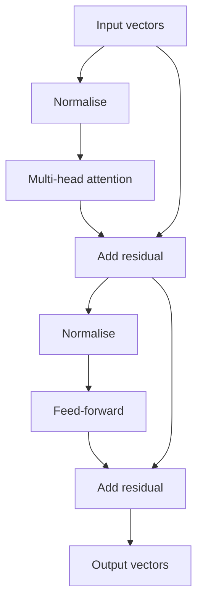
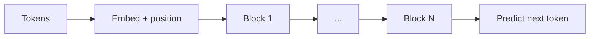

## Before you start

Read [llm-fundamentals](llm-fundamentals) for tokens and next-token prediction, and [embeddings-and-vector-math](embeddings-and-vector-math) for vectors and the dot product — attention is built almost entirely out of dot products, so that one operation is the prerequisite that matters.

## In one sentence

**Attention** lets every position in a sequence look directly at every other position and pull in whatever is relevant, and a **transformer** is a stack of layers that do exactly that, over and over.

## Why it matters

Every model you use is a transformer, and two of its most consequential properties fall straight out of attention's mechanics. Context windows are limited and long prompts are expensive *because* attention costs grow with the square of the sequence length. If you can explain that quadratic relationship, you can explain pricing, context limits, latency, and why "just make the window bigger" is not a free choice — which is precisely the reasoning interviewers are probing for.

## The intuition

Before transformers, sequence models read one token at a time and carried everything they had seen in a single fixed-size running state. Two problems followed. Information from 200 tokens ago had been overwritten by everything since, so distant context faded. And because step 50 needed step 49's output, nothing could be computed in parallel — training was inherently sequential, which capped how big models could get.

Attention drops the running summary entirely. Every position gets to look at every other position *directly*, in one step, with no distance penalty. Position 200 reaches position 1 as easily as position 199. And because all those comparisons are independent, they happen at once on a GPU. That parallelism, not just the quality gain, is why transformers won.

**Query, key, value** is the framing that makes the mechanism concrete, and it maps onto a lookup. Each position produces three vectors from its own embedding:

- The **query** is what this position is looking for. The token "it" emits a query meaning roughly "I need the noun I refer to".
- The **key** is what a position advertises about itself. "trophy" emits a key saying "I am a concrete object".
- The **value** is what actually gets handed over and mixed in when a position is selected.

A dictionary lookup matches one query to exactly one key and returns one value. Attention matches a query against *every* key, scores how well each matches, and returns a *blend* of all the values weighted by those scores. That is the honest limit of the analogy: it is a soft, learned lookup over the whole sequence, where nothing is chosen outright and everything contributes a little.

## How it actually works

Four steps, once per attention layer.

**1. Score.** Take the dot product of each query with every key. High dot product means the query and key point the same way — this position is relevant to that one. With n tokens you compute n × n scores.

**2. Scale.** Divide every score by the square root of the key dimension. Without this, large dimensions produce large dot products, softmax saturates, and gradients vanish during training. It is a numerical fix, not a conceptual one.

**3. Softmax.** Convert each row of scores into weights that are positive and sum to 1. Each position now has a distribution over the whole sequence: "I am 65% about myself, 16% about this other token".

**4. Weighted sum.** Multiply every value vector by its weight and add them up. That sum is the position's output — its own meaning, updated with context pulled from everywhere else.

**Multi-head attention.** One set of query/key/value projections can only learn one notion of relevance. So a layer runs several in parallel — 32 **heads** is typical — each with its own learned projections, each operating on a slice of the dimensions. They specialise: heads that track syntactic agreement, heads that follow pronoun references, heads that mostly look at the previous token. Their outputs are concatenated and projected back. More than one head, because "relevant" means several different things simultaneously.

**Why it is quadratic.** This is the fact to remember. Every token attends to every token, so n tokens produce n² scores. Double the sequence and you quadruple the attention work.

| Tokens | Attention scores per head per layer |
|---|---|
| 1,000 | 1,000,000 |
| 2,000 | 4,000,000 |
| 8,000 | 64,000,000 |
| 128,000 | 16,384,000,000 |

Going from 1k to 128k tokens is 128× the text and over 16,000× the attention scores. That is why context windows are a hard engineering problem rather than a configuration value, and why a long prompt costs more than proportionally to its length.

**Causal masking.** In a decoder-only model — the architecture behind every chat LLM — a token must not attend to tokens after it. Before softmax, all future positions are set to negative infinity, which softmax turns into exactly zero weight. Without this the training objective collapses: predicting the next token while being allowed to see it is not a task. Masking is what lets one forward pass over a whole sentence train every position simultaneously and honestly.

**Positional information.** Attention is a weighted sum, and sums do not care about order — shuffle the tokens and the same scores come back rearranged. So position must be injected explicitly, either added to the embeddings or applied by rotating the query and key vectors by angle-per-position (the common modern approach). Without it, "the dog bit the man" and "the man bit the dog" are the same input.



That block is repeated N times — 32 layers is common. The **residual** connections (the arrows that skip past a sublayer) let each block make a small adjustment to a running representation rather than rebuild it, which is what makes stacking dozens of layers trainable at all. Attention moves information *between* positions; the feed-forward layer processes each position independently and is where most of the parameters live.



## Worked example

Single-head self-attention over four tokens, with hand-picked matrices small enough to check by hand:

```js
const dot = (a, b) => a.reduce((s, x, i) => s + x * b[i], 0);
const matmul = (A, B) => A.map((r) => B[0].map((_, j) => dot(r, B.map((row) => row[j]))));

function softmax(row) {
  const max = Math.max(...row);              // subtract the max for numerical stability
  const exps = row.map((v) => Math.exp(v - max));
  const sum = exps.reduce((a, b) => a + b, 0);
  return exps.map((e) => e / sum);           // positive, sums to 1
}

const names = ['the', 'cat', 'sat', 'down'];
const X = [                                   // token embeddings, d_model = 4
  [1, 0, 1, 0], // the
  [0, 1, 0, 1], // cat
  [1, 1, 0, 0], // sat
  [0, 0, 1, 1], // down
];
const Wq = [[1, 0], [0, 1], [1, 0], [0, 1]];  // learned projections, d_k = 2
const Wk = [[1, 0], [0, 1], [1, 0], [0, 1]];
const Wv = [[1, 0], [0, 2], [2, 0], [0, 1]];

const Q = matmul(X, Wq), K = matmul(X, Wk), V = matmul(X, Wv);

const scale = Math.sqrt(Wq[0].length);        // sqrt(d_k) = sqrt(2)
const scores = Q.map((q) => K.map((k) => dot(q, k) / scale));
const weights = scores.map(softmax);

console.log('        ' + names.map((n) => n.padStart(6)).join(''));
weights.forEach((r, i) =>
  console.log(names[i].padEnd(8) + r.map((w) => w.toFixed(3).padStart(6)).join('')),
);

const out = weights.map((w) => V[0].map((_, j) => dot(w, V.map((v) => v[j]))));
console.log('\noutput vectors:');
out.forEach((r, i) => console.log(' ', names[i].padEnd(6), r.map((v) => v.toFixed(3)).join('  ')));
```

Output:

```
           the   cat   sat  down
the      0.647 0.038 0.157 0.157
cat      0.038 0.647 0.157 0.157
sat      0.250 0.250 0.250 0.250
down     0.250 0.250 0.250 0.250

output vectors:
  the    2.413  0.587
  cat    0.587  2.413
  sat    1.500  1.500
  down   1.500  1.500
```

That grid is the attention pattern, and it is readable. Rows are the position doing the attending; columns are what it attends to. Row `the` puts 64.7% of its weight on itself and only 3.8% on `cat`, because with these matrices their query and key vectors are orthogonal — dot product zero, no relevance. `sat` and `down` produce an exactly uniform 0.250 across all four, because their queries match every key equally; they have no preference. Every row sums to 1.0, which is softmax doing its job.

Check row `the` yourself. Its scaled scores are `[2.828, 0, 1.414, 1.414]`. Exponentiate, divide by the total, and you get `[0.647, 0.038, 0.157, 0.157]`. The output vector for `the` is then 0.647×[3,0] + 0.038×[0,3] + 0.157×[1,2] + 0.157×[2,1] = [2.413, 0.587] — its own value dominating, with a little of the others mixed in. That mixing is the whole point of attention.

## A second example — when it gets harder

The pattern above lets every token see the future, which is fine for an encoder but destroys a generative model. Add the causal mask:

```js
// Position i may not attend to any position j > i.
const masked = Q.map((q, i) => K.map((k, j) => (j > i ? -Infinity : dot(q, k) / scale)));
const cw = masked.map(softmax); // exp(-Infinity) = 0, so future weights become exactly 0

console.log('        ' + names.map((n) => n.padStart(6)).join(''));
cw.forEach((r, i) => console.log(names[i].padEnd(8) + r.map((v) => v.toFixed(3).padStart(6)).join('')));
```

```
           the   cat   sat  down
the      1.000 0.000 0.000 0.000
cat      0.056 0.944 0.000 0.000
sat      0.333 0.333 0.333 0.000
down     0.250 0.250 0.250 0.250
```

A triangle. The first token can only attend to itself, so its weight is forced to 1.000 — it has no context at all, which is exactly right for predicting token two from token one alone. Each row renormalises over just the positions it is allowed to see: `sat` now splits 0.333 three ways instead of 0.250 four ways. The last token is the only one that sees everything.

Two consequences worth carrying. First, this triangle is why one forward pass trains every position at once: each row is an independent, honest next-token prediction problem. Second, notice that roughly half the n² scores are thrown away by the mask — the cost is still quadratic, just with a smaller constant.

## Quick reference

| Piece | What it does | Why it exists |
|---|---|---|
| Query | What this position is looking for | One side of the relevance score |
| Key | What this position advertises | The other side of the score |
| Value | What gets mixed into the output | Separating "match on" from "return" |
| Scale by √d_k | Shrinks large dot products | Stops softmax saturating |
| Softmax | Scores to weights summing to 1 | Makes it a weighted average |
| Multi-head | Several attentions in parallel | "Relevant" has many meanings at once |
| Causal mask | Zeroes out future positions | Makes next-token training valid |
| Positional encoding | Injects order | Attention alone is order-blind |
| Residual + norm | Keeps deep stacks trainable | Each block adjusts, not rebuilds |

## Tools & frameworks

Three entries is the honest count here: this is a theory topic whose tooling is a Python research stack.

| Tool | What it's for | Reach for it when |
|---|---|---|
| [PyTorch](https://docs.pytorch.org/docs/stable/index.html) | `scaled_dot_product_attention` and the primitives under it | You want to implement attention yourself to actually understand it — Python |
| [HuggingFace Transformers](https://huggingface.co/docs/transformers/index) | Reference implementations of every architecture | You would rather read real model code than another blog diagram |
| [tiktoken](https://github.com/openai/tiktoken) | Tokenization, the step before attention | You need to see what a token actually is before reasoning about sequence length |

There is no Node path into these internals, so do not go looking for one.

## Common mistakes

- Saying attention "chooses" a token; it produces a weighted blend of all of them, and usually a diffuse one.
- Believing attention is linear in sequence length. It is quadratic, which is why context is expensive.
- Confusing heads with layers: heads run side by side in one layer; layers run one after another.
- Thinking the causal mask is a safety feature. It is a training requirement — without it, next-token prediction is trivially solvable and teaches nothing.
- Forgetting positional information and expecting the model to infer order from the tokens themselves.
- Assuming a head's specialisation is designed. Nobody assigns roles; they emerge, and most heads are not cleanly interpretable.

## What interviewers ask

- **Why is attention quadratic in sequence length?** — Every token computes a relevance score against every other token, so n tokens produce n² scores per head per layer; doubling the input quadruples the work, which is the root cause of context limits and long-prompt cost.
- **What problem did attention solve?** — Earlier sequence models compressed all history into one fixed state, losing distant context, and had to run strictly in order so nothing parallelised; attention gives every position direct access to every other and makes all those comparisons independent.
- **Explain query, key and value.** — A soft lookup: the query is what a position needs, keys advertise what each position offers, scores come from query-key dot products, and the output is a softmax-weighted blend of all the values rather than a single retrieved one.
- **Why multiple heads?** — Relevance is not one relationship; separate heads with separate projections learn distinct patterns like agreement or coreference simultaneously, which one set of projections cannot represent.
- **What does causal masking do and why?** — It sets future positions to negative infinity so softmax gives them zero weight, which is what makes next-token prediction a real task and lets a single pass train every position at once.
- **Where does word order come from?** — Not from attention, which is a permutation-blind weighted sum; position is injected separately, by adding positional vectors or rotating queries and keys by an angle that depends on position.

## Practice

1. Extend the worked example to two heads with different `Wq`/`Wk` matrices, concatenate the outputs, and describe in words what each head ended up attending to.
2. Change one row of `X` so that `cat` and `sat` have parallel query and key vectors. Predict the new attention weights before running it, then check.
3. Write a function that counts attention scores for given layers, heads and sequence length, and use it to find the sequence length at which attention work exceeds one trillion score computations for a 32-layer, 32-head model.

## Where to go next

You now know that generating each token means attending over everything before it — and that doing so naively means recomputing the same keys and values on every step. [kv-cache-and-context-windows](kv-cache-and-context-windows) is the fix, and the memory bill it creates. For what happens to the final probability distribution, see [sampling-and-decoding](sampling-and-decoding).
