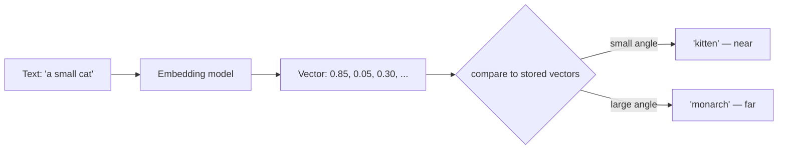

## Before you start

Read [llm-fundamentals](llm-fundamentals) first — you need to know that a model turns text into numbers before doing anything else. No linear algebra course required; everything here is addition, multiplication and one square root.

## In one sentence

An **embedding** is a fixed-length list of numbers that represents a piece of text as a position in space, arranged so that texts with similar meanings end up close together.

## Why it matters

Keyword search cannot find "how do I reset my password" when the document says "credential recovery procedure". Not one word overlaps. Embeddings solve this by comparing *positions* instead of *characters* — and that single trick is the foundation of semantic search, recommendations, deduplication, clustering, and every RAG system.

It also matters because the failures are silent. Mix vectors from two models and you get results that look plausible and are meaningless. Read a similarity score of 0.82 as "82% relevant" and you will build a threshold that rejects every correct answer. Both mistakes are invisible until someone complains about quality.

## The intuition

Imagine plotting every animal on a piece of graph paper. Left to right is *how big*, bottom to top is *how domesticated*. A cat and a kitten land almost on top of each other. A lion sits far right, low down. A washing machine is nowhere near any of them.

You did not define "similar". You defined two axes, and similarity became a distance you can measure with a ruler.

An embedding is that idea with hundreds or thousands of axes instead of two. Nobody hand-labels them — no dimension means "how domesticated". They come out of training, and most are not interpretable individually. What matters is that the *arrangement* is meaningful: distances and directions carry information even when individual coordinates do not.

**Why does similar text land nearby?** Because the model was trained to make that true. During training it repeatedly sees text and adjusts its numbers so that words and passages appearing in similar contexts get similar vectors. "Cat" and "kitten" get pulled together because the surrounding words are alike, over and over, across billions of examples. That is the whole mechanism. It is statistics about co-occurrence, not comprehension — which is exactly why embeddings happily place "excellent" near "terrible" (both appear in reviews, in the same slots) and why sarcasm defeats them.



## How it actually works

**Three metrics.** Given two vectors, you need one number for "how close".

**Cosine similarity** measures the angle between them and ignores how long they are. Divide the dot product by both magnitudes and the lengths cancel out. Range is -1 to 1: 1 means identical direction, 0 means unrelated, -1 means opposite.

**Dot product** multiplies the vectors element by element and sums. It reacts to angle *and* magnitude, so a long vector scores higher just for being long. Unbounded, so a raw dot product tells you nothing on its own.

**Euclidean distance (L2)** is straight-line distance — the ruler you would actually use on graph paper. Lower is closer, which inverts the direction of every comparison.

**The fact that carries the most practical weight:** for **normalised** vectors — rescaled so every one has length exactly 1 — cosine similarity and dot product produce *identical rankings*. Once all lengths are 1, the division in cosine is division by 1. So you normalise once when you store a vector, then use plain dot product forever after, skipping two square roots on every single comparison. Across millions of comparisons per query that is why a vector index is faster than the arithmetic suggests, and why nearly every production system stores normalised vectors.

**Score ranges are relative, not absolute.** Cosine similarity spans -1..1 in theory. For real text embeddings almost everything lands in a narrow positive band — often 0.6 to 0.95 — because natural language shares so much structure that even unrelated sentences point roughly the same way. So 0.8 means nothing by itself. It is only meaningful against the other scores from the *same model on your data*: if your top result is 0.91 and the rest sit at 0.78, that gap is the signal. Never hard-code a threshold copied from a blog post; measure your own distribution.

**Dimensionality.** A 384-dimension model captures less nuance than a 1536-dimension one, but costs a quarter of the storage and roughly a quarter of the comparison work. Storage is `count × dims × 4 bytes` for float32, so a million vectors at 1536 dimensions is about 6 GB before any index overhead. Some modern models are trained **Matryoshka**-style: the early dimensions carry the core meaning and later ones add detail, so you can simply truncate a 1536-dimension vector to 512 and it still works, losing a little accuracy for a large saving.

## Worked example

Three metrics over a hand-made 3-dimensional space, where the axes are made-up but readable:

```js
const dot = (a, b) => a.reduce((sum, x, i) => sum + x * b[i], 0);
const norm = (v) => Math.sqrt(dot(v, v));
const cosine = (a, b) => dot(a, b) / (norm(a) * norm(b)); // magnitudes cancel -> angle only
const euclidean = (a, b) => Math.sqrt(a.reduce((s, x, i) => s + (x - b[i]) ** 2, 0));

// Pretend axes: [animal-ness, royalty-ness, size]
const query = [0.9, 0.1, 0.4]; // "cat"
const docs = {
  kitten:  [0.85, 0.05, 0.30],
  lion:    [1.80, 0.60, 1.60], // similar direction, much LARGER magnitude
  monarch: [0.10, 0.95, 0.50],
};

for (const [name, v] of Object.entries(docs)) {
  console.log(
    name.padEnd(8),
    'cos', cosine(query, v).toFixed(4),
    ' dot', dot(query, v).toFixed(4),
    ' euc', euclidean(query, v).toFixed(4),
  );
}
```

Output:

```
kitten   cos 0.9959  dot 0.8900  euc 0.1225
lion     cos 0.9442  dot 2.3200  euc 1.5811
monarch  cos 0.3607  dot 0.3850  euc 1.1715
```

Read the columns, not the rows. **Cosine** says `kitten` is closest — correct, a cat is most like a kitten. **Raw dot product** says `lion` is closest, by a wide margin, purely because `lion` is a longer vector. That is the magnitude bug in miniature: with unnormalised vectors, dot product rewards long documents for being long. **Euclidean** agrees with cosine here, but notice its numbers run the other way — smaller is better.

Now normalise everything and watch two metrics converge:

```js
const unit = (v) => { const m = norm(v); return v.map((x) => x / m); }; // length becomes 1
const nq = unit(query);

for (const [name, v] of Object.entries(docs)) {
  const nv = unit(v);
  console.log(name.padEnd(8), 'cos', cosine(nq, nv).toFixed(4), ' dot', dot(nq, nv).toFixed(4));
}
```

```
kitten   cos 0.9959  dot 0.9959
lion     cos 0.9442  dot 0.9442
monarch  cos 0.3607  dot 0.3607
```

Identical, to four decimal places, and identical for the right reason: cosine *is* the dot product of unit vectors. `lion`'s inflated score has vanished, and the cheaper operation now gives the better answer.

## A second example — when it gets harder

The trap that costs real teams real weekends: **vectors from two different models are not comparable.** Each model learns its own arrangement of space during its own training run. Dimension 7 in one model has no relationship to dimension 7 in another. Even two models with identical dimension counts are unrelated coordinate systems.

The failure is not a crash. Cosine similarity between vectors from two models computes perfectly and returns a number in the normal-looking 0.6–0.9 band. Results are simply wrong, and nothing in your logs says so.

The consequence follows directly: **changing your embedding model means re-embedding your entire corpus.** Not a migration you can do incrementally with mixed vectors in one index — every vector must be regenerated with the new model before any of them can be compared.

Two more that surprise people:

**Chunking changes your vectors.** An embedding of a whole page and an embedding of one paragraph from that page are different points. Splitting the same document differently produces a different index and different results, with no code change. (Chunking *strategy* belongs to [rag-retrieval-augmented-generation](rag-retrieval-augmented-generation).)

**Symmetric versus asymmetric search.** Matching two documents against each other is a symmetric task: both sides look alike. Matching a five-word question against a 400-word passage is **asymmetric** — the two texts have different lengths, registers and shapes, and a model trained only for symmetric similarity handles it poorly. Many embedding models therefore ask you to prefix inputs differently for queries and documents, and skipping that prefix silently degrades every search you run.

## Quick reference

| Metric | Formula | Sensitive to | Use when |
|---|---|---|---|
| Cosine similarity | `dot(a,b) / (‖a‖·‖b‖)` | Angle only | Text of varying length — the default |
| Dot product | `Σ aᵢbᵢ` | Angle and magnitude | Vectors already normalised (fastest) |
| Euclidean (L2) | `√Σ(aᵢ-bᵢ)²` | Absolute position | Images, spatial data, clustering |

| Decision | Answer |
|---|---|
| Vectors normalised? | Use dot product — same ranking, no square roots |
| Score of 0.8 good? | Unanswerable in isolation; compare to your other scores |
| Switching model? | Re-embed everything; no mixed index |
| 384 vs 1536 dims | 1536 for nuance, 384 for cost; measure the recall gap |

## Common mistakes

- Comparing vectors from two different models, which produces confident, meaningless numbers.
- Hard-coding a similarity threshold like `> 0.75` from a tutorial instead of measuring your own score distribution.
- Reading similarity as a probability or percentage; 0.82 is a rank position, not a confidence.
- Using raw dot product on unnormalised vectors, so long documents dominate regardless of relevance.
- Forgetting the sign flip on Euclidean distance and sorting the least relevant results to the top.
- Assuming embeddings capture negation — "the flight was cancelled" and "the flight was not cancelled" land very close together.
- Embedding queries and documents identically when the model expects different prefixes for asymmetric search.

## What interviewers ask

- **What is an embedding?** — A fixed-length numeric vector representing text as a position in space, arranged during training so that text appearing in similar contexts lands nearby; it turns "is this relevant" into "is this close".
- **Cosine similarity or dot product?** — Cosine when magnitudes vary, since it compares direction only; if vectors are normalised the two rank identically and dot product is cheaper, so production systems normalise at write time and use dot product.
- **A search returns 0.83 similarity — is that a good match?** — Unknowable alone. Text embeddings cluster into a narrow positive band, so the number only means something relative to the other scores from the same model, which is why you measure the distribution rather than picking a threshold.
- **Can you swap embedding models without reindexing?** — No. Each model learns its own coordinate system, so old and new vectors are not comparable; you must re-embed the whole corpus, and mixing them fails silently rather than erroring.
- **Why use 384 dimensions instead of 1536?** — A quarter of the storage and comparison cost for a usually-small accuracy loss; Matryoshka-trained models let you truncate a large vector rather than run a different model.

## Practice

1. Write cosine, dot and Euclidean by hand, then build a 10-vector toy index and confirm which pairs each metric ranks differently. Explain every disagreement in terms of magnitude.
2. Embed 30 short sentences with one real embedding API, compute all pairwise cosine similarities, and plot the distribution. Find the actual minimum and maximum, then decide what threshold your data would justify.
3. Take one 1536-dimension embedding, truncate it to 512 and to 128, renormalise each, and measure how much the top-5 ranking of your toy index changes at each size.

## Where to go next

You can now measure similarity between two vectors. [vector-databases](vector-databases) is how you do it against millions of them in milliseconds, using indexes that trade exactness for speed. If you want to know how vectors are produced inside the model instead, go to [attention-and-transformers](attention-and-transformers).
