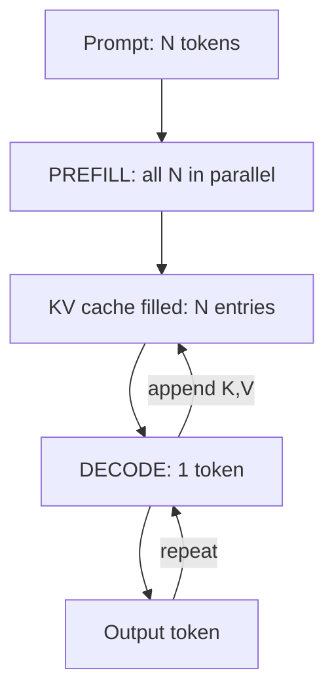

## Before you start

Read [attention-and-transformers](attention-and-transformers) first — you need to know that each token produces a query, a key and a value, and that attention scores a query against every key. This topic is what happens when you do that a thousand times in a row.

## In one sentence

The **KV cache** stores the key and value vectors already computed for every token so far, so generating the next token needs one small new computation instead of redoing the whole sequence — at the price of GPU memory that grows with every token.

## Why it matters

This is the single mechanic that explains the entire economics of running a model. Why is the first token slow and the rest fast? Why does a 128k context window cost so much more than 8k even at the same token price? Why does raising concurrency force you to shrink the context limit? Why is a long system prompt expensive in a way that is not obvious from the token count?

One answer: the KV cache. It turns generation from unaffordable into routine, and then it eats your VRAM. Every serving decision — batch size, context limit, which GPU you need — is a negotiation with this cache.

## The intuition

You are writing a story one word at a time, and before each word you re-read the entire story from the beginning to remind yourself of the context. Word 500 means re-reading 499 words. Across the whole story you have re-read the opening paragraph 500 times.

Obviously you should keep notes instead. Read each sentence once, jot down what it established, and glance at the notes before writing the next word.

That is the KV cache. The notes are the key and value vectors — and they are worth caching for a precise reason: **a token's key and value never change once computed.** They depend only on that token and the ones before it, and causal masking guarantees nothing later can affect them. Token 3's key is identical whether the sequence is 4 tokens long or 4,000. Anything that never changes and is needed repeatedly is exactly what a cache is for.

The cost is that the notebook keeps growing, it lives in the most expensive memory you own, and there is one notebook per concurrent conversation.

## How it actually works

**Without a cache**, generating token n+1 means running attention over all n previous tokens: project every one into keys and values again, score, softmax, sum. Do that for every token you generate and you repeat the same projections thousands of times. Generating n tokens costs roughly n³ work in the attention path — n steps, each redoing an n² computation.

**With a cache**, each layer keeps two tensors per token: its key and its value. Generating the next token becomes three steps:

1. Compute the new token's own query, key and value — one token's worth of work, not n.
2. Append its key and value to the cache.
3. Score its single query against all cached keys and blend the cached values.

Per step the work drops from "attend over the whole sequence" to "one query against n cached keys" — linear, not quadratic. Total generation goes from n³ to n².



**Prefill and decode** fall straight out of this, and they are two genuinely different workloads.

**Prefill** processes your entire prompt in one pass. Every token's key and value can be computed simultaneously because they do not depend on each other, so the GPU runs at full arithmetic throughput. Prefill is **compute-bound**, and its duration sets your time-to-first-token — which is why a long prompt feels slow before anything appears.

**Decode** generates one token at a time. Each step reads the whole KV cache and every weight in the model, then does a tiny amount of arithmetic with them. The GPU spends its time moving bytes, not multiplying — decode is **memory-bandwidth-bound**. This is why a token arrives every few milliseconds no matter how powerful the card is: you are limited by how fast memory can be read, and it is the reason serving stacks batch aggressively, since one memory read of the weights can serve many sequences at once.

**The cost.** The cache size is a straightforward product:

```
bytes = layers × heads × head_dim × 2 × bytes_per_value × seq_len × batch
```

The `2` is K and V. `bytes_per_value` is 2 for fp16. Take a 7B-class model: 32 layers, 32 heads, head_dim 128, fp16.

Per token: 32 × 32 × 128 × 2 × 2 = **524,288 bytes — half a megabyte for one token.** At 32,000 tokens that is 15.6 GB for a *single* sequence.

Now the punchline. **The KV cache and the model weights live in the same VRAM.** That 7B model in fp16 is about 14 GB of weights. On an 80 GB card you have roughly 66 GB left. One 32k-token conversation claims 15.6 GB of it, so you fit four. Drop the context limit to 4k and the same card serves thirty-three.

That trade is direct and unavoidable: **context length × batch size is a fixed budget.** A context window is not a text-length preference the model happens to allow — it is a memory reservation, which is why hosted providers price long context differently and why self-hosting forces you to pick a `max_model_len`.

**Long system prompts.** A 2,000-token system prompt is re-prefilled on every single request unless the server recognises and reuses the prefix, and it occupies 1 GB of cache for the entire conversation on the model above. Both costs are invisible in the token count you were quoted. Prefix caching is the lever, and [llm-cost-and-latency](llm-cost-and-latency) covers it from the API-consumer side.

**Why a bigger window is not free**, even when the model advertises it: prefill time rises with prompt length so time-to-first-token gets worse; cache memory rises linearly so concurrency drops; and retrieval quality often degrades in the middle of a very long context, where models attend reliably to the beginning and end but skim the centre. Filling a 128k window because it exists usually buys you a slower, costlier, *less* accurate answer than a well-chosen 8k.

**Shrinking the cache.** The formula has a `heads` term, and that is the one architectures attack. **Multi-query attention (MQA)** gives every head its own query but shares a single key/value pair across all of them, cutting the cache by the number of heads. **Grouped-query attention (GQA)** is the middle ground now used almost everywhere: heads are split into groups, and each group shares one K/V pair — 32 heads in 8 groups shrinks the cache 4× with almost no quality loss. When you read that a model "uses GQA", this cache line is why.

## Worked example

A calculator you can point at any model:

```js
// bytes = layers x heads x head_dim x 2 (K and V) x bytes_per_value x seq_len x batch
function kvCacheBytes({ layers, heads, headDim, bytesPerValue, seqLen, batch }) {
  return layers * heads * headDim * 2 * bytesPerValue * seqLen * batch;
}
const human = (b) =>
  b >= 1024 ** 3 ? (b / 1024 ** 3).toFixed(2) + ' GB' : (b / 1024 ** 2).toFixed(1) + ' MB';

const model = { layers: 32, heads: 32, headDim: 128, bytesPerValue: 2 }; // 7B-class, fp16

console.log('per-token cache:', human(kvCacheBytes({ ...model, seqLen: 1, batch: 1 })));
for (const seqLen of [1_000, 8_000, 32_000, 128_000]) {
  const one = kvCacheBytes({ ...model, seqLen, batch: 1 });
  const eight = kvCacheBytes({ ...model, seqLen, batch: 8 });
  console.log(
    `${String(seqLen).padStart(7)} tokens: ${human(one).padStart(9)} (batch 1)  ` +
    `${human(eight).padStart(9)} (batch 8)`,
  );
}

const WEIGHTS_GB = 14, VRAM_GB = 80;               // weights and cache share one pool
const budget = (VRAM_GB - WEIGHTS_GB) * 1024 ** 3;
console.log(`\nfree VRAM for cache: ${(budget / 1024 ** 3).toFixed(0)} GB`);
for (const seqLen of [32_000, 4_000]) {
  const per = kvCacheBytes({ ...model, seqLen, batch: 1 });
  console.log(`concurrent ${seqLen}-token sequences that fit:`, Math.floor(budget / per));
}
```

Output:

```
per-token cache: 0.5 MB
   1000 tokens:  500.0 MB (batch 1)    3.91 GB (batch 8)
   8000 tokens:   3.91 GB (batch 1)   31.25 GB (batch 8)
  32000 tokens:  15.63 GB (batch 1)  125.00 GB (batch 8)
 128000 tokens:  62.50 GB (batch 1)  500.00 GB (batch 8)

free VRAM for cache: 66 GB
concurrent 32000-token sequences that fit: 4
concurrent 4000-token sequences that fit: 33
```

Three things to take away. Half a megabyte per token is a shockingly high per-token price for something that is conceptually just "notes". The batch-8 column at 128k tokens is 500 GB — six of the largest single GPUs available, for eight conversations. And the last two lines are the whole trade in two numbers: the *same hardware and the same model* serves either 4 users or 33, decided entirely by the context limit you configured.

## A second example — when it gets harder

Now measure what the cache buys, counting query-key score computations:

```js
// Uncached: at step s the model re-attends over all s tokens -> s^2 scores.
function uncached(n) { let t = 0; for (let s = 1; s <= n; s++) t += s * s; return t; }
// Cached: at step s only the new token's query hits s cached keys -> s scores.
function cached(n)   { let t = 0; for (let s = 1; s <= n; s++) t += s;     return t; }

for (const n of [10, 100, 1000, 4000]) {
  const u = uncached(n), c = cached(n);
  console.log(
    `${String(n).padStart(5)} tokens: uncached ${u.toExponential(2)}` +
    `  cached ${c.toExponential(2)}  speedup ${(u / c).toFixed(1)}x`,
  );
}
```

```
   10 tokens: uncached 3.85e+2  cached 5.50e+1  speedup 7.0x
  100 tokens: uncached 3.38e+5  cached 5.05e+3  speedup 67.0x
 1000 tokens: uncached 3.34e+8  cached 5.01e+5  speedup 667.0x
 4000 tokens: uncached 2.13e+10  cached 8.00e+6  speedup 2667.0x
```

The speedup is not a constant — it grows roughly linearly with sequence length, because you removed a whole factor of n. At ten tokens caching is a nice 7× win. At 4,000 tokens it is 2,667×, which is the difference between a usable product and one nobody would ship. Long-context generation is not merely faster with a cache; it is only possible with one.

And that is the tension in one line: **the optimisation that makes long context possible is the same thing that makes long context expensive.** You traded compute for memory, and memory is now the binding constraint. Every technique in Chapter 17 — quantisation, paged attention, continuous batching — is a way of buying back some of that memory.

## Quick reference

| Term | What it is | Bound by |
|---|---|---|
| Prefill | Whole prompt processed in parallel, cache filled | Compute (sets time-to-first-token) |
| Decode | One token per step, reading the cache | Memory bandwidth (sets tokens/sec) |
| KV cache | Stored K and V per token per layer | VRAM; grows linearly with tokens |
| Context window | Max tokens in the cache | A memory reservation, not a text limit |
| MQA | One K/V shared by all heads | Smallest cache, some quality cost |
| GQA | One K/V per group of heads | The modern default compromise |

| If you want... | You give up... |
|---|---|
| Longer context | Concurrency, and time-to-first-token |
| Higher batch size | Maximum context length per request |
| Both | Money — a bigger or additional GPU |

## Common mistakes

- Treating the context window as a text-length setting rather than a VRAM reservation, then being surprised that raising it drops throughput.
- Filling a large window because the model supports it, when a focused shorter prompt is faster, cheaper and often more accurate.
- Assuming a long static system prompt is a one-off cost; it is re-prefilled per request and holds cache for the whole conversation unless the prefix is cached.
- Sizing a GPU from the model weights alone and leaving no headroom for the cache, which produces out-of-memory errors under concurrency rather than at startup.
- Expecting decode to speed up on a faster-compute GPU; decode is bandwidth-bound, so memory bandwidth is the number that matters.
- Explaining slow first tokens as network latency when it is prefill over a long prompt.

## What interviewers ask

- **What does the KV cache store and why is it valid to cache?** — The key and value vectors for every token at every layer; causal masking means a token's K and V depend only on it and earlier tokens, so they never change once computed and can be reused for every subsequent step.
- **Why does a long context cost GPU memory?** — The cache holds K and V per token per layer, so its size grows linearly with sequence length and it sits in the same VRAM as the model weights; on a 7B fp16 model that is about 0.5 MB per token, so 32k tokens is roughly 15 GB for one sequence.
- **Prefill versus decode?** — Prefill runs the whole prompt in parallel and is compute-bound, setting time-to-first-token; decode emits one token per step while reading the full cache and all weights, so it is memory-bandwidth-bound and sets tokens per second.
- **Why does raising batch size force a lower context limit?** — Cache memory is proportional to both, and they share one fixed VRAM budget after the weights are loaded, so the two are in direct competition on the same card.
- **What are MQA and GQA for?** — Reducing the cache's `heads` term by sharing key/value pairs across heads — all of them in MQA, per group in GQA — which shrinks cache memory several-fold at little quality cost and is why modern models adopt GQA.
- **A bigger context window is available. Should you use it?** — Not by default: prefill latency rises with length, cache memory cuts concurrency, and quality often degrades in the middle of very long contexts, so retrieving the right 4k usually beats dumping 100k.

## Practice

1. Adapt the calculator to a 70B-class model (80 layers, 64 heads, head_dim 128) and find the longest context that fits on a single 80 GB card once the fp16 weights are loaded. Then repeat assuming 8-way GQA.
2. Given 4 GPUs of 80 GB, a 7B fp16 model and a target of 200 concurrent users, compute the maximum context length per user. State which term you would attack first to double it.
3. Measure it for real: send one request with a 200-token prompt and one with a 20,000-token prompt to the same model, and compare time-to-first-token against total time. Attribute each difference to prefill or decode.

## Where to go next

You now know the model weights and the KV cache compete for the same VRAM. [gpu-memory-math](gpu-memory-math) turns that into a sizing calculation you can defend in an interview, and [continuous-batching-and-throughput](continuous-batching-and-throughput) shows how real inference servers pack many sequences into that budget to keep the memory-bound decode phase busy.
