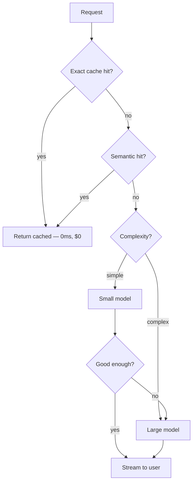

## Before you start

[llm-fundamentals](llm-fundamentals) for token accounting. [caching-strategies](caching-strategies) if you have it — the principles transfer, with one important difference in what counts as a cache hit.

## In one sentence

Cost and latency engineering for LLMs means measuring what a *completed task* costs and how long it takes end to end, then reducing both with caching, streaming, batching, and model routing — without letting quality quietly fall over.

## Why it matters

LLM calls are unusually expensive and unusually slow: roughly a thousand times the cost of a database query and a hundred times the latency. A feature that works beautifully in a demo can be economically impossible at a million users, and teams discover this after building it.

The subtler risk is measuring the wrong thing. A cheaper model that fails 30% of the time and triggers a retry plus an escalation to a human is not cheaper. **Cost per completed task** is the only number that means anything.

## The intuition

Think of a phone call to an expert consultant billed per word — both directions. Three ways to spend less: don't call when you already know the answer (caching), don't ask the same background context every time (prefix caching), and don't call the senior partner for questions a junior could answer (routing).

Latency has a separate trick. You cannot make the consultant think faster, but you can put them on speaker so everyone hears each word as it is spoken instead of waiting for a summary at the end. That is streaming: the total time is unchanged, the *perceived* wait collapses.

## How it actually works

**Token accounting.** You pay for prompt tokens and completion tokens at different rates, completion usually several times higher. Prompt tokens are re-sent every turn.

**Latency has two components.** **Time to first token (TTFT)** is how long before anything appears — driven by prompt length and queueing. **Time per output token** then dominates the rest: a 500-token answer takes roughly ten times as long as a 50-token one. Shortening *output* is the biggest latency lever most people never pull.

**Exact-match caching.** Identical request, cached response. Free and instant, but hit rates on natural language are low because users phrase things differently. **Semantic caching** embeds the query and reuses a response when a previous query is close enough — higher hit rate, real risk of serving a subtly wrong answer, so set the threshold conservatively.

**Prompt caching** is the provider-side feature that matters most for agents and RAG. Providers cache the unchanging *prefix* of your prompt and charge much less for those tokens on later calls. It requires the prefix be byte-identical, which drives a design rule: **put static content first — system prompt, tools, few-shot examples — and variable content last.** A timestamp near the top of your system prompt silently destroys the cache.



**Streaming** returns tokens as generated. Total time is identical; perceived latency drops from seconds to a few hundred milliseconds. For anything user-facing, this is the highest-value change relative to effort.

**Batching** trades latency for cost. Provider batch APIs typically offer around a 50% discount with a turnaround measured in hours — excellent for nightly classification of a backlog, useless for a chat reply.

**Model routing and cascades.** Send easy requests to a small cheap model and hard ones to a large one. A **cascade** tries the small model first and escalates only when the result fails a quality check. The economics work only when the small model succeeds often — escalating means paying for both.

## Worked example

A token-bucket limiter is the standard way to cap spend and absorb bursts:

```js
class TokenBucket {
  constructor({ capacity, refillPerSecond }) {
    this.capacity = capacity;         // burst size
    this.tokens = capacity;
    this.refillPerSecond = refillPerSecond;
    this.lastRefill = Date.now();
  }

  #refill() {
    const now = Date.now();
    const elapsedSeconds = (now - this.lastRefill) / 1000;
    this.tokens = Math.min(this.capacity, this.tokens + elapsedSeconds * this.refillPerSecond);
    this.lastRefill = now;
  }

  tryConsume(amount) {
    this.#refill();
    if (this.tokens >= amount) {
      this.tokens -= amount;          // spend only if the budget covers it
      return true;
    }
    return false;
  }

  get available() {
    this.#refill();
    return Math.floor(this.tokens);
  }
}

// Budget: 10,000 tokens burst, refilling at 1,000/second.
const bucket = new TokenBucket({ capacity: 10_000, refillPerSecond: 1000 });

console.log('allowed 4000?', bucket.tryConsume(4000));  // true
console.log('allowed 4000?', bucket.tryConsume(4000));  // true
console.log('allowed 4000?', bucket.tryConsume(4000));  // false — only 2000 left
console.log('remaining:', bucket.available);
```

Output:

```
allowed 4000? true
allowed 4000? true
allowed 4000? false
remaining: 2000
```

The third request is rejected before you spend anything. Reject-with-a-clear-error beats a surprise invoice, and the bucket absorbs legitimate bursts — a user pasting a long document — without blocking them the way a fixed per-minute counter would.

## A second example — when it gets harder

Now the number that actually matters. Compare a cheap model against an expensive one honestly:

```js
function costPerCompletedTask({ name, pricePerCall, successRate, humanCostPerEscalation }) {
  // Failures retry once; if the retry also fails, a human handles it.
  const retryRate = 1 - successRate;
  const stillFailing = retryRate * (1 - successRate);
  const modelCost = pricePerCall * (1 + retryRate);
  const humanCost = stillFailing * humanCostPerEscalation;
  return { name, modelCost, humanCost, total: modelCost + humanCost };
}

const options = [
  { name: 'small model', pricePerCall: 0.0004, successRate: 0.72, humanCostPerEscalation: 4.0 },
  { name: 'large model', pricePerCall: 0.0090, successRate: 0.94, humanCostPerEscalation: 4.0 },
  { name: 'cascade',     pricePerCall: 0.0028, successRate: 0.93, humanCostPerEscalation: 4.0 },
];

for (const o of options) {
  const r = costPerCompletedTask(o);
  console.log(
    `${r.name.padEnd(12)} model $${r.modelCost.toFixed(5)}  human $${r.humanCost.toFixed(4)}  TOTAL $${r.total.toFixed(4)}`
  );
}
```

Output:

```
small model  model $0.00051  human $0.3136  TOTAL $0.3141
large model  model $0.00954  human $0.0144  TOTAL $0.0239
cascade      model $0.00300  human $0.0196  TOTAL $0.0226
```

The small model is 22 times cheaper per call and **thirteen times more expensive per completed task**, because its 28% failure rate pushes work to humans at $4 a time. This is the trap behind most "we switched to a cheaper model to save money" stories.

The cascade edges out the large model here — $0.0226 against $0.0239 — but only barely, and that margin is entirely sensitive to the assumed success rates. Nudge the cascade's success rate down two points and the ranking flips, because a cascade pays the cheap model on every request *plus* the expensive one on every escalation. The lesson is not "cascades win"; it is that the three options land within a factor of two of each other while their per-call prices differ by 22x. **Run the numbers for your own success rates; do not assume.**

Two more levers with unusually good returns:

**Cap output length.** Completion tokens cost several times prompt tokens and dominate latency. "Answer in at most three sentences" plus `max_tokens` often halves both, at no quality cost for most tasks.

**Structure prompts for cache hits.** Static system prompt and tool definitions first, retrieved context and user message last. Providers cache the identical prefix; a per-request timestamp at the top makes every call a cache miss, and people ship that bug regularly.

## Quick reference

| Technique | Cost saving | Latency effect | Risk |
|---|---|---|---|
| Exact-match cache | 100% on hits | Instant on hits | Low hit rate on prose |
| Semantic cache | 100% on hits | Instant on hits | May serve a wrong answer |
| Prompt/prefix caching | Large on repeated prefixes | Lower TTFT | Prefix must be byte-identical |
| Streaming | None | Perceived drop, huge | None — do it by default |
| Batch API | ~50% | Hours | Unusable for interactive |
| Smaller model | Large per call | Faster | Quality drop may cost more overall |
| Cascade | Depends on escalation rate | Slower on escalation | Pays twice when it escalates |
| Shorter output | Proportional | Proportional | May truncate needed detail |

| Metric | What it tells you |
|---|---|
| Cost per API call | Almost nothing on its own |
| Cost per completed task | The number that matters |
| TTFT | What the user experiences as responsiveness |
| Tokens per request (p50/p99) | Where the outliers are |
| Cache hit rate | Whether your caching is real |

## Common mistakes

- Optimising cost per call while ignoring failure rates, retries, and human escalation.
- Putting variable content — a timestamp, a request ID — at the top of the prompt, destroying prefix caching.
- Skipping streaming on user-facing features, so a 4-second answer feels like a hang.
- Setting a semantic cache threshold too loosely and serving confidently wrong answers to slightly different questions.
- Never capping `max_tokens`, letting a rambling answer cost and take five times what a concise one would.
- Measuring only average latency; p99 is what users complain about.
- Batching interactive requests to save money, then discovering the turnaround is hours.

## What interviewers ask

- **How would you cut LLM costs by half without hurting quality?** — Start by measuring where tokens actually go, then apply prefix caching by moving static content to the front, cap output length, cache repeated queries, and route only genuinely simple requests to a smaller model — validating each change against an eval set so quality drops surface before users find them.
- **What is the difference between cost per call and cost per completed task?** — Cost per call ignores retries, failures, and escalation to humans, so a model that is twenty times cheaper per call but fails a third of the time can be far more expensive per task actually finished.
- **Does streaming make the response faster?** — No, total generation time is unchanged; it makes the first token arrive in a few hundred milliseconds instead of seconds, which is what users perceive as speed.
- **When does prompt caching not help?** — When your prefix varies between requests, so putting a timestamp, request ID, or the user's message before the static system prompt silently makes every call a cache miss.
- **When would you use a batch API?** — For offline work with no user waiting — nightly classification, bulk embedding, backfills — where roughly half the cost is worth a turnaround measured in hours.
- **How do you decide whether a cascade is worth it?** — Compute expected cost including the escalation path: a cascade pays the cheap model on every request plus the expensive one on escalations, so it only wins when the small model's success rate is high enough that escalations stay rare.

## Practice

1. Instrument an existing LLM feature to log prompt tokens, completion tokens, and cost per request. Find the p99 request and explain why it is so much larger than the median.
2. Take a prompt with variable content at the top and restructure it so the static prefix comes first. Measure the reported cached-token count before and after.
3. Model the cascade economics for your own numbers: pick a success rate for the small model at which the cascade beats using the large model alone, and derive the break-even point algebraically.

## Where to go next

[llm-safety-and-guardrails](llm-safety-and-guardrails) covers the checks that sit in this same request path and add their own cost and latency, which is why the two topics get designed together.
