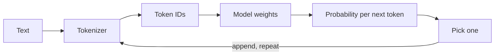

## Before you start

You need JavaScript and `fetch`. No machine-learning background is required — nothing here involves training a model or doing calculus. If you have used an LLM chat product, you already have the only intuition you need to begin.

## In one sentence

A **large language model (LLM)** is a function that takes a sequence of text and repeatedly predicts the single most plausible next chunk of text, one chunk at a time, using patterns it absorbed from an enormous amount of writing.

## Why it matters

Almost every LLM bug you will ever debug comes from misunderstanding this one mechanic. "Why did it truncate?" "Why did it forget what I told it?" "Why is my bill so high?" "Why does it invent APIs?" Those are not four mysteries — they are four consequences of next-token prediction over a fixed-size window. Once you see the mechanism, the behaviour stops looking magical and starts looking like a system you can engineer.

## The intuition

Picture the world's most extensively read autocomplete. It has no memory of your last conversation, no database it looks things up in, and no concept of truth. It has one skill: given the text so far, produce a probability for every possible next chunk, then pick one.

That is genuinely all it does. "Reasoning" is what emerges when the next-chunk prediction is good enough that the chunks it produces happen to spell out a valid argument. Understanding this explains **hallucination** immediately: a model asked for a citation produces text shaped like a citation, because plausible-shaped text is exactly what it was built to produce. It is not lying — it has no mechanism for checking.

## How it actually works



**Tokens.** The model never sees characters or words. Text is first cut into **tokens** — word fragments learned from data by **byte-pair encoding (BPE)**, which starts from individual bytes and repeatedly merges whichever adjacent pair appears most often, until the vocabulary reaches a fixed size (typically 50,000 to 200,000 entries). Frequency therefore decides length: " the" earns a token to itself, while "unhappiness" splits into pieces like `un` + `happiness`.

This is why **token count is not word count**. For English prose, one token is about four characters and 1,000 tokens roughly 750 words. But that ratio reflects *what the vocabulary was trained on*, and it degrades the moment you leave that distribution:

- **Non-English text** tokenizes far less efficiently. A vocabulary built mostly from English gives few slots to Hindi or Thai fragments, so those languages fall back to two- and three-byte pieces — two or three times more tokens for the same sentence.
- **Code** fragments for a different reason: indentation, `}`, `);` and `snake_case` identifiers split into many small tokens, and whitespace alone eats a surprising share of a code prompt.
- **Numbers and rare strings** — UUIDs, hashes, long digit runs — split near-arbitrarily, sometimes one token per character.

Both limits that matter are denominated in tokens, so this hits twice. **Price** is per token, making inefficient tokenization a direct cost multiplier. **Context** is measured in tokens, so the same document fits or does not depending on language and format. A non-English support bot can cost triple an English one for identical conversations, with no bug anywhere.

**Next-token prediction is the entire training objective.** The model sees a slice of real text with the next token hidden, guesses a probability for every token in its vocabulary, and is corrected in proportion to how wrong it was. Repeat trillions of times. There is no separate lesson on grammar, no fact database, no reasoning module — one objective, applied uniformly.

Why does something so simple produce so much? Because predicting the next token *well* requires whatever the text depended on. Finishing "the capital of France is" needs a stored fact. Finishing a function needs variable scope tracked. Finishing a translation needs meaning represented independently of language. Finishing "therefore the answer is" in a proof needs the argument followed. None of those was targeted; all are prerequisites for accurate prediction, and they appear because the training data is human writing about everything.

The same objective fixes the limits in place. It rewards *plausible* continuations, never *true* ones, so nothing penalises a confident fabrication that reads correctly. Hallucination arrives as a design consequence, not a defect.

**What a model actually is.** Strip away the API and a model is a file: a large array of numbers called **weights** or **parameters**, plus a small config describing the shape they go into. No code you have to trust, no data lookup at runtime.

Size has two independent axes people constantly conflate. **Parameter count** is how many numbers there are — 7B means seven billion. **Precision** is bytes per number: 4 for fp32, 2 for fp16, 1 for int8, half for 4-bit. File size is roughly the product, so a 7B model is about 28 GB at fp32, 14 GB at fp16 and 3.5 GB at 4-bit — the same model, three sizes, quality falling gently as precision drops.

Models also come in **training stages**, and using the wrong one wastes days. A **base** model is trained only to continue text; ask it a question and it may reply with more questions, because that is what plausibly follows. An **instruction-tuned** model has been further trained on instruction-and-response pairs, so it obeys requests. A **chat-tuned** model adds multi-turn structure and expects specific role markers. Every product you have used is at least instruction-tuned.

**Open weights** means the file is downloadable and you can run it yourself. It does not mean open source: training data is almost never published, training code often is not, and the licence may restrict commercial use or redistribution. You get the artefact, not the recipe.

**Inference is a loop.** One forward pass turns your token IDs into one probability distribution over the whole vocabulary — that is all a single call produces. Something picks one token, appends it, and the whole thing runs again. A 500-token answer is 500 passes, which is why longer answers cost more, take longer, and can stream at all.

Three of these ideas now have topics of their own. The vectors the model computes on, and how similarity between them is measured, are in [embeddings-and-vector-math](embeddings-and-vector-math). The mechanism by which each token gathers meaning from the others is [attention-and-transformers](attention-and-transformers). The token budget your prompt, history and answer compete for — really a memory limit — is [kv-cache-and-context-windows](kv-cache-and-context-windows). The picker in step two of the loop is [sampling-and-decoding](sampling-and-decoding).

## Worked example

This calls the OpenAI REST endpoint with plain `fetch` and prints the token accounting the API returns:

```js
// node >=18. Set OPENAI_API_KEY first.
const res = await fetch('https://api.openai.com/v1/chat/completions', {
  method: 'POST',
  headers: {
    'Content-Type': 'application/json',
    Authorization: `Bearer ${process.env.OPENAI_API_KEY}`,
  },
  body: JSON.stringify({
    model: 'gpt-4o-mini',
    messages: [{ role: 'user', content: 'Name three primary colours.' }],
  }),
});

const data = await res.json();
console.log(data.choices[0].message.content);
console.log(data.usage); // the token accounting — this is what you are billed on
```

Output looks like this:

```
Red, blue, and yellow.
{ prompt_tokens: 14, completion_tokens: 8, total_tokens: 22 }
```

Two things to notice. Your seven-word question was 14 tokens — punctuation, role scaffolding and word fragments all count. And `prompt_tokens` is charged on *every* call: in a 20-turn conversation you resend the whole history each time, so prompt tokens grow every turn while completion tokens stay flat.

## A second example — when it gets harder

The naive model of "one token, one word" breaks the moment you count something. Ask an LLM how many r's are in "strawberry" and it often gets it wrong — because it never saw the letters. It saw two or three token fragments, and letter-level facts are not recoverable from them.

You can watch tokenization efficiency vary by content type without any API call. This builds a tiny BPE-style merge table from a corpus, then applies it — the real algorithm, on a small enough scale to read:

```js
// Learn merges the way BPE does: repeatedly fuse the most frequent adjacent pair.
function learnMerges(corpus, rounds) {
  let seqs = corpus.map((w) => w.split(''));
  const merges = [];
  for (let r = 0; r < rounds; r++) {
    const counts = new Map();
    for (const s of seqs)
      for (let i = 0; i < s.length - 1; i++) {
        const k = s[i] + '' + s[i + 1];
        counts.set(k, (counts.get(k) ?? 0) + 1);
      }
    if (!counts.size) break;
    const [best] = [...counts.entries()].sort((a, b) => b[1] - a[1])[0];
    const [x, y] = best.split('');
    merges.push(x + y);
    seqs = seqs.map((s) => {
      const out = [];
      for (let i = 0; i < s.length; i++) {
        if (s[i] === x && s[i + 1] === y) { out.push(x + y); i++; } else out.push(s[i]);
      }
      return out;
    });
  }
  return merges;
}

function tokenize(word, merges) {
  let s = word.split('');
  for (const m of merges) {           // apply merges in the order they were learned
    const out = [];
    for (let i = 0; i < s.length; i++) {
      if (s[i] + (s[i + 1] ?? '') === m) { out.push(m); i++; } else out.push(s[i]);
    }
    s = out;
  }
  return s;
}

// A corpus dominated by 'ing' and 'the' — like English training data.
const corpus = ['thing', 'think', 'thing', 'the', 'the', 'the', 'singing', 'ringing'];
const merges = learnMerges(corpus, 6);
console.log('learned merges:', merges);

for (const w of ['thing', 'singing', 'zqxwv', '9f8a2b']) {
  const t = tokenize(w, merges);
  console.log(`${w.padEnd(8)} chars ${String(w.length).padStart(2)}  tokens ${t.length}  ${JSON.stringify(t)}`);
}
```

Output:

```
learned merges: [ 'in', 'th', 'ing', 'the', 'thing', 'inging' ]
thing    chars  5  tokens 1  ["thing"]
singing  chars  7  tokens 2  ["s","inging"]
zqxwv    chars  5  tokens 5  ["z","q","x","w","v"]
9f8a2b   chars  6  tokens 6  ["9","f","8","a","2","b"]
```

The whole phenomenon in four lines. "thing" appeared often, so it earned a single token — 5 characters for the price of 1. "zqxwv" and "9f8a2b" never appeared, so they cost one token *per character*, five to six times worse. Real tokenizers behave this way at scale, which is why a UUID costs more than a paragraph of English and why a language absent from the training corpus is systematically more expensive to serve.

Notice too that `singing` tokenized as `["s","inging"]` rather than the intuitive `sing` + `ing`. Because `ing` was learned early and then merged with itself into `inging`, the boundaries fall where the *statistics* put them, not where the morphemes are. Token boundaries routinely cut across meaning like this, which is one more reason the model cannot reason about spelling.

## Quick reference

| Concept | What it is | Why you care |
|---|---|---|
| Token | A learned text fragment; the model's atomic unit | Billing, limits and truncation all use it |
| BPE | Merges frequent adjacent pairs to build the vocabulary | Explains why frequency decides token length |
| Tokens per word | ~0.75 words/token for English; far worse for code, other languages, IDs | Same text, different cost by language |
| Parameters | Count of numbers in the weights file | Capability and memory floor |
| Precision | Bytes per number (fp32/fp16/int8/4-bit) | File size = params × bytes |
| Base model | Continues text only | Will not follow instructions |
| Instruction-tuned | Trained on instruction/response pairs | What you almost always want |
| Open weights | Weights downloadable | Not the same as open source or free to resell |
| Prompt tokens | Everything you send | Resent every turn — grows with history |
| Completion tokens | Everything generated | Usually priced higher |
| Hallucination | Plausible-shaped but false output | A consequence of the objective, not a bug |

## Common mistakes

- Counting characters or words instead of tokens, then being surprised by a context-length error.
- Estimating non-English or code prompts with the English four-characters-per-token rule and under-budgeting by two or three times.
- Assuming the model remembers previous API calls — the client resends history every time, and anything trimmed is genuinely gone.
- Confusing parameter count with file size, then provisioning 7 GB when fp16 weights need 14 GB.
- Reaching for a base model and concluding it is broken because it will not answer questions; you wanted the instruction-tuned variant.
- Reading "open weights" as "open source and unrestricted"; check the licence before shipping.
- Expecting reliable arithmetic or character counting; give the model a tool instead.
- Treating a confident tone as evidence of correctness — confidence is a learned style, uncorrelated with accuracy.

## What interviewers ask

- **Why do LLMs hallucinate?** — The training objective rewards probable continuations, not verified facts, so when no strong pattern supports an answer the model still emits the most plausible-looking text; the fix is grounding in retrieved sources or tools, not asking it to try harder.
- **Why isn't a token just a word?** — Tokens come from BPE, which merges the most frequent adjacent pairs until the vocabulary is full, so common words become single tokens while rare ones fragment; frequency decides length, which is also why unfamiliar languages and identifiers cost more.
- **Your bill tripled after launching in a non-English market. Why?** — Tokenization efficiency depends on the vocabulary's training distribution, so a language poorly represented in it needs two or three times more tokens for the same text, tripling both cost and context consumption with no code change.
- **How does one objective produce reasoning, translation and coding?** — Predicting the next token accurately requires whatever the text depended on: facts, scope tracking, cross-lingual meaning, argument structure. None was targeted; all are prerequisites for good prediction.
- **Base, instruction-tuned or chat-tuned?** — A base model only continues text and will not follow a request; instruction tuning adds obedience; chat tuning adds multi-turn structure and role formatting. Almost every application wants at least instruction-tuned.
- **Why can't a model count letters in a word?** — It never sees letters; text is split into multi-character fragments first, and those boundaries often cut across meaning, so letter-level facts are absent from its input.
- **Where does the cost in a chat app come from?** — Resending history: prompt tokens are billed every turn, so cost grows far faster than the conversation unless you trim, summarise or cache the prefix.

## Practice

1. Take the same paragraph in English and in one non-Latin-script language, count tokens for both with a real tokenizer, and compute the cost multiplier. Then do it for a 200-line source file and a list of UUIDs.
2. Extend the BPE example to 30 merge rounds over a larger corpus and plot average tokens-per-word as merges increase. Identify where the returns flatten.
3. Write a function that takes a conversation array and a token budget and trims oldest-first while always keeping the system message. Decide what to do when a single message exceeds the budget alone.

## Where to go next

Take the three new topics in the order they build. [embeddings-and-vector-math](embeddings-and-vector-math) covers the vectors the model computes on and how similarity is measured. [attention-and-transformers](attention-and-transformers) is the mechanism that turns those vectors into contextual meaning, and where the cost comes from. [kv-cache-and-context-windows](kv-cache-and-context-windows) explains why the context window is a memory budget, not a text-length setting. To stay on the API side instead, [sampling-and-decoding](sampling-and-decoding) is the picker at the end of the loop and the cheapest quality lever you have.
