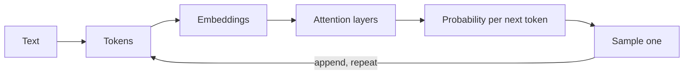

## Before you start

You need JavaScript and `fetch`. No machine-learning background is required — nothing here involves training a model or doing calculus. If you have used an LLM chat product, you already have the only intuition you need to begin.

## In one sentence

A **large language model (LLM)** is a function that takes a sequence of text and repeatedly predicts the single most plausible next chunk of text, one chunk at a time, using patterns it absorbed from an enormous amount of writing.

## Why it matters

Almost every LLM bug you will ever debug comes from misunderstanding this one mechanic. "Why did it truncate?" "Why did it forget what I told it?" "Why is my bill so high?" "Why does it invent APIs?" Those are not four mysteries — they are four consequences of next-token prediction over a fixed-size window. Once you see the mechanism, the behaviour stops looking magical and starts looking like a system you can engineer.

## The intuition

Picture the world's most extensively read autocomplete. It has no memory of your last conversation, no database it looks things up in, and no concept of truth. It has one skill: given the text so far, produce a probability for every possible next chunk, then pick one.

That is genuinely all it does. "Reasoning" is what emerges when the next-chunk prediction is good enough that the chunks it produces happen to spell out a valid argument. Understanding this explains **hallucination** immediately: a model asked for a citation produces text shaped like a citation, because plausible-shaped text is exactly what it was built to produce. It is not lying — it has no mechanism for checking.

## How it actually works

Four ideas, in order.

**Tokens.** The model does not see characters or words. Text is first cut into **tokens** — common word fragments learned from data. "unhappiness" might become `un` + `happiness`; a common word like " the" is one token. As a rule of thumb for English, one token is about four characters, so 1,000 tokens is roughly 750 words. Every limit and every price you deal with is denominated in tokens, not characters.

**Embeddings.** Each token becomes a list of numbers — an **embedding** — a point in a space with hundreds or thousands of dimensions. The space is arranged so that tokens used in similar contexts land near each other. That geometric closeness is what later lets you do semantic search without any keyword matching.

**Attention.** Stacked layers repeatedly let every token look at every earlier token and pull in what is relevant. In "the trophy did not fit in the suitcase because it was too big", **attention** is the mechanism that lets "it" gather meaning from "trophy" rather than "suitcase". Applied over many layers, each token's vector stops representing a word in isolation and starts representing that word in this specific context.

**The context window.** The **context window** is the maximum number of tokens the model can consider at once — your system prompt, the whole conversation, retrieved documents, and the reply being generated all compete for the same budget. Nothing outside it exists. This is why the model "forgets": your earlier messages were trimmed to fit.



That loop at the bottom is the whole show. The model is called once per token; a 500-token answer is 500 passes through the network. That is why longer answers cost more and take longer, and why streaming is possible at all.

## Worked example

This calls the OpenAI REST endpoint with plain `fetch` and prints the token accounting the API returns:

```js
// node >=18. Set OPENAI_API_KEY first.
const res = await fetch('https://api.openai.com/v1/chat/completions', {
  method: 'POST',
  headers: {
    'Content-Type': 'application/json',
    Authorization: `Bearer ${process.env.OPENAI_API_KEY}`,
  },
  body: JSON.stringify({
    model: 'gpt-4o-mini',
    messages: [{ role: 'user', content: 'Name three primary colours.' }],
  }),
});

const data = await res.json();
console.log(data.choices[0].message.content);
console.log(data.usage); // the token accounting — this is what you are billed on
```

Output looks like this:

```
Red, blue, and yellow.
{ prompt_tokens: 14, completion_tokens: 8, total_tokens: 22 }
```

Two things to notice. Your seven-word question was 14 tokens, not 7 — punctuation, the role scaffolding, and word fragments all count. And `prompt_tokens` is charged on *every* call: in a 20-turn conversation you resend the entire history each time, so prompt tokens grow with every turn while completion tokens stay flat. That quadratic-feeling cost curve surprises people on their first invoice.

## A second example — when it gets harder

The naive model of "one token, one word" breaks the moment you count something. Ask an LLM how many r's are in "strawberry" and it often gets it wrong — because it never saw the letters. It saw two or three token fragments, and letter-counting is not recoverable from them.

You can watch tokenization behave unintuitively without any API call:

```js
// A crude approximation of a real tokenizer: split on word fragments.
// Real tokenizers are learned from data; this only shows the shape of the problem.
function roughTokens(text) {
  return text.match(/\w+|[^\w\s]/g) ?? [];
}

console.log(roughTokens('strawberry').length);        // 1 — the model sees ~2-3 fragments, not 10 letters
console.log(roughTokens('1234567890').length);        // 1 chunk here, but real tokenizers split digits oddly
console.log('strawberry'.length);                     // 10 — what a human counts

// Estimate cost before sending, using the ~4-chars-per-token rule of thumb.
function estimateTokens(text) {
  return Math.ceil(text.length / 4);
}

const conversation = Array.from({ length: 20 }, (_, i) => `Turn ${i}: ` + 'x'.repeat(400));
const perTurn = conversation.map(estimateTokens);
const cumulative = perTurn.reduce((acc, t, i) => acc + t * (conversation.length - i), 0);

console.log('tokens if sent once:', perTurn.reduce((a, b) => a + b, 0)); // 2050
console.log('tokens actually billed over 20 turns:', cumulative);        // 21475
```

Sending 2,050 tokens of conversation costs you 21,475 prompt tokens across the twenty turns, because turn 1 gets resent twenty times. Ten times the naive estimate. This is the single most common cause of "our LLM bill is inexplicable", and the fix — trimming, summarising, or caching the prefix — only makes sense once you can see the arithmetic.

## Quick reference

| Concept | What it is | Why you care |
|---|---|---|
| Token | ~4 chars of text; the model's atomic unit | Billing, limits, and truncation all use it |
| Embedding | Vector of numbers per token | Enables semantic search and RAG |
| Attention | Each token gathers context from earlier tokens | Why word order and phrasing change output |
| Context window | Max tokens per request, input + output | Exceeding it truncates or errors |
| Prompt tokens | Everything you send | Resent every turn — grows with history |
| Completion tokens | Everything generated | Usually priced higher than prompt tokens |
| Hallucination | Plausible-shaped but false output | A consequence of the design, not a bug to patch |

## Common mistakes

- Counting characters or words instead of tokens, then being surprised by a context-length error.
- Assuming the model remembers previous API calls — it does not; the client resends history every time, and anything trimmed is genuinely gone.
- Expecting reliable arithmetic or character counting; give the model a tool for that instead.
- Treating a confident tone as evidence of correctness — confidence is a style the model learned, entirely uncorrelated with accuracy.
- Filling the context window to the brim and leaving no room for the answer; input and output share one budget.

## What interviewers ask

- **Why do LLMs hallucinate?** — They are trained to produce probable continuations, not verified facts, so when no strong pattern supports an answer they still emit the most plausible-looking text; the fix is grounding it in retrieved sources or tools, not asking it to try harder.
- **What is a context window and what happens when you exceed it?** — It is the token budget shared by input and output; exceed it and the request errors or older messages get silently dropped, which is why long conversations "forget" the beginning.
- **Why does the same prompt give different answers?** — Generation samples from a probability distribution rather than taking the top token every time, so anything above temperature zero is inherently non-deterministic.
- **Why can't a model count letters in a word?** — It never sees letters; text is split into multi-character tokens before the model sees anything, so letter-level facts are not present in its input.
- **Where does the cost in a chat app actually come from?** — Resending conversation history: prompt tokens are billed on every turn, so cost grows with the square of the conversation length unless you trim, summarise, or cache the prefix.

## Practice

1. Send the same prompt to a model three times and diff the outputs. Then find the parameter that makes them identical and explain why it does.
2. Write a function that takes a conversation array and a token budget, and trims oldest-first while always keeping the system message. Decide what to do when a single message exceeds the budget alone.
3. Build a cost estimator: given a conversation length, average message size, and per-token prices, project the total bill for a 30-turn session. Compare against the naive "sum of all messages" figure.

## Where to go next

You now know the model emits a probability distribution and something picks from it. [sampling-and-decoding](sampling-and-decoding) is that picker — temperature, top-k, and top-p — and it is the cheapest quality lever you have. After that, [prompt-engineering](prompt-engineering) covers what to put in the context window in the first place.
