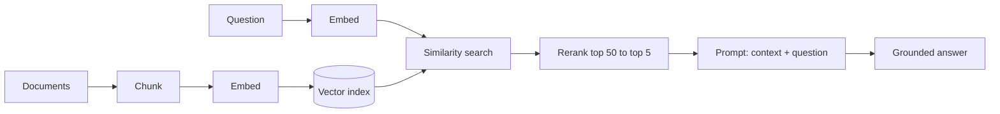

## Before you start

Read [llm-fundamentals](llm-fundamentals) for embeddings and the context window. [prompt-engineering](prompt-engineering) helps for the generation half.

## In one sentence

**RAG (retrieval-augmented generation)** answers a question by first searching your own documents for relevant passages, then pasting those passages into the prompt so the model answers from real sources instead of memory.

## Why it matters

A model cannot know your internal wiki, last night's support tickets, or a policy written after training ended. RAG is how you give it that knowledge without retraining anything — and it is by far the most common LLM system design question asked in interviews, because it touches search, chunking, ranking, and evaluation all at once.

It also reduces hallucination, though it never eliminates it. A model handed the right paragraph is dramatically more likely to answer correctly than one asked to recall.

## The intuition

Imagine an open-book exam. Closed-book, the student answers from memory and invents plausible-sounding details when memory fails. Open-book, they look up the relevant page first.

RAG is the open book. But note where the difficulty actually sits: it is not the answering, it is *finding the right page*. Hand the student the wrong chapter and a confident wrong answer follows. Almost every RAG failure in production is a retrieval failure wearing a generation costume.

## How it actually works

Two pipelines. **Indexing** runs offline, **retrieval** runs per query.

**Indexing.** Split documents into **chunks** of a few hundred tokens. Convert each chunk to an embedding vector via an embedding model. Store vectors plus original text in a vector index.

**Retrieval.** Embed the user's question with the *same* model, find the nearest chunk vectors, take the top few, paste them into the prompt with the question, and instruct the model to answer only from the provided context.



**Chunking is where quality is won or lost.** Too small and a chunk lacks the context to be meaningful; too large and its embedding blurs several topics into one vague point. Around 200–500 tokens with 10–20% overlap is a reasonable default, but splitting on document structure — headings, paragraphs — beats splitting on a fixed character count, because a chunk that ends mid-sentence loses the meaning it was supposed to carry.

**Reranking is the highest-value addition to naive RAG.** Embedding search is fast but lossy: it compresses a paragraph into a single point, so it retrieves chunks that are *topically related* rather than *actually relevant*. A **reranker** (a cross-encoder that reads query and chunk together) then rescores. The pattern is retrieve 50 cheaply, rerank to the best 5, send those.

## Worked example

Cosine similarity is the whole retrieval mechanism, and it is short enough to write yourself:

```js
function cosineSimilarity(a, b) {
  let dot = 0, normA = 0, normB = 0;
  for (let i = 0; i < a.length; i++) {
    dot += a[i] * b[i];       // how much they point the same way
    normA += a[i] * a[i];
    normB += b[i] * b[i];
  }
  return dot / (Math.sqrt(normA) * Math.sqrt(normB)); // divide out magnitude
}

// Real embeddings have 1536 dimensions; 3 shows the mechanism.
const index = [
  { text: 'Refunds are issued within 14 days of purchase.', vec: [0.9, 0.1, 0.2] },
  { text: 'Our office is open Monday to Friday.',           vec: [0.1, 0.9, 0.1] },
  { text: 'To return an item, contact support for a label.', vec: [0.8, 0.2, 0.3] },
];

function search(queryVec, k = 2) {
  return index
    .map((c) => ({ text: c.text, score: cosineSimilarity(queryVec, c.vec) }))
    .sort((a, b) => b.score - a.score)
    .slice(0, k);
}

const queryVec = [0.85, 0.15, 0.25]; // "how do I get my money back?"
for (const hit of search(queryVec)) {
  console.log(hit.score.toFixed(4), hit.text);
}
```

Output:

```
0.9960 Refunds are issued within 14 days of purchase.
0.9955 To return an item, contact support for a label.
```

The query shares no keywords with either chunk — no "refund", no "return" — yet both rank above the office-hours chunk. That is the entire value proposition: matching on meaning rather than words. Real systems get the vectors from an embedding API instead of hand-writing them, but this ranking step is unchanged.

Here is the chunker, which matters more than most people expect:

```js
function chunkText(text, chunkSize = 200, overlap = 40) {
  const words = text.split(/\s+/);
  const chunks = [];
  const stride = chunkSize - overlap; // overlap keeps sentences from being cut in half
  for (let i = 0; i < words.length; i += stride) {
    const slice = words.slice(i, i + chunkSize);
    if (slice.length === 0) break;
    chunks.push(slice.join(' '));
    if (i + chunkSize >= words.length) break;
  }
  return chunks;
}

const doc = Array.from({ length: 500 }, (_, i) => `word${i}`).join(' ');
const chunks = chunkText(doc);
console.log('chunks:', chunks.length);
console.log('first chunk words:', chunks[0].split(' ').length);
console.log('overlap check:', chunks[0].split(' ').slice(-3).join(' '), '|', chunks[1].split(' ').slice(0, 3).join(' '));
```

Output:

```
chunks: 3
first chunk words: 200
overlap check: word197 word198 word199 | word160 word161 word162
```

The second chunk starts 40 words before the first one ended. That redundancy is deliberate: a sentence straddling a boundary appears whole in at least one chunk.

## A second example — when it gets harder

Naive RAG works in a demo and disappoints in production. Four reasons, all worth knowing by name.

**Long or multi-part queries.** "Compare the refund policy for digital goods with the one for physical goods and tell me which is stricter" produces one embedding averaging two different topics — landing in a vacant region between both. The fix is **query decomposition**: split into sub-questions, retrieve for each, merge.

**Keyword-exact queries.** Ask for error code `E4021` and semantic search may return chunks about errors generally while missing the one containing the literal string. Embeddings are poor at rare tokens. The fix is **hybrid search** — combine vector results with keyword (BM25) results:

```js
// Reciprocal Rank Fusion: merge two ranked lists without needing comparable scores.
function reciprocalRankFusion(lists, k = 60) {
  const scores = new Map();
  for (const list of lists) {
    list.forEach((doc, rank) => {
      // Rank matters, absolute score does not — this is why RRF handles
      // cosine similarity and BM25 scores in the same fusion.
      scores.set(doc, (scores.get(doc) ?? 0) + 1 / (k + rank + 1));
    });
  }
  return [...scores.entries()].sort((a, b) => b[1] - a[1]).map(([doc, score]) => ({ doc, score }));
}

const vectorHits  = ['chunk_A', 'chunk_B', 'chunk_C'];
const keywordHits = ['chunk_C', 'chunk_A', 'chunk_D'];

for (const r of reciprocalRankFusion([vectorHits, keywordHits])) {
  console.log(r.doc, r.score.toFixed(5));
}
```

Output:

```
chunk_A 0.03252
chunk_C 0.03227
chunk_B 0.01613
chunk_D 0.01587
```

`chunk_A` wins for ranking well in both lists; `chunk_C` follows closely, promoted by its keyword-first placement. Neither list alone would have produced that order.

**Retrieved-but-irrelevant chunks.** Top-5 by cosine similarity are the five *most similar*, which is not the same as five *relevant* — if nothing relevant exists you still get five chunks, and the model will dutifully answer from them. Add a **similarity floor** and reranking, and let the system say "I don't know" when nothing clears the bar.

**Chunks that lost their context.** A chunk reading "This applies only to orders over $50" is useless without knowing what "this" refers to. Prepend the document title and section heading to every chunk before embedding — a cheap fix that measurably improves retrieval.

## Quick reference

| Failure | Symptom | Fix |
|---|---|---|
| Chunks too small | Answers lack context | Increase size; add overlap |
| Chunks too large | Retrieval imprecise | Split on structure, not character count |
| Long multi-part query | Nothing relevant returned | Query decomposition |
| Exact-term query (IDs, codes) | Literal match missed | Hybrid search with BM25 |
| Topically related, not relevant | Confident wrong answers | Add a reranker |
| No relevant docs exist | Model answers anyway | Similarity floor plus "say I don't know" |
| Chunk lacks referent | "This applies to..." with no subject | Prepend title and heading |
| Model ignores the context | Answers from memory | Instruct it to cite; verify citations |

| Parameter | Typical starting point |
|---|---|
| Chunk size | 200–500 tokens |
| Chunk overlap | 10–20% of chunk size |
| Retrieved before rerank | 20–50 |
| Sent to the model after rerank | 3–8 |

## Common mistakes

- Embedding queries with a different model than the documents; the vectors are not comparable and results are noise.
- Splitting on a fixed character count, cutting sentences and tables in half.
- Sending the top 20 chunks because "more context is better" — it raises cost, raises latency, and buries the answer among distractors.
- Never measuring retrieval separately from generation, so you cannot tell which half is broken.
- Skipping the reranker, which is usually the single largest quality win available.
- Reaching for RAG when the whole corpus would fit in the context window anyway.
- Forgetting to re-index when documents change, serving confidently stale answers.

## What interviewers ask

- **Your RAG system returns irrelevant chunks for long queries — how do you debug it?** — Isolate retrieval from generation first by checking whether the correct chunk appears in the top-k at all; if it does not, the problem is retrieval, and long multi-part queries typically need decomposition into sub-questions because one embedding averages several topics into a meaningless midpoint. If the right chunk *is* retrieved but ranked low, add a reranker; if it is retrieved and ranked well but ignored, the prompt is at fault.
- **Why not just fine-tune the model on your documents?** — Fine-tuning teaches style and format, not reliable fact recall, and every document change means retraining; RAG updates instantly by re-indexing and lets you cite sources, which fine-tuning cannot do.
- **How do you choose chunk size?** — Empirically against a labelled query set, starting around 200–500 tokens with overlap and splitting on document structure; the right size depends on whether answers live in single sentences or span sections.
- **When does semantic search fail and what do you use instead?** — On rare exact tokens like error codes, SKUs, and names, where embeddings generalise away the specificity; hybrid search combining BM25 keyword matching with vector search fixes it, typically fused by reciprocal rank fusion.
- **How do you stop RAG answering when no relevant document exists?** — Enforce a minimum similarity threshold, return no context when nothing clears it, and instruct the model to say it does not know; without a floor, top-k always returns k chunks no matter how irrelevant.
- **How do you evaluate a RAG system?** — Measure the two stages separately: retrieval with recall@k on a labelled query-to-chunk set, and generation with groundedness (is every claim supported by the retrieved context) and answer relevance.

## Practice

1. Build an in-memory RAG over ten paragraphs using a real embeddings API. Write ten questions with known correct chunks and measure recall@3.
2. Re-chunk the same corpus at 100, 300, and 800 tokens and re-measure recall@3. Explain the shape of the curve you get.
3. Add hybrid search: implement simple keyword scoring, fuse it with your vector results using the RRF function above, and find a query where fusion beats either method alone.

## Where to go next

[vector-databases](vector-databases) explains what happens when linear scanning stops working and you need an ANN index. [llm-evaluation-and-testing](llm-evaluation-and-testing) covers measuring retrieval quality properly.
