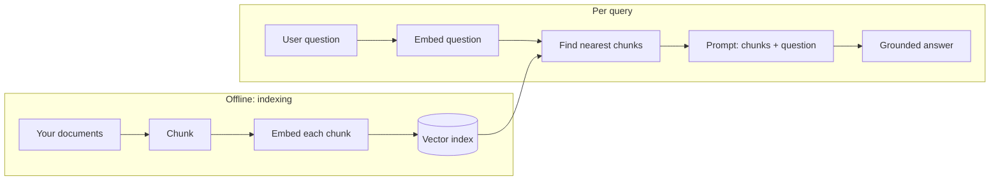
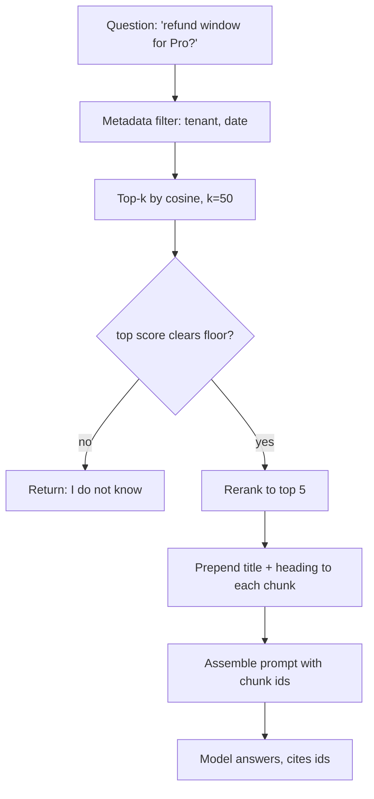

## Before you start

Read [llm-fundamentals](llm-fundamentals) for the context window and [embeddings-and-vector-math](embeddings-and-vector-math) for what a vector is and how you compare two of them — this topic uses embeddings constantly and never re-explains them. [prompt-engineering](prompt-engineering) helps for the generation half.

## In one sentence

**RAG (retrieval-augmented generation)** answers a question by first searching your own documents for relevant passages, then pasting those passages into the prompt so the model answers from real sources instead of memory.

## Why it matters

A model cannot know your internal wiki, last night's support tickets, or a policy written after training ended. RAG is how you give it that knowledge without retraining anything — and it is by far the most common LLM system design question asked in interviews, because it touches search, chunking, ranking, and evaluation all at once.

It also reduces hallucination, though it never eliminates it. A model handed the right paragraph is dramatically more likely to answer correctly than one asked to recall.

## The intuition

Imagine an open-book exam. Closed-book, the student answers from memory and invents plausible-sounding details when memory fails. Open-book, they look up the relevant page first.

RAG is the open book. But note where the difficulty actually sits: it is not the answering, it is *finding the right page*. Hand the student the wrong chapter and a confident wrong answer follows. Almost every RAG failure in production is a retrieval failure wearing a generation costume.

Two pipelines make that happen, and they run at completely different times. **Indexing** is a batch job you run when documents change. **Retrieval** happens on every single question, in front of a waiting user.



The key consequence of that split: question and documents must be embedded by the **same model**. Different models learn unrelated coordinate systems, so mixing them yields normal-looking similarity numbers that mean nothing — see [embeddings-and-vector-math](embeddings-and-vector-math).

## How it actually works

**Indexing.** Split documents into **chunks** of a few hundred tokens. Convert each chunk to an embedding vector. Store the vector, the original text, and — this part gets skipped and shouldn't — metadata: source document, section, author, date, tenant.

**Retrieval.** Embed the question, find the nearest chunk vectors, take the top few, paste them into the prompt with the question, and instruct the model to answer only from the provided context.

The per-query path has more steps than that summary suggests, and each one is a place quality leaks away:



### Chunking is a design decision, not a parameter

Chunking is where RAG quality is won or lost, and there are four strategies worth knowing by name.

**Fixed-size** splits every N characters or tokens. Trivial to implement, blind to the document, and it will happily cut a sentence, a table row, or a definition in half.

**Recursive** splitting is the sensible default. It tries a priority list of separators — paragraph breaks, then sentence breaks, then words — descending to a cruder boundary only when a chunk is still too big. You get roughly uniform chunks that mostly respect natural boundaries.

**Structure-aware** splitting uses the document's own shape: split on Markdown headings, HTML sections, or code-block boundaries, never inside one. For technical documentation this beats everything else, because the author already decided where an idea ends.

**Semantic** chunking embeds each sentence and cuts where consecutive sentences stop being similar, on the theory that a topic shift is the real boundary. It costs an embedding call per sentence at index time, and earns that mainly on unstructured prose with no headings to lean on.

**Overlap** insures against a bad boundary: repeating the last 10–20% of one chunk at the start of the next means a sentence straddling a split appears whole in at least one chunk. It costs storage and creates near-duplicate hits, so deduplicate before assembling the prompt.

**The trade-off underneath all of it** is a genuine tension, not a tuning preference. A small chunk retrieves *precisely* — its embedding represents one idea, so it matches one kind of question sharply — but may lack the context to be understood, or hold only half the answer. A large chunk *carries* its context, but its embedding averages several topics into a vague point that matches many queries weakly and none strongly. One chunk size cannot give you both; the escape hatch is to retrieve small chunks and expand to their surrounding text before generation.

### Metadata and filtering are first-class

A purely semantic search over a mixed corpus retrieves plausible-but-wrong-document results, and the reason is uncomfortable: embeddings are *good*. Last year's refund policy and this year's are near-identical in meaning, so they sit almost on top of each other in vector space. So do one policy's copies for two tenants. Cosine similarity has no opinion about which is current or which you are allowed to see.

So you filter on metadata — source, date, language, tenant, document type — **before or inside** the vector search, never after. Filtering afterwards whittles your top 50 down to three survivors of the wrong 50; the index never looked at the chunks you were entitled to.

### Reranking

Embedding search is fast but lossy: it compresses a paragraph into one point, so it retrieves chunks that are *topically related* rather than *actually relevant*. A **reranker** — a cross-encoder reading query and chunk together — rescores them. Retrieve 50 cheaply, rerank to the best 5, send those. [rag-in-production](rag-in-production) covers why that two-stage shape is standard.

## Worked example

Retrieval and prompt assembly, end to end, with hand-written vectors so it runs offline:

```js
function cosineSimilarity(a, b) {
  let dot = 0, normA = 0, normB = 0;
  for (let i = 0; i < a.length; i++) {
    dot += a[i] * b[i];       // how much they point the same way
    normA += a[i] * a[i];
    normB += b[i] * b[i];
  }
  return dot / (Math.sqrt(normA) * Math.sqrt(normB)); // divide out magnitude
}

// Real embeddings have 1536 dimensions; 3 shows the mechanism.
// Pretend axes: [money-back-ness, logistics-ness, opening-hours-ness]
const index = [
  { id: 'refund-policy#1',  source: 'policy',  vec: [0.90, 0.10, 0.20],
    text: 'Refunds are issued within 14 days of purchase.' },
  { id: 'returns-how-to#3', source: 'helpdesk', vec: [0.80, 0.20, 0.30],
    text: 'To return an item, contact support for a label.' },
  { id: 'contact-us#1',     source: 'website', vec: [0.10, 0.90, 0.10],
    text: 'Our office is open Monday to Friday.' },
];

function retrieve(queryVec, k = 2) {
  return index
    .map((c) => ({ ...c, score: cosineSimilarity(queryVec, c.vec) }))
    .sort((a, b) => b.score - a.score)
    .slice(0, k);
}

function assemblePrompt(question, hits) {
  // Every chunk carries its id so the model can cite and you can audit.
  const context = hits.map((h) => `[${h.id}] ${h.text}`).join('\n');
  return [
    'Answer ONLY from the context below. If it is insufficient, say you do not know.',
    'Cite the [id] of every chunk you use.',
    '',
    'Context:',
    context,
    '',
    `Question: ${question}`,
  ].join('\n');
}

const question = 'how do I get my money back?';
const queryVec = [0.85, 0.15, 0.25]; // the same embedding model, applied to the question

const hits = retrieve(queryVec);
for (const h of hits) console.log(h.score.toFixed(4), h.id);
console.log('---');
console.log(assemblePrompt(question, hits));
```

Output:

```
0.9960 refund-policy#1
0.9955 returns-how-to#3
---
Answer ONLY from the context below. If it is insufficient, say you do not know.
Cite the [id] of every chunk you use.

Context:
[refund-policy#1] Refunds are issued within 14 days of purchase.
[returns-how-to#3] To return an item, contact support for a label.

Question: how do I get my money back?
```

The question shares no keywords with either chunk — no "refund", no "return" — yet both rank above the office-hours chunk. That is the entire value proposition: matching on meaning rather than words. Note the two design choices in the prompt: chunk ids travel with the text so answers can be traced back, and the instruction is *only* from context, because otherwise the model blends context with what it half-remembers from training.

Now the chunker, where fixed-size loses to structure-aware in one visible step:

```js
const doc = `## Refund eligibility
A refund is available when the order is under 30 days old.
| Tier | Window | Fee |
| Free | 14 days | 5% |
| Pro  | 30 days | 0% |

## Contact
Support answers within one business day.`;

// Strategy 1: fixed size. Fast, structure-blind.
function fixedChunks(text, size) {
  const out = [];
  for (let i = 0; i < text.length; i += size) out.push(text.slice(i, i + size));
  return out;
}

// Strategy 2: structure-aware. Split on headings, never inside a block.
function headingChunks(text) {
  return text
    .split(/\n(?=## )/)                       // a boundary only where a heading starts
    .map((c) => c.trim())
    .filter(Boolean);
}

const fixed = fixedChunks(doc, 120);
console.log('fixed-size chunks:', fixed.length);
console.log('chunk 1 ends ...' + JSON.stringify(fixed[0].slice(-28)));
console.log('chunk 2 starts ..' + JSON.stringify(fixed[1].slice(0, 28)));

const structured = headingChunks(doc);
console.log('\nstructure-aware chunks:', structured.length);
structured.forEach((c, i) => {
  const heading = c.split('\n')[0];
  const rows = (c.match(/^\|/gm) ?? []).length;
  console.log(`  #${i} ${heading.padEnd(22)} table rows kept: ${rows}`);
});
```

Output:

```
fixed-size chunks: 2
chunk 1 ends ..."ndow | Fee |\n| Free | 14 day"
chunk 2 starts .."s | 5% |\n| Pro  | 30 days | "

structure-aware chunks: 2
  #0 ## Refund eligibility  table rows kept: 3
  #1 ## Contact             table rows kept: 0
```

Look at where the fixed-size boundary fell. Chunk 1 ends mid-row at `14 day`; chunk 2 opens with `s | 5% |`. The Free tier's window and its fee are now in different chunks, and the Pro row has lost its header, so nothing in chunk 2 says those numbers are windows and fees. Ask "what is the fee on the free tier" and neither chunk can answer it, though the document plainly does. The structure-aware split keeps all three rows with their heading — same document, same model, answer now retrievable.

## A second example — when it gets harder

Naive RAG works in a demo and disappoints in production, and the disappointment has a specific shape. The retriever returns five chunks all *about* the right subject, none of which contains the answer. The model, told to be helpful and handed five plausible passages, does not stop — it answers confidently from the nearest-looking chunk or from its own parametric memory. Nothing errors. Nothing logs a warning. The user gets a wrong answer that reads exactly like a right one.

Four failure modes, worth knowing by name because interviewers ask you to distinguish them:

**Retrieval miss.** The answer exists in your corpus and did not come back in the top-k. Usually chunking (the answer was split across a boundary) or vocabulary mismatch on rare terms. Diagnose by checking whether the gold chunk appears anywhere in the top 50.

**Distractor chunks.** The right chunk came back ranked fourth, beneath three chunks closer to the question's *wording* that do not answer it. The model attends to the wrong one. This is what rerankers exist to fix.

**Conflicting sources.** Two chunks both answer the question and disagree — last year's policy and this year's. The model has no basis for preferring one, so it picks arbitrarily, merges them into something neither document says, or hedges. Metadata filtering by date is the fix; asking the model to "prefer newer" is not.

**The model ignoring context.** The right chunk is present, ranked first, unambiguous, and the answer still contradicts it — training data won. Most common when the retrieved fact is surprising. Fix on the prompt side: demand citations and verify every one resolves to a chunk you actually supplied.

The conflicting-sources case is worth watching numerically, because the scores are no help at all:

```js
const cos = (a, b) => {
  let d = 0, na = 0, nb = 0;
  for (let i = 0; i < a.length; i++) { d += a[i]*b[i]; na += a[i]*a[i]; nb += b[i]*b[i]; }
  return d / (Math.sqrt(na) * Math.sqrt(nb));
};

// Same topic, three different documents. Only one is current and ours.
const corpus = [
  { id: 'policy-2021',  tenant: 'acme',  year: 2021, vec: [0.90, 0.12] },
  { id: 'policy-2026',  tenant: 'acme',  year: 2026, vec: [0.88, 0.14] },
  { id: 'policy-other', tenant: 'globex', year: 2026, vec: [0.91, 0.11] },
];

const q = [0.89, 0.13];
const score = (c) => ({ id: c.id, s: cos(q, c.vec) });

console.log('no filter:');
corpus.map(score).sort((a,b) => b.s - a.s)
  .forEach((r) => console.log('  ', r.s.toFixed(6), r.id));

// Filter FIRST, then rank. The predicate is not negotiable; the score is.
const allowed = corpus.filter((c) => c.tenant === 'acme' && c.year >= 2026);
console.log('filtered to tenant=acme, year>=2026:');
allowed.map(score).sort((a,b) => b.s - a.s)
  .forEach((r) => console.log('  ', r.s.toFixed(6), r.id));
```

Output:

```
no filter:
   0.999922 policy-2021
   0.999919 policy-2026
   0.999694 policy-other
filtered to tenant=acme, year>=2026:
   0.999919 policy-2026
```

The stale 2021 policy beats the current one by three parts in a million, and another tenant's document scores in the same band. No similarity threshold separates these — the gap is noise. Only the metadata predicate does, which is why "filter, then rank" is a rule rather than an optimisation.

Two more failures that surprise people:

**Long or multi-part queries.** "Compare the refund policy for digital goods with the one for physical goods and tell me which is stricter" produces one embedding averaging two topics, landing in a vacant region between both. The fix is **query decomposition** into sub-questions, retrieved separately and merged.

**Chunks that lost their referent.** A chunk reading "This applies only to orders over $50" is useless without knowing what "this" is. Prepend the document title and section heading to every chunk before embedding — cheap, and it measurably improves retrieval.

## Quick reference

| Chunking strategy | How it splits | Best for | Cost |
|---|---|---|---|
| Fixed-size | Every N tokens | Prototypes only | Trivial |
| Recursive | Paragraph, then sentence, then word | General text — the default | Trivial |
| Structure-aware | Headings, sections, code blocks | Technical docs, Markdown, code | Low, needs a parser |
| Semantic | Where sentence similarity drops | Unstructured prose, no headings | An embedding per sentence |

| Failure mode | Symptom | Fix |
|---|---|---|
| Retrieval miss | Gold chunk absent from top 50 | Re-chunk; add hybrid search |
| Distractor chunks | Right chunk present but ranked low | Add a reranker |
| Conflicting sources | Answers merge two policies | Filter by date and source metadata |
| Model ignores context | Answer contradicts chunk 1 | Demand citations; verify they resolve |
| Chunk lost its referent | "This applies to..." with no subject | Prepend title and heading |
| Boundary cut a table | Numbers without their header | Structure-aware splitting |
| No relevant docs exist | Model answers anyway | Similarity floor plus "say I do not know" |
| Wrong tenant or year retrieved | Plausible answer from wrong document | Metadata filter before the search |

| Parameter | Typical starting point |
|---|---|
| Chunk size | 200–500 tokens |
| Chunk overlap | 10–20% of chunk size |
| Retrieved before rerank | 20–50 |
| Sent to the model after rerank | 3–8 |

## Tools & frameworks

| Tool | What it's for | Reach for it when |
|---|---|---|
| [pgvector](https://github.com/pgvector/pgvector) | Vector similarity inside Postgres | You already run Postgres and want metadata filters and vectors in one transactional query — realistic to roughly 10M vectors |
| [Qdrant](https://qdrant.tech/documentation/) | Dedicated vector database with filtered search | Filtering is heavy or the corpus outgrows what you want in your primary database |
| [Chroma](https://docs.trychroma.com/docs/overview/introduction) | Embedded vector store that runs in-process | You are prototyping and want zero infrastructure; you will migrate before production |
| [LangChain.js](https://docs.langchain.com/oss/javascript/langchain/overview) | Loaders, splitters and retriever plumbing | You want the chunking and retrieval scaffolding written already — Python LangChain has the larger integration set if you are not tied to Node |
| [Unstructured](https://docs.unstructured.io/open-source/core-functionality/chunking) | Parsing PDFs, HTML and Office files into clean chunks | Your sources are messy real-world documents rather than Markdown you control |

## Common mistakes

- Embedding queries with a different model than the documents; the vectors are not comparable and results are noise.
- Splitting on a fixed character count, cutting sentences and tables in half.
- Storing only text and vector, with no metadata, so you can never filter by tenant, date, or source afterwards.
- Applying the metadata filter after retrieval instead of before, so the index scores chunks the user was never allowed to see.
- Sending the top 20 chunks because "more context is better" — it raises cost, raises latency, and buries the answer among distractors.
- Never measuring retrieval separately from generation, so you cannot tell which half is broken.
- Skipping the reranker, which is usually the single largest quality win available.
- Reaching for RAG when the whole corpus would fit in the context window anyway.
- Forgetting to re-index when documents change, serving confidently stale answers.

## What interviewers ask

- **Your RAG system returns irrelevant chunks for long queries — how do you debug it?** — Isolate retrieval from generation first by checking whether the correct chunk appears in the top-k at all; if it does not, the problem is retrieval, and long multi-part queries typically need decomposition into sub-questions because one embedding averages several topics into a meaningless midpoint. If the right chunk *is* retrieved but ranked low, add a reranker; if it is retrieved and ranked well but ignored, the prompt is at fault.
- **Why not just fine-tune the model on your documents?** — Fine-tuning teaches style and format, not reliable fact recall, and every document change means retraining; RAG updates instantly by re-indexing and lets you cite sources, which fine-tuning cannot do.
- **How do you choose chunk size and strategy?** — Empirically against a labelled query set, starting around 200–500 tokens with overlap; strategy matters more than size, so split on document structure rather than character count, and remember the underlying tension — small chunks retrieve precisely but lose context, large chunks carry context but dilute the embedding.
- **Why is metadata filtering not just an optimisation?** — Near-duplicate documents — last year's policy, another tenant's copy — are near-identical in meaning, so their scores differ by noise and no threshold separates them; only a predicate on source, date, or tenant does, running before or inside the search.
- **Name the ways a RAG pipeline fails and how you tell them apart.** — Retrieval miss (gold chunk absent), distractor chunks (present but outranked), conflicting sources (two chunks disagree), and the model ignoring context; distinguish them by inspecting the retrieved set for one failing query.
- **How do you evaluate a RAG system?** — Measure the two stages separately: retrieval with recall@k on a labelled query-to-chunk set, and generation with groundedness and answer relevance. [llm-evaluation-and-testing](llm-evaluation-and-testing) covers the methodology.

## Practice

1. Build an in-memory RAG over ten paragraphs using a real embeddings API. Write ten questions with known correct chunks and measure recall@3.
2. Re-chunk the same corpus three ways — fixed-size, recursive, and structure-aware on headings — and re-measure recall@3 for each. Then find one question where fixed-size wins, and explain why.
3. Add `{ tenantId, publishedYear }` metadata to every chunk and two near-duplicate documents that differ only in year. Measure how often the stale one is retrieved without a filter, then add the filter before scoring and confirm it drops to zero.

## Where to go next

[rag-in-production](rag-in-production) is the direct sequel: hybrid search, reranking, evaluation, and the indexing pipeline that keeps this fresh. [vector-databases](vector-databases) explains what happens when linear scanning stops working and you need an ANN index.
