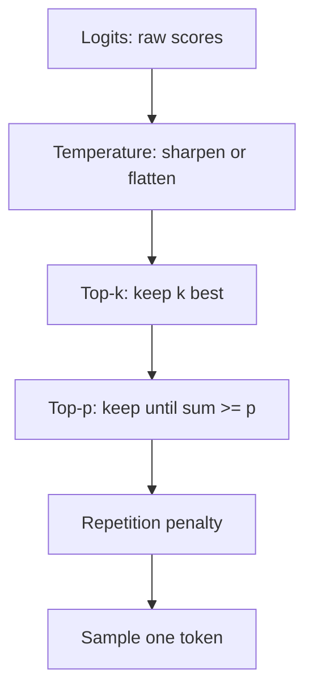

## Before you start

Read [llm-fundamentals](llm-fundamentals) first — you need to know that a model outputs a probability for every possible next token. This topic is entirely about what happens to those probabilities afterwards.

## In one sentence

**Sampling** is the step that turns the model's list of next-token probabilities into one actual token, and the knobs that control it — temperature, top-k, and top-p — decide whether your output is repetitive and safe or varied and risky.

## Why it matters

This is the highest-leverage parameter change you can make, and the one most teams never touch. A support bot at default settings invents policy details; the same bot at temperature 0.2 stops. A creative writing tool at temperature 0 produces the same bland paragraph every time. No prompt rewrite fixes either problem, because neither is a prompt problem.

It is also free. Changing temperature costs nothing and ships instantly, unlike fine-tuning or swapping models.

## The intuition

The model hands you a ranked list of candidates with confidence scores:

```
" blue"   62%
" red"    21%
" green"   9%
" azure"   4%
...20,000 more tokens sharing the last 4%
```

Sampling is how you pick. Always take the top one and you get **greedy decoding** — repeatable, but prone to dull, looping text. Roll a weighted die over the whole list and you get variety, but that long tail of 20,000 near-zero tokens contains genuine nonsense, and given enough rolls you will eventually hit one. Every sampling parameter exists to manage that trade: keep enough of the list for variety, cut enough of the tail to avoid garbage.

## How it actually works

Three knobs, applied in a specific order.

**Temperature** reshapes the distribution before anything is cut. It divides the raw scores (**logits**) by a number before converting them to probabilities. Below 1.0 sharpens — the leader gets more likely, the tail gets crushed. Above 1.0 flattens — everything moves toward equally likely. At 0 it collapses to greedy: always the top token.

**Top-k** truncates by count. Keep the k highest-probability tokens, discard the rest, renormalise. Simple, but k is fixed regardless of context — the same k = 40 is far too permissive when the model is certain and too restrictive when it is genuinely torn.

**Top-p (nucleus sampling)** truncates by cumulative mass, which fixes exactly that flaw. Sort by probability, add tokens to the pool until their probabilities sum to p, then stop. When the model is confident, one or two tokens reach p = 0.9 and the pool is tiny. When it is uncertain, the pool grows automatically. The candidate set adapts to the model's own confidence.



**Repetition penalty** (and the related `frequency_penalty` / `presence_penalty`) works differently: it looks at what has already been generated and downweights tokens that have appeared. It fights the loops that low temperature causes.

## Worked example

Sampling is just arithmetic on an array. Here it is, runnable, with no API required:

```js
function softmax(logits, temperature) {
  if (temperature === 0) {                      // greedy: all mass on the argmax
    const best = logits.indexOf(Math.max(...logits));
    return logits.map((_, i) => (i === best ? 1 : 0));
  }
  const scaled = logits.map((l) => l / temperature); // THE line temperature controls
  const max = Math.max(...scaled);
  const exps = scaled.map((s) => Math.exp(s - max)); // subtract max for numerical stability
  const sum = exps.reduce((a, b) => a + b, 0);
  return exps.map((e) => e / sum);
}

const tokens = [' blue', ' red', ' green', ' azure', ' plaid'];
const logits = [3.2, 2.1, 1.3, 0.4, -1.8];

for (const t of [0.2, 1.0, 2.0]) {
  const probs = softmax(logits, t);
  const shown = probs.map((p, i) => `${tokens[i]}=${(p * 100).toFixed(1)}%`);
  console.log(`temp ${t}:`, shown.join('  '));
}
```

Output:

```
temp 0.2:  blue=99.6%   red=0.4%   green=0.0%   azure=0.0%   plaid=0.0%
temp 1:  blue=64.5%   red=21.5%   green=9.6%   azure=3.9%   plaid=0.4%
temp 2:  blue=43.6%   red=25.2%   green=16.9%   azure=10.8%   plaid=3.6%
```

The same model, the same logits, three completely different behaviours. At 0.2 the answer is effectively fixed — " blue" 996 times out of 1,000. At 2.0, " plaid" — a nonsense colour for most contexts — fires roughly one time in twenty-eight, and the leader has dropped from 64.5% to 43.6%. Nothing about the model changed; only the reshaping did.

## A second example — when it gets harder

Here is what the docs rarely spell out: **temperature and top-p compose, and stacking them multiplies their effects.** Temperature 1.5 with top-p 0.5 is not "creative" — the flattening pushes mass into the tail, then top-p cuts most of it away again, leaving a strange middle band.

Watch nucleus sampling adapt, which is the property that makes it the better default:

```js
function nucleus(probs, tokens, p) {
  const ranked = probs
    .map((prob, i) => ({ token: tokens[i], prob }))
    .sort((a, b) => b.prob - a.prob);

  const pool = [];
  let cumulative = 0;
  for (const item of ranked) {
    pool.push(item);
    cumulative += item.prob;
    if (cumulative >= p) break;  // stop as soon as we've covered p of the mass
  }
  return pool;
}

const six = [' blue', ' red', ' green', ' azure', ' teal', ' plaid'];
const confident = softmax([6.0, 1.0, 0.5, 0.2, -1.0, -1.5], 1.0); // model is sure
const unsure    = softmax([2.4, 2.1, 1.9, 0.3, -0.5, -1.2], 1.0); // model is torn

console.log('confident:', confident.map((p) => (p * 100).toFixed(1) + '%').join(' '));
console.log('  pool at p=0.9 ->', nucleus(confident, six, 0.9).length, 'of 6');
console.log('unsure:   ', unsure.map((p) => (p * 100).toFixed(1) + '%').join(' '));
console.log('  pool at p=0.9 ->', nucleus(unsure, six, 0.9).length, 'of 6');
```

Output:

```
confident: 98.5% 0.7% 0.4% 0.3% 0.1% 0.1%
  pool at p=0.9 -> 1 of 6
unsure:    39.2% 29.0% 23.8% 4.8% 2.2% 1.1%
  pool at p=0.9 -> 3 of 6
```

One setting, two behaviours, chosen by the model's own confidence rather than by you. A fixed `top_k = 3` would have allowed three candidates in the confident case too — permitting a wrong answer precisely when the model already knew the right one at 98.5%. That adaptivity is why top-p is the parameter to reach for when you only want to tune one.

One more trap: **temperature 0 is not a guarantee of identical output.** Floating-point non-determinism on GPUs, batching, and provider-side routing mean repeated calls can still differ. Treat temperature 0 as "as deterministic as we can get", not as a hash function.

## Quick reference

| Use case | temperature | top_p | Notes |
|---|---|---|---|
| Classification, extraction, routing | 0 | — | You want the same label every time |
| Structured output / JSON | 0–0.2 | — | Randomness breaks schemas |
| Code generation | 0–0.3 | 0.95 | Slightly above 0 helps escape a bad first token |
| Factual Q&A, RAG answers | 0.1–0.3 | 0.9 | Low enough to stay grounded |
| General chat assistant | 0.7 | 0.9 | The common default |
| Brainstorming, variations | 0.9–1.1 | 0.95 | You want spread |
| Creative fiction | 1.0–1.3 | 0.95 | Expect to discard some outputs |

| Parameter | What it does | Typical range |
|---|---|---|
| `temperature` | Sharpens or flattens the distribution | 0–2, useful 0–1.3 |
| `top_k` | Keep the k best tokens | 20–100 |
| `top_p` | Keep tokens until cumulative probability ≥ p | 0.85–0.95 |
| `frequency_penalty` | Downweight tokens by how often they appeared | 0–1 |
| `presence_penalty` | Downweight any token that appeared at all | 0–1 |

## Tools & frameworks

| Tool | What it's for | Reach for it when |
|---|---|---|
| [vLLM](https://docs.vllm.ai/en/latest/) | Sampling parameters: temperature, top-p, top-k | You want every sampling knob in one place with realistic defaults |
| [HuggingFace Transformers](https://huggingface.co/docs/transformers/index) | `generate()` strategies and configs | You want to learn what each strategy does to the distribution — Python |
| [Ollama](https://docs.ollama.com/) | Change sampling parameters locally, instantly | You are building intuition by setting temperature to 0, then to 2 |
| [llama.cpp](https://github.com/ggml-org/llama.cpp) | Sampler implementations you can read | You want the actual code for min-p, mirostat and the rest |

## Common mistakes

- Tuning temperature and top-p at the same time and losing track of which caused what — change one, measure, then change the other.
- Using a high temperature for JSON output, then adding retry logic to handle malformed responses; the fix is temperature 0, not a parser.
- Believing temperature 0 makes output reproducible across runs or providers — it reduces variance, it does not eliminate it.
- Cranking temperature up to fix boring output when the real problem is a vague prompt; sampling adds variety, never new knowledge.
- Setting temperature above 1.5 in production, which reliably produces off-topic tokens from the tail.
- Reaching for a repetition penalty to fix looping when low temperature is the cause — the penalty treats the symptom.

## What interviewers ask

- **Explain temperature to a non-technical stakeholder.** — It is a creativity dial: low means the model always picks its safest guess so answers are consistent, high means it takes more chances so answers vary but risk going off-track.
- **Top-k versus top-p — which would you default to and why?** — Top-p, because its candidate pool resizes with the model's confidence, while a fixed k stays too permissive when the model is certain and too narrow when it is genuinely uncertain.
- **Your JSON extraction endpoint returns malformed output about 5% of the time. First thing you check?** — The temperature; extraction should run at 0, since any sampling randomness can select a token that breaks the schema, and no amount of prompt tuning fully compensates.
- **Does temperature 0 make the model deterministic?** — It makes it greedy, always taking the highest-probability token, but hardware floating-point variation and provider batching mean identical inputs can still produce different outputs, so never build a cache key or a test assertion on exact-match equality.
- **When would you deliberately raise temperature?** — When you want diverse candidates rather than one correct answer: brainstorming, generating test-data variations, or sampling several solutions to rank afterwards.

## Practice

1. Extend the `softmax` function above with a `top_k` filter applied after temperature, and verify that k = 1 produces the same result as temperature 0.
2. Take one factual prompt and run it at temperatures 0, 0.7, and 1.4, ten times each. Count how many answers at each setting contain a factual error, and write down the trade-off you would accept for a customer-facing bot.
3. Build a "pick the best of five" wrapper: generate five completions at temperature 0.9, then use a second call at temperature 0 to select the strongest. Measure the cost increase against the quality gain.

## Where to go next

Sampling controls how the model picks tokens; [prompt-engineering](prompt-engineering) controls what tokens it is choosing between in the first place. If your output is wrong rather than merely varied, the prompt is where to look.
