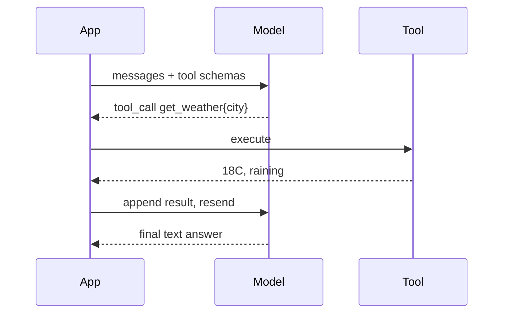

## Before you start

You need [llm-fundamentals](llm-fundamentals) and ideally [prompt-engineering](prompt-engineering). Comfort with JSON Schema helps, but the shape is simple enough to pick up here.

## In one sentence

**Tool calling** lets a model respond not with prose but with a structured request to run one of your functions — which you execute, then hand the result back so the model can continue with information it could never have had on its own.

## Why it matters

Without tools, a model is limited to what it memorised during training. It cannot know today's date, your user's order status, or the current price of anything. Tool calling is the bridge from a text generator to software that does real work: checking inventory, sending email, querying your database.

It is also the foundation of every agent framework you will be asked about. Agents are a loop around tool calling — nothing more exotic than that.

## The intuition

You have hired a capable assistant who is locked in a room with no internet. They know an enormous amount but nothing current or specific to you.

So you slide a laminated card under the door listing what you can look up for them: `get_order_status(order_id)`, `search_products(query)`. When they need something, they slide back a note naming one function and its arguments. You run it and slide the result back. They carry on.

The critical detail beginners miss: **the model never runs anything.** It only ever emits a request. Your code executes it. Every security decision lives on your side of the door.

## How it actually works

**You declare tools as JSON Schema.** Each has a name, a description, and typed parameters. The description is not documentation — it is the prompt that decides whether the model picks this tool. A vague description is the single most common cause of a tool never being called.

**The model chooses.** Given the conversation and the tool list, it either replies with text or emits one or more tool calls with arguments. It can also emit *nothing* — which is correct behaviour when no tool fits, and a case your code must handle.

**You execute and return.** Run the function, then append the result to the message history with the matching call ID and send everything back. The model now sees its request and the answer.

**Loop until done.** The model may call another tool based on what it learned. You keep looping until it returns plain text — with a hard iteration cap so a confused model cannot loop forever.



**Parallel calls.** Modern models can request several independent tools at once — three cities' weather in one turn. Run them with `Promise.all` and return all results together. Only do this when the calls are genuinely independent; if one depends on another's output, the model must take separate turns.

## Worked example

A complete agentic loop against the REST API, with plain `fetch`:

```js
const tools = [
  {
    type: 'function',
    function: {
      name: 'get_weather',
      // This description IS the selection prompt. Be specific.
      description: 'Get the current weather for a city. Use whenever the user asks about weather, temperature, or conditions.',
      parameters: {
        type: 'object',
        properties: {
          city: { type: 'string', description: 'City name, e.g. "Berlin"' },
          unit: { type: 'string', enum: ['celsius', 'fahrenheit'] },
        },
        required: ['city'],
      },
    },
  },
];

// Your real implementations. The model never touches these directly.
const impl = {
  get_weather: async ({ city, unit = 'celsius' }) => {
    const table = { Berlin: 18, Cairo: 34, Oslo: 4 };
    if (!(city in table)) return { error: `No weather data for "${city}"` };
    return { city, temperature: table[city], unit, conditions: 'rain' };
  },
};

async function callModel(messages) {
  const res = await fetch('https://api.openai.com/v1/chat/completions', {
    method: 'POST',
    headers: {
      'Content-Type': 'application/json',
      Authorization: `Bearer ${process.env.OPENAI_API_KEY}`,
    },
    body: JSON.stringify({ model: 'gpt-4o-mini', messages, tools, temperature: 0 }),
  });
  return (await res.json()).choices[0].message;
}

async function run(userText, maxSteps = 5) {
  const messages = [{ role: 'user', content: userText }];

  for (let step = 0; step < maxSteps; step++) {   // ALWAYS cap the loop
    const msg = await callModel(messages);
    messages.push(msg);

    if (!msg.tool_calls?.length) return msg.content; // model is done — plain text

    // Parallel: run independent calls concurrently.
    const results = await Promise.all(
      msg.tool_calls.map(async (call) => {
        const fn = impl[call.function.name];
        if (!fn) return { tool_call_id: call.id, output: { error: 'unknown tool' } };
        try {
          const args = JSON.parse(call.function.arguments); // model-written JSON: may be malformed
          return { tool_call_id: call.id, output: await fn(args) };
        } catch (err) {
          // Return the error TO THE MODEL so it can recover, don't throw.
          return { tool_call_id: call.id, output: { error: String(err.message) } };
        }
      })
    );

    for (const r of results) {
      messages.push({
        role: 'tool',
        tool_call_id: r.tool_call_id,
        content: JSON.stringify(r.output),
      });
    }
  }
  return 'Stopped: exceeded maximum tool-calling steps.';
}

console.log(await run('What is the weather in Berlin and Oslo?'));
```

A typical run: the model emits two `get_weather` calls in one turn, your loop runs both concurrently, appends both results, and the second model call returns `"It's 18°C and raining in Berlin, and 4°C and raining in Oslo."` Three HTTP round trips total — two to the model, and the tool work in between.

## A second example — when it gets harder

The happy path teaches you almost nothing about production. Four failures matter, and they are exactly what interviewers probe.

**The model calls nothing when it should.** You ask "what's it like outside?" and get "I don't have access to weather data" — despite the tool existing. Nearly always a weak description. Naming the trigger words ("weather, temperature, conditions") fixes more of these than any other change.

**The model calls a tool with bad arguments.** Arguments are generated text, so they can be malformed JSON, miss a required field, or invent an enum value. Never pass them straight through:

```js
function validateArgs(schema, args) {
  const errors = [];
  for (const key of schema.required ?? []) {
    if (!(key in args)) errors.push(`missing required field "${key}"`);
  }
  for (const [key, value] of Object.entries(args)) {
    const spec = schema.properties[key];
    if (!spec) { errors.push(`unknown field "${key}"`); continue; }
    if (spec.enum && !spec.enum.includes(value)) {
      errors.push(`"${key}" must be one of ${spec.enum.join(', ')}, got "${value}"`);
    }
    if (spec.type === 'string' && typeof value !== 'string') {
      errors.push(`"${key}" must be a string`);
    }
  }
  return errors;
}

const schema = tools[0].function.parameters;
console.log(validateArgs(schema, { city: 'Berlin', unit: 'kelvin' }));
console.log(validateArgs(schema, { unit: 'celsius' }));
console.log(validateArgs(schema, { city: 'Berlin' }));
```

Output:

```
[ '"unit" must be one of celsius, fahrenheit, got "kelvin"' ]
[ 'missing required field "city"' ]
[]
```

**Feed those errors back rather than throwing.** A tool result of `{"error":"unit must be one of celsius, fahrenheit"}` lets the model retry correctly on the next turn — self-healing you get for the price of one extra round trip. An exception just crashes the request.

**The model loops.** It calls the same tool with the same arguments repeatedly, usually because the result does not contain what it wanted. The iteration cap saves you, but detecting a repeat and injecting "that tool returned the same result; answer with what you have" recovers more gracefully.

**A tool has side effects.** Reads are safe to retry; `send_email` and `issue_refund` are not. Any destructive tool needs an idempotency key, and typically a human approval gate — a model that misreads a request will happily refund the wrong customer, and the loop gives it no natural pause.

## Quick reference

| Situation | What to do |
|---|---|
| Model never calls your tool | Rewrite the description with concrete trigger words |
| Model calls the wrong tool | Make descriptions mutually exclusive; say when *not* to use each |
| Arguments fail to parse | Return the error as the tool result; let the model retry |
| Invalid enum or missing field | Validate before executing; return a specific message |
| Independent calls in one turn | Execute with `Promise.all` |
| Dependent calls | Let the model take separate turns; do not fabricate ordering |
| Model loops on one tool | Cap iterations; detect repeats and force a text answer |
| Destructive tool | Idempotency key plus human approval |
| Model returns text, no calls | Normal termination — return the text |

## Common mistakes

- Writing tool descriptions for humans rather than for selection; the model reads them as a prompt.
- Executing model-supplied arguments without validation — this is remote code execution shaped like a feature when the tool touches a shell or a database.
- Throwing on tool failure instead of returning the error to the model, discarding its ability to recover.
- Omitting the iteration cap, so one confused conversation burns your budget in a runaway loop.
- Registering thirty tools at once; selection accuracy drops sharply, and every schema is re-sent and re-billed each turn.
- Assuming a tool call means intent was correct — the model can call `delete_account` from an ambiguous sentence.
- Forgetting to append the assistant's tool-call message before the tool result; the API rejects the mismatched history.

## What interviewers ask

- **Does the model execute the function?** — No; it only emits a structured request naming a tool and arguments, and your application executes it, which is why all authorisation and validation must live in your code.
- **What happens when the model calls no tool at all?** — That is valid termination, meaning it can answer directly or judged no tool relevant; your loop must handle it as the exit condition rather than treating it as an error.
- **How do you handle a tool that throws?** — Catch it and return the error text as the tool result so the model can adapt or apologise on the next turn; propagating the exception destroys the recovery path and fails the whole request.
- **How do you stop an agent looping forever?** — A hard iteration cap, plus repeat detection on identical tool-and-argument pairs, plus a token or cost budget, since a model with a bad tool result will otherwise keep retrying indefinitely.
- **When are parallel tool calls appropriate?** — Only when calls are genuinely independent, like fetching three cities' weather; if one call's output feeds another's input, the model must take sequential turns.
- **How do you make tool calling safe for destructive actions?** — Idempotency keys so retries do not double-charge, validation of every argument against a schema, least-privilege credentials per tool, and human approval before anything irreversible.

## Practice

1. Define two tools with deliberately overlapping descriptions (`search_orders` and `find_purchases`) and observe the model choosing inconsistently. Rewrite the descriptions until selection is reliable.
2. Extend the loop above to track cumulative tokens and abort when a budget is exceeded, returning the best partial answer rather than an error.
3. Build a `transfer_money` tool with an approval gate: the model's call is queued and returns "pending approval", and only an explicit confirmation executes it. Decide what the model sees while it waits.

## Where to go next

A loop around tool calling with memory and planning is an agent — [agent-orchestration](agent-orchestration) covers termination, multi-agent designs, and cost control. If your tools mostly fetch documents, [rag-retrieval-augmented-generation](rag-retrieval-augmented-generation) is the specialised pattern for that.
