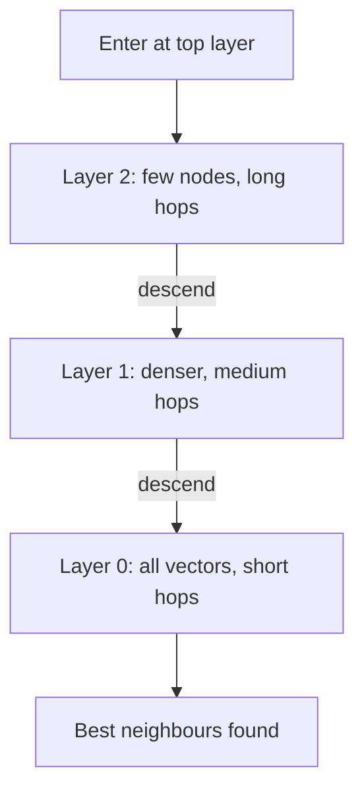

## Before you start

Read [rag-retrieval-augmented-generation](rag-retrieval-augmented-generation) for why you would want this. Knowing what a database index does from [indexing-and-transactions](indexing-and-transactions) helps — the trade-offs rhyme, with one big twist.

## In one sentence

A **vector database** stores high-dimensional embedding vectors and answers "which stored vectors are closest to this one" fast, by giving up the guarantee that it found the *exact* nearest neighbours.

## Why it matters

A regular database index answers "where is the row with id = 42". No B-tree can answer "which of these million 1536-dimensional points is nearest to this one" — the question has the wrong shape. Semantic search, recommendations, deduplication, and every RAG system need that second question answered in milliseconds.

The interview value is the trade-off. Vector search is the clearest example of an index that is *deliberately approximate*, and being able to explain why 95% recall at 2ms beats 100% recall at 800ms shows engineering judgement.

## The intuition

Every embedding is a point in a space with hundreds or thousands of dimensions. Similar meanings sit near each other. Finding relevant documents becomes finding nearby points.

The naive approach — compare the query to all million stored vectors — is correct and far too slow. And here is the twist that makes this different from ordinary indexing: in high dimensions there is no trick that finds exact nearest neighbours quickly. The known exact methods degrade until they are no better than scanning everything.

So the field made a bargain: accept approximate answers. **Approximate nearest neighbour (ANN)** search returns *probably* the closest vectors, hundreds of times faster. Missing the 5th-best result out of a million rarely changes an answer; waiting 800ms always does.

## How it actually works

**Distance first.** Three metrics dominate. **Cosine similarity** measures the angle between vectors, ignoring magnitude — the default for text, because a long document and a short one about the same topic should match. **Dot product** factors in magnitude too. **Euclidean distance** is straight-line distance.

The one thing to know: for **normalised** vectors (length 1), cosine similarity and dot product rank identically, and dot product is cheaper because it skips the square roots. Most embedding APIs return normalised vectors, so production systems normalise once at index time then use plain dot product.

**HNSW.** The dominant index is **Hierarchical Navigable Small World**, a layered graph. The top layer is sparse with long-range links; each layer down is denser. Search enters at the top, greedily walks toward the query, drops a layer, and repeats — like taking the motorway across the country, then A-roads, then residential streets.



Two knobs matter. `efConstruction` controls index build quality — higher means slower builds and better recall. `efSearch` controls how wide the search explores at query time — higher means slower queries and better recall. `efSearch` is tunable per query, which is your live speed-versus-accuracy dial.

**Other indexes.** **IVF** clusters vectors and searches only the nearest clusters — faster to build than HNSW, lower recall at the same speed. **Flat** is brute force: perfect recall, fine under roughly 10,000 vectors. **Product quantisation** compresses vectors to cut memory dramatically at some accuracy cost.

## Worked example

Both metrics, and the equivalence that trips people up:

```js
function dotProduct(a, b) {
  return a.reduce((sum, x, i) => sum + x * b[i], 0);
}

function magnitude(v) {
  return Math.sqrt(v.reduce((sum, x) => sum + x * x, 0));
}

function cosineSimilarity(a, b) {
  return dotProduct(a, b) / (magnitude(a) * magnitude(b));
}

function normalise(v) {
  const m = magnitude(v);
  return v.map((x) => x / m); // length becomes exactly 1
}

const query = [1, 2, 3];
const short = [2, 4, 6];    // same DIRECTION as query, larger magnitude
const other = [3, 2, 1];    // different direction

console.log('cosine query vs short:', cosineSimilarity(query, short).toFixed(4));
console.log('cosine query vs other:', cosineSimilarity(query, other).toFixed(4));
console.log('dot    query vs short:', dotProduct(query, short).toFixed(4));
console.log('dot    query vs other:', dotProduct(query, other).toFixed(4));

// After normalising, dot product equals cosine similarity.
const nq = normalise(query), ns = normalise(short);
console.log('normalised dot:', dotProduct(nq, ns).toFixed(4));
console.log('raw cosine:    ', cosineSimilarity(query, short).toFixed(4));
```

Output:

```
cosine query vs short: 1.0000
cosine query vs other: 0.7143
dot    query vs short: 28.0000
dot    query vs other: 10.0000
normalised dot: 1.0000
raw cosine:     1.0000
```

`short` is exactly twice `query`, so cosine similarity is 1.0 — identical direction, magnitude ignored. That is what you want for text: a two-sentence summary and a two-page article on the same subject should match. Raw dot product returns 28, which is unbounded and not comparable across pairs. After normalising, dot product and cosine agree exactly — so normalise once at write time and use dot product thereafter, saving two square roots per comparison across millions of comparisons.

## A second example — when it gets harder

Brute force works until, quite suddenly, it does not. Measure the crossover:

```js
function randomVector(dim) {
  return Array.from({ length: dim }, () => Math.random() * 2 - 1);
}

function bruteForceSearch(index, query, k = 5) {
  return index
    .map((vec, id) => ({ id, score: dotProduct(query, vec) }))
    .sort((a, b) => b.score - a.score)
    .slice(0, k);
}

const DIM = 384;
for (const size of [1_000, 10_000, 100_000]) {
  const index = Array.from({ length: size }, () => normalise(randomVector(DIM)));
  const query = normalise(randomVector(DIM));

  const start = performance.now();
  bruteForceSearch(index, query);
  const ms = performance.now() - start;

  console.log(`${size} vectors: ${ms.toFixed(1)}ms per query`);
  console.log(`  memory: ~${((size * DIM * 4) / 1024 / 1024).toFixed(1)} MB as float32`);
}
```

Typical output (timings vary by machine):

```
1000 vectors: 2.9ms per query
  memory: ~1.5 MB as float32
10000 vectors: 31.7ms per query
  memory: ~14.6 MB as float32
100000 vectors: 89.5ms per query
  memory: ~146.5 MB as float32
```

Roughly linear, which is the problem. At 100,000 vectors you are already spending tens of milliseconds — before the LLM call has even started. At 10 million you would be into whole seconds. HNSW turns that linear curve into roughly logarithmic: the same 10 million vectors return in single-digit milliseconds, at maybe 95–99% recall.

Note the memory line too. 100,000 vectors of 384 dimensions is 147MB as float32, and HNSW's graph adds roughly 30–50% on top. At 1536 dimensions and 10 million vectors you are looking at tens of gigabytes of RAM. This is why **dimensionality matters commercially** — several embedding APIs let you request fewer dimensions, and halving them halves your memory bill for a usually-small recall cost.

**Recall is the metric you must be able to define.** Recall@10 is the fraction of the true top-10 that the ANN search actually returned. Measure it by brute-forcing a sample of queries and comparing. A system nobody has measured recall on is a system nobody knows the accuracy of.

## Quick reference

| Index | Build time | Query speed | Recall | Memory | Use when |
|---|---|---|---|---|---|
| Flat (brute force) | None | Slow, linear | 100% | Lowest | Under ~10k vectors |
| HNSW | Slow | Fastest | 95–99% | Highest | The default at scale |
| IVF | Fast | Fast | 90–95% | Medium | Frequent rebuilds |
| IVF + PQ | Fast | Fast | 80–90% | Lowest | Memory-constrained, huge corpora |

| Metric | Formula idea | Use for |
|---|---|---|
| Cosine similarity | Angle between vectors | Text embeddings (default) |
| Dot product | Sum of products | Normalised vectors — faster, same ranking |
| Euclidean (L2) | Straight-line distance | Image embeddings, spatial data |

## Tools & frameworks

Read this table as one axis — in-process, then in-database, then dedicated service, then managed — because that ordering is the interview answer.

| Tool | What it's for | Reach for it when |
|---|---|---|
| [pgvector](https://github.com/pgvector/pgvector) | Vectors in Postgres, so one datastore | You are under roughly 10M vectors and value operational simplicity over peak recall |
| [Qdrant](https://qdrant.tech/documentation/) | Dedicated vector database with strong filtering | You need payload filtering at scale and can operate another service |
| [Milvus](https://milvus.io/docs) | Distributed vector database with many index types | You are at billions of vectors and need horizontal sharding |
| [Pinecone](https://docs.pinecone.io/guides/get-started/overview) | Managed serverless vector database | You refuse to operate this layer at all and will pay to avoid it |
| [Weaviate](https://docs.weaviate.io/weaviate) | Vector database with built-in hybrid search | You want BM25 and vector fused inside one query rather than in your code |
| [hnswlib](https://github.com/nmslib/hnswlib) | In-process HNSW index | You have fewer than about 100k vectors and a database would be overkill |

The Milvus docs site returns a redirect loop to automated clients, so a link checker may flag it even though the page is real in a browser.

## Common mistakes

- Mixing embeddings from two different models in one index; the spaces are unrelated and results are meaningless.
- Comparing raw dot products across pairs without normalising, so long documents win regardless of relevance.
- Reaching for a vector database at 5,000 vectors, where an in-memory array scan takes under 10ms.
- Never measuring recall, so a badly tuned `efSearch` silently drops relevant results.
- Forgetting metadata filtering — "similar documents from this tenant" needs the filter applied inside the search, not after, or you get five results from other tenants and zero from your own.
- Ignoring memory: 1536 dimensions times 10 million vectors does not fit on a small instance.
- Treating a similarity score as a probability; 0.82 is only meaningful relative to other scores from the same model.

## What interviewers ask

- **Why can't you use a B-tree for vector search?** — B-trees order data along one dimension, but nearest-neighbour queries in hundreds of dimensions have no such ordering, and exact methods degenerate to full scans as dimensionality grows — which is why the field accepts approximate answers.
- **Cosine similarity or dot product?** — Cosine for raw vectors of differing magnitude since it compares direction only; if you normalise at index time they produce identical rankings and dot product is cheaper, which is what most production systems do.
- **Explain HNSW simply.** — A layered graph where upper layers hold few nodes with long-range links and lower layers hold everything with short links, so search descends from coarse to fine like motorway to A-road to street, giving roughly logarithmic instead of linear lookup.
- **What does approximate mean here, and is it acceptable?** — It means the returned neighbours are probably but not certainly the true closest; at 95–99% recall the occasional missed 8th-best result almost never changes a downstream answer, while the latency difference is two or three orders of magnitude.
- **How do you tune recall versus latency?** — Raise `efSearch` for better recall at higher latency, or lower it for speed; measure recall@k against brute-force ground truth on sample queries rather than guessing.
- **When would you skip a vector database entirely?** — Under roughly 10,000 vectors, where a linear scan in application memory is fast enough and avoids an entire piece of infrastructure, or when your queries are genuinely keyword-exact and BM25 serves better.

## Practice

1. Extend the benchmark above to 500,000 vectors and plot query time against index size. Identify where latency crosses your budget.
2. Implement brute-force search as ground truth, then take the top-3 of your top-10 as a crude "approximate" result and compute recall@3. Write the recall calculation yourself.
3. Add metadata filtering to the in-memory index (`{ tenantId, vec }`) and measure how filtering *before* versus *after* scoring changes both result quality and latency.

## Where to go next

You can now retrieve. [llm-evaluation-and-testing](llm-evaluation-and-testing) is how you prove retrieval is actually working, and [llm-cost-and-latency](llm-cost-and-latency) covers the budget these lookups sit inside.
