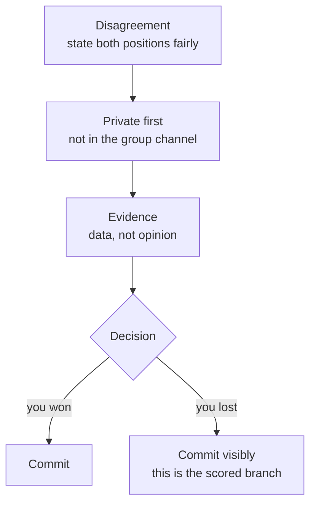

## Before you start

`star-method-mastery`, because conflict answers live or die on the Action section — and here the Action is what you *said*, close to word for word.

## In one sentence

Conflict questions ask whether you can hold a technical position against someone with more power, change your mind when the evidence moves, and stay working with that person afterwards — all three, not just the one you find easiest.

## Why it matters

Every team has disagreements. The interviewer is not checking whether you have them; they are checking which failure mode you have. There are two, and both are disqualifying:

The **avoider** goes along with a decision they believe is wrong, then quietly says "I told you so" when it breaks. The **bulldozer** wins the argument and leaves a peer who will not work with them again.

Companies with explicit leadership frameworks name this directly — Amazon's principles include both "Have Backbone; Disagree and Commit" and "Earn Trust," which is a single expectation split in two: push hard, then commit fully. Your story has to show both halves.

## The intuition

A good disagreement story sounds like a court case, not a fight. In a court case both sides present evidence, a decision is made by someone with the authority to make it, and — this is the part candidates skip — **the losing side complies with the ruling and everyone goes to lunch.**

Candidates instinctively tell the story where they were right and won. That story is the weakest of the three, because it tests nothing. The two stronger stories are: you were right and were overruled, and you were wrong and changed your mind.

## How it actually works

Every conflict answer runs the same five steps. The middle three carry the score.



**State the other side fairly.** If your account makes the other person sound stupid, the interviewer concludes you are still angry and that you were probably part of the problem. Steelman them: "his position was reasonable — we had shipped twice on that library without issue."

**Raise it privately and early.** Interviewers listen specifically for whether your first move was a public channel or a direct conversation. Ambushing someone in a group setting is the single most common invisible fail.

**Convert opinion into evidence.** "I thought it was risky" is a preference. "I reproduced three failures in an hour and wrote them up" is an argument. Preferences do not resolve; evidence does.

**Then commit** — and say what committing looked like. Not "I accepted it" but the concrete thing you did to make the decision you disagreed with succeed.

The **disagreeing-up** variant adds one thing: acknowledge the authority gap without pretending it does not exist. You do not need to have won. You need to have raised it properly and then supported the decision.

## Worked example

Same story, two ways. This is the "overruled by my manager" case, which is the one most worth preparing.

```text
WEAK:

  "My manager wanted to use MongoDB for a system that was clearly
   relational. I told him it was the wrong choice — anyone who's worked
   with relational data knows you don't do that. He went with it anyway
   because he'd used it at his last company. Six months later we had
   exactly the data integrity problems I predicted and we ended up
   migrating to Postgres, which cost us about two months. So, yeah. I
   was right."

  Interviewer's notes:
    - No evidence presented, only assertion ("clearly", "anyone knows")
    - Contemptuous of manager's reasoning
    - No commitment after the decision
    - Told with relish. Would this person be safe to overrule?
    - Score: low on Earn Trust, low on Disagree and Commit


STRONG (same events):

  "We were choosing a datastore for a new billing service. My manager
   favoured MongoDB; I thought the data was strongly relational and we'd
   fight the schema. His reasoning wasn't unreasonable — his previous
   team had shipped fast on it, and our ops team already ran a Mongo
   cluster, so it was the cheaper operational choice.

   I asked for thirty minutes with him before the design review rather
   than raising it in the review itself. I'd written up the four
   queries I expected billing to need most, and showed what each looked
   like in both. Two of them were multi-document transactions across
   invoices and line items — doable, but the kind of thing you get
   wrong at 2am.

   He heard it and still chose Mongo, mainly on the ops-cost argument,
   which I hadn't weighted heavily enough. So I committed — and I mean
   I actually did the work. I wrote the transaction wrapper we'd need,
   documented the two queries as known sharp edges, and set up an alert
   for the specific inconsistency I was worried about.

   The alert fired about eight months in. Because it was there, we
   caught it as a data question rather than a customer-facing incident,
   and that's what triggered the migration decision — with him, not
   against him. I'd handle it the same way. The part I got wrong was
   under-weighting operational cost, and I ask about that first now."
```

What changed:

| Weak | Strong | Why it moves the score |
|---|---|---|
| "clearly relational" | Four specific queries written out | Evidence beats assertion |
| Manager's view dismissed | Manager's view stated fairly, and partly right | Shows you can be wrong |
| Raised in the review | Asked for 30 min privately, first | Tests conflict hygiene |
| Nothing after the decision | Wrote the wrapper, docs, and alert | Proves "disagree and commit" |
| "I was right" | "The part I got wrong was…" | Self-awareness, not vindication |
| Migration framed as vindication | Migration framed as a joint decision | Shows the relationship survived |

The events are identical. The strong version simply refuses to make itself the hero.

## A second example — when it gets harder

**The peer who blocks you.** This is harder than disagreeing with a manager, because there is no authority to resolve it and escalating too early damages the relationship.

> "A senior engineer on the platform team sat on my API review for eight days. My first assumption was that he was ignoring it, and I was annoyed.
>
> I asked to talk instead of pinging the thread again. It turned out he had a real objection he hadn't written down — my endpoint duplicated something their gateway already did, and he'd been waiting for a design discussion he thought was scheduled and wasn't. So the block was a calendar failure, not a rejection.
>
> We spent forty minutes at a whiteboard and I ended up deleting about a third of my PR and calling their service instead. It shipped four days later than planned, with less code than I wrote.
>
> The change I made: for anything touching another team, I now open a fifteen-minute design conversation *before* the PR, not a review request after it. Two of my last three cross-team changes went through in a day."

Note the two moves that score: the candidate **assumed bad faith and was wrong about it**, and says so; and the resolution left them with *less* of their own work in the codebase, which they present as the good outcome.

The genuinely hardest variant is **"tell me about a conflict you did not resolve."** Some interviewers ask it because everyone has one. The honest answer names what you tried, what you would try now, and what you did to keep the work moving anyway — reducing your dependency on that person, escalating with the disagreement stated fairly, or simply accepting a slower path. What you must not say is that it was entirely the other person.

## Quick reference

| Story type | What it tests | Strength |
|---|---|---|
| You disagreed and won | Very little | Weakest — avoid as your main story |
| You were overruled and committed | Backbone + trust | Strongest |
| You changed your mind on evidence | Ego, coachability | Very strong |
| A peer blocked you and you resolved it | Influence without authority | Strong |
| It stayed unresolved and you managed it | Maturity, realism | Strong if honest |

| Phrase to avoid | What it signals | Say instead |
|---|---|---|
| "He just didn't understand…" | Contempt | "His reasoning was X, which was fair" |
| "I escalated to my manager" (first move) | No conflict hygiene | "I asked to talk one-on-one first" |
| "I was proven right" | Vindication-seeking | "It turned out X, and here's what I'd missed" |
| "We agreed to disagree" | Nothing was resolved | What you actually did to move forward |
| "I don't really have conflicts" | Avoidance, or not senior enough | Any real disagreement, told fairly |

## Common mistakes

- Choosing the story where you won. It demonstrates nothing except that you can be right.
- Making the other person the villain. The interviewer only ever hears your side, so a one-sided account reads as a warning about you.
- Skipping the commit. Half of what is being scored happens *after* the decision.
- Escalating in the story's first move. Even a correct escalation looks bad without an attempted direct conversation first.
- Picking a conflict about something trivial — tabs versus spaces — which signals you have never had a disagreement with real stakes.

## What interviewers ask

- **"Tell me about a time you disagreed with your manager."** — Testing whether you can push back on authority without either caving or damaging the relationship.
- **"Tell me about a time you were overruled. What did you do next?"** — The "next" is the entire question. They want the commit.
- **"Tell me about a time you changed your mind."** — Checking your ego is smaller than your interest in being right.
- **"How do you handle someone who won't respond to you?"** — Testing influence without authority, which is most of senior work.

## Practice

1. Take a real disagreement and write the other person's position as *they* would argue it, in three sentences, with no sarcasm. If you cannot, you are not ready to tell that story.
2. Write out the commit step for a decision that went against you — the specific things you did to help it succeed. If there were none, that is the honest lesson, and it is worth saying.
3. Prepare a story where you were wrong. Practise it aloud until the admission comes out flatly, without defensive hedging around it.

## Where to go next

`failure-and-learning` — where the disagreement was with your own past judgement, and there is no one else to hold accountable.
