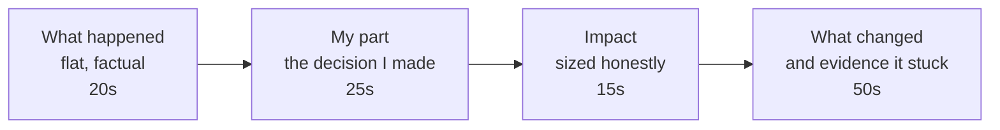

## Before you start

`star-method-mastery`, and ideally `strengths-and-weaknesses` — the failure answer is the same shape at higher stakes, where the mechanism you built matters more than the mistake.

## In one sentence

The failure question scores **ownership calibration**: whether you can take exactly your share of the blame — not less, which reads as evasion, and not more, which reads as poor judgement — and show one durable thing that changed.

## Why it matters

This question separates candidates more reliably than almost any other, because it has two failure modes that pull in opposite directions and most people fall into one.

Under-owning ("the requirements were unclear, QA missed it, the vendor's docs were wrong") tells the interviewer that when something breaks on their team, you will be busy explaining why it was not you. Over-owning ("I completely destroyed that quarter, I still think about it, honestly I'm not sure I should have been trusted with it") tells them you cannot assess severity — which is alarming in someone who will be on call.

The narrow target between them is the whole skill.

## The intuition

Think about how a good post-incident review reads. It is unemotional. It states what happened in a timeline, identifies the contributing causes including the human ones, assigns action items, and does not spend a paragraph on how bad everyone feels.

That is the register you want. You are not confessing and you are not defending. You are *reporting*, about yourself, with the same flatness you would use for a service outage — and then you spend your remaining time on the action items, because that is the part that predicts your future behaviour.

Candidates get the register wrong far more often than they get the facts wrong.

## How it actually works

The structure is STAR with a different weighting: **the Result is the biggest section**, not the Action.



**State the failure in the first sentence.** Do not build up to it. "I took down checkout for forty minutes" — then the context. Burying the failure under two minutes of setup reads as stalling.

**Name your decision, in the first person, without hedging.** Not "the deploy went out without a review" (passive — who deployed it?) but "I deployed it without asking for review because I thought it was trivial."

**Size the impact accurately.** Both directions. If it was forty minutes and no data loss, say forty minutes and no data loss — do not inflate it to sound humble, and do not shrink it to sound safe.

**Then spend half your airtime on what changed** — and give evidence it stuck. "I'm more careful now" is not evidence. "The deploy pipeline now blocks unreviewed merges to main, I wrote that check" is evidence. So is "I've done fourteen migrations since and every one had a written rollback."

Pick a real failure with real consequences. A failure with no consequences was not a failure, and the interviewer will ask for another one.

## Worked example

```text
WEAK — under-owning:

  "We had a bad incident on a data migration last year. The requirements
   we got were pretty vague, and honestly staging wasn't set up properly
   — it had a fraction of the production data, so a lot of edge cases
   just weren't visible. QA signed off on it. When it went out it
   corrupted some records and we had to roll it back. It was a learning
   experience for the whole team about the importance of good staging
   environments."

  Interviewer's notes: three parties blamed, zero decisions owned.
  "Learning experience for the whole team" = nothing changed for HIM.


WEAK — over-owning:

  "I corrupted production data. It was entirely my fault, I should have
   caught it, I don't really have an excuse. It was probably the worst
   thing I've done professionally and I honestly still feel awful about
   it. My manager was very good about it but I know I let the team down
   badly, and I've been a lot more cautious ever since."

  Interviewer's notes: can't size severity, no mechanism, "more
   cautious" is a mood not a change. Would he escalate proportionately
   at 3am, or panic?


STRONG (same incident):

  "I corrupted about 12,000 user records in production with a migration
   I ran myself.

   The decision that caused it was mine: I read the migration as
   low-risk and skipped the dry-run step our runbook asks for, because
   I'd run four similar ones that month without issue. The script
   assumed every user row had a linked profile. In staging that was
   true. In production about 3% of rows were older accounts created
   before profiles existed, and for those the join silently produced
   nulls that I then wrote back.

   Impact: 12,000 records with wiped preference data, caught after
   about ninety minutes when support saw the tickets. No financial data
   touched, no data permanently lost — we restored from the previous
   night's backup and replayed the day's writes. Roughly six hours of
   my time and two of a teammate's.

   Three things changed. First, personally: I don't skip the dry-run
   now, and I've run maybe twenty migrations since — the dry-run is in
   the PR description every time, so it's visible whether I did it.
   Second, I made it hard to repeat: migrations that touch more than a
   thousand rows now require a dry-run artifact attached to the PR, and
   that's a CI check I wrote, not a convention. Third, the real root
   cause was that staging didn't resemble production, so I built a
   sampler that pulls an anonymised 5% slice weekly. That one has
   caught two other people's bugs since.

   The judgement error I'd flag is the one I'd want to avoid again:
   four safe migrations in a row made me treat 'low risk' as a fact
   rather than a guess."
```

What changed, precisely:

| Dimension | Under-owning | Over-owning | Strong |
|---|---|---|---|
| Opening | Context first, failure buried | Failure, then apology | Failure, one sentence, factual |
| Cause | Requirements, staging, QA | "Entirely my fault" | The specific decision he made |
| Impact | "some records" | "the worst thing I've done" | 12,000 records, 90 min, no data lost |
| Register | Defensive | Emotional | Post-incident review |
| Change | "the team learned" | "more cautious" | CI check, staging sampler, 20 clean runs |
| Root cause | Blamed staging | Blamed himself | Fixed staging *and* named his own bias |

The strong version still mentions staging — but as something he then *fixed*, not as a reason it was not his fault. That is the difference between an excuse and a root cause.

## A second example — when it gets harder

The harder case: **the failure was not technical, and there is no CI check to write.** You mismanaged a person, or you pushed a project that should have been killed.

> "I kept a project alive for two quarters after I had enough evidence it wasn't going to work.
>
> I'd proposed it, so I was reading the weak signals generously — three pilot customers, all of whom used it once and stopped. I had explanations for each of them. What I should have done, and what I'd committed to on the whiteboard at the start, was set a kill criterion before we began: if fewer than half the pilots were still active at week six, we stop. I never wrote it down, so there was nothing to hold me to.
>
> Cost: roughly two engineer-quarters, and more importantly one of those engineers spent six months on something that got deleted, which I don't think I can fully give back.
>
> What changed is narrow and specific. Every proposal I write now has a 'we stop if' line in the first paragraph, with a date and a number, and I show it to someone who isn't invested. I've killed one of my own projects at that checkpoint since — six weeks in, on the number I'd written down. That's the only real evidence I've got that the change is real."

This one is harder because the mechanism is a habit rather than a check, so the candidate does the necessary work of proving it: he *used* it, and it cost him his own project. That is the strongest possible evidence that a soft change stuck.

Notice too that he does not resolve the human cost neatly. "I don't think I can fully give that back" is honest and does not spiral into self-flagellation. Sitting with an unresolved consequence for one sentence, without either dismissing or dramatising it, reads as maturity.

## Quick reference

| Signal | Under-owning | Calibrated | Over-owning |
|---|---|---|---|
| Grammar | Passive: "it went out" | Active: "I deployed it" | Active but absolute: "I destroyed" |
| Others mentioned | As causes | As context or help | Not at all |
| Impact stated | Vague, minimised | Numbers, both directions | Inflated |
| Emotion | None | Brief, proportionate | Dominates the answer |
| Change | "we learned" | A checkable artifact | "I'm more careful" |

## Common mistakes

- Choosing a failure with no consequence. If nothing broke, it does not answer the question, and you will be asked again — now improvising.
- Passive voice around the critical moment. Interviewers hear the grammar shift; it is the loudest tell in the whole answer.
- Blaming a system without also naming your decision. Fixing staging is good; pretending staging chose to skip your dry-run is not.
- Ending on the apology instead of the mechanism. The last thing you say is the thing they remember.
- Picking a failure from six years ago. It implies nothing has gone wrong since, which is either untrue or means you are not taking on hard work.

## What interviewers ask

- **"Tell me about a time you failed."** — Ownership calibration. They are listening for active voice, an honest size, and a checkable change.
- **"What would you do differently?"** — Testing whether you have actually analysed it or just apologised for it.
- **"Has that happened again since?"** — Verifying the mechanism. "No, and here's how I know" is the answer you want to be able to give.
- **"Tell me about a project that didn't succeed."** — Broader than a personal mistake; they want to see whether you can assess a failure you did not solely cause without either hiding in the collective or claiming all of it.

## Practice

1. Write your failure story, then underline every passive verb. Rewrite each in the first person and see how much the answer changes.
2. Identify the artifact that proves your change stuck — a CI check, a template, a document, a count of clean runs since. If none exists, build it before you interview; that is genuinely useful regardless.
3. Say the whole story aloud and time the "what changed" section. If it is under half the total, cut context until it is.

## Where to go next

`why-this-company` — moving from stories about your past to an argument about your future.
