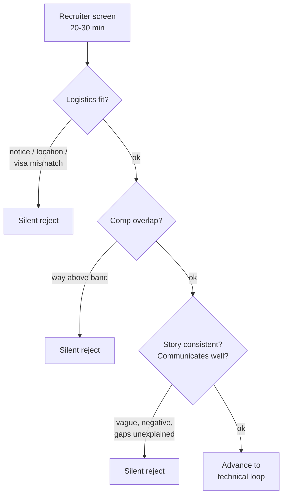

## Before you start

`tell-me-about-yourself` and `salary-negotiation` — both come up in this round, and the compensation question in particular arrives earlier than most candidates expect.

## In one sentence

The HR screen is a twenty-to-thirty-minute filter run by a recruiter checking logistics — availability, compensation range, work authorisation, motivation, communication — and it rejects far more people than candidates realise, usually for a reason nobody tells them.

## Why it matters

This is the round candidates prepare least and lose most often. You spend weeks on algorithms and then get filtered by a recruiter in twenty minutes because you said your notice period is three months in a role they need filled in six weeks, or because you gave a number twice their band, or because your explanation of why you left your last job took ninety seconds and sounded evasive.

None of these are technical failures. All of them are avoidable with an hour of preparation, and almost none of them come with feedback — you simply do not hear back.

## The intuition

The recruiter is not evaluating whether you are a good engineer. They are not qualified to and it is not their job. They are checking whether it is worth spending five engineers' time on you.

That makes their job **cheap rejection**. A recruiter running forty screens for six slots is looking for reasons to say no, because saying no is nearly free and saying yes costs the company a full interview loop. Anything that looks like a future problem — a mismatch on money, a start date that does not work, a story that does not add up, a candidate who does not sound interested — is enough.

So your goal is not to impress. It is to be **easy to say yes to**: no unresolved logistical mismatch, no story that needs a second explanation, clear interest in the role.

## How it actually works



Three gates, in order. Most rejections happen at the first two, before your experience is discussed at all.

**Logistics.** Notice period, earliest start date, location and remote expectations, work authorisation. Know all four exactly before the call. "I think it's two months, maybe three?" reads as someone who has not decided to leave.

**Compensation.** They will ask for a range. Everything in `salary-negotiation` applies — deflect once, and give a researched range starting at your target if pressed. But be aware of the asymmetry here: this specific round can reject you for being far *above* band, so a wildly high number is a real risk. A researched range is not.

**The story.** Why you are looking, why you left each role, any gaps. Consistency matters more than the content. The recruiter will compare what you say to your CV and, later, to what you tell the hiring manager.

Two things get scored throughout without ever being announced: **how you speak about previous employers**, and **whether you sound like you want this specific job**. A candidate who is lukewarm on the phone gets deprioritised behind an equally qualified one who is not.

## Worked example

The four questions that quietly filter people out, each answered badly and well.

```text
1. "What's your notice period?"

WEAK:  "It's three months, but I might be able to negotiate it down,
        I'm not really sure. Depends on my manager I think."
        -> Filtered. Uncertainty here reads as not committed to leaving.

STRONG: "Officially 90 days. I've confirmed our policy allows buy-out
        of the last 30, and two people on my team have done it, so
        realistically 60 days from signing. If you need faster I can
        ask about a further reduction — I'd rather tell you the real
        number now than a hopeful one."
        -> Advances. A precise number, evidence, and a lever.


2. "Why are you leaving your current role?"

WEAK:  "Honestly the management there has been pretty bad. There's no
        real technical direction, my manager changed three times in
        two years, and the good engineers have mostly left. It's not a
        great environment."
        -> Filtered. All may be true. It reads as someone who will say
           the same about them in two years.

STRONG: "I've been there three years and shipped the thing I wanted to
        ship — the scheduling service is stable and someone else runs
        it well now. What I want next is multi-tenant scale, and that
        work isn't on our roadmap. So it's less a push than a pull."
        -> Advances. Forward-facing, no blame, and it names what he
           wants — which is also the answer to "why us".


3. "There's a gap between March and September last year — what
    happened there?"

WEAK:  "Yeah, so, that was a difficult period, I was kind of figuring
        out what I wanted to do next, and I was doing some freelance
        stuff on and off, and I did a couple of courses... it was
        just a bit of a transitional time really."
        -> Filtered. Ninety seconds of hedging makes six months sound
           like something being hidden.

STRONG: "I was laid off in March when the team was cut — about 40 of
        us went in one round. I took two months to look properly
        rather than take the first thing, and I used the time to
        finish a Go project that's on my GitHub. I started at Lumen in
        September."
        -> Advances. Named, sized, dated, closed. Twelve seconds.


4. "What are your compensation expectations?"

WEAK:  "I'm currently on 18L and I'd want at least a 30% hike, so
        around 24L."
        -> Anchored to a past employer's budget. If their band went to
           32, he has capped himself. Not a reject, but expensive.

STRONG: "I'd rather not anchor before we've worked out fit — what's
        the band for this level? [if pressed] Based on market data for
        this level in Bangalore I'm looking at 32-38 total, with the
        caveat that I'd want to understand scope before committing."
        -> Advances, with the range intact.
```

| Question | What they're really checking |
|---|---|
| Notice period | Can you start inside their hiring window? |
| Why leaving | Will you badmouth *them* next? Is the reason durable? |
| The gap | Is there something you're hiding? (Usually there isn't) |
| Compensation | Do our ranges overlap at all? |
| "Tell me about the role as you understand it" | Did you read the posting, or apply to 200 jobs? |
| "Are you interviewing elsewhere?" | Timeline pressure and how serious you are |

## A second example — when it gets harder

**Short tenures.** Three jobs in four years triggers a flight-risk flag. Address it before they ask, in one clean sentence, and give a reason that will not recur here:

> "Two short stints in there, and I know how that reads. The first was a nine-month startup that ran out of runway — the whole engineering team went. The second I left after a year because the role turned out to be a rewrite of what I'd been hired to build fresh, and I should have asked harder questions before joining. I did ask harder questions this time, which is partly why I'm interested in this one specifically."

That works because it takes responsibility for the pattern ("I should have asked harder questions") rather than producing two separate excuses.

**A long gap you would rather not detail.** You do not owe a recruiter a medical or family history. Name the category, close the timeline, and pivot:

> "I took eight months out for a family health situation that's now resolved. I kept my hand in with a contract in the last two months of it, which is the most recent thing on my CV. I've been fully available since January."

Category, resolution, availability. A recruiter's actual concern is whether it recurs and whether you are available now; answer both and the topic closes.

**"Why did you apply here?"** on a screening call is a lighter version of `why-this-company`, but it filters hard, because mass applicants have no answer. Thirty seconds naming one specific thing from the posting is enough — you do not need the full engineering-blog treatment at this stage, you just need to prove you read it.

**Being asked about your current salary** where it is legal to ask. Deflect once — "I'd rather we base it on the scope of this role, which is broader than what I do now" — and if the recruiter insists it is required for their process, giving it is not fatal. Follow immediately with your researched target range so the *last* number in the conversation is yours.

## Quick reference

| Have ready before the call | Why |
|---|---|
| Exact notice period + any buy-out option | Hardest filter, most often fumbled |
| Earliest realistic start date | They are filling a slot on a calendar |
| Your target comp range, researched | You will be asked in the first ten minutes |
| Work authorisation status, precisely | Non-negotiable filter; vagueness kills it |
| A 90-second "tell me about yourself" | Almost always the opener |
| One specific reason for *this* company | Filters out mass applicants |
| A one-sentence reason for every gap and short tenure | Length is what makes these sound bad |
| Two questions for the recruiter | Process, timeline, loop structure |

## Common mistakes

- Treating it as a formality. It rejects more candidates than the technical round does.
- Criticising a current employer. Even when justified, it predicts how you will talk about them.
- Long explanations for gaps. The length is the problem, not the gap.
- Not knowing your own notice period exactly. It is the most common logistical fumble.
- Naming your current salary unprompted, which anchors you to your old employer's budget.
- Sounding neutral about the role. Recruiters route enthusiasm forward first.
- Asking the recruiter deep technical questions. Wrong person — ask about process and timeline.

## What interviewers ask

- **"Walk me through your background."** — Your 90-second answer. They are checking communication and that your CV matches your speech.
- **"Why are you looking to leave?"** — Screening for someone who will badmouth them next. Answer forward, not backward.
- **"What's your notice period / when can you start?"** — A hard logistical filter. Give a precise number.
- **"What are your expectations?"** — Band overlap. Deflect, then a researched range.
- **"Why did you apply to us?"** — Filtering mass applicants. Name one specific thing from the posting.
- **"Anything you want to ask me?"** — Ask about the loop structure and timeline; it is useful and it signals you are actually planning to proceed.

## Practice

1. Write your exact answers to the eight items in the Quick reference table. Say the notice period and start date aloud until they come out as numbers, not estimates.
2. Write your "why I'm leaving" answer, then remove every clause about anyone else. If nothing survives, you do not yet have a forward-facing reason — find one, since you will need it in every interview.
3. Time your gap or short-tenure explanation. If it runs past twenty seconds, cut it. Length is what makes it sound like a problem.

## Where to go next

This closes Chapter 13. `star-method-mastery` and `conflict-and-disagreement` are the two worth rehearsing aloud before a real loop; then move on to Chapter 14 for situational and leadership questions.
