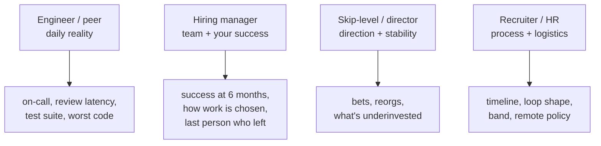

## Before you start

`why-this-company` — the research that produces a good answer there produces your best questions here. They are the same hour of work.

## In one sentence

The last five minutes are still scored: your questions reveal what you think matters about engineering work, and asking the same three questions of everyone reveals that you did not think about who you were talking to.

## Why it matters

"Do you have any questions for us?" is not the end of the interview, it is the last thing that goes in the notes. Interviewers form an impression from what you are curious about, because curiosity is a reliable proxy for experience — a candidate who asks how on-call is staffed has been on call, and a candidate who asks about free lunch has not yet learned what actually makes a job good or bad.

The other half is that this is your only real chance to evaluate *them*. You are about to spend two or more years somewhere. Five minutes of good questions is the entire due diligence budget you get.

## The intuition

Doctors have a rule of thumb: the question a patient asks tells you as much as the symptom they describe. "Will this scar?" and "what's the recurrence rate?" come from different people with different concerns, and an experienced doctor updates on which one you are.

Interviewers do the same. Your question exposes your mental model of the job. If your model of engineering is "write features, get promoted," your questions will be about the roadmap and the promotion cycle. If your model includes the parts that actually hurt — legacy code, on-call, review latency, decisions that keep getting relitigated — your questions will show that, and you will read as someone who has been through a few of them.

You cannot fake this by memorising a list. But you can prepare questions you genuinely want answered, which is the same thing.

## How it actually works

Match the question to the role of the person answering it. Asking an IC about headcount planning wastes both of you; asking a skip-level about code review conventions does too.



**Ask about the difficult, not the aspirational.** "What's the most frustrating part of working here?" gets you a real answer far more often than "what's the culture like?" — the first is hard to deflect, the second has a rehearsed reply.

**Ask for specifics, not policy.** "How often does someone get paged at night?" gets a number. "How do you approach work-life balance?" gets a value statement.

**Ask about the last real instance.** "When was the last time an on-call incident led to an actual process change?" forces them to retrieve a memory rather than describe an aspiration. This is the single most useful question form, and it is exactly how *they* have been interviewing *you* all along.

Two or three good questions beats a list of eight. And listen — a follow-up on their answer signals more than another prepared question.

## Worked example

```text
WEAK — asked of everyone, in every interview:

  "What's the culture like here?"
  "What's a typical day look like?"
  "What are the opportunities for growth?"

  What they signal: no research, no model of the work, would ask the
  same three at any company. All three have safe rehearsed answers, so
  you also learn nothing.


STRONG — to a peer ENGINEER:

  "What's the thing about this codebase you'd warn a new joiner about?"

  "Walk me through the last incident you were paged for — what broke,
   and did anything change afterwards?"

  "How long does a typical PR sit before it gets reviewed?"

  Why these work: all three are answerable only from experience, none
  has a corporate script, and each maps to a real cost of the job.
  The PR question in particular is a superb proxy for team health —
  the answer is a number and it correlates with everything else.


STRONG — to the HIRING MANAGER:

  "What does someone in this role need to have done by month six for
   you to be glad you hired them?"

  "How does work get chosen? Is it roadmap-driven from product, or do
   engineers propose things and get them staffed?"

  "Who was the last person to leave this team, and why?"

  Why these work: the first turns into your actual first-quarter plan
  and it's a question only a serious candidate asks. The second is the
  single best predictor of whether you'll have autonomy. The third is
  uncomfortable, which is exactly why the answer is informative.


STRONG — to a SKIP-LEVEL or DIRECTOR:

  "What's the bet this team is making that you're least certain about?"

  "Where is this team under-invested right now — what would you fix
   first with two more engineers?"

  "How many reorgs has this group been through in two years?"

  Why these work: they're at the altitude the person actually operates
  at. Asking a director about code review is a level mismatch; asking
  about strategic risk and stability is peer-level conversation.
```

Every strong question above shares one property: **the answer cannot be produced from the careers page.** That is the whole test.

## A second example — when it gets harder

The harder skill is **reading the answers.** You asked a good question; now what does the reply mean?

| You ask | Good answer | Red flag |
|---|---|---|
| "How's on-call?" | "One week in six, roughly two pages a month, comp time for nights" | "It's pretty quiet mostly" — no numbers, and vagueness about pages usually means nobody tracks them |
| "Last incident and what changed?" | A specific incident, a specific action item, whether it shipped | Cannot recall one, or recalls it and nothing changed |
| "PR review latency?" | "Same day usually, we have a rota" | "Depends" / visible discomfort / "we should be better at that" |
| "Why did the last person leave?" | A straight answer, even an awkward one | Deflection, or "people just move on" for a team of six with three departures |
| "What would you fix with two more engineers?" | A concrete under-invested area | "We're fully staffed for our goals" — nobody believes this |
| "Success at six months?" | Specific: a system owned, a migration landed | "Just get up to speed and settle in" — the role is not defined |
| "How is work chosen?" | An honest mix, with examples both ways | "We're very agile" as the whole answer |
| "Work-life balance?" | Normal hours, with honest exceptions | "We work hard and play hard" / "we're like a family" |

Two patterns worth naming. **Hesitation before an answer to a factual question** is data — someone deciding how much to say. And **the same discomfort across multiple interviewers on the same topic** is a much stronger signal than one person being awkward. If three separate people go vague about the tech lead who left, you have learned something real.

The other hard case: **you genuinely have no questions** because the interviewers covered everything. Never say "no, you've covered it all" — it lands as disinterest. Instead, convert something they said into a question: "You mentioned the migration is halfway done — what's the part you expect to be hardest in the second half?" That is better than any prepared question, because it proves you were listening.

## Quick reference

| Interviewer | They are assessing | Ask about | Don't ask about |
|---|---|---|---|
| Peer engineer | Would I want you on my team? | Codebase, on-call, review flow, tooling | Strategy, headcount, promotion |
| Hiring manager | Can you do the job, will you stay? | Success criteria, autonomy, attrition | Salary, holiday policy |
| Skip-level | Judgement, level, ambition | Bets, risks, org stability, investment | Day-to-day process |
| Recruiter / HR | Logistics, expectations, closing | Timeline, loop structure, band, remote | Deep technical detail |
| Cross-functional (PM, design) | Do you work well outside engineering? | How disagreements get settled, spec quality | Anything engineering-internal |

## Common mistakes

- Asking the identical three questions of five interviewers. They compare notes, and it is noticed.
- Asking something answered on the careers page. It is the same failure as not researching the company.
- Leading with compensation or leave with an engineer. Wrong person, and it costs you the impression.
- Asking eight questions because you prepared eight. Two good ones plus a real follow-up is better.
- Saying "no, I think you covered everything." Always convert something they said into a question instead.
- Not listening to the answer. The follow-up is worth more than the question.

## What interviewers ask

- **"Do you have any questions for us?"** — Still scored. They are reading your model of the job from what you are curious about.
- **"Is there anything you'd like to know about the team?"** — A softer version, same scoring.
- **"What haven't we asked you that we should have?"** — A gift. Name a strength the loop missed, with one concrete example.
- **"Any concerns about the role?"** — Genuine. Raise a real one; a candidate with zero questions or concerns about a job they have spent five hours learning about is not being honest.

## Practice

1. Write three questions you would ask a peer engineer that they could only answer from experience. Check each one: could it be answered from the website? Cut it if so.
2. Take one question and write the good answer and the red-flag answer. Practising this is what lets you notice the difference live, when you are nervous.
3. In your next interview, ask one question, then ask a genuine follow-up to what they said instead of moving to your next prepared question. The follow-up is the part that reads as senior.

## Where to go next

`hr-screening-round` — the round before all of this, where a different set of questions quietly filters candidates out.
