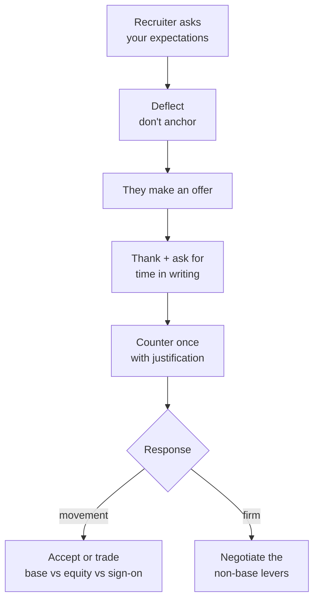

## Before you start

Nothing technical. You do need one number before you begin: what you would accept if this were your only offer. Decide it before any conversation, not during one.

## In one sentence

Negotiation is a short, bounded, low-risk conversation in which you avoid naming a number first, respond to their offer once with a justified counter, and remember that base salary is only one of six things on the table.

## Why it matters

The compensation conversation is the shortest and highest-hourly-rate work in the entire process. A twenty-minute exchange routinely moves an offer by 5–15%, and that increase compounds — future raises, future offers, and your next job's benchmark are all computed from it.

Most candidates skip it entirely, out of a fear that is almost always unfounded: that negotiating will lose them the offer. Companies that have run you through five rounds and issued an offer have already spent real money on you. A polite counter does not undo that.

## The intuition

**Anchoring** is the reason the first number matters so much. Whoever names a number first sets the range everyone else argues around. If you say "I'm looking for 20 lakhs" and their band went to 28, you have just capped yourself at roughly 20 — and nobody in the room will tell you.

The second idea is **BATNA** — your best alternative to a negotiated agreement. This is the source of all your leverage and it is not a bluff. Your BATNA might be another offer, your current job, or the ability to keep interviewing for two more months. Whatever it is, you negotiate from it. A candidate who knows their walk-away number sounds calm; one who does not sounds like they are asking permission.

You never have to *state* your BATNA. You just have to have one.

## How it actually works



**Deflecting the first ask.** They will ask early. Deflect twice, politely; if pressed a third time, give a researched range with the bottom at your target, not your minimum.

**Never counter in the moment.** When the offer arrives verbally, say thank you, sound genuinely pleased, and ask for it in writing plus a few days. Enthusiasm and a counter are compatible; do both, just not in the same breath.

**Counter once, with a reason.** One counter, justified by market data or a competing offer, is professional. Three rounds of haggling burns goodwill for small gains. Justification is what separates a negotiation from a demand — "based on levels.fyi data for this level in this city and a competing offer at X" beats "I was hoping for more."

**Then remember the other levers.** Base is often the most rigid number in the package, because it is banded and setting it above band creates internal-equity problems. Sign-on bonus is the most flexible — it is a one-time cost, usually from a different budget, and does not disturb the band at all.

## Worked example

Here is the counter email. Copy the structure; the bracketed parts are yours.

```text
Subject: Re: Offer — Backend Engineer

Hi Priya,

Thank you for sending this over — I'm genuinely excited about the team,
and the conversation with Ankit about the scheduling platform was the
best one I've had in this search.                         [1] WARMTH

I'd like to discuss the compensation before I sign. Two things
informing my thinking:                                    [2] ONE ASK

  - Levels.fyi data for this level in Bangalore puts total comp in the
    32-38L range, and the scope you've described — owning the booking
    service end to end, including on-call — sits at the upper half of
    that.
  - I have a competing offer at 36L total, which I'd rather not take,
    because this role is the better fit technically.       [3] REASON

If you can get to 36L total, I'll sign today. I'm flexible on how it's
composed — if base is constrained by the band, a larger sign-on or an
adjusted equity grant works just as well for me.          [4] FLEX

Happy to jump on a call if that's easier.

Best,
Rahul
```

Four things that make it work:

**[1] Warmth, and specific warmth.** Naming the conversation with Ankit proves this is not a form email.

**[2] One clear ask, up front.** No paragraph of throat-clearing before the point.

**[3] External justification.** Market data and a competing offer. Note the competing offer is stated as real and as *less preferred* — that is the honest, effective framing. Never invent one; recruiters talk, and a bluff that gets called ends the conversation.

**[4] Flexibility on composition.** This is the line that most often gets the deal done, because it hands the recruiter a way to say yes without breaking the band.

And the closing commitment — "I'll sign today" — is powerful, so only write it if it is true.

Here is the same person doing it badly:

```text
WEAK:

  Hi Priya, thanks for the offer. I was honestly hoping for a bit more
  — the number's a little lower than I expected given my experience. Is
  there any flexibility at all? I'm still very interested either way,
  and I'd probably accept regardless, I just thought I'd ask.
```

| Weak | Strong | Effect |
|---|---|---|
| "hoping for a bit more" | "If you can get to 36L, I'll sign today" | Vague wish vs a closeable number |
| "given my experience" | Market data + competing offer | Internal opinion vs external evidence |
| "any flexibility at all?" | A specific figure | Invites a token 2% |
| "I'd probably accept regardless" | Silence on that point | Destroys all leverage in one clause |
| Base only | "flexible on composition" | Blocks their easiest path to yes |

## A second example — when it gets harder

**Being pressed for a number before an offer exists.** The exchange usually runs:

> **Recruiter:** "What are your salary expectations?"
>
> **You:** "I'd rather not anchor before we've both worked out whether this is a fit — I'm sure your band for this level is reasonable, and if the role's right I don't expect comp to be the sticking point. What range is budgeted?"
>
> **Recruiter:** "I need a number to move you forward."
>
> **You:** "Understood. Based on market data for this level in this city, I'd be looking at 34–40 total, with the caveat that I'd want to understand the scope before committing to a figure. What's the band?"

Note the range starts at your *target*, not your floor — recruiters hear the bottom of any range you give. And in some jurisdictions they must post or disclose the band on request, so asking is always worth doing.

**When they say the number is final.** Often it genuinely is for base — bands are real. Move to the other levers:

| Lever | Flexibility | Ask like this |
|---|---|---|
| Base salary | Low — banded | "Is there room at the top of the band?" |
| Sign-on bonus | **High** — one-time, separate budget | "Can we bridge the gap with a sign-on?" |
| Equity / RSUs | Medium | "Could we increase the initial grant?" |
| Start date | High | "I'd need four weeks after my notice" |
| Title / level | Low, but huge if it moves | "What would it take to be considered at the next level?" |
| Remote / hybrid days | High | "Could we agree three days remote in writing?" |
| Learning budget, kit, leave | High, low value | Worth asking; don't spend leverage here |
| Early comp review | Medium | "A six-month review instead of twelve?" |

The sign-on is the reliable one. If they cannot move base, "would a sign-on of X bridge it?" succeeds far more often than pushing base again.

**Exploding offers** — "this expires Friday" — are a pressure tactic more often than a real constraint. Asking for one more week is normal and rarely refused. If it is genuinely refused, that is real information about the company.

**Competing offers you do not have.** Do not invent one. You can still negotiate honestly with "I'm in late stages elsewhere" if true, or with market data alone, which is entirely sufficient.

## Quick reference

| Stage | Do | Never |
|---|---|---|
| Screening call | Deflect the number question | Give your current salary unprompted |
| Pressed for a range | Give a researched range, floor = target | Give your minimum |
| Offer arrives verbally | Thank, ask for it in writing + a few days | Accept or counter on the spot |
| Counter | One email, one number, justified | Haggle over three rounds |
| They hold firm on base | Move to sign-on, equity, start date, level | Assume the whole package is fixed |
| Accepting | Get every number in writing | Accept a verbal promise of a future raise |

## Common mistakes

- Naming a number first when you did not have to. This is the single most expensive mistake in the process.
- Disclosing your current salary. It anchors your offer to your past employer's budget rather than this role's value. Deflect: "I'd rather we base it on the scope of this role."
- Saying "I'd accept anyway." True or not, it ends the negotiation.
- Countering only on base, so the recruiter has no way to say yes without breaking their band.
- Negotiating before the offer exists. You have no leverage until they have chosen you.
- Accepting a verbal "we'll review it in six months." If it is not in the letter, it is not real.

## What interviewers ask

- **"What are your salary expectations?"** — Trying to anchor and to filter early. Deflect, then give a researched range if pressed.
- **"What are you currently making?"** — Anchoring to your history. Redirect to the role's market value; in some places this question is not legally permitted.
- **"Do you have other offers?"** — Assessing urgency and competition. Answer honestly; never invent one.
- **"If we get to X, will you accept?"** — A genuine close. Only say yes if you mean it — a yes you renege on ends the relationship.

## Practice

1. Look up your level and city on levels.fyi or a local equivalent, and write down three numbers: your target, your walk-away, and the range you would say aloud if pressed.
2. Write your counter email from the template using a real recent offer or a realistic hypothetical. Delete every hedging phrase — "just", "a bit", "I was hoping" — and read what is left.
3. Rehearse the deflection out loud until it sounds relaxed rather than evasive. This one is genuinely worth practising; it is the moment most candidates lose the most money.

## Where to go next

`questions-to-ask-interviewers` — the questions that also tell you whether the offer is worth negotiating for.
