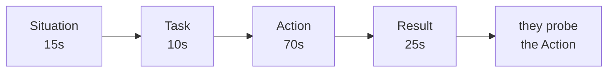

## Before you start

Read `mock-interviews-behavioral` first — it teaches what STAR is. This topic assumes you know the four letters and fixes the two things that go wrong anyway.

## In one sentence

**STAR** (Situation, Task, Action, Result) only works when you budget your speaking time deliberately and finish with a number, because interviewers score the Action and Result and mentally discard the rest.

## Why it matters

Most rejected behavioural answers are not bad stories — they are good stories told in the wrong proportions. The candidate spends ninety seconds explaining the org chart, thirty seconds on what they did, and ends with "and it went well." The interviewer has a scoring sheet with boxes for *what you personally did* and *what changed as a result*, and both boxes are empty.

The fix is mechanical, not creative. You already have the stories. You need to re-cut them.

## The intuition

Think of your answer as a two-minute film with a fixed budget. Every second you spend on establishing shots — the office, the team, the quarter, the client's history — is a second you cannot spend on the scene where you do something.

Beginners over-shoot the establishing shots because that part is comfortable and requires no self-assessment. Describing context feels like talking; describing your own decisions feels like being judged. So the nerves push the airtime toward the safe end, and the answer starves exactly where it is scored.

## How it actually works

Give each part a **time budget** and hold yourself to it. In a two-minute answer:



The Situation exists only to make the Action legible. If the interviewer can follow your Action without a detail, that detail does not belong in the Situation. "Our payments service was timing out" is enough — they do not need the service's history, the team's size, or which quarter it was.

The **Result** is where the second failure happens. "It went well" is unscoreable. A Result needs one of three things: a number ("cut p99 from 4s to 400ms"), a decision that stuck ("we still use that runbook"), or an honest lesson that changed your behaviour. Any of the three is fine. None of the three is a fail.

Build a **story bank** before the interview: five or six real stories, each tagged with the question types it can answer. You are not inventing a story per question — you are re-cutting one of six stories to emphasise the part the question asks about.

## Worked example

Here is a story bank as structured JSON. Fill it in for your own experience — the `tags` field is what lets one story serve four questions.

```js
// story-bank.js — run with: node story-bank.js "conflict"
const bank = [
  {
    id: "payments-timeout",
    situation: "Checkout was timing out for ~3% of users at peak.",
    task: "I owned the payments service and had to find the cause before Black Friday.",
    action: [
      "Reproduced it by replaying peak traffic against staging",
      "Traced it to connection-pool exhaustion, not the vendor as everyone assumed",
      "Argued for raising the pool size AND adding a circuit breaker, not just the quick fix",
      "Wrote the runbook so on-call could handle it without me",
    ],
    result: "p99 checkout latency 4.1s -> 380ms; zero payment incidents over Black Friday.",
    tags: ["pressure", "ownership", "debugging", "conflict", "deadline"],
  },
  {
    id: "migration-rollback",
    situation: "I ran a schema migration in production with no rollback plan.",
    task: "Restore correctness without a clean revert path.",
    action: [
      "Wrote a repair script live while the team held deploys",
      "Asked a teammate to review it before running — slower, but I was rattled",
      "Posted the timeline in the incident channel as it happened",
    ],
    result: "Two hours of degraded writes. I now require a rollback plan in every migration PR; it is a template checkbox on our repo.",
    tags: ["failure", "ownership", "learning"],
  },
];

const want = process.argv[2] || "conflict";
const hits = bank.filter((s) => s.tags.includes(want));
console.log(`Stories that answer a "${want}" question: ${hits.length}`);
for (const s of hits) {
  console.log(`\n[${s.id}]`);
  console.log(`  Action beats: ${s.action.length}`);   // want 3-5
  console.log(`  Result measurable: ${/\d/.test(s.result)}`); // want true
}
```

Output:

```
Stories that answer a "conflict" question: 1

[payments-timeout]
  Action beats: 4
  Result measurable: true
```

That `Result measurable: false` check is the useful one. Run it over your own bank and fix every story that prints `false` before you interview.

## A second example — when it gets harder

The hard case is a story where you genuinely have no number — you supported someone, you improved a process, you mentored a junior. Candidates panic and either invent a metric or fall back to "it went well."

Neither is necessary. Compare:

**Weak Result:** "She got a lot better and the team was happier."

**Strong Result:** "Her PRs stopped needing a second review round — that went from most of them to roughly one in five over about two months. She now runs the onboarding session I used to run."

There is no dashboard behind that. It is a **before-and-after you observed**, which is a legitimate measurement. "Most of them, then about one in five" is honest and specific; "a lot better" is neither.

The other hard case is a story where the outcome was bad and stayed bad — the project was cancelled, the fix did not work. Say so. Then make the Result the durable change: what you do differently now, and one piece of evidence that you actually do it (a template, a checklist, a habit someone else adopted). An interviewer who hears a real failure with a real behaviour change learns more than one who hears a fifth clean win.

## Quick reference

| Part | Airtime | Fails when | Fix |
|---|---|---|---|
| Situation | ~15s | Org chart, history, quarter names | Cut to the one fact the Action needs |
| Task | ~10s | Says "we" — no personal ownership | "I owned…", "I was asked to…" |
| Action | ~70s | 1–2 vague sentences | 3–5 concrete decisions, in order |
| Result | ~25s | "It went well" | A number, a stuck decision, or a changed habit |

| What you say | What they hear | Say instead |
|---|---|---|
| "We decided to…" | You were in the room, maybe | "I proposed X; the team went with it" |
| "It was a difficult situation" | Filler | The one fact that made it difficult |
| "And it worked out well" | No result | "Latency dropped from X to Y" |
| "I basically just…" | You are discounting yourself | Drop the hedge, state the action |

## Common mistakes

- Spending more than a quarter of your airtime on Situation. Time yourself once and you will be shocked.
- Saying "we" throughout the Action. The interviewer is scoring *you*; a team narrative scores nobody.
- Preparing one story per question. You will get a question you did not prepare for, and you will have no bank to re-cut from.
- Inventing a metric. Follow-up questions ("how did you measure that?") expose it instantly, and it costs you far more than the vague answer would have.

## What interviewers ask

- **"What was your specific contribution?"** — You said "we" too much. They are giving you one chance to claim ownership.
- **"How did you measure that?"** — Testing whether your Result is real. A confident "we didn't measure it formally, but X changed" beats a fabricated number.
- **"What would you do differently?"** — Checking you have reflected, not just recited. Have a real answer for every story in your bank.

## Practice

1. Write your story bank as the JSON above — six stories, real ones, with a `tags` array. Run the script and fix every story printing `Result measurable: false`.
2. Record yourself telling one story. Stopwatch each STAR section. If Situation exceeds 20 seconds, cut it and re-record.
3. Take your single best story and answer three different questions with it — conflict, pressure, ownership — changing only which Action beats you emphasise. Notice that you never changed the facts.

## Where to go next

`tell-me-about-yourself` — the one answer that is not a STAR story, and the one you will give in every single interview.
