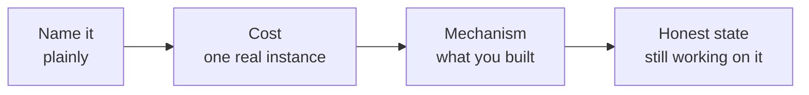

## Before you start

Read `star-method-mastery` — the weakness answer is a compressed STAR story where the Result is the remediation.

## In one sentence

The weakness question is a test of **self-awareness under mild social pressure**: can you name a genuine limitation, describe what it actually cost, and show the specific mechanism you built so it costs less now.

## Why it matters

Every experienced interviewer has heard "I'm a perfectionist" enough times to have stopped listening to it. The humblebrag does not fail because it is dishonest — it fails because it is *uninformative*. The interviewer learns nothing, and then has to record something in the self-awareness box, so they record "evasive."

Meanwhile the candidate who says "I under-communicate when a task is going badly, here is the standing check-in I now use" has told the interviewer something true, something useful, and something that proves they can hear feedback. That candidate scores higher on a question they answered with an actual flaw.

## The intuition

Think about how you assess a colleague you trust. You do not trust them because they have no weaknesses — you trust them because they know what theirs are and have systems around them. The person who says "don't let me estimate timelines alone, I'm optimistic, get a second opinion" is *more* reliable than the person who claims no blind spots.

That is the whole question. They are asking whether you are the kind of engineer who has a system around their own failure mode.

## How it actually works

A complete answer has four parts, and the last two are where all the value is:



**Name it plainly.** No softening preamble. "I'm slow to ask for help" beats "I suppose if I had to pick something, I sometimes maybe…"

**Cost.** One concrete instance where it hurt. This is what makes it credible — a weakness with no cost was never a weakness.

**Mechanism.** Not "I'm working on it" — the *specific thing you built*. A calendar block, a checklist, a rule you gave a teammate, a template in your repo. Mechanisms are checkable; intentions are not.

**Honest current state.** Say where you actually are. "It's better, not solved" is more convincing than a clean cure, and it protects you from a follow-up you cannot support.

For **strengths**, the rule is different and simpler: pick a strength the job description actually needs, and prove it with evidence rather than adjectives. "I'm a strong communicator" is a claim. "I write the design doc before the code, and two teams now use my template" is evidence.

Choose a real weakness, but choose sensibly. A weakness that is the *core* of the job is disqualifying, and honesty does not require self-sabotage. Applying for a role that is 80% code review? Do not pick "I give shallow code reviews." Pick a true weakness that is adjacent, not central.

## Worked example

Here is the same person answering twice. Notice that only the second half changes.

```text
WEAK (the humblebrag):

  "Honestly, my weakness is that I'm a bit of a perfectionist. I care a
   lot about the quality of what I ship, so sometimes I spend longer on
   things than I probably need to. But I think that's mostly a good
   thing — my managers have always said my code is very clean."

  Interviewer's note: "No real weakness given. Self-awareness: unclear."


STRONG (same person, real answer):

  "I under-communicate when something is going badly. My instinct when
   I'm stuck is to go quiet and grind on it, because I want to bring a
   solution rather than a problem.                        [NAME]

   That cost us on a vendor integration last year. I was blocked for
   most of a week on their auth flow and didn't say so until standup on
   day four. My lead had solved the same thing at a previous job — the
   fix took him twenty minutes. I burned three days protecting my ego.
                                                          [COST]

   What I changed: I have a rule now, and it's on a sticky note on my
   monitor — two hours blocked and I post in the team channel. Not a
   meeting, just a message saying what I'm stuck on. I also started
   writing a short daily note of what I'm actually working on, so my
   lead can see a stall before I admit to it.             [MECHANISM]

   It's better, not fixed. I still notice the urge to go quiet, and I
   still sometimes hit three hours instead of two. But the week-long
   version hasn't happened again."                        [STATE]
```

What changed, precisely:

| Weak | Strong |
|---|---|
| A strength in disguise ("perfectionist") | A genuine cost to the team |
| No instance | One dated, specific instance |
| "sometimes I spend longer" — vague | "three days" — quantified |
| Ends by defending itself | Ends with a mechanism you can inspect |
| Manager cited as praise | Manager cited as the person he failed to tell |
| Nothing changed | Sticky note, 2-hour rule, daily note |

The strong answer is *riskier*, and that is the point. It contains a genuine admission that the candidate wasted three days. It scores higher anyway, because the interviewer now believes everything else the candidate says.

## A second example — when it gets harder

The hard version is when your genuine biggest weakness is close to the job. Suppose you are junior and applying for a role that involves a lot of stakeholder communication, and your real weakness is that you freeze in front of non-technical stakeholders.

Do not lie, and do not pick it either. Pick the **adjacent true weakness** and make the mechanism the bridge:

> "I default to technical framing even when the audience isn't technical — my first draft of anything is written for another engineer. It showed up badly in a quarterly review where I presented latency percentiles to our operations manager and lost her in about ninety seconds; she needed 'appointments were slow for these clinics', not p99.
>
> So now I write the one-line version first — what changed for the person affected — and only then the detail underneath it. I ask a non-engineer on my team to read anything going outside engineering. It's a habit I have to do deliberately; it isn't instinct yet."

That is honest, it is adjacent to the freezing problem, and the mechanism directly addresses the job's actual requirement. You did not claim the weakness away — you showed the system.

The other hard case is a follow-up: **"can you give me another one?"** This means your first answer was too safe, or they are stress-testing. Have a second one ready. A candidate with only one prepared weakness is visibly reciting; a candidate with two sounds like someone who has thought about themselves.

## Quick reference

| Weakness offered | Interviewer hears | Score |
|---|---|---|
| "I'm a perfectionist" | Rehearsed, evasive | Low |
| "I work too hard" | Rehearsed, evasive | Low |
| "I'm bad at the job's core skill" | Honest but disqualifying | Low |
| "I take on too much and miss deadlines" — no mechanism | Real, but unmanaged | Medium |
| Real flaw + real cost + a checkable mechanism | Self-aware, coachable | High |

| Strength claim | Same strength, as evidence |
|---|---|
| "I'm a fast learner" | "I picked up Go on a two-week deadline for the payments rewrite" |
| "I'm a team player" | "I run the on-call handover doc nobody was maintaining" |
| "I have strong attention to detail" | "I caught the timezone bug in review that would have hit 6,000 bookings" |

## Common mistakes

- Offering a strength as a weakness. Interviewers pattern-match this in one sentence.
- Naming a real weakness, then stopping. Without the mechanism you have only admitted a liability.
- "I'm working on it." Everyone says this. What are you actually doing on Tuesday that you were not doing last year?
- Picking a weakness central to the job description out of a misplaced sense of honesty.
- Listing four weaknesses because it feels more honest. One, well-structured, is the ask.

## What interviewers ask

- **"What's your greatest weakness?"** — Scoring self-awareness and coachability. They want a mechanism, not a confession.
- **"Can you give me another one?"** — Your first was too safe. Have a second prepared.
- **"What would your last manager say you need to improve?"** — Harder, because it is externally sourced. Use real feedback you have received; "nobody's ever raised anything" reads as either untrue or as never having asked.
- **"What are you best at?"** — Pick the strength their job description leans on, and answer with evidence, not adjectives.

## Practice

1. Write down the last three pieces of critical feedback you actually received. Your real weakness is in there; do not invent a new one.
2. For your chosen weakness, write the mechanism as something an interviewer could inspect — a file, a recurring calendar entry, a rule someone else knows about. If you cannot point to an artifact, build one this week.
3. Prepare a second weakness for the follow-up, then say both aloud back to back and check neither is a disguised strength.

## Where to go next

`failure-and-learning` — the same structure at greater stakes, where the cost is an incident rather than a habit.
