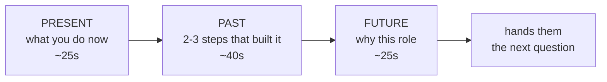

## Before you start

Nothing required. This is the first question of almost every interview, so it is the right place to start preparing — but read `star-method-mastery` afterwards, because this is the one answer that is deliberately *not* a STAR story.

## In one sentence

"Tell me about yourself" is a request for a 90-second professional trailer — where you are now, the two or three steps that got you here, and why this role is the obvious next one — not a walk through your CV.

## Why it matters

It is asked first, so it sets the frame for everything after. An answer that rambles for four minutes tells the interviewer you cannot self-edit, which is the exact skill they will worry about in design reviews and incident calls. An answer that lands in ninety seconds and ends pointing at their job description makes the next twenty minutes easier, because you have handed them the topics you want to be asked about.

It is also the most reliably predictable question you will ever get. There is no excuse for improvising it.

## The intuition

You know the difference between a film trailer and the film. The trailer is ninety seconds, shows three scenes, and its only job is to make you want the film. It leaves things out on purpose.

Your CV is the film. This answer is the trailer. Candidates fail because they try to play the whole film — chronological, complete, every job, every year — and the interviewer stops listening around the second employer.

The trailer also chooses its scenes for *this* audience. The same career gets a different ninety seconds when the role is infrastructure than when it is product.

## How it actually works

Use **present → past → future**, in that order. Not chronological.



**Present** goes first because it is what they care about most and it immediately establishes your level. One sentence on your current role and scope, one on what you are known for.

**Past** is a selected path, not a history. Two or three moves, each one explaining how you got the skill the job description asks for. Skip anything that does not serve the role — the internship, the unrelated first job, the degree, unless one of them is genuinely load-bearing.

**Future** is where you name their role and connect it to what you just said. This is the part almost everyone drops, and it is the part that converts the answer from a monologue into an argument.

Then stop talking. Ninety seconds. The silence after a crisp answer is confident; filling it is not.

## Worked example

Here is the answer with timing annotations, so you can rehearse against a stopwatch. Read it aloud at a normal pace and it lands at roughly 90 seconds.

```js
// tmay-script.js — rehearsal timer for your answer.
// Speaking pace averages ~140 words/min in interviews.
const script = [
  { part: "PRESENT", target: 25, text:
    "I'm a backend engineer at Lumen Health, where I own the appointment " +
    "scheduling service — about 40,000 bookings a day. Most of what I do is " +
    "reliability work on systems other teams depend on." },

  { part: "PAST", target: 40, text:
    "I got there through two steps. I started at a small logistics startup " +
    "where I was the only backend person, so I learned the whole stack fast, " +
    "including the parts I'd rather not have — I was on call for my own code " +
    "from month two. That taught me to design for the 3am version of myself. " +
    "I moved to Lumen three years ago specifically to work at a scale where " +
    "that discipline matters, and I've spent the last year cutting our " +
    "scheduling error rate from around 2% to under 0.1%." },

  { part: "FUTURE", target: 25, text:
    "What draws me to this role is the platform side of it. Your posting " +
    "mentions consolidating three booking integrations onto one internal API " +
    "— that's the same problem I solved at Lumen, one layer up, and it's the " +
    "kind of work I want more of." },
];

const WPM = 140;
let total = 0;
for (const s of script) {
  const secs = Math.round((s.text.split(/\s+/).length / WPM) * 60);
  total += secs;
  const flag = secs > s.target + 8 ? "  <-- TRIM" : "";
  console.log(`${s.part.padEnd(8)} ${String(secs).padStart(3)}s  (target ${s.target}s)${flag}`);
}
console.log(`TOTAL    ${total}s  ${total > 100 ? "<-- too long" : "ok"}`);
```

Output:

```
PRESENT   15s  (target 25s)
PAST      39s  (target 40s)
FUTURE    19s  (target 25s)
TOTAL    73s  ok
```

Seventy-three seconds of script, which becomes about ninety with natural pauses. Paste your own text into that array before you interview.

## A second example — when it gets harder

Now the weak version of the *same* career, so you can see exactly what changed:

**Weak:**

> "Sure! So, I was born in Pune and I did my B.Tech in computer science at VIT, where I graduated in 2018 with a 8.4 CGPA. My final year project was on image classification. After that I joined a startup called Fleetly as a junior developer, I was there for two years working on their API, mostly Node and Postgres, and then I moved to Lumen Health where I'm currently working as a backend engineer. I've been there three years now. I work on the scheduling service. I also know Docker and Kubernetes and I've been learning Go recently. Yeah, that's pretty much me."

Same person, same jobs. What is actually wrong:

| Weak version | Why it costs you | Strong version |
|---|---|---|
| Starts at birth and the degree | Chronological order buries the relevant part | Starts at present role and scope |
| "a startup called Fleetly" | Name means nothing; the *conditions* meant something | "only backend person, on call from month two" |
| "working on their API" | No scope, no ownership | "40,000 bookings a day" |
| Lists tools: Docker, K8s, Go | Reads as CV keyword recital | Cut entirely — the CV lists tools |
| "that's pretty much me" | Trails off; no ask | Names their exact problem from the posting |
| ~2 min of undifferentiated facts | Nothing memorable | One number, one hardship, one connection |

The single largest change is the ending. The weak version stops; the strong version *aims*. When you finish by naming a problem from their job posting, the interviewer's natural next question is about that problem — which is a question you have prepared for.

The harder variant is when your past genuinely does not line up with the role — a career changer, or a gap. Do not hide it in the middle hoping it slips past. Name it in one clause and move on: "I spent 2024 caring for a family member; I came back through a six-month contract at X, which is where the Go work is from." Said plainly, it costs you four seconds. Said evasively, it becomes the interview's subject.

## Quick reference

| Section | Time | Contains | Never contains |
|---|---|---|---|
| Present | ~25s | Current role, scope, one number | Your job title's history |
| Past | ~40s | 2–3 moves, each earning a skill | Every employer, dates, CGPA |
| Future | ~25s | Their role, their stated problem | "I'm looking for growth" |
| Total | 90s | One memorable number | A tool list |

## Common mistakes

- Answering chronologically from school. The interviewer's attention is highest in the first fifteen seconds and you spent them on 2018.
- Reciting technologies. Your CV already lists them; saying them aloud adds nothing and burns the clock.
- Going past two minutes. Beyond that you are no longer answering, you are filling silence.
- Giving the identical answer at every company. The Future section must name *their* problem or it is not doing its job.
- Over-rehearsing to the word. Know the three beats and the number; let the sentences vary.

## What interviewers ask

- **"Tell me about yourself."** — Assessing self-editing and level. Can you compress five years into ninety seconds and pick the right ninety seconds?
- **"Walk me through your resume."** — A different question. Here chronological *is* correct, but keep it to three minutes and keep the emphasis on the last two roles.
- **"What are you looking for in your next role?"** — Your Future section, expanded. If they ask this after your answer, your Future section was too thin.

## Practice

1. Write your three sections into the script array above and run it. Trim until total is under 100 seconds.
2. Record yourself, then listen back with a pen and strike every sentence that would not change the interviewer's opinion of you. Re-record without them.
3. Write two Future sections for two real job postings you are interested in. If you can swap them without noticing, neither is specific enough.

## Where to go next

`why-this-company` — your Future section is a compressed version of that answer, and preparing one improves the other.
