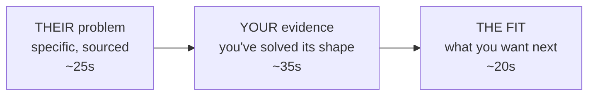

## Before you start

`tell-me-about-yourself` — the Future section of that answer is a thirty-second version of this one, and preparing this properly upgrades both.

## In one sentence

"Why this company" is not asking whether you admire them; it is asking whether you have identified a specific problem they have and can name why your experience is unusually well suited to it.

## Why it matters

Recruiters can tell within two sentences whether you researched the company or the industry. "You're a leader in fintech and I'm passionate about financial inclusion" applies to two hundred companies, which is exactly how it reads.

There is a practical stake as well: a weak answer here means everything else in the interview is scored as generic competence rather than as fit for *this* team. And it directly affects whether they believe you will accept the offer — a hiring manager who suspects you are using them as leverage will slow down or pass, no matter how well the technical rounds went.

## The intuition

Compare two messages you might get from a stranger.

> "I love what your company is doing and would be a great fit for any opening you have."

> "I saw your changelog note about splitting the booking service — I spent last year doing exactly that at a company your size, and the migration order you chose is the one I'd argue against. Can we talk?"

The second one gets a reply. Not because the person is more enthusiastic, but because they have **paid the cost of specificity**. Specificity is expensive — it takes an hour of real reading and it can be wrong — and that expense is exactly what makes it a credible signal.

Enthusiasm is free, so it signals nothing.

## How it actually works

The answer has three parts, and only the middle one is hard to fake.



**Their problem.** One concrete thing you learned that is not on the homepage: an engineering blog post, a changelog, a job posting's fourth bullet, a conference talk, a GitHub repo, a recent funding round's stated purpose, a product limitation you hit yourself as a user. Name your source out loud — it proves the research happened.

**Your evidence.** Connect it to something you have actually done. Not "I'd love to work on that" but "I've done the smaller version of that." This is where the answer stops being flattery and becomes an argument.

**The fit.** Why this is what *you* want next, in a way that is true. Interviewers can hear the difference between "this is my next step" and "I need a job."

Where to actually look, in descending order of value: the **engineering blog**, the **job description's specifics** (bullets four through eight, not one through three, which are boilerplate), **recent product changes**, the **founders' or engineers' public writing**, and — best of all — **using the product**. Twenty minutes of using it beats an hour of reading about it.

## Worked example

```text
WEAK:

  "I've been following your company for a while and I'm really impressed
   by the growth. You're clearly a leader in the space and I like that
   you have a strong engineering culture — I've heard great things about
   the team. I'm looking for a place where I can grow and take on more
   ownership, and I think this would be a great environment for that.
   Plus the product is something I can genuinely believe in."

  What the interviewer scores:
    Research: none demonstrated. Could be said about any company.
    Fit: about what HE wants, not what they need.
    Belief he'd accept an offer: low.


STRONG (same candidate, one hour of research):

  "Two things, one specific and one broader.

   The specific one: your engineering blog post in March about moving
   scheduling off the monolith described almost exactly the problem I
   spent last year on — you mentioned dual-writing during the cutover
   and the reconciliation pain that caused. We did the same thing for
   our payments service, and the part that hurt us was that we hadn't
   decided upfront which side was authoritative during the overlap
   window. I'd want to ask how you handled that, because the post
   stops right before that part. That's the kind of problem I want to
   be closer to, not further from.

   The broader one: I signed up for the product last week to see the
   booking flow. The thing I noticed is that you're doing multi-clinic
   scheduling, which is genuinely hard — the constraint set is nastier
   than most people assume, and it's the same class of problem I've
   been solving at Lumen but at single-clinic scope. Going from one
   site to many is the step up I want.

   So: same problem shape, one level harder, and a team that writes
   publicly about the hard parts rather than only the wins."


  What the interviewer scores:
    Research: blog post cited by month, product actually used.
    Fit: their problem mapped to his experience, with a real gap named.
    Belief he'd accept: high — he's already technically engaged.
```

The difference is not effort at the interview. It is one hour, the week before.

| Weak element | Strong element | What it proves |
|---|---|---|
| "following your company" | "your blog post in March about X" | A checkable source |
| "impressed by the growth" | "the post stops right before that part" | Read it critically |
| "strong engineering culture" | "a team that writes about the hard parts" | Culture claim with evidence |
| "believe in the product" | "I signed up last week and noticed…" | Used it |
| "grow and take on ownership" | "single-clinic to multi-clinic scope" | A specific, sized step |
| No question raised | A real technical question | Peer, not applicant |

## A second example — when it gets harder

**When the company is boring, or you are there for the money.** Not every job is a mission. Insurance claims processing is not going to move you, and pretending otherwise produces the most transparent answer in interviewing.

The move is to be honest about a *different* real reason. There is always one:

> "I'll be straight — I didn't come to this from a passion for claims processing. What got my attention was the scale. Your posting mentions two million claim events a day on a system that started in 2011, and I find legacy-at-scale genuinely more interesting than greenfield; the constraints are what make the problems non-trivial. I also read that you're doing this migration without a rewrite, incrementally, which is the harder and more honest path. I've done a strangler-fig migration once, at a tenth of that volume, and I'd like to do it at yours."

That is credible precisely because it declines the fake enthusiasm. Interviewers respect it more than a performed mission fit — and a claimed passion you cannot back up will collapse the moment they ask a follow-up about the domain.

**When you are laid off and applying widely.** You cannot research forty companies deeply. So do not — research the ones that reach the interview stage, in the hour before. And do not apologise for volume: "I'm looking actively, so I've been selective about which conversations to spend time on. This one I wanted because…" is a fine framing.

**"Why this role, when you're currently more senior?"** Answer the seniority question directly rather than around it. "The scope is wider even if the title isn't; I'd rather own a platform at your size than a service at mine" is an answer. Dodging it makes them assume you will leave in six months.

## Quick reference

| Research source | Effort | Signal strength |
|---|---|---|
| Homepage / About page | 5 min | None — everyone reads it |
| Job description, bullets 4–8 | 10 min | High — that's the real work |
| Engineering blog | 30 min | Very high — few candidates do this |
| Using the product | 20 min | Very high, and generates real questions |
| Public GitHub / open source | 20 min | High for infra and dev-tool roles |
| Recent funding or launch news | 10 min | Medium — shows direction |
| Glassdoor reviews | 10 min | For your decision, not your answer |

| They ask | They're really checking |
|---|---|
| "Why us?" | Did you research, and will you accept? |
| "Why this role?" | Is the level and scope right, or will you leave? |
| "What do you know about what we do?" | A direct research check — answer with specifics |
| "Where else are you interviewing?" | Your timeline and your seriousness, not your loyalty |

## Common mistakes

- Praising things true of every company in the sector — growth, culture, smart people, impact.
- Answering with what you want and never mentioning what they need. This question is about them.
- Quoting the mission statement back at them. They wrote it; it proves you read one page.
- Faking passion for a domain you do not care about. Follow-up questions expose it, and the honest alternative scores better.
- Doing the research and then not naming your source. "Your March post" is worth ten times "I've read about your work."

## What interviewers ask

- **"Why do you want to work here?"** — Research depth and offer-acceptance probability. Cite a source.
- **"Why this role specifically?"** — Level fit. They are checking you will not be bored or overwhelmed in six months.
- **"What do you know about our product?"** — A literal research check. Having used it is the strongest possible answer.
- **"What would you want to work on in your first six months?"** — Whether your research turned into an actual plan. Name a system from their posting.

## Practice

1. Pick a company you would genuinely apply to. Spend one hour: engineering blog, job posting bullets four onward, and twenty minutes using the product. Write the three things you learned that are not on the homepage.
2. Write your answer, then delete every sentence that would still be true of their nearest competitor. Whatever survives is the real answer; build it back up from there.
3. From your research, write one technical question you genuinely want answered. That question is also your closer for `questions-to-ask-interviewers`.

## Where to go next

`questions-to-ask-interviewers` — the same research, deployed as questions instead of as answers.
