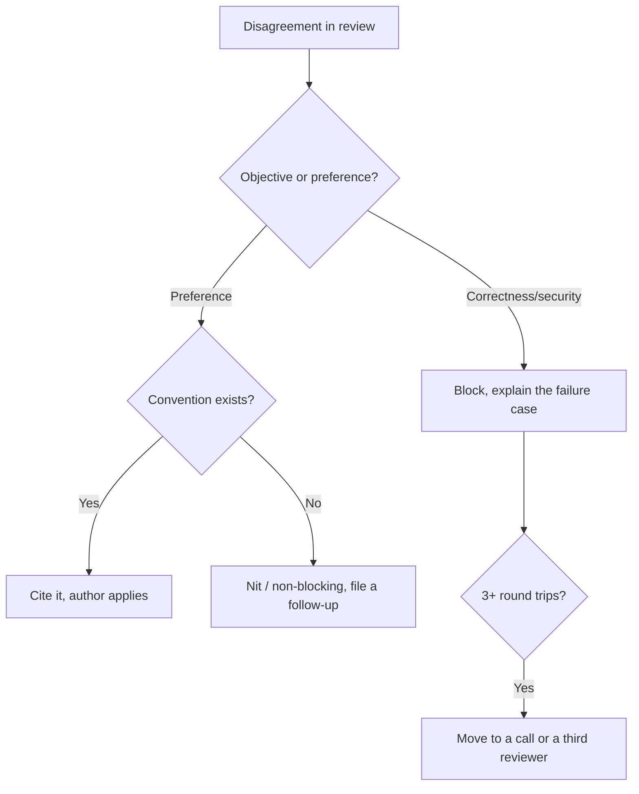

## Before you start

You should have opened a pull request and received comments on it. `underperforming-teammate` covers peer friction generally; this is the specific arena where it happens in writing.

## In one sentence

A **code review standoff** is a pull request stuck in disagreement — over style, over design, or over a risk neither side wants to own — where the real cost is not the code but the days of blocked work and the relationship damage accumulating in the comment thread.

## Why it matters

Code review is the highest-frequency conflict surface in engineering. You will have thousands of them. It is also the only conflict that is **written down, permanent, and public to your whole team**, which means a badly handled one is visible to everyone forever.

Interviewers use it as a proxy for something bigger: whether you can hold a technical standard without being a bottleneck, and whether you can accept criticism of your work without treating it as criticism of you. Both are hard, and the review thread is where both fail visibly.

## The intuition

Google's engineering guide names the standard precisely: approve once the change **definitely improves the overall code health of the system**, even if it is not perfect. There is no perfect code, only better code.

That single line resolves most standoffs, because most standoffs are a reviewer comparing the PR against an ideal that does not exist rather than against the code currently in `main`. The question is not "is this the best possible implementation?" It is "is the codebase better with this than without it?"

The second half of the intuition: reviews have a **clock**. Every day a PR sits blocked, the author context-switches away, the branch drifts, and the merge gets riskier. Google explicitly optimises for the speed of the *team* over the correctness of the individual review — a review that is 10% better but four days slower is usually a net loss.

## How it actually works

The most valuable habit in code review is **labelling the strength of every comment**, because without labels every comment reads as mandatory.

| Prefix | Means | Blocks merge? |
|---|---|---|
| `Nit:` | Minor, take it or leave it | No |
| `Optional:` / `Consider:` | Suggestion worth thinking about | No |
| `FYI:` | Context for later, no action now | No |
| (unlabelled) | I think this should change | Yes |
| `Blocking:` | Must change before merge | Yes |

Half of all review standoffs disappear the moment a team adopts this, because most of them are a reviewer leaving eight nits and an author reading eight blockers.

Second: **separate what is objective from what is preference**. Correctness, security, and data integrity are objective. Naming, decomposition, and structure are usually taste — and taste disagreements should be resolved by an existing convention, not by whoever is more stubborn. If there is no convention, that is the real finding, and "let us settle this in the style guide rather than in this PR" both unblocks the merge and prevents the next ten arguments.

Third: **escalate the medium, not the volume**. When a comment thread passes roughly three round trips with no convergence, the format is failing. Text strips tone and rewards whoever writes last. A ten-minute call resolves what twenty comments will not.



## Worked example

A review policy expressed as data — the sort of thing a team can actually adopt, and a concrete artefact to describe in an interview.

```js
const policy = {
  blocking: ['correctness', 'security', 'data-integrity', 'public-api-contract'],
  nonBlocking: ['naming', 'file-layout', 'comment-wording', 'micro-optimisation'],
  escalateAfterRoundTrips: 3,
  slaHours: 24,
};

function classify(comment, policy) {
  if (policy.blocking.includes(comment.category)) return 'BLOCKING';
  if (policy.nonBlocking.includes(comment.category)) {
    return comment.hasConvention ? 'Nit: cite convention' : 'Nit: non-blocking, file follow-up';
  }
  return 'Consider:';
}

const comments = [
  { category: 'naming', hasConvention: true },
  { category: 'naming', hasConvention: false },
  { category: 'security', hasConvention: false },
];

comments.forEach(c => console.log(c.category.padEnd(9), '->', classify(c, policy)));
```

Output:

```
naming    -> Nit: cite convention
naming    -> Nit: non-blocking, file follow-up
security  -> BLOCKING
```

The two `naming` rows produce different comments from identical categories, and that is the entire point. With a convention, you cite it and the author applies it in thirty seconds without resentment. Without one, insisting is just imposing your taste using the leverage of an approval button — and the fix is a style-guide discussion, not a blocked PR.

## A second example — when it gets harder

**Scenario 1 — the reviewer who will not approve.** You opened a PR on Monday. Raj, a senior engineer, left fourteen comments: two about a genuine null-handling bug, twelve about naming, file organisation, and preferring `map` over a `for` loop. You fixed the bug and pushed back on the rest. Raj re-reviewed and left nine more. It is now Thursday, the PR blocks two other people, and Raj is the only approver with ownership of that directory.

*The naive answer:* apply all nineteen changes to unblock yourself. Or dig in and refuse everything on principle.

*Why both fail:* capitulating teaches Raj this works and turns your next PR into the same week. Refusing wholesale means you also reject the two comments that were right, and it converts a code disagreement into a personal standoff with the one person who can approve you.

*What a senior engineer does:* splits the list explicitly and moves the medium. Reply once, not nineteen times: "I have taken the null handling and the four naming ones that match our existing convention. For the loop-versus-map and the file split, I do not think we have a convention — I would rather not settle it in this PR since it is blocking two people. Can we take those to the style guide, and I will do the file split in a follow-up if we land on it?" That is not a compromise for the sake of peace; it is the correct classification. If Raj still blocks, escalate the *process* rather than the code — ask your lead whether directory ownership should require a second approver, so no single person can hold a queue. Note what you did not do: argue about whether `map` is better. That argument has no ending.

**Scenario 2 — you are the reviewer, and the author will not budge.** Reverse it. A newer engineer, Tom, has written a 700-line PR that works and has tests, but puts business logic directly in the HTTP handler, which your team moved away from a year ago after it caused duplicated validation bugs. You explain. Tom replies that it works, it is tested, the deadline is Friday, and refactoring is "not in scope". He is not wrong about the deadline.

*The naive answer:* approve it to avoid the conflict, or block it until he restructures 700 lines.

*What a senior engineer does:* checks the actual standard first — is the codebase better with this than without it? If the logic is tested and correct, quite possibly yes, and blocking is the wrong call. But "approve" and "let it rot" are not the same thing. Approve with a written, owned follow-up: the ticket exists, it has Tom's name and a sprint, and you say plainly why the pattern was retired — with the actual bug it caused, because "we have a convention" persuades nobody and "this exact structure caused the duplicate-validation incident in March" persuades most people. If the logic is *not* adequately tested, or it is on a path where the duplication risk is a real security or money issue, then it is blocking, and you say so with the specific failure case rather than the principle. The distinction interviewers are listening for: is your block anchored to a concrete consequence, or to a preference wearing the clothes of a standard?

**Scenario 3 — the issue nobody wants to own.** Reviewing a PR that adds a search feature, you notice the query is built by string concatenation with user input. It is not exploitable *today* because an upstream gateway strips quotes — but that gateway is owned by another team, is not documented as a security control, and one team is already discussing replacing it. The PR author says it is out of scope. Your tech lead says the gateway handles it. Nobody wants to own the ticket, and the release is Friday.

*The naive answer:* accept the two "it is fine" answers. Two senior people said so, and it is genuinely not exploitable right now.

*Why it fails:* the safety here is accidental. Nothing records that the gateway is load-bearing for security, so the team that replaces it will have no way to know they are removing a control. This is precisely how injection vulnerabilities appear months later with no single person having made a mistake.

*What a senior engineer does:* refuses to let the risk be undocumented, which is a much smaller ask than refusing to let the PR merge. You can accept the schedule and still kill the ambiguity: parameterise the query if it is a ten-minute change (usually it is — this is worth checking before any debate, because the whole conflict often evaporates); if not, write the risk down where the *gateway* team will see it, and put it in the release notes and the security channel with a named owner and a date. The move that gets you hired is refusing the false binary between "block the release" and "let it go" — you own it by making it visible, which nobody else was willing to do and which costs the schedule nothing. Interviewers ask this one because the diffusion of responsibility is the real test, not the SQL.

## Quick reference

| Standoff | Resolution |
|---|---|
| Reviewer blocking on style | Separate convention from taste; take the conventions, defer taste to the style guide |
| Author refusing a real design issue | Anchor to a concrete past failure, not a principle |
| 3+ round trips, no convergence | Change the medium — call, or a third reviewer |
| One approver holding a queue | Escalate the process, not the code |
| Nobody owns a risk | Document it with a named owner and a date; visibility over blocking |
| PR is imperfect but improves the code | Approve, with an owned follow-up |

## Common mistakes

- **Unlabelled nits.** Without `Nit:` every comment reads as mandatory, and reviews stall for no reason.
- **Reviewing against an ideal instead of against `main`.** The bar is improvement, not perfection.
- **Arguing taste with the approval button.** If there is no convention, you are using leverage, not judgement.
- **Endless comment threads.** After three round trips the format itself is the problem.
- **"LGTM" to avoid conflict.** It is the review equivalent of silently absorbing work — it hides the disagreement instead of resolving it.
- **Comments about the person.** "Why would you do it this way?" and "this adds complexity without a performance benefit" carry the same information and land completely differently.
- **Treating "not exploitable today" as "not a risk".** Accidental safety that nobody has written down is the origin story of most vulnerabilities.

## What interviewers ask

- **A reviewer blocks your PR over style you disagree with. What do you do?** — Testing whether you can distinguish convention from preference and whether you know that unblocking others outranks winning.
- **How do you decide whether a comment blocks a merge?** — They want a stated line: correctness, security, and data integrity block; taste does not.
- **You find a security issue that is out of scope and nobody wants to own it. What do you do?** — The best question in this topic. Look for refusing the block-or-drop binary: make it visible, name an owner, set a date.
- **Tell me about review feedback you disagreed with and accepted anyway.** — Checking you are not the person who has never been wrong in a review thread.
- **How do you review a junior engineer's code differently?** — Good answers mention explaining *why*, labelling severity clearly, and not rewriting their PR in comments — the goal is a better engineer, not just a better diff.

## Practice

1. Take a review you left recently and re-label every comment `Nit:`, `Consider:`, or blocking. Count how many were genuinely blocking. Most people are surprised.
2. Write a blocking comment for a real design problem in under three sentences, anchored to a concrete failure case rather than a principle.
3. Find a rule your team enforces in review that is not written down anywhere. Write it down, or stop enforcing it — either is an improvement over the current state.

## Where to go next

`scope-creep-and-estimation` moves from arguing about the code to arguing about the calendar — what to do when the work turns out to be three times the size you promised.
