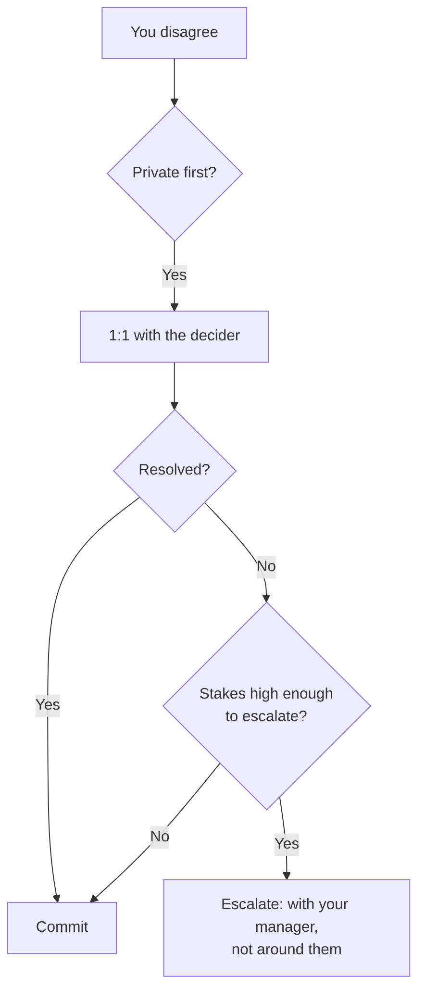

## Before you start

`technical-debt-decisions` shows how to build a case in business language. This topic is about what happens when you build it well and lose anyway.

## In one sentence

**Disagreeing with leadership** is the skill of pushing back hard enough that your objection actually lands, through the right channel, and then genuinely supporting the decision you lost — without either going quiet or going bitter.

## Why it matters

Every interviewer asks a version of "tell me about a time you disagreed with your manager", and almost every candidate answers it badly in one of two ways. Either they tell a story where they were right and eventually everyone realised it — which reads as arrogance and, suspiciously, never happens the other way round — or they describe an objection so mild it clearly changed nothing.

What is actually being tested is whether you are *safe to give authority to*. Someone who never disagrees is useless as a senior engineer, because leadership relies on being told when they are about to do something expensive. Someone who cannot let go after a decision is worse: they slow every project they lose an argument on.

## The intuition

Think of a jury deliberating. You argue your position hard while the verdict is open, because that is what the process is *for*. Once the verdict is delivered, continuing to relitigate it in the corridor does not change it — it just makes you the person nobody wants on the jury.

The two halves are inseparable. **Backbone without commitment** is obstruction. **Commitment without backbone** is compliance, and it quietly transfers all the risk to someone who did not have your information. Amazon bundled both into one leadership principle for exactly this reason: "leaders are obligated to respectfully challenge decisions when they disagree... once a decision is determined, they commit wholly."

## How it actually works

Before you object, work out **which kind of wrong** you think this is, because it changes everything downstream.

They may be wrong on *facts* — this is the easiest and most winnable, because facts can be checked. They may be wrong on *judgement* — same facts, different weighting of risk, and reasonable people genuinely differ here. Or they may be right on information you do not have, which is common enough that assuming it first will save you significant embarrassment.

Then the **channel**. Disagreement lands very differently depending on where you deliver it.



Private first, nearly always. A challenge in a group setting forces the other person to defend a position publicly, which hardens it — you have made it about status rather than the decision. The exception is a decision being made *in* that meeting where silence reads as consent; then you object in the room, but on the substance and briefly.

Escalation has a rule people break constantly: **escalate with your manager, not around them**. "I want to raise this with your director — can we go together, or would you rather take it?" is a normal professional sentence. Going behind them converts a technical disagreement into a trust problem, and you will lose the trust problem regardless of who was right about the technology.

Finally, calibrate. Not every disagreement is worth spending on. You have a finite budget of "I think this is a serious mistake" before it stops carrying weight, and senior engineers spend it deliberately — which mostly means letting the medium ones go so the big ones land.

## Worked example

Escalation criteria written down in advance, so you are not deciding how upset to be while upset.

```js
const disagreement = {
  topic: 'Ship customer data sync without encryption at rest',
  kindOfWrong: 'judgement',      // facts | judgement | they-know-more
  reversible: false,             // once customer data is written unencrypted, it stays
  domain: 'security',            // security | money | privacy | architecture | style
  myConfidence: 0.8,
  theirInformation: 'may know contractual constraints I do not',
};

function escalationLevel(d) {
  if (['security', 'money', 'privacy'].includes(d.domain) && !d.reversible) return 'escalate-formally';
  if (d.kindOfWrong === 'facts') return 'resolve-with-evidence';
  if (d.myConfidence > 0.7) return 'disagree-privately-then-commit';
  return 'ask-questions-first';
}

console.log(escalationLevel(disagreement));
// escalate-formally

console.log(escalationLevel({ ...disagreement, domain: 'architecture', reversible: true }));
// disagree-privately-then-commit
```

Output:

```
escalate-formally
disagree-privately-then-commit
```

The same strength of feeling produces two different actions depending on domain and reversibility. That is the point: your *conviction* is not the input that decides how far you push. An architecture decision you are 90% sure is wrong but which is reversible gets one clear private objection and then your full support. A security decision you are 60% sure about, that is irreversible, gets escalated formally even though you feel less strongly.

## A second example — when it gets harder

**Scenario 1 — the decision you cannot support quietly.** Your VP, Marcus, announces the team will migrate from Postgres to a document database next quarter. His reasoning: the schema changes are slowing the team down. You believe the actual bottleneck is that three services share one database and nobody owns the migration process — a problem the move does not solve and probably worsens. Two engineers have already told you privately they agree with you. Marcus has publicly committed to this in a leadership meeting.

*The naive answer:* raise it in the team meeting, backed by the two engineers who agree, and make the case in front of everyone.

*Why it fails:* you have turned a technical question into a public referendum on Marcus's judgement, one week after he staked his credibility on it upward. Even if you are right, he now cannot back down without cost, so he will not. And "two other people agree with me" reads as organising a faction, which is a much bigger deal to leadership than the database choice.

*What a senior engineer does:* books a 1:1 and opens with the question rather than the conclusion — "what problem is the migration solving?" Sometimes you learn he is under pressure from a customer commitment or a cost mandate you knew nothing about, and the whole objection dissolves. If the answer is "schema changes are slow", you now have a shared premise to argue from: propose measuring it. Take the last ten schema changes, show where the time actually went. If the data supports you, Marcus can change course citing new information rather than losing an argument, which is the difference between a decision he *can* reverse and one he cannot. If the data does not support you, you have learned something and spent nothing. The two engineers who agree with you are not evidence — send them to say it themselves in their own 1:1s, which is legitimate, or leave them out.

**Scenario 2 — overruled, and it fails exactly as you predicted.** Marcus proceeds. Five months in, the migration is late, two services are stuck dual-writing, and an incident is caused by a consistency gap that you specifically named in your objection. In the postmortem, Marcus asks you to present the timeline.

*The naive answer:* present it accurately, which — since you were right — inevitably lands as a slow-motion "I told you so", whether you intend it or not.

*Why it is a trap:* this is where people burn a year of goodwill in ten minutes. The facts are on your side, so it feels safe. It is not. Everyone in the room can see the subtext, including the people who supported the decision, and your reward for being right is that you become the person who is unpleasant to be wrong in front of.

*What a senior engineer does:* presents the technical timeline flatly, with no editorial, and puts the energy into the forward decision instead — is this recoverable, what is the cheapest path, what do we stop doing. Raise the *process* question separately and later, in private, framed at the system: "we made that call without a way to test the premise; can we agree on what evidence would have changed it, for next time?" That conversation is the one that actually changes future decisions. And notice what buys you the right to have it: the fact that you visibly helped for five months after losing. Commitment is what makes your disagreement credible next time — it is the deposit, not the concession.

**Scenario 3 — commitment has a floor.** Different case. Leadership decides to log full request bodies, including payment card data, to debug an integration issue. You object; you are overruled; you are told to implement it.

*What a senior engineer does:* recognises this is not a disagreement, it is a line. Disagree-and-commit covers judgement calls, not legal, regulatory, or ethical breaches — a decision that would put the company in violation of PCI rules is not yours to commit to. Put the objection in writing, escalate outside the chain to whoever owns compliance or security, and be explicit and calm about why: "I am not able to implement this as specified; here is the specific standard it breaches, and here are two alternatives that solve the debugging problem" — redacted logging, or a time-boxed capture in a restricted environment. Almost always there is a version that gets them what they need. Interviewers love this scenario because the naive answer — "I would refuse" — is directionally right but useless; the senior answer refuses *and* solves the underlying problem *and* routes it to the person whose job it is.

## Quick reference

| Situation | Action |
|---|---|
| Wrong on facts | Resolve with evidence, privately, fast |
| Wrong on judgement, reversible | One clear objection, then commit fully |
| Wrong on judgement, irreversible + money/security/privacy | Escalate formally, in writing, with your manager |
| You may lack context | Ask what problem it solves before objecting |
| Legal/ethical breach | Not a disagreement — written objection, escalate outside the chain, propose an alternative |
| Already decided publicly, low stakes | Let it go; save the budget |

## Common mistakes

- **Disagreeing in public first.** It forces a defensive position and makes the decision harder to reverse.
- **Escalating around your manager.** Converts a technical issue into a trust issue you will lose.
- **Bringing allies instead of evidence.** "Others agree" reads as organising; data reads as thinking.
- **Confusing commitment with agreement.** You can say "I still think this is risky, and I am fully on board" — that sentence is not a contradiction.
- **Spending the budget on everything.** If you object strongly to five things a quarter, none of them register.
- **The vindication story in interviews.** Prepare at least one disagreement where you turned out to be wrong; it is more convincing than three where you were right.

## What interviewers ask

- **Tell me about a time you disagreed with your manager.** — They are listening for the channel (private first), the evidence, and crucially what you did *after* losing. A story with no commitment phase is a red flag.
- **Tell me about a time you were overruled and it turned out badly.** — Testing for grace. The right answer contains no gloating and does contain a systemic fix.
- **When have you disagreed and later realised you were wrong?** — The most revealing question here. Have one ready; candidates who cannot produce one look like they do not update.
- **How do you decide something is worth escalating?** — Look for a rule stated in advance — domain and reversibility — rather than intensity of feeling.
- **What if you are asked to do something you believe is unethical?** — They want the line drawn clearly, the objection in writing, and an alternative proposed. Pure refusal without an alternative is a weaker answer than most people expect.

## Practice

1. Write your escalation rule as a single sentence: which domains and which conditions make you escalate regardless of confidence. Then test it against three disagreements from your last year.
2. Take a decision you lost. Write the one-paragraph record you should have written: what was known, what was chosen, by whom, and what evidence would change it. Notice how much less emotional the written version is.
3. Prepare the "I was wrong" story properly — what you argued, why you believed it, what changed your mind, and what you do differently now. Two minutes, out loud.

## Where to go next

`underperforming-teammate` moves the difficulty sideways: instead of disagreeing upward with someone who has authority, you are dealing with a peer, where you have none at all.
