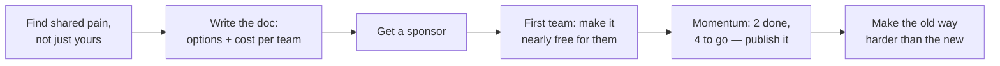

## Before you start

`mentoring-and-onboarding` covers influence with one person. `disagreeing-with-leadership` covers influence upward. This is the hardest version: sideways, across teams, at scale.

## In one sentence

**Leading without authority** is getting several teams to change what they are doing when none of them report to you, they all have their own roadmaps, and helping you makes their own quarter harder.

## Why it matters

This is the defining skill of the staff-plus engineer, and it is the thing most senior interviews are actually probing when they ask about a cross-team project. Will Larson's framing of the staff role is exactly this: achieving your goals in part through the work of others, without the org chart on your side.

It matters because the highest-value technical problems are almost always cross-cutting. Migrating off a deprecated service, standardising authentication, fixing a data model that four teams depend on — none of these belong to one team, which is precisely why they stay broken for years. Someone has to drive them, and that someone has no authority to.

## The intuition

Think about how a change actually gets adopted. You cannot make anyone do anything, so every team's participation has to be *in their interest* — or at least cheaper than not participating.

That reframes the whole problem. The question is not "how do I convince them?" It is "what does this cost them, and what does it give them?" A migration that gives Team A a week of work and no benefit will not happen no matter how good your argument is, and you being right about the architecture is not a force that moves anyone.

The strongest single tactic follows directly: **make participation cheap**. Do the hard part yourself. Write the migration script, do the first three services, produce a codemod, prepare their PR. An engineer asking a team for two weeks of work loses; the same engineer arriving with a PR that needs twenty minutes of review usually wins. This is unglamorous and it is most of the job.

## How it actually works

Start by finding out whether anyone else agrees the problem exists. A cross-team push with one believer is a hobby. Before proposing a solution, talk to two or three engineers on the affected teams and ask what *their* pain is — you frequently discover the problem you care about is a symptom of one they care about more, and that reframing is worth more than any amount of advocacy.

Then write it down. A short document — problem, options considered, recommendation, cost per team — does work you cannot do in meetings: it circulates when you are not there, it lets people object in writing rather than in a room where objecting is socially expensive, and it survives the reorg that happens midway through.

Get a **sponsor**. Not to command anyone, but because a manager or staff engineer who says "yes, this matters" in a planning meeting you are not invited to is often the entire difference. This is not politics; it is recognising that resourcing decisions get made in rooms you are not in.

Sequence for momentum. Pick the team most likely to say yes first — usually the one in the most pain — and make their migration genuinely easy. Then the second team is not being asked to take a risk on an idea; they are joining something already working. Three teams migrated is an argument that no document can make.



The last step is what makes changes stick. Voluntary migrations stall at about 70% and sit there forever, because the remaining teams have the least pain and the most excuses. You finish it by changing the defaults — the new service is what the scaffolding generates, the old library warns on import, the lint rule blocks new usage. Making the old path harder does what persuasion cannot.

## Worked example

A migration tracker as data. Publishing something like this weekly does more for adoption than any meeting.

```js
const migration = {
  goal: 'All services on the shared auth library v2',
  teams: [
    { team: 'Payments',   pain: 'high', effortDays: 2, migrated: true,  sponsor: true },
    { team: 'Search',     pain: 'high', effortDays: 3, migrated: true,  sponsor: false },
    { team: 'Notifications', pain: 'low', effortDays: 5, migrated: false, sponsor: false },
    { team: 'Reporting',  pain: 'low',  effortDays: 8, migrated: false, sponsor: false },
  ],
};

// Who to approach next: most pain, least effort, and I can reduce the effort.
function nextTarget(m) {
  return m.teams
    .filter(t => !t.migrated)
    .sort((a, b) => (b.pain === 'high' ? 1 : 0) - (a.pain === 'high' ? 1 : 0) || a.effortDays - b.effortDays)[0];
}

function progress(m) {
  const done = m.teams.filter(t => t.migrated).length;
  return `${done}/${m.teams.length} migrated — remaining effort ${
    m.teams.filter(t => !t.migrated).reduce((s, t) => s + t.effortDays, 0)} days`;
}

console.log(progress(migration));      // 2/4 migrated — remaining effort 13 days
console.log(nextTarget(migration).team); // Notifications
```

Output:

```
2/4 migrated — remaining effort 13 days
Notifications
```

Two useful things here. `progress` published weekly creates gentle, factual pressure — nobody wants to be the last row, and no one has to be nagged. And `effortDays` is the number you can personally change: dropping Reporting's eight days to two by writing their migration yourself is far more effective than eight more meetings about why the migration matters.

## A second example — when it gets harder

**Scenario 1 — the migration nobody wants.** Six services use a homegrown auth library with a known session-fixation weakness. You want everyone on the shared v2 library. You are a senior engineer on Payments; the other five teams have full quarters. You send a well-argued document to all six teams. Two reply politely. Nothing happens for a month.

*The naive answer:* escalate — get a director to mandate the migration.

*Why it fails:* mandates without buy-in produce the worst outcome available. Teams comply minimally, do it badly, resent you, and the next thing you need from them is much harder to get. A mandate also does not solve their actual constraint, which is that their quarter is full and this is not on it.

*What a senior engineer does:* stops broadcasting and starts talking to individuals. One conversation with an engineer on each team, asking what would make this easy and what it collides with. You will learn things the document could not surface — Search already has an auth bug they cannot fix and would love a reason to move; Reporting's service is being decommissioned in two quarters, so migrating it is genuinely wasted work and you should exclude it, which costs you nothing and buys enormous credibility. Then do Payments (yours) and Search first, write the migration guide from those two, and reduce the next team's cost to a reviewable PR. Publish the tracker. Escalation comes *later* and looks different: not "mandate this", but going to the director with "four of six are done, the remaining two need a week each — can it go on their Q3 plan?" That is a request a director can grant easily because you have already removed all the risk.

**Scenario 2 — the team that says no.** Notifications refuses. Their lead, Ben, says his team has a customer commitment this quarter, he does not believe the session-fixation issue is exploitable in his service, and he is tired of platform work landing on his team. He is partly right — his service has no browser sessions, so the specific weakness genuinely does not apply.

*The naive answer:* insist on consistency. Everyone must be on v2 or the migration is not done.

*Why it fails:* your goal was security, and you have quietly substituted tidiness. Ben's objection is technically sound and he knows it, so pushing makes you the person who does not listen — which costs you Reporting too, since Ben talks to their lead.

*What a senior engineer does:* concedes the technical point immediately and openly, which is disarming and correct. Then separates the two things bundled inside "no": the security case (does not apply to him — fine) and the maintenance case (the old library will be unowned, and in a year he will be the only consumer of a dead dependency, which is *his* problem, not yours). Offer a timeline that fits his constraint rather than yours: not this quarter, next, and you will write the PR. Also hear the real complaint — "platform work keeps landing on us" is a legitimate grievance about how work is allocated, and acknowledging it, or raising it with his manager on his behalf, buys more goodwill than winning the argument would. If he still declines, accept it and keep him on the tracker with a note. Forcing a peer team is not available to you, and pretending otherwise is how people burn their influence in the first six months.

**Scenario 3 — someone else takes it over.** Four months in, four of six teams are done. A newly hired staff engineer, Claire, is given "platform consolidation" as her remit and presents the auth migration in an engineering all-hands as her workstream. Your name is not mentioned. Two colleagues notice and are annoyed on your behalf.

*The naive answer:* correct the record publicly, or say nothing and quietly disengage.

*Why both fail:* the public correction makes you look territorial about something that was never yours to own, in front of everyone, and it makes Claire an adversary in the one project you both care about. Silent disengagement kills a migration that is 70% done and leaves the security issue live — the outcome you were originally trying to prevent.

*What a senior engineer does:* goes to Claire directly and privately, with the offer rather than the grievance: here is the tracker, here are the two remaining teams and why each has stalled, here is the context on Ben. If she now has the mandate and the resourcing, that is genuinely better for the outcome — you wanted the migration done, not credit for it. Then handle visibility separately and unemotionally: make sure your manager knows what you did, in writing, before performance review season. That is not politics, it is the documentation your manager needs to advocate for you in a calibration meeting you will not attend. Interviewers ask this variant because it separates people motivated by the outcome from people motivated by ownership, and the difference shows up instantly in how you answer.

## Quick reference

| Obstacle | What works | What does not |
|---|---|---|
| No one thinks it is a problem | Find shared pain in *their* terms first | A better-argued document |
| Teams have full roadmaps | Reduce their cost to a PR review | Asking for two weeks |
| Nobody starts | Do the first two migrations yourself | Waiting for volunteers |
| Stalls at 70% | Change defaults; make the old way harder | More reminders |
| A team refuses | Separate valid objection from grievance; offer a later slot | Escalating for a mandate |
| Not invited to the planning room | Get a sponsor who is | Complaining about the room |
| Someone else takes credit | Hand over the context; tell your manager in writing | Correcting the record publicly |

## Common mistakes

- **Leading with the solution.** Nobody adopts your answer to a problem they have not agreed they have.
- **Asking for effort instead of removing it.** The winning move is arriving with the PR.
- **Broadcasting instead of talking to people.** A document to six teams generates polite silence; six conversations generate two allies.
- **Escalating for a mandate early.** It produces minimal compliance and burns the relationship you need next quarter.
- **Refusing to grant a valid exception.** Insisting on consistency where the technical case does not apply reveals you care about tidiness, not the goal.
- **Confusing the goal with owning the goal.** If someone better resourced can finish it, the migration finishing is the win.
- **No visible progress.** A weekly tracker does more than a monthly meeting.

## What interviewers ask

- **Tell me about a time you drove a change across teams with no authority.** — Listening for: did you find shared pain, did you reduce others' cost, did you have a sponsor, and did it actually finish.
- **A team refuses to participate. What do you do?** — They want you to distinguish a valid technical objection from a resourcing complaint, and to know that forcing is not available.
- **How do you get something on another team's roadmap?** — Good answers involve their planning cycle and their manager, well ahead of time, with the cost already minimised — not a request mid-quarter.
- **Your migration stalled at 70%. Now what?** — The default-changing answer: scaffolding, lint rules, deprecation warnings. Persuasion has already extracted everyone it will move.
- **Someone else got credit for your work.** — A character question. Outcome-first answers, plus handling visibility through your manager rather than publicly, are what they hope to hear.

## Practice

1. Pick a cross-cutting problem you can see right now. Write the one-page doc: problem, two options, recommendation, and cost per affected team. The cost column is the hard part and the one that matters.
2. For the team you would approach first, list three specific things you could do to cut their effort in half. Then do one of them before asking.
3. Draft the weekly progress update — teams done, teams remaining, effort left — in under 60 words, factual and with no nagging in it.

## Where to go next

You have finished the situational chapter. Return to `mock-interviews-behavioral` and run these scenarios out loud under time pressure — reading a dilemma and answering one live are different skills, and only the second one is assessed.
