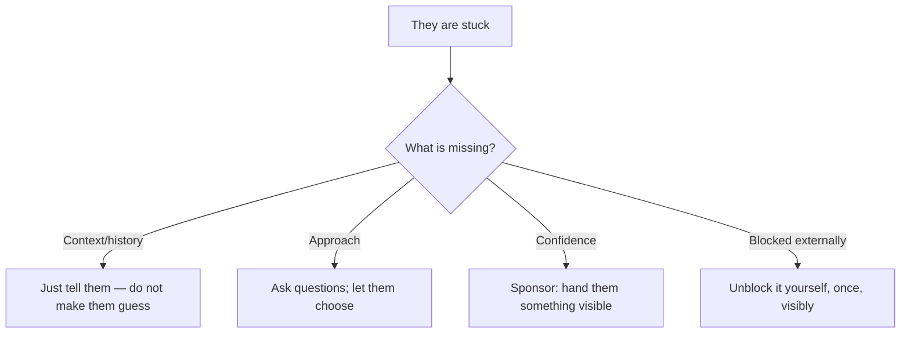

## Before you start

`code-review-conflicts` is useful first — review is where most mentoring actually happens, and where most of it goes wrong.

## In one sentence

**Mentoring as an IC** is deliberately increasing another engineer's capability — through pairing, review, onboarding, and sponsorship — without any authority over them and without doing their work for them.

## Why it matters

Senior and staff interviews assess this even for pure individual-contributor roles, and candidates are consistently caught out by it. The reasoning is simple: an engineer who makes four people 20% more effective has delivered more than one who is 50% faster alone, and companies promote for leverage.

Onboarding is the sharpest case. New engineers ramp in weeks or in months depending almost entirely on who is around them, and the difference compounds across every hire the team makes. It is also the single highest-leverage thing a mid-level engineer can do that nobody has asked them to do.

## The intuition

The failure mode is easiest to see in a driving lesson. The instructor who grabs the wheel every time the car drifts produces a student who cannot drive. The one who lets the car hit a kerb at 15mph produces one who can — because the recovery is the lesson, and the kerb is cheap.

Good mentoring is mostly **calibrating the size of the mistake you allow**. Let them ship the imperfect abstraction and refactor it in a month; do not let them drop the production table. Every intervention you make is a lesson you have taken away from them, so the question before you jump in is always: what does this mistake actually cost, and is that less than the learning?

The second idea is a distinction Will Larson draws sharply. **Mentoring** is giving advice. **Sponsorship** is spending your own credibility on someone — putting their name forward for the visible project, letting them present the design review you could have presented. Mentoring is comfortable and cheap. Sponsorship is what actually changes careers, and it costs you something, which is precisely why it counts.

## How it actually works

Onboarding has a structure worth knowing because interviewers ask "how would you onboard a new hire?" and most candidates answer with a documentation wish-list.

The best first task is small, real, and shippable in days — not a toy, because toys teach nothing about your systems, and not a large project, because a new hire needs to complete the full loop (write, review, merge, deploy, observe) before they need to hold a big design in their head. Ship-on-day-three beats understand-the-architecture-in-week-three.

Pair with them on that first task rather than assigning it. What you are transmitting is not the code — it is the invisible layer: which Slack channel to ask in, which test suite is flaky, which service is owned by whom, why that module has a comment saying "do not touch". None of that is in the docs, and asking a new hire to discover it alone costs weeks.

And have them fix the docs as they go. They are the only person who can see what is missing; in two months they will have the same blindness everyone else has.

For the mentoring itself, the useful discipline is matching your response to what they actually need.



The top branch matters. Socratic questioning is over-applied — when someone lacks a *fact* they could not possibly know ("why does this service have two caches?"), asking them leading questions is not teaching, it is a quiz they will fail and resent. Save the questions for approach and design, where the thinking is the point.

## Worked example

An onboarding plan as data, and the escalating-support rule that keeps you from doing their work.

```js
const onboarding = {
  day1: ['laptop + access', 'run the app locally', 'meet 3 people by name'],
  day2: ['pick up a small real bug', 'pair 60 min on it'],
  day3: ['ship it to production'],            // the full loop, early
  week2: ['own a small feature', 'fix one doc gap they hit'],
  week4: ['review someone else\'s PR', 'on-call shadow'],
  week8: ['lead a small design discussion'],   // sponsorship starts here
};

// How long to let them struggle before you step in.
const SUPPORT = [
  { minutesStuck: 30, action: 'let them work; struggle is the learning' },
  { minutesStuck: 60, action: 'ask what they have tried; hint at the area' },
  { minutesStuck: 120, action: 'pair — but their hands on the keyboard' },
  { minutesStuck: 240, action: 'unblock it directly; the cost now exceeds the lesson' },
];

function supportFor(minutes, isProductionRisk) {
  if (isProductionRisk) return 'intervene immediately — this mistake is too expensive';
  return SUPPORT.filter(s => minutes >= s.minutesStuck).pop()?.action ?? SUPPORT[0].action;
}

console.log(supportFor(45, false));   // let them work; struggle is the learning
console.log(supportFor(150, false));  // pair — but their hands on the keyboard
console.log(supportFor(10, true));    // intervene immediately
```

Output:

```
let them work; struggle is the learning
pair — but their hands on the keyboard
intervene immediately — this mistake is too expensive
```

"Their hands on the keyboard" is the line that carries the most weight. The instinct when pairing with someone stuck is to take over and type — it is faster, and it feels helpful. It also guarantees they cannot do it next time. Ask them to drive and narrate; you can still say every word you would have typed.

## A second example — when it gets harder

**Scenario 1 — the mentee who wants answers, not help.** You are mentoring Alex, three months in. He is capable but messages you five or six times a day with questions he could answer in fifteen minutes of digging. You reply quickly because it is easy and he is grateful. Your own tickets are slipping, and after three months he is asking the same *kind* of question he asked in week two.

*The naive answer:* keep answering — he is learning and it is what a good mentor does. Or the opposite: tell him to figure it out himself.

*Why both fail:* fast answers are a trap that feels like generosity. You have made yourself the fastest path to a solution, so Alex has never built the muscle of investigating — you have optimised for his comfort and against his growth. But refusing outright just removes his support and teaches him not to ask, which is worse in a different direction.

*What a senior engineer does:* changes the *shape* of the help rather than its volume. Say it out loud so it is not a confusing withdrawal: "I have noticed I am answering things you could find, and I do not think that is helping you. Let us try this — before you ask, spend fifteen minutes and tell me where you looked. I will point you at the right place rather than give the answer." Then batch it: a standing thirty minutes a day where questions get answered, which cuts your interruptions and, unexpectedly, cuts his questions, because half of them resolve while he waits. Where he genuinely lacks context nobody could infer — team history, why a service exists — keep answering immediately, because making him hunt for unknowable facts is cruelty dressed as pedagogy.

**Scenario 2 — the mentee who is drowning and hiding it.** Different person. Maya, six weeks in, says "all good" every standup. Her first PR has been open for two weeks with no commits in five days. She is quiet in meetings. You suspect she is stuck and does not want to admit it — and you know she was the only person hired from a non-traditional background onto this team.

*The naive answer:* wait for her to ask for help. She is an adult, you do not want to patronise her, and asking is her responsibility.

*Why it fails:* the people least likely to ask are the ones most in need, and the reluctance usually rises with how much someone feels they have to prove. "Ask if you need anything" is a policy that systematically fails exactly the people it needs to reach. Two weeks of a stalled PR is data; you already know.

*What a senior engineer does:* removes the need to ask by making help routine and non-diagnostic. Do not open with "are you struggling?" — that requires her to confess. Instead: "I am going to grab thirty minutes on that PR with you, I want to look at the caching bit anyway." Now she gets help without having requested it, and you find out what is actually wrong. Normalise your own confusion loudly while you are there — narrating "I have never understood why this service does that, let me look it up" does more for someone's willingness to ask than any invitation. Then remove the structural cause: if a two-week PR could go unnoticed, that is a team problem, and a standing review rotation fixes it for the next person too.

**Scenario 3 — mentoring someone more senior than you.** You have been on the payments team two years. A new hire, Daniel, joins with twelve years of experience and a much stronger CV. He is redesigning a component in a way you know will hit a problem — a rate limit on a downstream provider that is not documented anywhere and that bit the team last year. You have raised it once; he said his approach handles it.

*The naive answer:* defer. He is far more experienced, and you would look presumptuous insisting.

*What a senior engineer does:* separates expertise from **context**, which is the whole scenario. Daniel is a better engineer than you; you know something he cannot possibly know. Those are not in conflict, and the framing that works says so explicitly: "you know this pattern much better than I do — the thing I am worried about is specific to our provider. We hit their undocumented 50-per-second cap last March and it took a week to diagnose. Can I show you the incident doc?" Evidence, not authority. If he still disagrees after seeing it, he may well be right, and you have done your job by making the information available. The reciprocal move is what makes this a mentoring scenario rather than a disagreement: your onboarding of Daniel is precisely this — transferring context — while you learn the pattern expertise from him. Interviewers ask this because a lot of people either defer entirely to seniority or overcorrect into territorialism.

## Quick reference

| Situation | Do | Do not |
|---|---|---|
| Missing context they could not know | Tell them directly | Socratic questioning — it is a quiz they lose |
| Stuck on approach | Ask what they tried; let them decide | Hand over your design |
| Stuck > 2 hours | Pair, their hands on the keyboard | Take over and type |
| About to make a cheap mistake | Let it happen | Prevent it and remove the lesson |
| About to make an expensive mistake | Intervene immediately | "Learning experience" on production data |
| Quiet, not asking for help | Offer routinely, without diagnosis | Wait for them to ask |
| Ready for more | Sponsor: visible work with their name on it | Keep advising from a distance |

## Common mistakes

- **Doing the work for them.** The fastest way to look helpful and produce nothing durable.
- **Answering instantly, always.** It makes you the shortest path to an answer and stops them building investigation skills.
- **Socratic questioning for facts.** Reserve it for design; for history, just tell them.
- **Waiting to be asked.** The people who most need help are the least likely to ask.
- **Mentoring without sponsorship.** Advice is cheap; putting their name on visible work is what moves a career.
- **A first task that is a toy.** It teaches nothing about the real system and delays the first real ship.
- **Onboarding docs written by people who have been there two years.** They cannot see what is missing; the new hire can.

## What interviewers ask

- **How would you onboard a new engineer onto your team?** — They want a concrete week-by-week shape with an early real ship, not "good documentation and be welcoming".
- **Tell me about someone you mentored. What changed for them?** — The follow-up is the real question: what did *they* achieve. If your answer is only about what you taught, it is incomplete.
- **How do you know when to step in and when to let someone struggle?** — Look for a cost-of-the-mistake rule, not a time-based one alone.
- **What is the difference between mentoring and sponsorship?** — A senior-signal question. Advice versus spending your credibility on someone's behalf.
- **How do you mentor someone more experienced than you?** — Tests whether you can distinguish expertise from context, and whether you use evidence rather than territorial claims.

## Practice

1. Write the first-week plan for a new hire on your current team, with a specific first ticket that could ship by day three. If you cannot name one, that is a finding about your backlog.
2. Next time someone asks you a question you could answer in a sentence, ask what they have tried first — then notice how often they solve it while explaining.
3. Identify one visible opportunity you could hand to someone less senior — a design review, a demo, an incident writeup — and hand it over this month. That is sponsorship, and it is the exercise most people skip.

## Where to go next

`leading-without-authority` scales the same influence problem from one person to a whole organisation — driving a change across teams where nobody has to listen to you at all.
