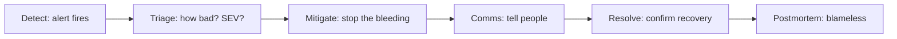

## Before you start

Nothing technical. It helps to have seen a deploy pipeline and to know what a rollback is, but the interview tests judgement, not tooling.

## In one sentence

**Incident response** is the practice of restoring a broken production service quickly and calmly — deciding what to fix first, who is in charge, what to tell people, and what to learn afterwards — under time pressure and with incomplete information.

## Why it matters

Every company with users has outages. What separates a five-minute blip from a four-hour disaster is almost never technical skill; it is whether anyone declared the incident, whether one person was clearly in charge, and whether the responders resisted the urge to find the perfect fix instead of the fast one.

Interviewers ask about incidents because the situation strips away your preparation. You cannot rehearse an outage. What you say reveals whether you *actually* prioritise users over your own ego, and whether you know that the fix and the root cause are two separate jobs.

## The intuition

Think of an emergency room. A patient arrives bleeding. The doctor does not open with "let us determine the underlying cause of this haemorrhage" — they stop the bleeding first, stabilise, and *then* investigate. Diagnosis is a luxury you buy with stability.

Production incidents work identically. **Mitigation** (make users stop hurting) and **root cause** (understand why) are different phases with different goals, and the single most common failure is doing them in the wrong order — debugging a fascinating bug for forty minutes while checkout stays down.

The second half of the analogy: in an ER, someone is visibly in charge. Not the most skilled surgeon necessarily — someone whose only job is coordination. That role has a name in incident response too.

## How it actually works

An incident runs in phases, and each has a different question.



**Triage** assigns a severity. Severity is not a judgement of how interesting the bug is — it is a measure of user pain, usually a percentage of users or revenue affected. PagerDuty's rule is the useful one: when you cannot decide between two levels, pick the *higher* one and downgrade later. An incident is not the moment to litigate severity.

**Roles** matter more than people expect. The Google SRE model separates the **Incident Commander** (decides, delegates, owns the incident — and deliberately does *not* debug), the **Operations lead** (the person actually typing), and the **Communications lead** (updates the status page and stakeholders). At 3am with three people awake, one person may hold two hats — but the commander should never also be the person head-down in a stack trace, because a debugging brain cannot track the clock.

**Mitigation beats diagnosis.** Roll back, failover, disable the feature flag, shed load. Any of these is better than a clever forward fix you wrote at 3am and cannot test.

**Comms** are the part engineers skip and interviewers notice. A short, honest update every 20–30 minutes — even "no update yet, still investigating, next update at 04:15" — prevents the far worse failure mode where five executives independently DM the responder and slow the fix down.

**The postmortem** comes after, and is **blameless**: it focuses on the contributing causes without indicting a person. Not because blame is unkind, but because it is *useless* — you cannot fix a person, and if people fear the postmortem they will hide the information you need.

## Worked example

Here is a real severity matrix as data. This is the kind of artefact you can point to in an interview to show you have thought about the mechanics, not just the vibes.

```js
const SEVERITY = [
  { sev: 'SEV1', impact: 'Payments down, or >50% users blocked',
    page: 'wake everyone', commander: 'required', comms: '15 min', publicStatus: true },
  { sev: 'SEV2', impact: 'Core feature broken, workaround exists',
    page: 'on-call + lead', commander: 'required', comms: '30 min', publicStatus: true },
  { sev: 'SEV3', impact: 'Degraded, <5% users, or internal only',
    page: 'on-call only', commander: 'optional', comms: '60 min', publicStatus: false },
  { sev: 'SEV4', impact: 'Cosmetic or single-tenant', 
    page: 'next business day', commander: 'no', comms: 'ticket', publicStatus: false },
];

// The rule that matters: ambiguity rounds UP, never down.
function classify(usersAffectedPct, revenueBlocked) {
  if (revenueBlocked || usersAffectedPct > 50) return SEVERITY[0];
  if (usersAffectedPct > 5) return SEVERITY[1];
  if (usersAffectedPct > 0) return SEVERITY[2];
  return SEVERITY[3];
}

console.log(classify(3, true).sev);   // SEV1 — revenue blocked outranks the small user count
console.log(classify(12, false).sev); // SEV2
```

Output:

```
SEV1
SEV2
```

The interesting line is the first one: only 3% of users are affected, but payments are among them, so it is a SEV1. A matrix that keys purely on user count would have called that a SEV3 and let it burn overnight. Whatever framework you describe, be ready for the interviewer to attack it with a case like this.

## A second example — when it gets harder

**Scenario 1 — "The 3am Outage."** It is 03:12. You are on call. Payments have been failing for 8 minutes; roughly 4% of checkout attempts, climbing. The only change in the last 12 hours is a deploy at 22:40 by a teammate, Priya, who is asleep. That deploy included a database migration that added a column and backfilled it. Rolling back the code is one command. Rolling back the *migration* is not — the backfill wrote data the old code does not understand, and nobody is sure whether the old code will crash or silently corrupt rows.

*The naive answer:* "I roll back immediately — rollback is always the safest option."

*Why it fails:* it is not a rollback here, it is a schema change in reverse with unknown data semantics. You could turn a 4% payment failure into 100% corruption. "Always roll back" is a rule that works right up until the deploy included a migration, which is exactly when incidents get bad.

*What a senior engineer does:* separate the code rollback from the schema. Ask first: **is there a mitigation that touches nothing?** Check whether the failing path can be feature-flagged off, or traffic routed to the previous version for the payment service only. Then read the migration to determine whether it is *forward-compatible* — if the new column is nullable and the old code never reads it, rolling back the code alone is safe and the column can stay. That reading takes four minutes and is worth every second. Meanwhile you post a comms update and you wake Priya — not to blame her, but because the person who wrote the backfill can answer the safety question in 30 seconds instead of your 30 minutes. Waking a colleague during a SEV1 is not rude; hesitating to wake them because you feel awkward is the actual failure.

**Scenario 2 — the fix that makes it worse.** 03:40. You disabled the failing payment provider and routed everything to the backup provider. Checkout recovers. At 04:20 the backup provider starts rate-limiting you — it was never sized for 100% of traffic — and now checkout is down *completely*, worse than the original 4%.

*The naive answer:* panic, revert the mitigation, and start over.

*What a senior engineer does:* recognises that every mitigation is itself a change that can cause an incident, and that the right response is to *narrow* it, not undo it. Route only the failing subset (the specific card type, region, or merchant) to the backup, leaving the rest on the primary. This is also the moment to escalate: you have now been up for 70 minutes, you have made two changes under pressure, and your judgement is measurably worse than it was at 3am. Handing over — or even just pulling in a second pair of eyes — is a senior move, not an admission of failure.

**Scenario 3 — the postmortem.** In the review, the VP of Engineering says: "So the root cause is that Priya deployed a migration on a Friday night without testing the rollback path."

*The naive answer:* agree, because they are the VP and Priya is not in the room.

*What a senior engineer does:* reframes without contradicting the facts. "Priya followed the deploy process exactly as written. The process let a migration ship without a documented rollback plan, and our staging database has 400 rows so the backfill took 90ms there and 40 seconds in production. If we replace Priya with any other engineer on the team, the same outage happens." That sentence — *would this have happened to anyone else?* — is the sharpest test of blamelessness, and it is genuinely persuasive because it points at fixes: a required rollback plan in the deploy checklist, and staging data volumes that are not a toy.

## Quick reference

| Phase | The question | Do | Do NOT |
|---|---|---|---|
| Triage | How much user pain? | Round severity up | Debate SEV levels mid-incident |
| Mitigate | Fastest safe path to "working"? | Roll back, flag off, failover | Write a new fix at 3am |
| Comms | Who is anxious right now? | Update on a fixed clock | Go silent while heads-down |
| Resolve | Is it *actually* better? | Verify with metrics, not vibes | Declare victory on one green request |
| Postmortem | What made this possible? | Fix systems and defaults | Name a person as the cause |

## Common mistakes

- **Debugging before mitigating.** The root cause is not going anywhere; the users are.
- **The commander also debugging.** The moment you open a stack trace you stop tracking time, severity, and stakeholders.
- **Silence.** Engineers go quiet when they are working hard; from outside, silence reads as "nobody is on it" and triggers an escalation storm that costs you more time than the update would have.
- **Treating rollback as automatically safe.** With schema migrations, stateful queues, or cache format changes, backwards is a change too.
- **Postmortem action items with no owner or date.** A list of good intentions is how the same outage happens twice.
- **In the interview, telling the story as a hero narrative.** "I stayed up all night and fixed it myself" is a worse answer than "I escalated at 40 minutes and we fixed it in 20."

## What interviewers ask

- **Walk me through the last time production broke on your watch.** — They want the *sequence*: detect, triage, mitigate, communicate, learn. If you jump straight to the technical root cause, you have shown them you would do the same at 3am.
- **When would you NOT roll back?** — Testing whether "rollback" is a reflex or a decision. Good answer: when the deploy included an irreversible data migration, when the previous version has a known worse bug, or when rollback takes longer than the forward fix you already have tested.
- **You are 40 minutes in and stuck. What now?** — They are testing escalation. The right answer involves a clock: senior engineers set a time box before they start ("if I have not mitigated by 03:45, I page the database team") rather than deciding in the moment when they are least able to judge.
- **Who decides an incident is over?** — Tests whether you know that recovery is measured, not felt. Error rate back to baseline and held there, not one successful request.
- **Your postmortem concludes it was human error. Is that a valid root cause?** — Almost never. "Human error" is where an investigation stops too early; ask what made the error easy to make and hard to catch.

## Practice

1. Write the severity matrix for a product you know well — pick real thresholds. Then have a friend invent three incidents designed to break your thresholds, and adjust.
2. Take an outage you were near and write a blameless postmortem: timeline, impact in user-minutes, contributing causes, and three action items each with an owner. Remove every name from the causes section without losing accuracy.
3. Role-play the escalation: you are 25 minutes into a SEV1 with no mitigation. Write the exact Slack message you would send to wake a staff engineer — under four sentences, including what you have ruled out.

## Where to go next

`shipping-under-pressure` is the same judgement one step earlier in time: instead of deciding how to fix a broken system, you decide whether to ship the thing that might break it.
