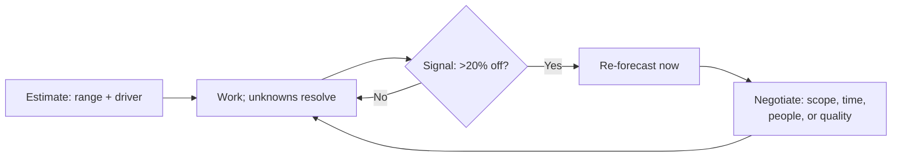

## Before you start

Nothing technical required. `shipping-under-pressure` covers the endgame of a deadline; this covers the three weeks before it, when the deadline is quietly becoming impossible.

## In one sentence

**Scope creep and estimate overruns** are the normal condition of software projects — the skill is not estimating perfectly, it is noticing you are wrong early and renegotiating in a way that keeps people trusting your next number.

## Why it matters

Your estimates will be wrong. Steve McConnell's **cone of uncertainty** puts early-stage estimates off by a factor of up to four in either direction — a 16x spread at the moment of initial concept — and that is not incompetence, it is a property of estimating work you have not done yet.

Since being wrong is inevitable, interviewers are not testing your accuracy. They are testing what you do at the moment you *realise* you are wrong. The two failure modes are famous: the engineer who says "on track" every week until the deadline, and the engineer who blows up the plan in a panic. Both destroy the thing that actually matters, which is that people can plan around what you tell them.

## The intuition

The cone of uncertainty has a shape that explains almost everything about this topic. At the start of a project the range is enormous. It narrows *only as you make decisions that remove variability* — not as time passes.

That last clause is the part people miss. Sitting inside a project for three weeks does not narrow the cone; answering questions does. Which means an estimate given before you know whether the third-party API supports batch operations is not really an estimate at all, and the single most useful thing you can do at the start is identify the two or three unknowns whose answers move the number most, then go answer them.

The other half: a deadline is not one variable. Every project has four — **scope, time, people, quality** — and when one moves, at least one other must. The trap is that quality moves silently by default. If nobody chooses, the project absorbs the overrun by shipping something worse, and nobody ever explicitly agreed to that.

## How it actually works

Estimate as a **range with an explicit driver**, not a point. "Three weeks" hides everything. "Two to five weeks — the spread depends entirely on whether the vendor API supports bulk export; I can find out in a day" tells your PM the number *and* how to shrink it. Point estimates get treated as commitments; ranges with drivers get treated as information.

Then **re-forecast on evidence, not on a calendar**. The moment you learn something that changes the number — the API does not support bulk, the legacy schema has three undocumented states, the migration takes 40 minutes not 40 seconds — is the moment to say so. Waiting for the next status meeting is a choice to let someone plan on data you know is wrong.

There is a bad-news rule that matters more than any estimation technique: **the cost of late news is superlinear**. Telling your PM in week two that you will slip by two weeks gives them options — cut scope, add a person, move the date, tell the customer early. Telling them in week five gives them none, and the damage to your credibility comes almost entirely from the delay, not the slip.



**Scope creep** is the other half, and it is mostly a bookkeeping failure. Requests arrive one at a time, each individually small, each easy to say yes to. Nobody ever agreed to a 40% larger project; it accumulated in twelve conversations. The fix is not saying no — it is making each addition visible with a price attached at the moment it arrives: "yes, that is about three days; it fits if we drop the CSV export, or it moves the date to the 14th. Which do you prefer?" You are not refusing, you are refusing to absorb it silently. Almost half of such requests are withdrawn once they have a price.

## Worked example

A re-forecast, computed rather than felt.

```js
const project = {
  originalEstimateDays: 15,
  daysElapsed: 9,
  plannedPctAtThisPoint: 60,
  actualPctComplete: 25,
  scopeAdded: [
    { item: 'CSV export', days: 3 },
    { item: 'Audit log for edits', days: 2 },
  ],
};

function reforecast(p) {
  const velocityRatio = (p.actualPctComplete / 100) / (p.daysElapsed / p.originalEstimateDays);
  const baseProjected = p.originalEstimateDays / velocityRatio;
  const creep = p.scopeAdded.reduce((s, x) => s + x.days, 0);
  return {
    velocityRatio: +velocityRatio.toFixed(2),
    projectedDays: Math.round(baseProjected + creep),
    overrunFactor: +((baseProjected + creep) / p.originalEstimateDays).toFixed(1),
    daysFromCreep: creep,
  };
}

console.log(reforecast(project));
```

Output:

```
{ velocityRatio: 0.42, projectedDays: 41, overrunFactor: 2.7, daysFromCreep: 5 }
```

Two things this gives you that a gut feeling does not. First, the overrun is **2.7x**, and you can see it on day nine rather than day fourteen — the velocity ratio of 0.42 is a signal available long before the deadline. Second, it separates the causes: five of the twenty-six extra days are scope you accepted, and the rest is a bad original estimate. Those are different conversations with different fixes, and merging them into one apology loses both.

## A second example — when it gets harder

**Scenario 1 — "the 3x."** You estimated fifteen days for a reporting feature. It is day nine and you are roughly a quarter done. The legacy schema has undocumented states you did not know existed, and the reporting library does not handle the timezone case at all — you will have to write that yourself. Your PM, Nadia, has told a customer the feature ships in three weeks. She asks in standup how it is going.

*The naive answer:* "Going well, still on track" — because you might still catch up, and you do not want to be the person who slips.

*Why it fails:* you almost certainly will not catch up (0.42 velocity does not double), and you have spent Nadia's remaining options. In two weeks she cannot warn the customer early, cannot cut scope in time, cannot get help. The credibility damage is not from being wrong about fifteen days; it is from being the person whose status reports are worthless.

*What a senior engineer does:* re-forecasts that day, and brings the conversation in three parts. What changed and why the original number was wrong — specifically, not "it was harder than expected" but "the schema has three states we had no record of, and the library does not do timezones." The new range with its remaining uncertainty. And then options, priced: full scope at roughly six weeks; ship reporting without timezone-correct rollups in three weeks and follow up; or bring in a second engineer, which helps only on the export half because the schema work does not parallelise. That last honesty matters — offering "add a person" as a fix for work that cannot be split is how you get a person added *and* still slip. Then say what you will do differently: you will spike the unknown integration first next time, which is the concrete version of "I learned from this."

**Scenario 2 — the creep you already accepted.** Reviewing why you are behind, you notice five of the extra days came from requests you said yes to in Slack: a CSV export, an audit log. Each took ten seconds to agree to. Nadia does not remember asking for either, and genuinely believes the project is just late.

*The naive answer:* raise it defensively — "well, you added scope" — which sounds like blame-shifting and is unprovable if it lived in DMs.

*What a senior engineer does:* separates the two causes without weaponising either. "Twenty-one days of this is my estimate being wrong. Five days is the export and the audit log — those were good additions and I said yes without pricing them, which is on me. Going forward I will bring changes to you with a cost so we can decide together." Owning the *process* failure rather than pointing at the requester is what makes this land, and it fixes the actual problem: the requests were never the issue, the silent absorption was. Then make it structural — a visible list of accepted changes with day costs, so the twelfth request arrives in a room where the previous eleven are on screen.

**Scenario 3 — the estimate you are asked to shrink.** Before the project. You say six weeks. Your director says the customer commitment is four, and asks what you can do to hit it. There is no new information — just pressure.

*The naive answer:* say four. It ends the meeting pleasantly and you will find a way.

*Why it fails:* an estimate that changes because of pressure rather than information is not an estimate, and everyone learns your numbers are negotiable — which means next time they will start the negotiation lower. You have also made yourself solely responsible for a gap you did not create.

*What a senior engineer does:* holds the estimate and moves a different variable, out loud. "Six weeks is what this scope costs. To hit four: we can cut the audit log and the bulk import, which gets it to about four and a half; or add an engineer for the export half, which is genuinely parallelisable; or ship at four with the migration behind a flag for internal users only and go external at six." You have not said no. You have said the four variables cannot all be fixed simultaneously and offered them the choice, which is their job — deciding what to trade — and not yours. Interviewers probe this one because a lot of engineers cave here, and caving on estimates is the origin of most death marches.

## Quick reference

| Signal | What it means | Action |
|---|---|---|
| Velocity ratio < 0.7 at 30% elapsed | You are on a real overrun, not a bad week | Re-forecast now |
| A key unknown resolved badly | The cone did not narrow the way you assumed | Re-forecast now |
| Third small request this week | Creep is accumulating invisibly | Price each one, keep a visible list |
| Asked to shrink with no new information | Pressure, not evidence | Hold the number, offer scope/people/quality trades |
| Slipping and unsure of the size | Uncertainty is not a reason to wait | Report the range and the date you will know |

## Common mistakes

- **Point estimates.** They get heard as commitments and they hide the driver that would let someone shrink them.
- **Waiting for the status meeting.** Bad news costs superlinearly with delay; the meeting is not a deadline for honesty.
- **Absorbing scope silently.** Nobody agreed to a 40% bigger project; it arrived in twelve pieces with no price tags.
- **Letting quality be the silent variable.** If no one chooses, the overrun comes out of testing and design by default.
- **Re-estimating under pressure instead of evidence.** It teaches everyone your numbers move when pushed.
- **Padding secretly instead of stating a range.** Hidden buffer gets found and removed; a stated range with a driver survives.
- **Apologising instead of re-planning.** The interviewer wants options and a revised number, not contrition.

## What interviewers ask

- **Tell me about a time you badly missed an estimate.** — Listening for *when* you knew and *when* you said. The gap between those two is the whole answer.
- **How do you estimate work you have never done?** — Good answers: decompose to comparable pieces, spike the biggest unknown first, give a range with the driver named, and re-forecast on evidence.
- **A stakeholder asks you to commit to a date you think is impossible. What do you say?** — They want the four-variable trade offered explicitly, not a flat refusal and not a capitulation.
- **How do you handle scope creep?** — Weak answer: "push back". Strong answer: price each change at the moment it arrives and keep the accumulation visible.
- **Your estimate was fine but a dependency slipped. Whose problem is it?** — Testing ownership. It is still your commitment to renegotiate; "blocked on another team" is a status, not an excuse, and the follow-up question is what you did to unblock it.

## Practice

1. Take your last completed project. Compute the velocity ratio at the one-third mark from your real ticket history, and check whether the overrun was visible then. It usually was.
2. Rewrite a point estimate you gave as a range with an explicit driver, in one sentence, plus how long it would take to resolve that driver.
3. Write the day-nine re-forecast message from Scenario 1 in under 120 words: what changed, the new range, three priced options, and what you will do differently.

## Where to go next

`mentoring-and-onboarding` shifts from managing your own commitments to multiplying other people's — the other half of what senior engineers are actually assessed on.
