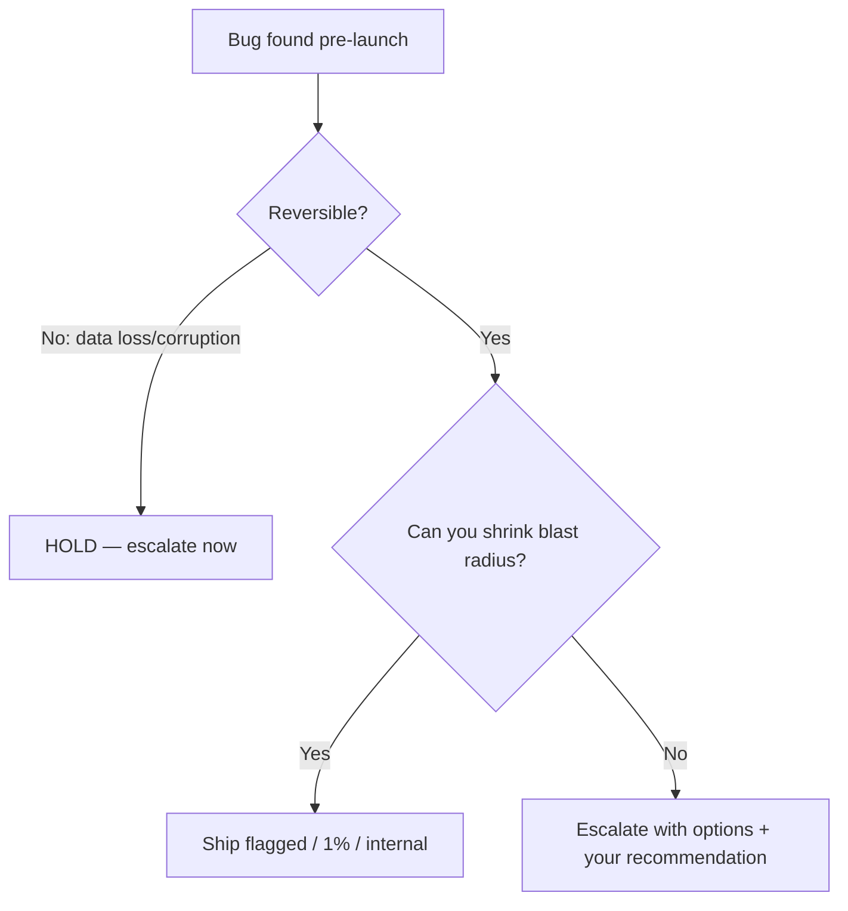

## Before you start

Read `production-incident-response` first — it covers what happens *after* a bad ship, and this topic is easier once you know the cost of being wrong.

## In one sentence

**Shipping under pressure** is the judgement call about whether a known defect is acceptable to release, and — the part people forget — who actually gets to make that call.

## Why it matters

The engineer who blocks every release over every imperfection becomes the person teams route around. The engineer who ships whatever they are told becomes the person whose name is on the data-corruption postmortem. Neither survives long.

Interviewers ask this because it is the cleanest test of whether you understand your own authority. Most engineers get it wrong in one of two directions: they either escalate nothing (and own a decision that was never theirs) or escalate everything (and demonstrate they cannot filter).

## The intuition

A pilot has a pre-flight checklist. Some items ground the plane; some get written in the log and fixed at the next maintenance window. The pilot does not decide *which category* an item is in during taxi — that classification was made in advance, calmly, by people who knew the failure modes.

Your job when you find a bug the night before launch is mostly **classification, not decision**. Is this a "log it and fly" or a "ground the plane"? And the crucial asymmetry: you can undo a delayed launch. You often cannot undo corrupted data.

## How it actually works

Three questions, in order, decide almost every ship-or-hold call.

**1. Is the damage reversible?** This is the dominant variable. A cosmetic bug is reversible. A slow endpoint is reversible. Writing wrong values into a customer's billing table is *not* — you may not even be able to tell later which rows were wrong. Reversibility beats severity: a total outage you can roll back in 90 seconds is a smaller risk than a subtle corruption that runs for a week.

**2. What is the blast radius, and can you shrink it?** Ship-or-hold is rarely binary. Between them sit: ship behind a flag, ship to 1% of traffic, ship to internal users, ship with the risky path disabled, ship and add a monitor that pages on the exact symptom. A senior engineer's instinct is to convert a binary decision into a graded one.

**3. Whose decision is this?** You own the technical assessment: what can happen, how likely, how bad, how detectable, how reversible. The business owns the risk acceptance. Confusing these is the classic mistake in both directions — quietly deciding not to ship (usurping the call) or quietly shipping to avoid a hard conversation (abdicating the assessment).



Note where escalation sits. You escalate with **options and a recommendation**, never with a raw problem. "We found a bug, what do you want to do?" pushes a technical judgement onto someone unqualified to make it. "Here are three options, here is the one I recommend and why" is the same information delivered as leadership.

## Worked example

Write the assessment down as structured data before you write the Slack message. It forces the fields you would otherwise skip.

```js
const risk = {
  defect: 'Concurrent checkout writes duplicate line items to orders table',
  reversible: false,               // the decisive field
  detectable: 'weak',              // no alert exists for duplicate line items
  probability: '~1 in 400 orders (est. from load test)',
  blastRadius: 'all customers, silently, growing daily',
  mitigations: [
    { option: 'Hold 48h for a unique constraint + backfill check', cost: 'launch slips' },
    { option: 'Ship with checkout behind a flag at 1% traffic', cost: 'partial launch, real data at risk' },
    { option: 'Ship + nightly reconciliation job to detect duplicates', cost: 'up to 24h of bad data, but recoverable' },
  ],
  recommendation: 2,               // index into mitigations
};

function shouldEscalate(r) {
  return !r.reversible || r.detectable === 'weak';
}

console.log(shouldEscalate(risk));                    // true
console.log(risk.mitigations[risk.recommendation]);   // the option you argue for
```

Output:

```
true
{ option: 'Ship + nightly reconciliation job to detect duplicates',
  cost: 'up to 24h of bad data, but recoverable' }
```

The `detectable` field is the one people leave out and the one that changes the answer. An irreversible bug you can *detect* becomes recoverable — you can find the affected rows and fix them. An irreversible bug you cannot detect is the genuinely dangerous category, because the damage keeps growing and you will never know its size.

## A second example — when it gets harder

**Scenario 1 — "the number nobody will check."** Launch is tomorrow, 09:00. At 21:00 you find that under concurrent checkout, roughly 1 in 400 orders writes a duplicate line item. The customer is charged correctly — the payment total is computed separately — but the *order record* is wrong, which means fulfilment ships two units and the analytics revenue number is inflated. Your PM, Dan, has a launch press release already scheduled and three partner integrations timed to it. He says: "Charging is correct, so customers are not harmed. We fix it next sprint."

*The naive answer:* refuse to ship. "I am not putting my name on data corruption."

*Why it fails:* you do not have that authority, and the framing loses you the argument. Dan hears "engineer is being precious", overrules you, and now you have spent your credibility and still shipped. Worse, "not putting my name on it" is about *you* — it invites him to treat this as a personality problem rather than a risk assessment.

*What a senior engineer does:* attacks the premise that customers are unharmed, in Dan's own units. Fulfilment ships a free second unit on 1 in 400 orders — at the projected launch volume, that is a specific number of units of real inventory, and you can calculate it in two minutes. Analytics revenue will be wrong, and the partners are being given those numbers. Then present the graded options: the flagged-1% option, or ship-with-reconciliation. The reconciliation job is often the winner and almost nobody proposes it — it converts an irreversible problem into a reversible one for four hours of work, which is a *cheaper* concession than the 48-hour slip Dan is refusing. That is the core move: find the option that gives the business its date and gives you your safety.

**Scenario 2 — you are overruled, and it is genuinely their call.** You made the case. Dan, with the VP copied in, decides to ship as-is and fix next sprint. He is within his authority; the risk is real but bounded, and the launch has contractual weight you cannot see.

*The naive answer:* comply silently and feel bitter, or comply loudly ("fine, but I said so") which poisons the next three months.

*What a senior engineer does:* **disagree and commit** — Amazon's phrasing for the norm most good teams follow. You argued, you lost, you now help it succeed. But commitment is not amnesia. You do three things: write the decision down in one paragraph (what we knew, what we chose, who chose it) somewhere durable — not to build a case, but because in six weeks nobody will remember and the fix will get deprioritised; add the monitoring you would have wanted so the bug is *detectable* even though it ships; and get the fix onto the next sprint's board before the launch, while the memory is fresh and Dan is grateful. The written record is the professional move and the bitter "I told you so" is not, and the difference between them is entirely tone and timing.

**Scenario 3 — pressure from the wrong direction.** Same launch. This time it is *your tech lead*, Maya, who wants to hold: she has found a code path she thinks is unsafe but cannot reproduce it, and she is asking you to support her in blocking. You have looked at the same code and think the path is unreachable in production because the calling service validates the input.

*The naive answer:* go along with your lead. She is senior and it costs you nothing.

*Why it fails:* it costs the company a slipped launch on a phantom, and it costs *you* the habit of having an independent opinion. Interviewers ask this variant specifically because deferring upward is the easy failure that looks like teamwork.

*What a senior engineer does:* try to settle it with evidence rather than seniority. "I think that path is unreachable because the caller validates — can we spend 30 minutes proving it either way?" A log query, a quick test against staging, or a grep for every caller usually resolves it faster than the debate does. If it stays unresolved, say plainly that you disagree, state your reasoning to whoever decides, and then support Maya's call if it goes her way. Disagreeing with your own lead in front of the PM is uncomfortable exactly once; being the engineer whose technical opinion is a function of the room is a permanent handicap.

## Quick reference

| Signal | Lean ship | Lean hold |
|---|---|---|
| Reversibility | Rollback in minutes | Writes bad data, no undo |
| Detectability | Alert exists, you would know in an hour | Silent; found weeks later by a customer |
| Blast radius | One tenant, one flag, 1% traffic | All users, all writes |
| Deadline cost | Internal date, slips cheaply | Contractual, partner-coupled, regulatory |
| Confidence | Reproduced, understood, bounded | "Something feels wrong here" |

Two hard rules that override the table: anything touching **money, auth, or privacy** escalates regardless of probability, and **you never make the call silently in either direction**.

## Common mistakes

- **Treating ship-or-hold as binary.** Flags, canaries, and internal-only releases are the whole middle of the space.
- **Escalating a problem instead of a recommendation.** It looks humble; it reads as avoiding responsibility.
- **Arguing in engineering units.** "It is a race condition" moves nobody. "1 in 400 orders ships a free unit" moves everybody.
- **Confusing reversible with low-severity.** A loud, total, instantly-rollback-able failure is often safer than a quiet 1% data bug.
- **Silent compliance followed by "I told you so."** Both halves are damaging; the second more than the first.
- **Not writing the decision down.** Six weeks later the fix is unowned and the context is gone.

## What interviewers ask

- **Tell me about a time you shipped something you were not comfortable with.** — Testing whether you can distinguish your assessment from your authority, and whether you followed up.
- **Who decides whether a known bug ships?** — Wrong answers: "engineering" or "the PM". Right answer names the split — engineering owns the risk assessment, the business owns risk acceptance, and anything touching money, auth, or privacy escalates above both.
- **You are overruled and the bug hits production exactly as you predicted. What do you do?** — They are checking for gloating. The answer is: work the incident, and in the postmortem describe the *decision process* that failed rather than the person who decided.
- **When have you been the one arguing to ship?** — A trap for people who have rehearsed being the safety-conscious hero. Good engineers also push back on excessive caution; if you have never argued for shipping, you may be the bottleneck.
- **How do you decide something is worth escalating?** — Look for a rule stated in advance (irreversible, or undetectable, or touches money) rather than a gut feeling formed in the moment.

## Practice

1. Take a bug you shipped knowingly. Write the four-field assessment — reversible, detectable, blast radius, probability — as you would have sent it. Notice which field you did not actually know at the time.
2. Write the escalation message for Scenario 1 in under 120 words: impact in business units, three options, your recommendation, and the deadline for a decision.
3. Argue the opposite side. Take a decision where you wanted to hold and build the strongest honest case for shipping. If you cannot, you probably did not understand the business pressure.

## Where to go next

`technical-debt-decisions` extends the same skill across a longer time horizon: instead of one bug tonight, it is accumulated compromise, and you have to make the case in the business's language rather than your own.
