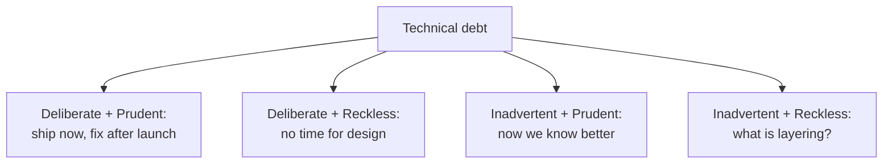

## Before you start

No prerequisites. It helps to have worked in one codebase long enough to be slowed down by a decision someone made before you arrived.

## In one sentence

**Technical debt** is the accumulated cost of choosing a faster implementation over a better one — and like financial debt, it is not automatically bad, it just charges interest that shows up as slower future work.

## Why it matters

Every engineer complains about technical debt. Almost none can get time allocated to fix it. The gap between those two facts is a communication skill, and it is one of the clearest separators between a mid-level and a senior engineer in an interview.

The reason the request usually fails is that engineers ask for debt paydown in *engineering* terms — "the code is messy", "this module is a nightmare" — which sounds to a business stakeholder like an aesthetic preference. Meanwhile the same stakeholder is fielding requests backed by revenue numbers. You are not losing the argument because they are short-sighted; you are losing because you brought no numbers to a numbers fight.

## The intuition

The metaphor is a loan, and Ward Cunningham chose it deliberately. You borrow time now — shipping the crude version — and you repay in interest: every future change to that area takes longer.

Push the metaphor and it gets more useful. A loan is fine when the thing you buy with it earns more than the interest. A startup that ships a hacky version and finds product-market fit made a *good* trade. The debt that kills you is the debt on something you keep paying interest on and never repay — and, critically, the debt on code you are about to delete is worth exactly nothing to fix.

That last point is the one most engineers miss. **Interest only accrues where you keep working.** Ugly code in a stable, untouched module charges you nothing.

## How it actually works

Martin Fowler's **technical debt quadrant** splits debt on two axes: was it *deliberate* or *inadvertent*, and was it *prudent* or *reckless*.



This matters in an interview because it lets you say something more precise than "we had a lot of tech debt". Deliberate-and-prudent debt is a legitimate business decision and you should defend it, not apologise for it. Inadvertent-and-prudent debt is unavoidable — you learn the domain by building in it. Only the reckless quadrants are failures, and they call for different responses (process and review for reckless-deliberate; training and mentoring for reckless-inadvertent).

To get *funded*, you need a second thing: the interest rate. Translate the debt into one of four currencies a business already tracks — **engineering time**, **incidents**, **revenue at risk**, or **hiring and ramp-up**. "Auth module is spaghetti" becomes "every auth change costs three days instead of one; we made nine last quarter; that is eighteen engineer-days, and two of our four SEV2s last quarter originated there."

And you need a **trigger**: the moment the argument is cheapest to win. Nobody funds refactoring in the abstract. Everybody funds it right after an incident caused by it, or immediately before a large feature that has to be built on top of it. Attaching the paydown to work that is already funded is the single most effective tactic available to you.

## Worked example

The case is a calculation, not an opinion. Write it out.

```js
const debtCase = {
  area: 'Auth module — no test coverage, three overlapping session paths',
  changesLastQuarter: 9,
  daysPerChangeNow: 3,
  daysPerChangeAfter: 1,
  incidentsCausedLastYear: 2,
  hoursPerIncident: 14,
  paydownCost: 12,        // engineer-days to fix
};

function makeCase(d) {
  const wastePerQuarter = d.changesLastQuarter * (d.daysPerChangeNow - d.daysPerChangeAfter);
  const incidentDays = (d.incidentsCausedLastYear * d.hoursPerIncident) / 8;
  const paybackQuarters = d.paydownCost / wastePerQuarter;
  return { wastePerQuarter, incidentDays: +incidentDays.toFixed(1), paybackQuarters: +paybackQuarters.toFixed(2) };
}

console.log(makeCase(debtCase));
```

Output:

```
{ wastePerQuarter: 18, incidentDays: 3.5, paybackQuarters: 0.67 }
```

Now the sentence you take into the room is: *"Twelve days of work pays for itself in under one quarter, and last year this module cost us two SEV2s and three and a half engineer-days of firefighting."* That is a proposal a manager can take to their own boss. "The auth code is bad" is not.

Two things make this credible rather than fabricated. First, `changesLastQuarter` is a number you can actually get — `git log --since=... -- src/auth | grep -c commit` — so quote the real one. Second, be honest that `daysPerChangeAfter` is an estimate, and give it a range. A stakeholder who catches you inflating one number stops believing all of them.

## A second example — when it gets harder

**Scenario 1 — "the rewrite nobody will fund."** You joined six months ago. The payments integration is a 4,000-line file with three overlapping retry mechanisms and no tests. Every change takes days and you have caused two production issues in it. You propose a two-month rewrite. Your director, Ana, says no — the roadmap is full through Q3, and she has heard "we need to rewrite payments" from two previous engineers.

*The naive answer:* escalate, or push the two-month rewrite harder with a better slide deck.

*Why it fails:* Ana's objection is not that she misunderstands the code. It is that a two-month rewrite of the payment path is a large, unhedged bet with no incremental value, proposed by someone who has been there six months, and she has been burned before. She is being *rational*. A better deck does not address a single one of those concerns.

*What a senior engineer does:* stops asking for the rewrite. Break it into pieces that each deliver value alone and can each be abandoned without waste: characterisation tests around current behaviour first (one week, and it makes every future change safer immediately), then extract the retry logic into one path, then the next seam. Then attach the first piece to funded work — the next payments feature on the roadmap becomes "this feature, plus tests for the code it touches, is three weeks instead of two." Nobody has to approve a rewrite. You are also building the track record that makes the *next* ask credible, which is the actual constraint here: the previous two engineers asked and left, and Ana is pattern-matching on that.

**Scenario 2 — when NOT to pay it down.** Same company. There is a legacy reporting service, genuinely awful — no tests, a dead ORM, a data model nobody understands. An engineer on your team, Tom, wants to spend a sprint cleaning it up and is frustrated that you keep saying no. You know something he does not weigh heavily enough: the service is scheduled for replacement by a vendor tool in about eight months, it changes maybe twice a year, and it has not caused an incident in two.

*The naive answer:* let him do it, because refactoring is virtuous and morale matters.

*What a senior engineer does:* applies the interest test out loud. Debt costs you only where you keep working; this module charges near-zero interest and has a scheduled payoff date. Spending a sprint there is spending the team's scarcest resource on code that will be deleted. But say the *reason*, not just the no — "if the vendor migration slips past a year, this changes" — and redirect the energy: there is almost always a high-interest area Tom could own instead, and giving him that is both the right allocation and the right answer to his frustration. The interview version of this scenario is testing whether you have judgement or just enthusiasm; anyone can advocate for refactoring, and knowing when it is waste is the rarer signal.

**Scenario 3 — the debt you created.** You shipped a deliberate shortcut nine months ago to hit a launch: a hardcoded tenant list instead of proper multi-tenancy config. It was the right call then. It is now blocking a deal with a customer who needs self-serve onboarding, and in the meeting someone says "who built it this way?"

*The naive answer:* defend yourself, or over-apologise. Both make it about you.

*What a senior engineer does:* owns it flatly and immediately reframes to the decision — "I did, deliberately, to hit the March launch; here is what it bought us and here is what it costs now." Deliberate-prudent debt is not a mistake and you should not perform contrition for it, because doing so teaches everyone watching that shortcuts are shameful, which is how you get a team that either hides them or refuses to take them. Then produce the number: what unblocking this deal costs in engineer-days, versus the deal's value. That is a decision, not a confession.

## Quick reference

| Situation | Pay it down? | Why |
|---|---|---|
| High change rate area | Yes, urgently | Interest compounds where you keep working |
| Caused a recent incident | Yes — and now | The trigger is cheapest right after the pain |
| Blocking a funded feature | Yes, attached to that feature | Someone else's budget carries it |
| Stable, rarely touched | No | Near-zero interest |
| Scheduled for deletion | No | You are polishing something you will delete |
| "It's ugly" with no measured cost | Not yet | Find the number first, or it is taste |

## Common mistakes

- **Asking in engineering language.** "Messy", "legacy", "nightmare" all translate to "the engineer has a preference".
- **Proposing a big-bang rewrite.** Large unhedged bets get declined by default, and correctly so.
- **No trigger.** Abstract requests lose; requests attached to an incident or a funded feature win.
- **Ignoring the deletion test.** Time spent improving code that is going away is pure loss.
- **Estimating without evidence.** Get the real change count from git; a guessed number that gets challenged sinks the whole case.
- **Treating all debt as failure.** Deliberate-prudent debt is a tool. Apologising for it teaches your team to avoid a legitimate trade.

## What interviewers ask

- **How do you convince a PM to fund refactoring?** — They want the translation into time, incidents, revenue, or ramp-up, plus a trigger. If your answer is "I explain why the code is bad", you have failed the question.
- **Tell me about technical debt you chose NOT to fix.** — The strongest signal in this whole topic. It requires the deletion test or the interest test, and separates judgement from enthusiasm.
- **When is taking on technical debt the right decision?** — Deliberate and prudent: a real deadline, a bounded shortcut, and a written record of what you traded.
- **You inherit a codebase you think is terrible. First 90 days?** — Testing humility. Measure before proposing; the "obviously wrong" design often has a reason, and a newcomer demanding a rewrite is a well-known failure pattern.
- **How do you stop debt accumulating in the first place?** — Look for something structural — a standing allocation, definition-of-done including tests, debt logged at the moment it is taken with the reason. Not "we should all care more".

## Practice

1. Pick a module you dislike. Run `git log --since="3 months ago" --oneline -- <path> | wc -l` for the real change count, then build the full cost calculation. Notice whether the number supports your instinct — sometimes it does not.
2. Find one piece of debt in your codebase that is genuinely not worth fixing, and write the two-sentence justification for leaving it. This is harder than it sounds.
3. Take your worst debt and write the version of the pitch attached to an upcoming roadmap feature, so no separate budget is needed. Keep it under 100 words.

## Where to go next

`disagreeing-with-leadership` is what happens when you make the case well and still lose — how to escalate properly, what commitment means afterwards, and what to do when the decision fails.
