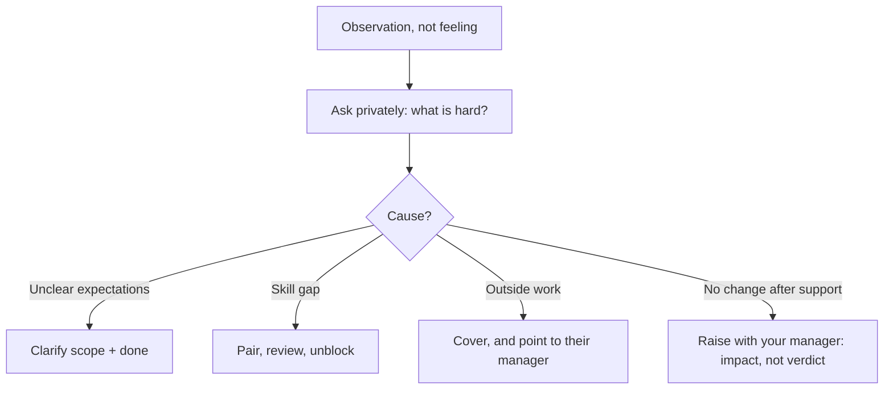

## Before you start

Nothing required. `disagreeing-with-leadership` is a useful companion — that topic is about pushing upward, this one is about influence sideways where you have no authority at all.

## In one sentence

Handling an **underperforming peer** is knowing when someone else's struggle stops being their business and becomes a delivery risk you have to act on — and acting on it without becoming their manager, their critic, or their doormat.

## Why it matters

This question separates people who think teamwork means being nice from people who understand that shipping is a shared obligation. Both extremes fail the interview: the candidate who silently absorbed a teammate's work for six months, and the candidate who escalated to a manager in week one.

There is a second reason interviewers care. How you talk about a struggling colleague — in a room where they are not present — tells them exactly how you will talk about *their* engineers. Contempt is disqualifying even when the facts support it.

## The intuition

Imagine a two-person kayak. Your partner is paddling weakly and you are drifting off course. You have three bad options and one good one. You can paddle harder and say nothing — you will exhaust yourself and the boat still veers. You can shout at them. You can call the coach on the shore. Or you can turn around and ask what is going on, because the honest answer might be "my paddle is cracked", "I have never done this before and I am copying you badly", or "I am injured".

Almost every bad response to an underperforming teammate comes from skipping that question. The three most common causes — unclear expectations, a missing skill, and something happening outside work — have completely different remedies, and you cannot pick one without asking.

## How it actually works

Start with **evidence, not vibes**. "Sam is slow" is a feeling. "Sam's last three tickets each took two weeks against a three-day estimate, and two came back from review with the same class of issue" is an observation. If you cannot produce the second version, your first job is to check whether the problem is real — sometimes what looks like underperformance is someone absorbing invisible work like on-call, interviews, or the flaky test suite everyone else routes around.

Then **go direct, first, privately**. This is the step people skip and it is the one interviewers are checking for. Not because escalation is wrong, but because escalating before a single honest conversation means you handed your manager a problem you never tried to solve, and you did it behind a colleague's back.

The conversation works better as curiosity than feedback. "I noticed the sync service ticket has been open a while — what is making it hard?" invites an explanation. "You are missing your estimates" invites a defence.



The bottom branch is where it becomes your manager's problem, and the framing rule matters: bring **impact and facts**, not a verdict. "The payments migration is three weeks late and I have picked up two of Sam's tickets to keep it moving; I have talked to him twice and I am not sure what else to do" is a report your manager can act on. "Sam is not good enough" is you attempting a judgement that is not yours to make, without the information — performance history, personal circumstances, prior conversations — that they have and you do not.

**When does it become your problem?** Three triggers: it puts a shared commitment at risk, you are silently absorbing the work, or the quality is creating risk for users. Slow-but-improving is not your business. Slow-and-you-are-covering is, because the covering is what hides it from the people who can actually fix it.

## Worked example

A short escalation ladder, encoded so the steps stay in order under frustration.

```js
const situation = {
  observations: [
    'Sync ticket open 14 days, estimated 3',
    'Two PRs reverted for the same missing-null-check pattern',
    'I completed 2 of their tickets last sprint to hold the date',
  ],
  directConversations: 1,
  supportOffered: ['pairing session'],
  weeksSinceFirstConversation: 3,
  sharedCommitmentAtRisk: true,
  imAbsorbingWork: true,
};

function nextStep(s) {
  if (s.observations.length === 0) return 'gather-evidence';
  if (s.directConversations === 0) return 'talk-to-them-first';
  if (s.supportOffered.length === 0) return 'offer-concrete-help';
  if (s.weeksSinceFirstConversation < 2) return 'give-it-time';
  if (s.sharedCommitmentAtRisk || s.imAbsorbingWork) return 'raise-with-manager-as-impact';
  return 'keep-supporting';
}

console.log(nextStep(situation));                              // raise-with-manager-as-impact
console.log(nextStep({ ...situation, directConversations: 0 })); // talk-to-them-first
```

Output:

```
raise-with-manager-as-impact
talk-to-them-first
```

The second call is the important one. Even with a commitment at risk and you absorbing work, if you have not had the direct conversation, that is still the next step. No amount of accumulated frustration promotes you past it.

## A second example — when it gets harder

**Scenario 1 — "the quiet absorber."** You and Sam are the two engineers on a payments migration due in four weeks. Sam has been on the team for a year, is well-liked, and his tickets have started taking three to four times their estimate. You have quietly finished two of them yourself, at night, because the deadline is real. Your manager, Leila, thinks the project is on track — because from her view it is. Sam has not asked for help, and when you check in he says "yeah, nearly done" for the third week running.

*The naive answer:* keep covering. Nobody is harmed, the project ships, and you avoid an awkward conversation.

*Why it fails:* three ways, and this is the scenario's real teaching point. Leila is making decisions on false data — she may commit the team to more work because the project looks healthy. Sam is being denied the feedback that would let him fix anything, and a year from now someone will manage him out for a problem nobody ever told him about, which is genuinely unfair to him. And you are building a dependency that collapses the moment you take leave. Covering feels generous and functions as concealment.

*What a senior engineer does:* stops the silent absorption first, because it is the thing distorting everyone's information. Then goes to Sam directly and *specifically* — vagueness is the enemy here. "I finished the retry ticket on Thursday night. That is the second one, and I do not think I should keep doing that without us talking about it. What is making these hard?" Notice it leads with your own behaviour, which is disarming and also true. The answers you get are usually concrete: he does not understand the message queue semantics and is embarrassed to ask a year in; or the migration touches a service he has never worked on; or something at home. Each has a real remedy, and two of them you can supply yourself in a week of pairing.

**Scenario 2 — the personal reason.** Sam tells you his father is seriously ill and he has been at the hospital most evenings. He asks you not to tell anyone, including Leila.

*The naive answer:* agree, keep covering, and say nothing. It is what a friend would do.

*Why it fails:* you have now taken on a burden that will break, and you have kept Sam from the only mechanism that actually helps him — Leila can adjust deadlines, redistribute scope, or arrange leave, and you can do none of those things. Sam is asking you to keep a secret partly because he does not know those options exist.

*What a senior engineer does:* respects the confidence about the *cause* while being honest about the *effect*. You do not tell Leila his father is ill; that is his to share. But you tell Sam plainly: "I am not going to share why, that is yours. But I do need to tell Leila the migration is at risk, because the date is wrong and she is planning against it — and I would rather that come from us than surface in three weeks." Then encourage him to talk to Leila himself, and be specific about why it is in his interest: managers can move deadlines, and one who finds out afterwards cannot help retroactively. This scenario is genuinely hard, and interviewers use it because the loyal-friend answer and the correct answer feel opposite while actually differing only in what you disclose.

**Scenario 3 — the peer who thinks they are fine.** Different flavour. Priya is fast — she ships more tickets than anyone — but her code generates rework: three of the last five production issues traced to her PRs, and reviewers have started rubber-stamping because pushing back costs an hour of argument. When you raise a specific bug, she explains why it was actually the reviewer's fault for not catching it.

*The naive answer:* stop reviewing her code, or escalate to the manager as "Priya does not take feedback."

*What a senior engineer does:* recognises that the team's *review culture* is now the problem — reviewers rubber-stamping is a systemic failure that outlasts any individual. Fix the system where you can: propose that PRs touching payment paths need a test demonstrating the failure case, which is an impersonal rule that catches the actual issue without anyone litigating Priya's attitude. Separately, give her the feedback in the currency she values — she cares about velocity, so frame it as velocity: "three of your last five landed twice because of rework; the second landing is not free." And when you do escalate, escalate the pattern with evidence, not the personality: "we have a review-quality problem in payments, here are the five incidents" is actionable in a way that "Priya is defensive" never is.

## Quick reference

| Situation | Your move | Not your move |
|---|---|---|
| Slower than you expected, no shared risk | Nothing yet; check your own expectation | Escalating |
| Missing shared deadlines | Direct conversation, ask what is hard | Silently covering |
| Skill gap | Pair, review generously, unblock | Doing it for them |
| Personal circumstances | Respect the cause, report the impact | Keeping the delay secret too |
| No change after support, commitment at risk | Raise impact with your manager | Delivering a verdict on the person |
| Quality risk to users | Fix via process/tests, escalate the pattern | Making it about the person |

## Common mistakes

- **Absorbing the work quietly.** It hides the problem from everyone who could solve it, including the teammate.
- **Escalating before one honest conversation.** Reads as going behind someone's back — because it is.
- **Diagnosing before asking.** Unclear expectations, missing skill, and personal crisis look identical from outside and need opposite responses.
- **Bringing a verdict to your manager.** "Not good enough" is a judgement you lack the information to make; "here is the impact and what I have tried" is what they need.
- **Contempt in the interview.** The moment you sound like you looked down on the person, you have lost the question regardless of the facts.
- **Making it about personality.** "Defensive", "sloppy", "lazy" are unactionable. Behaviours and impacts are actionable.

## What interviewers ask

- **Tell me about working with someone who was not pulling their weight.** — Listening for: did you talk to them first, did you find the cause, did you escalate at the right time, and do you sound compassionate about them now.
- **When does a teammate's performance become your problem?** — Wants a stated trigger — shared commitment at risk, you absorbing work, user-facing quality risk — not "when it annoys me".
- **You covered for someone and the project shipped. Was that the right call?** — A trap. Shipping does not validate it; ask what it cost in information, in their development, and in your sustainability.
- **How do you give a peer critical feedback when you have no authority?** — Look for privacy, specificity, behaviour-not-person, and an offer of help attached.
- **What if they get defensive?** — Good answers narrow to a single concrete example and shift to the shared goal, rather than escalating the argument or retreating entirely.

## Practice

1. Write three specific, factual observations about a real situation where you felt someone underdelivered. If you cannot make them factual, that is the finding.
2. Draft the opening two sentences of the direct conversation. Read them aloud — if either sentence would make you defensive on the receiving end, rewrite it.
3. Write the escalation message to a manager in under 80 words: impact, what you have tried, what you need. No adjectives about the person at all.

## Where to go next

`code-review-conflicts` narrows the same skill to the single place peer friction shows up most often — and where the disagreement is written down permanently for everyone to read.
