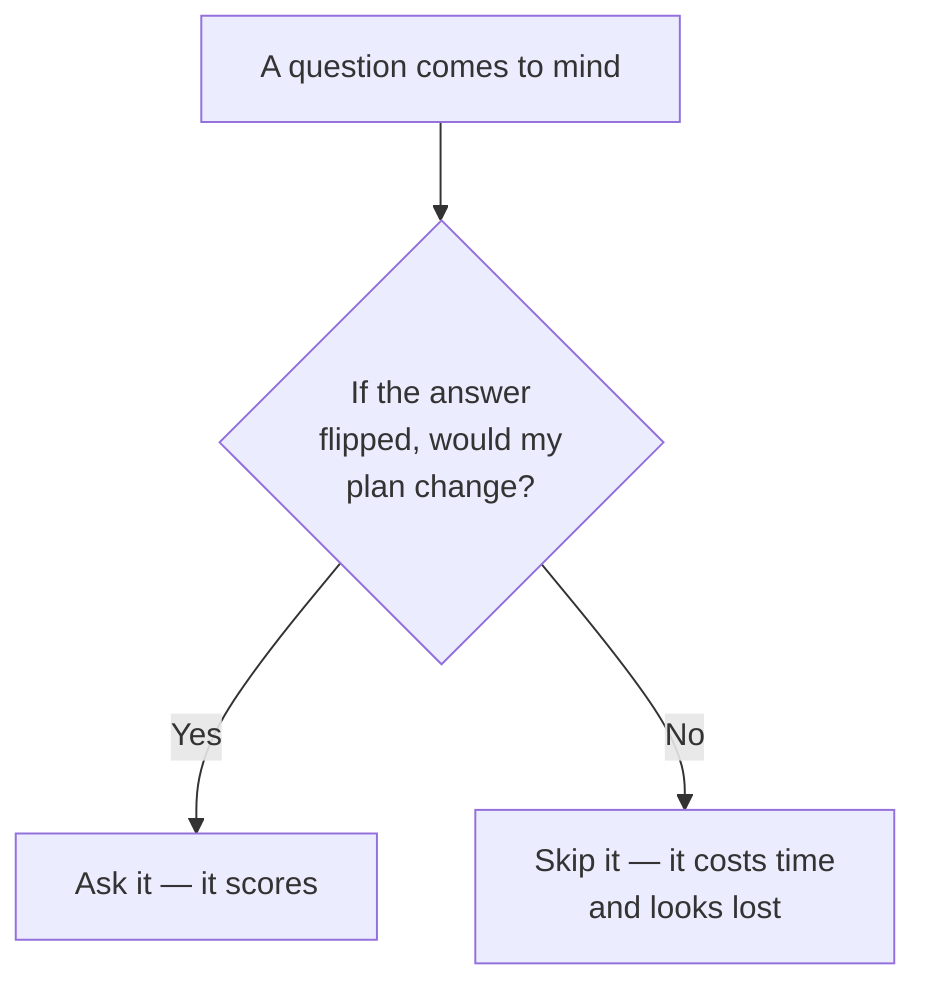

## Before you start

Read `how-to-approach-any-question` — clarifying is step 2 of that script. This topic is that step in detail.

## In one sentence

A **clarifying question** is one whose answer would change what you do next — and asking two of those makes you look experienced, while asking four questions that change nothing makes you look lost.

## Why it matters

Every interview question is deliberately incomplete. That is not an accident or an oversight — it is the test.

"Design Twitter" leaves out the scale. "Sort this array" leaves out whether duplicates exist. The missing pieces are placed there to see whether you notice them or charge ahead assuming.

But there is a trap on the other side. Beginners who learn "ask clarifying questions" often ask six of them, none of which matter, and burn five minutes proving they do not know what is important. Both failures come from the same gap: not knowing which questions have consequences.

## The intuition

There is one test that separates a good question from a bad one.

**Ask yourself: "if the answer were the opposite, would I do something different?"**

If yes, ask it. If no, do not.

"Should I use Python or Java?" — if the answer flipped, you would write the same algorithm in a different syntax. Nothing changes. Do not ask.

"Can the input be empty?" — if yes, you need a guard clause. If no, you do not. Something changes. Ask it.

That single test replaces every list you could memorise.



## How it actually works

Good questions cluster into four kinds. In every interview type, they are the same four kinds wearing different clothes.

**Scale** — how big? This changes architecture, data structure choice, and whether a simple answer is acceptable.

**Scope** — what is in and out? This is the most senior-sounding question type, because cutting scope deliberately is what experienced engineers do.

**Edges** — what about the weird inputs? Empty, huge, duplicate, negative, missing.

**Success** — what does good look like? Fast? Cheap? Always correct? These conflict, so knowing which one wins tells you what to optimise.

### The exact questions, by interview type

**Coding problems**
> "Can the input be empty, or is it always at least one element?"
> "Roughly how large can the input get — hundreds, or millions?"
> "Can there be duplicates?"
> "Is the input sorted already?"
> "What should I return if there's no valid answer?"
> "Can I modify the input array, or should I leave it unchanged?"

**System design**
> "What are the two or three core things a user must be able to do?"
> "Is ___ in scope, or can I leave it out for now?"
> "Roughly how many users — thousands, millions, or hundreds of millions?"
> "Is this read-heavy or write-heavy?"
> "Does the data need to be up to date everywhere instantly, or is a short delay OK?"
> "What matters more here — that it's always available, or always perfectly consistent?"

**Behavioural**
> "Would you like a technical example, or one about working with people?"
> "Should I pick a recent one, or the one I learned most from?"
> "How much detail would you like — a summary, or the full story?"

**Debugging / open-ended**
> "Is this happening for all users or a subset?"
> "When did it start, and did anything change around then?"
> "Do we have logs or monitoring for this path?"

### How to ask them

Ask two or three. Not six. Bundle them:

> "Before I start, can I ask two quick questions? First ___. Second ___."

And use the senior version wherever you can — **propose an answer instead of requesting one**:

> Junior: "How many users are there?"
> Senior: "I'll assume around ten million daily users, which puts us at roughly a hundred writes a second. Does that sound about right?"

The second version gives the interviewer something to correct rather than something to invent. It shows you know what a reasonable number looks like. Use it whenever you can guess.

## Worked example

Question: *"Design a chat application."* Two candidates, first three minutes.

```text
─────────────────────────────────────────────────────────
STRONG — three questions, all consequential

[SCOPE — and it proposes, rather than asks]
"Let me start with scope. I'm going to assume the core is
one-to-one messaging, delivery, and read receipts — and treat
group chat, voice calls, and file sharing as out of scope
unless you'd rather I include them. Does that split work?"
  INTERVIEWER: "Include group chat, drop read receipts."
  ↳ ANNOTATION: Proposed a scope, got it corrected in one
    exchange. Compare to 'what features should it have?', which
    makes the interviewer do the work and reveals nothing.

[SCALE — proposed with a number]
"For scale, I'll assume around fifty million daily users, each
sending maybe forty messages a day. That's roughly two billion
messages a day, about twenty-five thousand a second average, so
maybe seventy-five thousand at peak. Is that the right order of
magnitude?"
  INTERVIEWER: "Yes, that's fine."
  ↳ ANNOTATION: The number is not the point — the derivation is.
    Seventy-five thousand writes a second immediately rules out
    a single database, and now the candidate knows that before
    drawing anything.

[SUCCESS — the trade-off question]
"One more. When someone's phone is offline and messages arrive,
what matters more: that they eventually get every message, or
that the app feels instant when they're online? I'd guess never
losing a message wins, which pushes me toward persisting every
message before acknowledging it."
  INTERVIEWER: "Correct, never lose a message."
  ↳ ANNOTATION: This is the highest-value question of the three.
    It determines the entire write path. And the candidate
    already stated what they'd conclude from each answer, which
    shows they understood why they were asking.

RESULT: three minutes, three questions, and the candidate now
has scope, scale, and the core trade-off. The design is already
half-determined and they have not drawn a box yet.

─────────────────────────────────────────────────────────
WEAK — six questions, none consequential

"What language should I use?"
  ↳ Changes nothing. This is a design round; there is no code.

"Should I draw this on the whiteboard or just talk?"
  ↳ Logistics, not design. Ask at the very start if you must,
    but it is not a clarifying question.

"Is this like WhatsApp?"
  ↳ Vague. 'Yes' tells you nothing you can act on. The useful
    version names a specific feature: 'does it need group chat?'

"Do you want me to talk about the database?"
  ↳ Asks for permission instead of making a decision. It reads
    as needing to be told what to do.

"How much time do we have?"
  ↳ Reasonable once, at the very start. Asked among design
    questions, it signals worry about the clock rather than
    interest in the problem.

"Should I worry about security?"
  ↳ Sounds thorough, is actually empty. 'Yes' produces no
    specific action. The consequential version: 'do messages
    need end-to-end encryption? That changes whether the server
    can search message history at all.'

RESULT: five minutes gone, nothing learned. The interviewer
still does not know if this candidate can find what matters.
Worse, every one of these was answerable by the candidate
themselves — which is exactly why asking them looks lost.
```

Notice the pattern in the weak set: **every bad question either changes nothing, or asks the interviewer to make a decision the candidate should make.** That is the whole diagnosis.

## A second example — when it gets harder

Sometimes the interviewer refuses to answer.

```text
INTERVIEWER: "You tell me. What do you think?"

This is not hostility. It is a deliberate test of whether you
can make a reasonable assumption and move on, or whether you
stall without permission.

WEAK RESPONSE:
"Umm... I'm not sure. It kind of depends. What would you
prefer?"
  ↳ Asked again, having been told to decide. Now it is not a
    clarifying question, it is an inability to commit.

STRONG RESPONSE — state, justify, flag, move:
"Fair enough. Then I'll assume ten million daily users, since
that's a typical size for a product like this and it's big
enough to need sharding — which is the interesting case. I'll
flag it as an assumption, and if it's off by ten times in
either direction the main thing that changes is whether we
need more than one database. Let me carry on."
  ↳ Four things in one answer: made a decision, gave a reason,
    labelled it as an assumption, and stated what would change
    if it were wrong. That last part is what senior sounds like.

The general rule: after ONE unanswered question, stop asking
and start assuming out loud. An assumption stated clearly is
worth more than a question asked twice.
```

## Quick reference

| Type | Ask | Do not ask |
|---|---|---|
| Coding | "Can the input be empty? Duplicates?" | "Which language should I use?" |
| Coding | "How large can the input get?" | "Should I write a function or a class?" |
| System design | "Is ___ in scope, or out?" | "Is this like WhatsApp?" |
| System design | "Read-heavy or write-heavy?" | "Should I worry about security?" |
| System design | "Availability or consistency, if I must choose?" | "Should I talk about the database?" |
| Behavioural | "Technical example, or a people one?" | "Is this a good example?" |
| Any | Any question whose answer changes your plan | Any question you could answer yourself |

```json
{
  "test": "If the answer flipped, would my next step change?",
  "how_many": 2,
  "phrasing": "Before I start, can I ask two quick questions? First ____. Second ____.",
  "senior_form": "I'll assume ____, which means ____. Does that sound right?",
  "four_kinds": {
    "scale": "How big? Changes architecture.",
    "scope": "What's in and out? Cutting scope looks senior.",
    "edges": "Empty, huge, duplicate, negative, missing.",
    "success": "Fast, cheap, or always correct? They conflict."
  },
  "if_they_wont_answer": "State the assumption, justify it, say what changes if it's wrong, continue."
}
```

## Common mistakes

- **Asking questions with no consequence.** The single biggest one. Run the flip test on every question before it leaves your mouth.
- **Asking too many.** Two or three good ones beat six. Past three, you are stalling, and it reads that way.
- **Asking for permission instead of deciding.** "Should I talk about the database?" — decide, then say what you are doing.
- **Asking and not using the answer.** If you learn the system is read-heavy and then design a write-optimised store, the question was decoration. Say out loud what each answer changed.
- **Not asking at all.** The opposite failure. Charging in and assuming is how you design the wrong system for twenty minutes.
- **Asking twice after a non-answer.** One "you tell me" means assume out loud and move.

## What interviewers ask

- **"Do you have any questions before we start?"** — Not politeness. They are checking whether you spot what is missing. Always have at least one real one.
- **"What would you assume?"** — They want to see whether you can commit under uncertainty. State the assumption, the reason, and what would change if it were wrong.
- **"Why does that matter?"** — Asked when a question seemed random. Explain what each possible answer would change. If you cannot, that is your evidence the question was not worth asking.
- **"Do you have questions for me?"** (at the end) — A different thing, but the same skill. Ask about the actual work: what the team is building, what is hard about it, what the first three months look like.

## Practice

1. Take five coding problems and write five clarifying questions for each. Then apply the flip test and delete every one that fails it. Most people delete more than half.
2. For one system design question, write three questions in the senior form — proposing an answer rather than requesting one. Say them aloud and notice how different they feel.
3. Have a friend answer "you tell me" to your first question. Practise the state-justify-flag-move response until it comes out fluently.

## Where to go next

`how-to-approach-system-design` puts these questions into the 5-minute clarify step of a full design round. `when-you-dont-know` covers the case where even good questions leave you without an answer.
