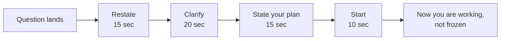

## Before you start

Nothing. This is the first thing you read in this chapter. You do not need to know any algorithm, any database, or any design pattern to use it.

## In one sentence

When any interview question lands, you spend the first 60 seconds doing four things in a fixed order — **restate, clarify, plan, start** — so that your mouth has something useful to do while your brain catches up.

## Why it matters

The most common way people fail interviews is not being wrong. It is going silent.

A question lands. Your mind goes blank. Ten seconds of silence pass. Now you are panicking about the silence as well as the question, and the panic makes the blank worse. By the time you speak, the interviewer has already watched you struggle for half a minute.

The fix is not to be smarter. The fix is to have a script you run without thinking, so the first 60 seconds are never blank. Every question — coding, system design, behavioural, "tell me about yourself" — starts the same way.

## The intuition

Think about a waiter taking your order at a restaurant. They do not immediately run to the kitchen. They repeat your order back to you: "So that's one chicken curry, medium spice, and a lemonade — anything else?"

That repeat-back does three jobs at once. It proves they listened. It catches a mistake before the kitchen wastes food. And it buys them a few seconds to write it down.

Your first 60 seconds is exactly that repeat-back. It is not a delay. It is the cheapest possible insurance against solving the wrong problem, and it is completely free thinking time.

## How it actually works

The four steps, always in this order.

**Step 1 — Restate (15 seconds).** Say the question back in your own words. Not word for word. Your words.

**Step 2 — Clarify (20 seconds).** Ask one or two questions about what you were not told. Every question has something missing. Find it.

**Step 3 — Plan out loud (15 seconds).** Say what you are about to do, before you do it. "I'll start with X, then move to Y."

**Step 4 — Start (10 seconds).** Begin. Out loud. Even if the first thing you say is imperfect.



Notice what the diagram does not contain: a box for panic. There is no gap for it. The script fills every second.

### The literal script

Memorise these sentences. They work for any question type.

**Restate:**
> "Let me make sure I've understood. You want me to ___. Is that right?"

**Clarify:**
> "Before I start, can I ask two quick questions?"
> "What's roughly the scale here — hundreds of users or millions?"
> "Is ___ in scope, or should I leave that out?"

**Plan:**
> "Here's how I'd like to approach this. First I'll ___, then ___, then ___. Does that sound reasonable?"

**Start:**
> "Great. Starting with ___."

That last question — "does that sound reasonable?" — is the single highest-value sentence in an interview. If your plan is wrong, the interviewer corrects you now, for free, before you have wasted twenty minutes.

## Worked example

Here is a real 60 seconds, annotated. The interviewer asks: *"Design a system that shortens long URLs."*

```text
CANDIDATE (0:00-0:15) — RESTATE
"Let me make sure I've understood. You want a service where I paste
a long URL, get back a short one, and when someone opens the short
one it sends them to the original. Is that right?"

  ↳ What this does: proves you listened, and locks in a shared
    definition. If the interviewer wanted something else, they say
    so right now.

INTERVIEWER: "Yes, exactly."

CANDIDATE (0:15-0:35) — CLARIFY
"Before I start, can I ask two quick questions? First, roughly how
many URLs a day are we shortening — thousands or millions? Second,
do users need to pick their own custom short link, or is a random
one fine?"

  ↳ What this does: scale changes the whole design. Custom links
    change the storage. Two questions, both load-bearing.

INTERVIEWER: "Say 10 million a day. Random is fine."

CANDIDATE (0:35-0:50) — PLAN
"Here's how I'd like to approach this. First I'll write down the
requirements and do a rough traffic estimate. Then I'll draw the
high-level boxes — API, database, redirect path. Then I'll go deep
on how we generate the short code. Does that sound reasonable?"

  ↳ What this does: the interviewer now knows where you are going
    and can steer you. It also signals you have done this before.

INTERVIEWER: "Sounds good."

CANDIDATE (0:50-1:00) — START
"Great. Starting with requirements. Two operations: create a short
link, and resolve a short link..."

  ↳ You are now working. The blank never happened.
```

Sixty seconds. No panic. No silence. And you have not yet had a single technical thought — the script carried you.

## A second example — when it gets harder

The script above assumed a friendly interviewer. Now the harder case: **the question you did not expect at all**, and the interviewer says nothing helpful.

Interviewer: *"Tell me about a time you disagreed with your manager."*

```text
WEAK VERSION
Candidate: "Umm... [8 seconds of silence] ...I guess... I don't
really disagree with my manager much? We get along well."

  ↳ What went wrong: the silence, then an answer that dodges the
    question. The interviewer learns nothing. They will move on
    and mark this as a fail.

STRONG VERSION — same script, different question type
Candidate (RESTATE):
"So you're asking about a time I pushed back on a decision from
someone senior to me, and how I handled it."

Candidate (CLARIFY — buys you real thinking time):
"Would you rather hear about a technical disagreement, or one
about priorities and timelines?"

INTERVIEWER: "Technical is fine."

  ↳ While they answer, you are searching your memory. The
    clarifying question bought you five seconds AND narrowed
    the search.

Candidate (PLAN):
"Let me give you one from my last project. I'll set up the
situation, then what I actually did, then how it ended."

Candidate (START):
"We were choosing between two caching approaches..."
```

The clarifying question is doing double duty here. It genuinely narrows the question, and it hands you five extra seconds to find a story. That is not a trick — it is what experienced candidates do naturally, and you can do it deliberately.

## Quick reference

| Step | Time | Say this | If you skip it |
|---|---|---|---|
| Restate | 15s | "Let me make sure I've understood. You want ___." | You may solve the wrong problem |
| Clarify | 20s | "Can I ask two quick questions?" | You guess at missing constraints |
| Plan | 15s | "First I'll ___, then ___. Sound reasonable?" | Interviewer can't steer you |
| Start | 10s | "Great. Starting with ___." | You stall at the starting line |

Fill this in before every practice session:

```json
{
  "restate": "Let me make sure I've understood. You want me to ____.",
  "clarify_1": "Roughly what scale are we talking about?",
  "clarify_2": "Is ____ in scope, or out?",
  "plan": "First I'll ____, then ____, then ____. Sound reasonable?",
  "start": "Great. Starting with ____.",
  "buy_time": "That's a good question, let me think for a few seconds."
}
```

## Common mistakes

- **Starting to answer immediately.** It feels fast and confident. It is neither — you are answering a question you have not fully heard.
- **Asking clarifying questions that have no consequence.** "What language should I use?" changes nothing. "How large is the input?" changes everything. Ask the second kind.
- **Restating word for word.** Parroting the question back proves nothing. Rephrasing it in your own words proves you understood it.
- **Skipping the plan.** This is the step people drop when nervous, and it is the one interviewers notice most. Saying your plan out loud is what separates "confident" from "frantic".
- **Treating silence as thinking time.** In your head it is thinking. From outside it looks identical to being stuck. Say "let me think for a few seconds" and then the silence is fine.

## What interviewers ask

- **"Do you have any questions before you begin?"** — This is not politeness. They are testing whether you spot the missing information. Always have at least one real question ready.
- **"How would you approach this?"** — They want the plan, not the answer. Give them the three steps out loud, then start.
- **"Are you sure you understood the question?"** — This is a warning. You have drifted. Stop, restate the question, and ask them to confirm before continuing.

## Practice

1. Take any five interview questions — from anywhere, any type. Set a 60-second timer for each and speak only the four steps out loud. Do not attempt to answer any of them. The goal is to make the script automatic, not to be right.
2. Record yourself doing the same five. Play it back and count how many seconds of total silence there are. Aim for under three per question.
3. Have a friend read you a question from a topic you know nothing about — deliberately. Run the script anyway. Notice that you can complete all four steps without knowing the answer.

## Where to go next

`asking-clarifying-questions` goes deep on step 2 — which questions make you look senior and which make you look lost. Then pick the template that matches your next interview: `how-to-approach-system-design`, `how-to-approach-coding-problems`, or `how-to-approach-behavioral`.
