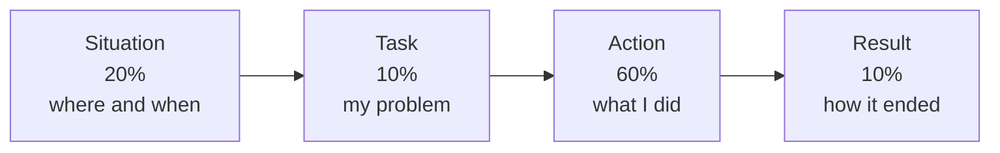

## Before you start

Nothing technical. You need one thing only: two or three real work situations you can describe. If you have never worked, use college projects, group assignments, or internships — the template does not care.

## In one sentence

A **behavioural question** asks "tell me about a time when…", and you answer it with four blocks in a fixed order — **Situation, Task, Action, Result**, known as **STAR** — so your story has a shape instead of wandering.

## Why it matters

You have a good story. You tell it badly.

That is what happens without a template. You start in the middle, back up to explain something, mention four people the interviewer has never heard of, and trail off without ever saying how it ended. Two minutes pass and the interviewer has learned nothing about you.

Behavioural rounds are not softer than technical ones. At many companies they are the round people actually fail. The good news: unlike a coding question, you can prepare the exact words in advance.

## The intuition

Every film you have ever watched has the same shape.

Here is the situation. Here is the problem the hero must solve. Here is what the hero does about it — this is the long part, the whole middle of the film. And here is how it ended.

STAR is that shape. Situation is the opening scene. Task is the problem. Action is the middle of the film, and it should be the longest part. Result is the ending.

Most people get this backwards: five minutes of setup, ten seconds of "and then it worked out fine". That is a film that is all opening credits.

## How it actually works



Those percentages are the whole technique. Two minutes total means roughly: 25 seconds of situation, 12 of task, 70 of action, 12 of result.

**Situation** — where, when, what team. Two sentences maximum. The interviewer does not need the org chart.

**Task** — what *you* specifically had to do. Not the team. You.

**Action** — the steps you took, in order. Say **"I"**, not "we". This is the part being scored, so it gets the most time.

**Result** — how it ended, with a number if you have one. Then one sentence on what you learned.

### The literal script

> "Sure, I have a good example of that. **[Situation]** Last year I was on a three-person team building ___. **[Task]** My job was to ___, and the problem was ___. **[Action]** So first I ___. Then I ___. The tricky part was ___, so I ___. **[Result]** In the end ___, which meant ___. What I took from it was ___."

If you need a moment before starting:

> "That's a good question — let me think of the best example for a second."

Silence after that sentence is completely fine. Silence without it looks like being stuck.

## Worked example

Question: *"Tell me about a time you had to fix something under pressure."*

```text
"Sure, I've got a good example.

[SITUATION — 20 seconds]
Last year I was one of three backend engineers on a payments
service. On a Friday afternoon, customer support told us that
about one in twenty payments was failing, and nobody knew why.
  ↳ ANNOTATION: Two sentences. Where, when, what broke. No org
    chart, no names, no history.

[TASK — 10 seconds]
I picked it up because I'd written most of the retry logic. My
job was to find the cause and stop the failures the same day,
because the weekend was our busiest period.
  ↳ ANNOTATION: 'I picked it up' — ownership. And it states the
    stake: why it had to be today.

[ACTION — 70 seconds, the longest part]
First I checked whether it was random or patterned. I pulled
the failed payment IDs and found they were all above a certain
amount, which told me it wasn't a network issue.

Then I traced one failing payment end to end through the logs.
The payment provider was returning a timeout, but only on the
larger amounts, which needed an extra fraud check on their side
and took longer.

Our client had a three-second timeout. Their fraud check
sometimes took four. So I had two options: raise our timeout,
or make the call asynchronous. Raising the timeout was faster
to ship but would hold connections open, so I raised it to
eight seconds as an immediate fix and opened a ticket to move
the whole call to a queue properly the following week.

I also added an alert on the payment failure rate, because the
thing that actually bothered me was that support found this
before we did.
  ↳ ANNOTATION: Four distinct steps, in order. 'I' throughout.
    The options-and-choice paragraph shows judgement. The alert
    at the end shows they fixed the process, not just the bug.

[RESULT — 12 seconds]
The failure rate went from around five percent back to under
one within two hours, and the weekend ran clean. The async
version shipped that Tuesday. What I took from it is that if
your customers detect a problem before your monitoring does,
the missing alert is as much of a bug as the code.
  ↳ ANNOTATION: A number, a timeframe, and a lesson that is
    actually a lesson rather than 'I learned teamwork'."
```

## A second example — when it gets harder

Same person, same real event, told without the template.

```text
WEAK VERSION
"Yeah, so, we had this issue with payments — actually let me
back up, we had this service that a few teams used, and it had
been kind of flaky for a while, there was some history there
because the original author had left. Anyway, someone from
support pinged us, I think it was on a Friday, or maybe
Thursday. And we looked into it. My teammate Raj was involved
too, he'd worked on the provider integration. We ended up
finding it was a timeout thing. We fixed it and it was fine
after that. It was pretty stressful."

WHAT WENT WRONG — line by line:
- "actually let me back up" — started in the middle, then
  reversed. The interviewer is now lost.
- "there was some history because the original author had
  left" — irrelevant backstory, spends the scarce Situation
  budget on nothing.
- "I think it was Friday, or maybe Thursday" — hedging on
  details nobody asked about. It reads as an unclear memory,
  which makes the whole story feel less real.
- "My teammate Raj was involved too" — introduces a person who
  never returns, and starts shifting credit away.
- "We looked into it... we fixed it" — WE, four times. The
  interviewer is hiring one person and cannot tell what that
  person did. This is the single most damaging habit.
- "We ended up finding it was a timeout thing" — the entire
  Action, the 60% that is being scored, is compressed into
  eleven words. Nothing about how they found it.
- "It was fine after that" — no number, no timeframe, no
  lesson. The Result is empty.
- "It was pretty stressful" — ends on the candidate's feelings
  rather than the outcome.

THE TRANSFORMATION — same facts, template applied:
  "we had this service" ..................... → Situation, 2 sentences, cut the history
  "someone pinged us"  ...................... → Task: "I picked it up because ___"
  "we looked into it"  ...................... → Action: the four steps, each starting with "I"
  "we fixed it and it was fine" ............. → Result: "five percent to under one, in two hours"
  "it was pretty stressful" ................. → Lesson: "the missing alert was as much a bug as the code"
```

Nothing was invented. The facts are identical. The template just put them in an order a listener can follow, and swapped "we" for "I".

## Quick reference

| Block | Share of answer | Contains | Trap to avoid |
|---|---|---|---|
| Situation | 20% | Where, when, what broke | Backstory nobody asked for |
| Task | 10% | What *you* had to do | Describing the team's goal, not yours |
| Action | 60% | Your steps, in order | Saying "we"; compressing this to one line |
| Result | 10% | Outcome + number + lesson | "It worked out fine" |

Prepare three stories in this format before any interview:

```json
{
  "story_name": "payments outage",
  "covers": ["under pressure", "debugging", "ownership", "conflict"],
  "situation": "Where, when, what team. Two sentences.",
  "task": "My specific job was ____, and the stake was ____.",
  "action": [
    "First I ____",
    "Then I ____",
    "The tricky part was ____, so I ____",
    "I also ____"
  ],
  "result": "Outcome ____, measured as ____.",
  "lesson": "What I took from it was ____."
}
```

Three stories with four tags each cover most questions you will be asked. You are not memorising answers — you are memorising material you can re-cut on the spot.

## Common mistakes

- **Saying "we" instead of "I".** The most common and most costly. The interviewer is hiring you, not your old team. Say "we" for context, "I" for every action.
- **A long Situation and a short Action.** Backwards. Cut the setup to two sentences and spend the time on what you did.
- **No Result.** "And then it was fine" wastes the whole story. Give a number, a timeframe, or a visible change.
- **Choosing a story where nothing was hard.** If there was no obstacle, there is nothing to score. Pick the story where something went wrong.
- **A fake lesson.** "I learned the importance of teamwork" is a non-answer. A real lesson is specific and slightly uncomfortable.
- **Inventing a story.** Follow-up questions will find the seams instantly. Use a real, small event over a fake, impressive one.

## What interviewers ask

- **"Tell me about a time you failed."** — They want honesty and a genuine lesson. Pick a real failure that you owned, and spend the Action on what you did once you realised. Never pick a disguised strength.
- **"Tell me about a conflict with a colleague."** — They are testing whether you can disagree without it becoming personal. The Action should show you listening and finding evidence, not winning.
- **"What would you do differently?"** — A direct invitation to show self-awareness. Have one concrete thing per story. "Nothing" is the wrong answer.
- **"What was your specific contribution?"** — You get this when you said "we" too often. Answer with three things you personally did, and take the hint for the rest of the interview.

## Practice

1. Write out one real work story in the JSON template above, filling every field. Time yourself saying it out loud. Aim for two minutes, with roughly 70 seconds on Action.
2. Record the same story and count how many times you say "we" where you mean "I". Retell it until that count is zero.
3. Prepare three stories, each tagged with four question types. Then have someone ask you a behavioural question at random and pick which story fits, out loud, in under ten seconds.

## Where to go next

`how-to-introduce-yourself` builds the answer to the very first question of every interview, from your own CV. `when-you-dont-know` covers the case where a question is asked and you genuinely have no story for it.
