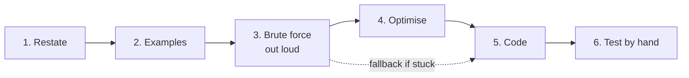

## Before you start

Read `how-to-approach-any-question`. You should know what **time complexity** means at a basic level — see `big-o-notation` — but "this loop looks at every item once" is enough understanding to use this template.

## In one sentence

A coding interview has six steps — **restate, examples, brute force, optimise, code, test** — and you say all six out loud, in that order, before and while you type.

## Why it matters

Most people fail coding interviews at minute two, by typing.

The problem appears. It looks a bit like something you have seen. Your hands start moving. Fifteen minutes later you realise you misread a constraint, and you have no time left to recover.

The fix costs five minutes at the start and saves the whole interview. It also solves a second problem: the interviewer cannot see inside your head. If you type in silence and it does not work, they saw nothing to score. If you narrate a half-right approach, they saw a thinking engineer.

## The intuition

You would not build furniture by picking up a saw and cutting.

You would read the instructions, lay out the parts, check nothing is missing, and only then cut. The cutting is the easy part — it is the part everyone can do. Getting the measurements right before cutting is where the skill is.

Code is the cutting. Steps 1 to 4 are the measuring.

## How it actually works



Note the dotted line. The brute force is not just a stepping stone — it is your parachute. If the clever idea never arrives, you code the slow one and still have something working.

### Step 1 — Restate (1 min)

> "So I'm given ___, and I need to return ___. Is that right?"

### Step 2 — Examples (2 min)

Write a small example and solve it by hand, out loud.

> "Let me work through a small case. If the input is [2, 7, 11] and the target is 9, the answer is indices 0 and 1, because 2 plus 7 is 9."
> "What should I return if there's no answer at all?"
> "Can the input be empty?"

Working one example by hand catches misunderstandings that no amount of staring does.

### Step 3 — Brute force, out loud (2 min)

Say the dumbest solution that works, and its cost.

> "The simplest thing that works is to check every pair. That's two nested loops, so O(n²) time. It's correct but slow. Let me see if I can do better before I write it."

**This is a strength, not a weakness.** Three reasons. It proves you can spot a bad complexity. It gives you a working fallback. And it gives the interviewer a baseline to hint against — "can you avoid the second loop?" is a hint they can only give once you have named the second loop.

### Step 4 — Optimise (3 min)

> "The slow part is searching the array again for each item. If I store what I've already seen in a hash map, that lookup becomes instant — that takes it to O(n) time, using O(n) extra space. I think that trade is worth it. Shall I code that?"

Always name what you are trading. Interviewers score trade-offs.

### Step 5 — Code (15 min)

Narrate the reason for lines, not the typing.

> Bad: "Now I'm typing a for loop."
> Good: "I'll loop once through the array, and for each number check whether its partner is already in the map."

### Step 6 — Test by hand (5 min)

Never say "done". Say:

> "Let me trace through my example. i is 0, num is 2, partner is 7, not in the map yet, so I store 2. i is 1, num is 7, partner is 2 — that's in the map, so I return [0, 1]. Correct."
> "Now the edge cases: empty array returns nothing, one element returns nothing, duplicates — let me check [3, 3] with target 6..."

## Worked example

Problem: *given an array of numbers and a target, return the indices of the two numbers that add up to the target.*

```js
// STEP 3 — the brute force. Say this out loud; code it only if time runs short.
function twoSumBrute(nums, target) {
  for (let i = 0; i < nums.length; i++) {
    for (let j = i + 1; j < nums.length; j++) {
      if (nums[i] + nums[j] === target) return [i, j];
    }
  }
  return null; // no pair found
}

// STEP 4/5 — the optimised version. One pass, remembering what we've seen.
function twoSum(nums, target) {
  const seen = new Map();               // number -> the index we saw it at
  for (let i = 0; i < nums.length; i++) {
    const partner = target - nums[i];   // the number that would complete the pair
    if (seen.has(partner)) return [seen.get(partner), i];
    seen.set(nums[i], i);               // store AFTER checking, so we never pair a number with itself
  }
  return null;
}

console.log(twoSumBrute([2, 7, 11, 15], 9)); // [ 0, 1 ]
console.log(twoSum([2, 7, 11, 15], 9));      // [ 0, 1 ]
console.log(twoSum([3, 3], 6));              // [ 0, 1 ]  duplicates work
console.log(twoSum([1, 2], 100));            // null      no answer
console.log(twoSum([], 5));                  // null      empty input
```

The single line that matters most is the comment on `seen.set`. Storing after the check is what stops `[3, 5]` with target 6 from wrongly pairing the 3 with itself. That is exactly the kind of detail you find by tracing an example by hand in step 6 — and exactly the kind that ships a silent bug if you skip it.

## A second example — when it gets harder

Here is the same problem, answered two ways.

```text
WEAK VERSION
[0:00] Interviewer reads the problem.
[0:15] Candidate starts typing immediately. Silence.
[4:00] "Sorry, one second." Still typing. Still silent.
[9:00] "OK I think this works." Nested loops, O(n squared).
       INTERVIEWER: "Can you do better?"
[9:30] "Umm... maybe sorting? Or... hmm."
[14:00] Silence. Deletes some code. Retypes it.
[20:00] "I'm not sure. Can I have a hint?"

WHAT WENT WRONG:
- Never restated the problem, so the interviewer has no idea
  whether the candidate even understood it.
- Nine minutes of silence: zero signal produced. The interviewer
  could not hint, because they did not know what was being tried.
- Reached the same brute force, but by accident rather than as a
  stated choice. It reads as "this is all I can do" instead of
  "this is my baseline".
- When asked to improve, had nothing to build on, because the
  slow part was never named out loud.

STRONG VERSION — same candidate, same knowledge, script applied
[0:00] "So I'm given an array and a target, and I return the
       indices of two numbers that sum to the target. Right?"
       INTERVIEWER: "Yes."
       ↳ 10 seconds spent. The interviewer now knows you got it.

[0:30] "Can I assume exactly one answer exists, or should I
       handle no-answer? And can the same index be used twice?"
       INTERVIEWER: "Handle no answer. No reusing an index."
       ↳ That second question just prevented a real bug.

[1:00] "Let me try [2, 7, 11] with target 9. 2 plus 7 is 9, so
       I return [0, 1]."
       ↳ Confirms understanding with something concrete.

[2:00] "The obvious approach is checking every pair — nested
       loops, O(n squared). Correct but slow. Let me see if I
       can beat it before writing it."
       ↳ Named the baseline AND signalled they know it's bad.

[3:30] "The waste is re-scanning the array for each number. If
       I remember what I've already seen in a hash map, that
       lookup is instant. One pass, O(n) time, O(n) space.
       Trading memory for speed. Shall I code that?"
       INTERVIEWER: "Go ahead."
       ↳ Named the trade explicitly. This is the sentence that
         separates mid from senior.

[4:00] Codes it, narrating why each line exists.

[12:00] "Let me trace [2, 7, 11, 15], target 9..." [traces it]
        "Now [3, 3] with target 6 — this is why I store after
        checking rather than before, otherwise 3 pairs with
        itself." [traces it] "And empty input returns null."
        ↳ Found and explained the subtle case unprompted.

[15:00] "O(n) time, O(n) space. If memory were tight and the
        array were sorted, two pointers would do it in O(1)
        space instead."
        ↳ Offered an alternative without being asked.
```

Same person. Same algorithm. The second one gets hired, because the interviewer had something to score at every single minute.

## Quick reference

| Step | Minutes | Output | Sentence |
|---|---|---|---|
| 1. Restate | 1 | Shared understanding | "So I'm given ___ and return ___. Right?" |
| 2. Examples | 2 | One case solved by hand | "Let me work through [___]." |
| 3. Brute force | 2 | A baseline + its Big-O | "The simple approach is ___, that's O(___)." |
| 4. Optimise | 3 | A better idea + the trade | "I'll trade space for time using ___." |
| 5. Code | 15 | Working code, narrated | "I'll loop once, and for each item ___." |
| 6. Test | 5 | Trace + 3 edge cases | "Let me trace through my example." |

```json
{
  "restate": "So I'm given ____ and I need to return ____. Is that right?",
  "clarify": ["Can the input be empty?", "Are duplicates possible?", "What do I return if there's no answer?"],
  "example_input": "____",
  "example_output": "____",
  "brute_force": "The simple approach is ____, which is O(____).",
  "optimisation": "The slow part is ____. I can fix it with ____, trading ____ for ____.",
  "edge_cases": ["empty input", "single element", "duplicates", "no valid answer"],
  "final_complexity": { "time": "O(____)", "space": "O(____)" }
}
```

## Common mistakes

- **Typing before speaking.** The most expensive mistake available. Five minutes of talking saves twenty of rewriting.
- **Hiding the brute force because it feels embarrassing.** It is the opposite of embarrassing. Not knowing your solution is O(n²) is embarrassing; naming it is not.
- **Narrating keystrokes instead of reasons.** "Now I'm adding a variable" tells the interviewer nothing. "I need to remember the index, so I'll store it in the map" tells them everything.
- **Saying "done" without testing.** Interviewers wait for it. Trace one example and three edge cases before you claim anything works.
- **Silently rewriting when stuck.** Say what is wrong: "this breaks on duplicates, let me trace [3, 3] to see why." Debugging out loud scores; silent flailing does not.
- **Forgetting to state final complexity.** It is a free point. Always end with time and space.

## What interviewers ask

- **"Can you do better?"** — Almost always yes, and almost always by remembering something you already computed. Look for repeated work first: a hash map or a single pass usually fixes it.
- **"What's the time and space complexity?"** — They are checking you understand the cost of your own code. Count the loops, count the extra data structures.
- **"What if the input doesn't fit in memory?"** — They are pushing you toward streaming or chunking. Say "I'd process it in chunks rather than loading it all" even if you cannot detail it.
- **"Are there any edge cases you haven't handled?"** — If you already tested empty, single, and duplicate inputs in step 6, you answer this in one confident sentence.

## Practice

1. Take a problem you have already solved. Re-solve it, speaking all six steps out loud on a timer, and deliberately state the brute force before writing anything.
2. Solve a medium problem but write **only** the brute force, and spend five minutes explaining out loud exactly which part of it is wasteful. Do not optimise it.
3. Record yourself on a new problem. Play it back and mark every stretch of silence over five seconds. Those are the moments the interviewer had nothing to score.

## Where to go next

`thinking-out-loud` gives you the exact phrases for step 5 — how to narrate without rambling, and how to recover when an approach goes wrong. `when-you-dont-know` covers what to do when step 4 never produces an idea.
