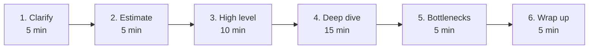

## Before you start

Read `how-to-approach-any-question` first — this topic is that script, expanded for one specific round. You do not need to have designed a real system before. You do not need to know Kafka, Redis, or Kubernetes. The template works without them.

## In one sentence

A **system design interview** asks you to sketch how a large product would be built, and you get through it by following a fixed six-step script on a clock, instead of trying to remember a diagram you saw once.

## Why it matters

"Design Instagram." That is the whole question. There is no input, no expected output, no right answer.

Beginners freeze here more than anywhere else, because there is nothing to grab onto. They either go silent, or they panic and start naming technologies — "we'll use Kafka and Cassandra and a CDN" — without knowing why.

The interviewer is not checking whether you know Cassandra. They are checking whether you can take something huge and vague and break it into pieces in an organised way. That skill is exactly what the script below gives you.

## The intuition

Imagine you are asked to design a house. You would not start by choosing the taps.

You would ask who lives here, how many bedrooms, what the budget is. Then you would sketch the outline — kitchen here, bedrooms upstairs. Only then would you argue about the plumbing. And at the end you would point out the weak spot: "the roof will be the expensive part."

A system design interview is that, on a 45-minute clock. Requirements, rough size, outline, one room in detail, weak spots, summary. Taps last, and only if there is time.

## How it actually works

Six steps. Each one has a time budget. Write the budget on your paper before you start.



The time budget is the real skill. Most candidates spend 30 minutes drawing boxes and never reach a deep dive — and the deep dive is where most of the score lives.

### Step 1 — Clarify (5 minutes)

Ask about two things: what the system must **do** (functional requirements) and how **well** it must do it (non-functional requirements — speed, uptime, scale). Ask these word for word:

> "Let me start with requirements. What are the two or three core things a user must be able to do here?"
> "Is ___ in scope, or can I leave it out for now?"
> "Roughly how many users are we designing for — thousands, millions, or hundreds of millions?"
> "Is this read-heavy or write-heavy? I'd guess mostly reads — is that fair?"
> "How fast does this need to feel? Is a delay of a second acceptable, or does it need to be instant?"
> "Does the data need to be perfectly up to date everywhere, or is a short delay acceptable?"

Then say the sentence that scores points:

> "So to keep this focused, I'll design for these three features and treat the rest as out of scope. Is that OK?"

Cutting scope deliberately looks senior. Trying to design everything looks lost.

### Step 2 — Estimate (5 minutes)

Do arithmetic out loud. Round hard. Nobody wants precision.

> "Let me get a rough sense of the size, so I know whether one database is enough."

### Step 3 — High level (10 minutes)

Draw boxes. **Always draw the same five boxes first**, then adapt:

client → load balancer → application servers → database, with a cache beside the database.

> "Let me draw the basic path first, then we'll make it realistic."

### Step 4 — Deep dive (15 minutes)

Pick **one** component and go deep. Let the interviewer choose if they want:

> "The most interesting part here is probably ___. Would you like me to go deep on that, or is there another area you'd prefer?"

### Step 5 — Bottlenecks (5 minutes)

Attack your own design before they do:

> "Let me point out where this breaks. The weakest part is ___, because ___. Here's how I'd fix it."

### Step 6 — Wrap up (5 minutes)

> "To summarise: the core flow is ___. The main trade-off I made was ___. If I had more time, I'd look at ___."

## Worked example

The question: *"Design a URL shortener."* Here is the script running, annotated.

```text
0:00 — STEP 1, CLARIFY
"Let me start with requirements. As I understand it, users paste a
long URL and get a short one back, and opening the short one
redirects them. Are there two or three other core features?"
  INTERVIEWER: "Just those two, plus basic click counts."
"Is user login in scope, or can I leave it out?"
  INTERVIEWER: "Leave it out."
"Roughly how many links created per day?"
  INTERVIEWER: "10 million."
"And I'd guess reads massively outnumber writes — people click
links far more than they create them. Is 100 to 1 fair?"
  INTERVIEWER: "Sure."
  ↳ ANNOTATION: The candidate proposed a number instead of asking
    an open question. This is the senior move — it gives the
    interviewer something to correct rather than something to
    invent.

0:05 — STEP 2, ESTIMATE
"Let me size this roughly. 10 million writes a day is about 115
per second — let's call it 100. Reads at 100 to 1 is 10,000 per
second. Each record is maybe 500 bytes, so 10 million a day is
5 GB a day, roughly 2 TB a year.
Two conclusions: 100 writes a second is small, a single database
handles that fine. But 10,000 reads a second means the read path
needs a cache. That's the thing that actually shapes the design."
  ↳ ANNOTATION: The numbers are not the point. The two conclusions
    are the point. Never do arithmetic without saying what it
    changed.

0:10 — STEP 3, HIGH LEVEL
"Let me draw the basic path first.
  Client → Load balancer → App servers → Database
                                ↕
                              Cache
Write path: POST with the long URL, app server generates a short
code, saves the pair, returns the short URL.
Read path: GET /abc123, check cache, on a miss read the database,
then redirect with a 301."
  ↳ ANNOTATION: Five boxes, both paths described. Nothing clever
    yet. Clever comes next.

0:20 — STEP 4, DEEP DIVE
"The most interesting part is how we generate the short code.
Would you like me to go deep there?"
  INTERVIEWER: "Yes."
"Three options. Random string — simple, but we must check for
collisions on every write. Hash the URL and take the first seven
characters — same collision problem. Or a counter: each new link
gets the next number, encoded into base62 so it's short. The
counter has no collisions at all, which is why I'd pick it.
The catch is that a single counter is a single point of failure.
So I'd hand each app server a block of a thousand numbers at a
time. Servers only coordinate once per thousand links, and if a
server dies we just lose a few unused numbers — which costs
nothing."
  ↳ ANNOTATION: Options, a pick, a reason, then the problem with
    their own choice, then the fix. That four-part shape is what
    scores in a deep dive.

0:35 — STEP 5, BOTTLENECKS
"Let me point out where this breaks. The database becomes the
bottleneck at 2 TB a year, and popular links will hammer one
row. Cache the hot links — a small percentage of links get almost
all the traffic, so even a modest cache absorbs most reads.
Second weak point: click counting. Writing to the database on
every single click doubles our write load. I'd push counts onto
a queue and total them up in batches. We lose real-time accuracy
on the count, which for analytics is an acceptable trade."
  ↳ ANNOTATION: Naming your own weak spots first is the single
    biggest confidence signal available in this round.

0:40 — STEP 6, WRAP UP
"To summarise: base62 counter with pre-allocated blocks for
writes, cache-first for reads, batched click counts. The main
trade-off was giving up real-time click accuracy for a much
cheaper write path. With more time I'd look at custom short
links and link expiry."
```

## A second example — when it gets harder

The script above assumed you knew the topic. Here is the harder case: **a domain you know nothing about.**

Interviewer: *"Design a system for real-time multiplayer game matchmaking."*

```text
WEAK VERSION
"Umm, I've never worked on games. I guess... a database of
players? And then... you'd match them somehow? Sorry, I don't
really know this area."
  ↳ WHAT WENT WRONG: gave up in one sentence, invited the
    interviewer to move on, and produced zero signal. The
    unfamiliar domain was never the problem — abandoning the
    script was.

STRONG VERSION — same ignorance, script intact
"I haven't built a game system before, so I'll reason from
first principles and you can correct me where I'm off.

[STEP 1] Let me guess the requirements and you tell me if I'm
wrong. A player presses 'play', waits in some kind of queue, and
gets put into a match with players of roughly similar skill,
reasonably quickly. Is that the core of it?"
  INTERVIEWER: "That's exactly it."

"Two follow-ups. Is it worse to wait a long time, or to get an
unfair match? And how many players in a match — two, or a team?"
  INTERVIEWER: "Unfair matches are worse. Teams of five."

  ↳ ANNOTATION: That first answer just handed over the core design
    constraint. The candidate got it by asking, not by knowing.

"[STEP 2] Let's say a million daily players, and at peak maybe
50,000 waiting at once. Teams of five means 10,000 matches
forming from that pool. That's small enough to hold the whole
waiting queue in memory, which simplifies things a lot.

[STEP 3] So: client → matchmaking service → an in-memory pool of
waiting players, grouped into skill buckets → a game server
allocator once ten players are matched.

[STEP 4] The interesting part is the skill bucket. Since you said
unfair matches are worse than waiting, I'd start with a narrow
skill range and widen it the longer someone waits. So a player
waiting ten seconds only matches near-identical skill, and one
waiting two minutes matches a wider band. That directly encodes
the trade-off you gave me."
  ↳ ANNOTATION: They know nothing about games. Every design
    decision came from an answer the interviewer gave them in
    step 1. This is what "reason from first principles" actually
    looks like in practice.
```

The lesson: the script does not require knowledge. It manufactures it, by asking.

## Quick reference

| Step | Minutes | You must produce | Say |
|---|---|---|---|
| 1. Clarify | 5 | 3 features, scale, read/write mix | "What are the two or three core things a user must do?" |
| 2. Estimate | 5 | Requests/sec, storage, one conclusion | "Let me size this roughly, so I know if one DB is enough." |
| 3. High level | 10 | Five boxes, both paths | "Let me draw the basic path first." |
| 4. Deep dive | 15 | Options, pick, reason, fix | "The interesting part is ___. Shall I go deep there?" |
| 5. Bottlenecks | 5 | Two weak spots + fixes | "Let me point out where this breaks." |
| 6. Wrap up | 5 | Summary, trade-off, next step | "The main trade-off I made was ___." |

Fill this in for any design question before you speak:

```json
{
  "functional": ["____", "____", "____"],
  "out_of_scope": ["____"],
  "scale": { "daily_users": "____", "read_write_ratio": "____" },
  "estimate": { "writes_per_sec": "____", "reads_per_sec": "____", "storage_per_year": "____" },
  "conclusion_from_numbers": "____",
  "boxes": ["client", "load balancer", "app servers", "cache", "database"],
  "deep_dive_component": "____",
  "bottleneck_1": "____",
  "tradeoff_i_made": "____"
}
```

## Common mistakes

- **Naming technologies before requirements.** "We'll use Kafka" in minute two is the clearest beginner signal there is. Kafka solves a problem you have not yet shown you have.
- **Designing everything.** Trying to cover ten features shallowly scores far worse than three features properly. Cut scope out loud, deliberately.
- **Doing arithmetic with no conclusion.** If you calculate 10,000 reads per second and then move on, the numbers were decoration. Always finish with "so this means ___".
- **Never reaching the deep dive.** Watch the clock. At minute 20 you must be going deep on something, even if the high-level sketch is unfinished.
- **Waiting for the interviewer to find your flaws.** Point them out yourself in step 5. It converts a weakness into a display of judgement.
- **Drawing in silence.** Narrate every box as you draw it. A silent diagram scores nothing.

## What interviewers ask

- **"How would you scale this to 10x the users?"** — They want you to find the component that breaks first and fix just that one, not redesign everything. Say which box breaks and why.
- **"What happens if this component goes down?"** — They are testing whether you thought about failure at all. Pick any box and explain what the user sees when it dies.
- **"Why did you choose that database?"** — They want a trade-off, not a brand. "Reads massively outnumber writes and the data has no complex relationships, so I chose ___" beats naming any product.
- **"What's the bottleneck in your design?"** — If you already answered this in step 5, you have won this question before it was asked.

## Practice

1. Set a 45-minute timer and design a URL shortener out loud, keeping to the six time boxes. Do not aim for a good design. Aim to be in the right step at the right minute.
2. Design something you know nothing about — an airline booking system, a hospital scheduler — and complete step 1 fully. Notice how many design decisions the requirements alone hand you.
3. Take a design you have already done and spend five minutes only on step 5: list every way it breaks. Aim for five failures and a fix for each.

## Where to go next

`asking-clarifying-questions` sharpens step 1, which is where most of the score is won. `how-to-approach-coding-problems` applies the same six-step shape to a much smaller problem, on a shorter clock.
