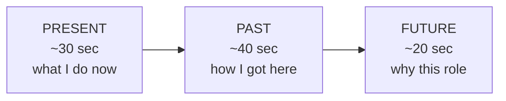

## Before you start

You need your CV in front of you. That is the only prerequisite — this topic builds the answer directly from it. Reading `how-to-approach-behavioral` first helps, but is not required.

## In one sentence

"Tell me about yourself" is not a question about your life — it is a 90-second pitch built from three parts of your CV, **Present, Past, Future**, ending with why you are sitting in this particular room.

## Why it matters

This is the first question in almost every interview, and it is the one people prepare least.

That is backwards. It is the only question you know is coming. It sets the tone for everything after it. And a rambling answer here makes the interviewer decide, in the first two minutes, that you are disorganised — a judgement that colours how they hear your technical answers later.

It is also the easiest question in the entire interview to get right, because you can write it down in advance and say the same thing every time.

## The intuition

Think of a film trailer.

A trailer is 90 seconds. It does not tell you the whole plot. It shows you what kind of film this is, the two or three best moments, and it ends by making you want to watch the film.

Your intro is a trailer for you. Not your autobiography. Not a list of everything on your CV — they already have your CV. Three highlights and a reason to keep watching.

## How it actually works

Three blocks, in this order.



**Present (30 sec)** — your current role in one sentence, then what you actually work on.

**Past (40 sec)** — one or two things from your CV that best match *this job*. Not everything. The two that matter here.

**Future (20 sec)** — why this company, this role, now. This is the part almost everyone skips, and it is the part that makes the answer feel aimed rather than recited.

### How to pull it out of your CV

Take your CV and do this in order.

1. **Read the job description.** Underline the three things they mention most.
2. **Find those three on your CV.** Whatever lines up, that is your Past section.
3. **Cross out everything else.** Your first internship, the language you used once, the club you ran — out. Not because it does not matter, but because it does not matter *here*.
4. **Find one number.** Any number from your CV: users served, time saved, percentage improved, team size. One number makes the whole thing land as real.
5. **Write the Future sentence last**, and make it specific to this company.

### The literal script

> "Sure. **[Present]** I'm currently a ___ at ___, where I mainly work on ___. **[Past]** I got here by ___ — before this I ___, and the project I'm proudest of is ___, where I ___ and ___ [the number]. **[Future]** What draws me to this role is ___, and it's a natural next step because ___."

## Worked example

Three versions of the same template, for three different people.

```text
─────────────────────────────────────────────────────────
EXAMPLE 1 — FRESHER, no job yet
Role applied for: Junior Backend Engineer (Node.js)

CV LINES USED: final-year project, one internship, one course.
Everything else cut.

"Sure. [PRESENT] I finished my computer science degree in June,
and I've spent the last few months building backend services in
Node.js — mostly to get real practice beyond coursework.

[PAST] The project I'm proudest of is my final-year one: a
booking system for my college's lab equipment. Before that,
students booked slots on a paper sheet and double-bookings
happened constantly. I built the API and the database schema,
and the part I found hardest was handling two people booking
the same slot at the same moment — I ended up learning about
database transactions to solve it properly. About 200 students
used it in the final semester.

I also did a three-month internship where I worked on a REST
API, which is where I first saw how code gets tested and
deployed rather than just written.

[FUTURE] What draws me to this role is that it's Node.js
backend work on a product with real users — the transaction
problem in my project is exactly the kind of thing I want to
work on properly, with people who've solved it before."

  ↳ ANNOTATION: No commercial experience, and it does not
    matter. There is a concrete problem, a specific technical
    thing learned, a number (200 students), and honesty about
    being early. It never apologises for being a fresher.

─────────────────────────────────────────────────────────
EXAMPLE 2 — 3 YEARS EXPERIENCE
Role applied for: Backend Engineer, payments team

CV LINES USED: current role, one project matching payments,
one showing ownership. Two older jobs cut entirely.

"Sure. [PRESENT] I'm a backend engineer at a logistics company,
where I've been for two and a half years. Day to day I work on
the order service — it's the piece that everything else in the
system talks to, so a lot of my work is about keeping it fast
and keeping its API stable while other teams change around it.

[PAST] The work closest to this role was a project last year
where I moved our payment retries off the request path. We were
losing about three percent of orders to timeouts when the
payment provider was slow. I moved retries onto a queue with
backoff, and that dropped to under half a percent. That project
taught me most of what I know about idempotency — making sure a
retried payment never charges twice.

Before that I was at a smaller startup where I was one of three
engineers, which is where I got used to owning something end to
end rather than just my part of it.

[FUTURE] I'm looking at payments specifically because that
retry project was the most interesting work I've done, and here
it would be the whole job rather than one quarter of one. And
your scale is a step up from anything I've handled, which is
the part I actually want."

  ↳ ANNOTATION: Every sentence in Past points at the payments
    job being applied for. Two numbers. Names a real concept
    (idempotency) and explains it in the same breath. The
    Future is honest about wanting a bigger problem.

─────────────────────────────────────────────────────────
EXAMPLE 3 — SENIOR
Role applied for: Senior/Staff Engineer, platform team

CV LINES USED: scope, one architectural decision, one people
outcome. Individual features cut — at this level they are noise.

"Sure. [PRESENT] I'm a senior engineer at a fintech company,
leading a team of five on our internal platform — the tooling
and services the other twelve engineering teams build on top of.

[PAST] The thing I'd point to is a migration I led over the
last eighteen months. We had a monolith that took forty minutes
to deploy, so teams batched changes and every release was
risky. Rather than a full rewrite, I argued for pulling out the
three highest-change services first and leaving the rest alone.
That was an unpopular call at the time — several people wanted
the full break-up — but it got deploy times to under five
minutes for the teams that were suffering most, within two
quarters instead of two years.

The part I'm most pleased about isn't the architecture though;
it's that two engineers on my team ran their own extractions by
the end of it, using the pattern from the first one.

[FUTURE] I'm looking for a platform role specifically because
that's the work I keep gravitating back to — building the thing
other engineers build on. What interested me about this role is
that you're at the stage where those decisions are still open."

  ↳ ANNOTATION: Scope first (team size, teams served). The
    story is a judgement call with a defensible trade-off,
    including that it was contested — senior candidates are
    scored on decisions, not features. The people outcome is
    deliberate. Numbers throughout.
```

## A second example — when it gets harder

The same three-years person, unprepared.

```text
WEAK VERSION
"Okay so, I was born in Pune, and I did my schooling there, and
then I went to college for computer science — I actually wanted
to do electronics at first but I switched in second year. Then
I joined a startup, that was in 2021 I think, or end of 2020.
I did some frontend there, some backend, a bit of everything
really. Then I moved to my current company where I'm doing
backend. I know Java, Python, JavaScript, some React, a little
Docker, and I'm learning Kubernetes. I'm looking for new
opportunities and growth. Yeah, that's about me."

WHAT WENT WRONG:
- Started at birth. The first 25 seconds carry zero information
  relevant to the job.
- "I actually wanted to do electronics" — an interesting fact
  that costs time and adds nothing.
- "2021 I think, or end of 2020" — vagueness about their own CV
  reads as either careless or dishonest.
- "a bit of everything really" — the phrase that erases whatever
  they actually did. No project, no problem, no number.
- The technology list is the worst part: it is already on the
  CV, it is being read aloud, and "a little Docker" volunteers
  a weakness for free.
- "looking for growth" — a sentence that fits every candidate
  applying to every company. It says nothing.
- Zero connection to the payments role they are interviewing for.
  The interviewer cannot tell why this person is in the room.

THE FIX — same person, same facts:
  born in Pune, schooling ................ → cut entirely
  electronics switch ..................... → cut entirely
  "2021 I think" ......................... → cut the dates; say "two and a half years"
  "a bit of everything" .................. → one project: the payment retry work
  the technology list .................... → replaced by ONE concept used in context
  "looking for growth" ................... → "payments specifically, because ___"
```

The rule that fixes most weak intros: **if a sentence would be true for any other candidate, delete it.**

## Quick reference

| Block | Time | Pull from your CV | Never include |
|---|---|---|---|
| Present | ~30s | Current title + what you actually work on | Where you were born, your schooling |
| Past | ~40s | The 1–2 items matching *this* job, with one number | A list of technologies |
| Future | ~20s | Why this company, this role | "Looking for growth" |

```json
{
  "present": "I'm currently a ____ at ____, where I mainly work on ____.",
  "past_project": {
    "problem": "The situation was ____",
    "what_i_did": "I ____",
    "number": "____",
    "what_it_taught_me": "____"
  },
  "past_secondary": "Before that I ____, which is where I learned ____.",
  "future": "What draws me to this role is ____, and it's a next step because ____.",
  "cut_list": ["birthplace", "schooling", "technology lists", "unrelated jobs", "generic ambitions"],
  "target_seconds": 90
}
```

## Common mistakes

- **Starting at birth.** Start at your current role and go backwards only as far as it is relevant.
- **Reading your CV aloud.** They have it. Reading it is the fastest way to sound like you have nothing to add.
- **Listing technologies.** "Java, Python, React, Docker" tells them nothing about whether you can use any of them. One concept used in context beats ten names.
- **The same intro everywhere.** The Future block must change per company. If it does not, they can hear it.
- **Going over three minutes.** After 90 seconds the interviewer is waiting for you to stop. Time it.
- **Apologising for your level.** "I'm only a fresher, so…" Never do this. State what you have done and let them judge.

## What interviewers ask

- **"Tell me about yourself."** — They are testing communication and whether you understand the role, not your history. Give the 90-second version, then stop.
- **"Walk me through your resume."** — A different question. Here they *do* want chronological order — but still emphasise the roles relevant to this job and move quickly through the rest.
- **"Why do you want this role?"** — Your Future block, expanded. If you prepared it properly, you have already half-answered this.
- **"What's your biggest strength?"** — Answer with the same project from your Past block. Reusing your prepared material is a feature; it makes your story consistent.

## Practice

1. Fill in the JSON template from your actual CV. Read it aloud with a timer. If you are over 100 seconds, cut from Present first, then Past.
2. Write three different Future blocks for three real job postings. Notice how much stronger the specific one feels than "looking for growth".
3. Record your intro, then listen back and ask: could this be any other candidate? Every sentence that could be, delete it and replace it with something only you could say.

## Where to go next

`how-to-approach-behavioral` turns the project you mentioned in your Past block into a full STAR story — because the follow-up question is almost always "tell me more about that project". `thinking-out-loud` covers the phrases that keep you fluent when a question is not one you rehearsed.
