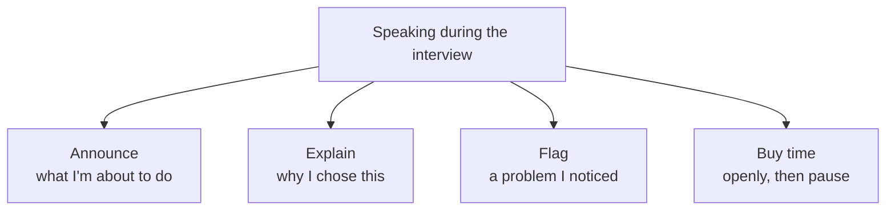

## Before you start

Read `how-to-approach-any-question` for the opening script. This topic covers the other 40 minutes — what you say while you are actually working.

## In one sentence

**Thinking out loud** means saying your reasoning while you work, so the interviewer can follow you — and doing it in short, purposeful sentences rather than a continuous stream of everything in your head.

## Why it matters

Interviewers score what they can hear. That is the whole reason.

Two candidates reach the same solution. One worked silently for twenty minutes. One narrated. The silent one produced no evidence of thinking, and no opportunity to be helped. When both get stuck, only one can be rescued by a hint, because only one revealed where they were.

But there is an opposite failure that people rarely warn about: talking constantly without saying anything. "So I'm thinking, um, maybe an array, or actually maybe not an array, hmm, let me see, so if I..." — that is noise. It sounds like panic and it is exhausting to listen to.

The target is between the two: a sentence every fifteen to twenty seconds, each one carrying a decision, a reason, or a plan.

## The intuition

Think of a sports commentator versus a nervous passenger giving directions.

The commentator says: "He's going wide, looking for the cross — and that's a good ball in." Short. Each sentence describes what is happening and why it matters.

The nervous passenger says: "Okay so maybe turn here, no wait, not here, or maybe here, actually I think it was the next one, hang on..." Same amount of talking. No information.

You want to commentate on your own thinking, not panic out loud next to it.

## How it actually works

Every sentence you say should do one of four jobs.



If a sentence does none of those four, it is filler. Cut it.

### Phrases that buy thinking time

The key trick: **announce the pause, then take it.** Silence after a signal reads as thinking. Silence without one reads as stuck.

> "Let me think about that for a few seconds."
> "That's a good question — give me a moment to get this right."
> "Let me write down what I know first."
> "I want to work through a small example before I answer."
> "Let me draw this out, it'll be easier to see."

Any of these buys you 10 to 20 seconds of completely acceptable silence. Use them freely.

### Phrases that narrate a decision

> "I'm going to use ___ here, because ___."
> "There are two options: ___ or ___. I'll go with the first because ___."
> "I'm choosing to ignore ___ for now, and I'll come back to it if there's time."
> "This is the part I'm least sure about, so I'll flag it and keep going."

### Phrases that narrate progress

> "So far I have ___. What's still missing is ___."
> "That part works. Now the harder bit — ___."
> "Let me check that against the example before I go further."

### Phrases that recover a wrong path

This is the one people most need and least have. Say it plainly:

> "Actually, I don't think this approach works, and here's why: ___."
> "I've been going down the wrong path — the problem is ___. Let me go back to ___."
> "Let me stop and re-read the question, I think I missed something."

Then do it. Saying it out loud costs you nothing. Silently deleting code while looking worried costs you a lot.

## Worked example

A candidate solving "find the first non-repeating character in a string." Every spoken line is labelled with its job.

```text
[ANNOUNCE] "Let me restate: I'm given a string, and I return the
first character that appears exactly once. If there isn't one, I
return null. Right?"
  INTERVIEWER: "Yes."

[BUY TIME] "Let me work through a small example first."

[NARRATE] "Take 'swiss'. s appears three times, w once, i once.
So the answer is w, because it's the first one with a count of
one — even though i also appears once."
  ↳ Solving one example by hand exposed the word 'first', which
    is the part of this problem people get wrong.

[EXPLAIN] "That tells me I need two things: how many times each
character appears, and the original order. So one pass to count,
then a second pass in original order to find the first with a
count of one."

[ANNOUNCE] "I'll use a Map for the counts, because it keeps
insertion order — that means I might get away with one pass at
the end instead of re-scanning the string. Let me code it."

[silence while typing — about 20 seconds]

[NARRATE PROGRESS] "So the first loop is done, I've got counts.
Now the second loop over the string."

[FLAG] "Actually, one thing I should check — the question didn't
say whether uppercase and lowercase count as the same character.
I'll assume they're different, but flag it as an assumption."
  ↳ Flagging beats guessing. If the assumption is wrong, the
    interviewer corrects it now.

[RECOVER] "Hang on. I'm looping over the Map, but the Map only
has unique characters — that's actually fine for order, but let
me trace it to be sure rather than assume. 'swiss': the Map
gets s, w, i in that order. First one with count 1 is w.
Correct. Good, the Map order does work."
  ↳ Caught a doubt, resolved it by tracing instead of guessing.
    This is the highest-scoring 15 seconds in the whole answer.

[WRAP] "Two passes, O(n) time, O(k) space where k is the number
of distinct characters. If it were guaranteed ASCII, I'd use a
fixed array of 128 counts instead and drop the Map."
```

```js
function firstNonRepeating(str) {
  const counts = new Map();
  for (const ch of str) counts.set(ch, (counts.get(ch) || 0) + 1);
  // Map preserves insertion order, so the first count-1 entry is the earliest character
  for (const [ch, n] of counts) if (n === 1) return ch;
  return null;
}

console.log(firstNonRepeating('swiss'));   // w
console.log(firstNonRepeating('aabb'));    // null
console.log(firstNonRepeating(''));        // null
console.log(firstNonRepeating('aA'));      // a  — case-sensitive, the flagged assumption
```

## A second example — when it gets harder

Two failure modes, both fixable.

```text
FAILURE MODE 1 — TOO SILENT
[0:30] Interviewer finishes reading the problem.
[0:31 – 4:10] Complete silence. Candidate is thinking hard and
              genuinely making progress. The interviewer sees a
              person staring at a screen for four minutes.
[4:11] "Okay, I think I'll use a hash map."
[4:12 – 9:00] Silence again. Typing.
[9:01] "It doesn't work."
       INTERVIEWER: "What have you tried?"
[9:10] "Um, a few things."

WHAT WENT WRONG: nine minutes produced two sentences of evidence.
The interviewer cannot hint, because they do not know what was
tried. Worse, at 9:01 the candidate has to summarise nine minutes
of thinking on the spot, under stress, which never goes well.

THE FIX — one sentence every 20 seconds:
  [0:31] "Let me think for a few seconds." → silence is now fine
  [0:50] "The naive way is checking every pair, O(n squared)."
  [1:20] "The waste is re-scanning. A hash map fixes that."
  [1:40] "Coding it now — one pass, storing what I've seen."
  [4:00] "That part works. Now handling duplicates."
Same nine minutes. Five sentences. Completely different score.

─────────────────────────────────────────────────────────
FAILURE MODE 2 — RAMBLING
"Okay so I'm thinking maybe we could use an array, or actually a
set might be better, although a set doesn't keep order does it,
hmm, or maybe I sort it first, but sorting is n log n so that's
probably worse, unless, hmm, actually wait, maybe two pointers?
No. Hmm. Or a hash map? I'm not sure. What do you think?"

WHAT WENT WRONG:
- Six ideas named, none evaluated. Every one abandoned mid-
  sentence.
- The interviewer cannot follow, and cannot help, because no
  single idea was held long enough to discuss.
- "What do you think?" at the end hands the problem back. It
  reads as giving up, not collaborating.
- The real problem is not too many words. It is that no sentence
  finished with a reason.

THE FIX — same ideas, one at a time, each finished:
  "Let me think for a few seconds." [pause — this is allowed]
  "Two options seem plausible: sorting, or a hash map."
  "Sorting is O(n log n) and loses the original indices, which I
   need. So I'll rule that out."
  "The hash map is O(n) and keeps indices. I'll go with that."
Four sentences. Each one completes a thought. Same thinking,
visible instead of leaked.
```

The rule that fixes both: **finish every sentence with a reason.** "I'll use a hash map" is a fragment. "I'll use a hash map, because I need constant-time lookups" is a thought.

## Quick reference

| Situation | Say this | Do not say |
|---|---|---|
| Need to think | "Let me think for a few seconds." | [silence] |
| Choosing an approach | "I'll use ___, because ___." | "Maybe ___? Or ___? Hmm." |
| Uncertain about a detail | "I'll assume ___, flagging that." | [guess silently] |
| Approach is failing | "This doesn't work because ___. Let me go back to ___." | [delete code quietly] |
| Genuinely stuck | "Here's what I've ruled out and why: ___." | "I don't know." |
| Finished a part | "That works. Now ___." | [keep typing] |
| Long silence coming | "I'm going to be quiet for a minute while I work through this." | [just go quiet] |

```json
{
  "cadence_target": "one sentence every 15-20 seconds",
  "buy_time": ["Let me think for a few seconds.", "Let me work through a small example."],
  "announce": "I'm going to ____ next.",
  "explain": "I'm choosing ____ because ____.",
  "flag": "I'll assume ____, flagging that as an assumption.",
  "recover": "This approach doesn't work because ____. Let me go back to ____.",
  "rule": "every sentence ends with a reason"
}
```

## Common mistakes

- **Treating silence as free.** In your head it is thinking. From outside it is indistinguishable from being stuck. Announce it and the silence becomes fine.
- **Narrating keystrokes.** "Now I'm adding a variable called i" is noise. Narrate decisions, not typing.
- **Abandoning ideas mid-sentence.** Naming six approaches and finishing none looks worse than committing to one imperfect idea.
- **Hiding a wrong turn.** Silently rewriting looks like flailing. Announced, the same rewrite looks like debugging.
- **Handing the problem back.** "What do you think?" is giving up. "Here's where I'm stuck and what I've ruled out — am I missing something?" is collaborating.
- **Apologising repeatedly.** "Sorry, this is taking long" spends time and adds doubt. Just continue.

## What interviewers ask

- **"What are you thinking?"** — You have been silent too long. Answer with your current state: what you have, what is missing, what you are trying. Then keep the cadence up.
- **"Why did you choose that?"** — Either they disagree, or you never gave a reason. Give the trade-off. If you realise the choice was wrong, say so and switch.
- **"Do you want a hint?"** — Say yes. Refusing a hint to look strong wastes time you do not have. Accepting one and using it well scores fine.
- **"Talk me through what you have so far."** — Summarise in three sentences: what works, what does not, what is next. Practise this — it comes up in almost every interview.

## Practice

1. Solve a problem you already know, with a metronome or timer beeping every 20 seconds. You must say a complete sentence at each beep. It feels absurd; it builds the cadence.
2. Record yourself on a new problem. Play it back and mark every sentence as announce, explain, flag, buy-time, or filler. Aim for under 20 percent filler.
3. Deliberately start a problem with an approach you know is wrong. Practise the recovery sentence out loud at the moment you abandon it. This is the hardest phrase to say under pressure, so rehearse it when there is no pressure.

## Where to go next

`when-you-dont-know` covers what to narrate when you have no idea at all — the hardest case, and the one where honest narration scores best.
