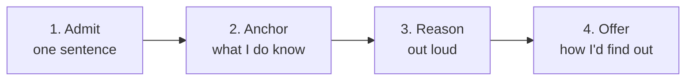

## Before you start

Read `thinking-out-loud` — this topic is the hardest case of it. Nothing technical is required.

## In one sentence

When you do not know an answer, you say so in one short sentence and then immediately show how you would work it out — because interviewers score reasoning, and only bluffing scores zero.

## Why it matters

This will happen. Not might — will. Interviewers deliberately ask past the edge of your knowledge to see what you do there.

So the question is never "how do I know everything?" It is "what do I do at the edge?" And there are only three options: bluff, freeze, or reason honestly. Two of them fail, and one of them can score better than a correct answer to an easier question.

That is not a comforting story. It is a real effect. "I don't know, but here's how I'd find out" is what a senior engineer says at work every week, and interviewers know it.

## The intuition

Imagine hiring a plumber. You point at a pipe and ask what the noise is.

Plumber A says confidently: "That's the pressure valve, definitely." They are wrong, and you find out in a week when your ceiling is wet.

Plumber B says: "I'm not sure from the sound alone. It's probably one of three things — air in the system, a loose bracket, or pressure. I'd check the bracket first because it's the cheapest to rule out."

Plumber B did not know either. But you would hire Plumber B, because you now know exactly how they would handle any problem, including the ones you have not found yet.

Interviewers are hiring Plumber B.

## How it actually works

Four steps. Total time: about 90 seconds.



**Step 1 — Admit, once, briefly.** One sentence. Do not apologise repeatedly, do not explain why you never learned it.

> "I haven't worked with that directly."
> "I don't know that one — but let me reason through it."

Then move immediately. Lingering on the gap is what makes it look bad.

**Step 2 — Anchor on what you do know.** Find the nearest thing you understand.

> "I haven't used ___, but I have used ___, which I think solves a similar problem. Can I reason from that?"
> "I know it's related to ___. Let me start there."

**Step 3 — Reason out loud from first principles.** This is where the points are. What must be true? What would it have to do? What are the trade-offs any solution here would face?

> "Let me think about what it would have to do. If the goal is ___, then it needs to handle ___ and ___. The hard part would be ___."
> "There are probably two approaches: ___ or ___. Each has a cost — ___ versus ___."

**Step 4 — Offer how you would find out.** This is the sentence that reads as senior.

> "In practice I'd read the docs and write a small test to confirm the behaviour before relying on it."
> "I'd check with whoever owns that service, because guessing at their guarantees would be risky."

Then, honestly: *do* look it up after the interview. If there is a follow-up email, mentioning what you found is a genuine positive.

## Worked example

Question: *"How would you handle a thundering herd problem?"* The candidate has never heard the term.

```text
[STEP 1 — ADMIT, 5 seconds]
"I haven't come across that term before. Can I reason about what
it might mean from the name, and you can correct me?"
  INTERVIEWER: "Go ahead."
  ↳ ANNOTATION: One sentence, no apology, and a request that
    invites the interviewer to collaborate rather than judge.
    Asking permission to reason turns a gap into an exercise.

[STEP 2 — ANCHOR, 20 seconds]
"'Herd' suggests many things arriving at once, and 'thundering'
suggests they all arrive at the same moment rather than spread
out. The closest thing I've dealt with is a cache expiring — we
had a popular item cached, and when it expired, every request
that came in during the gap went to the database at once, and
the database struggled. Is it that shape of problem?"
  INTERVIEWER: "That's exactly it."
  ↳ ANNOTATION: The candidate did not know the term but had
    lived the problem. Anchoring found it. They now effectively
    know the answer.

[STEP 3 — REASON, 45 seconds]
"Then let me think about what fixes it. The core issue is that
many identical requests do the same expensive work at the same
time, when only one of them needs to.

So the first idea: only let one request through. When the cache
misses, the first request takes a lock and recomputes, and the
others wait for it and share the result. That's efficient but it
means everyone waits on one request, and if that one is slow,
they all are.

Second idea: stop them arriving at the same moment. If the
expiry time had a small random offset per key, the herd would
spread out instead of hitting one instant. That's simpler and
needs no coordination, but it only smooths the spike — it
doesn't prevent it.

Third, and probably best if the data allows it: refresh the
cache before it expires, in the background, so there's never a
gap where the value is missing. That costs some unnecessary
refreshes on unpopular keys, which is fine if the item is
genuinely hot."
  ↳ ANNOTATION: Three approaches, each with its cost, all
    derived from the problem rather than recalled. This is the
    part being scored, and it is indistinguishable from what
    someone who knew the term would say.

[STEP 4 — OFFER, 15 seconds]
"I don't know what the standard name or solution is called, so
I'd read up on it properly — I'd want to know which of these is
the usual first choice and why, rather than guessing from three
options I just invented."
  INTERVIEWER: "The lock approach is usually called request
  coalescing, and the random offset is called jitter. You got
  both."
```

They started knowing nothing about the term. They finished having independently derived the two standard solutions. The admission at the start cost five seconds and made everything after it credible.

## A second example — when it gets harder

The same question, two ways to fail.

```text
FAILURE MODE 1 — THE BLUFF
INTERVIEWER: "How would you handle a thundering herd problem?"

"Right, yes, thundering herd — so you'd typically use a load
balancer for that, and maybe add more servers to handle the
load. You could also use Kubernetes to autoscale. And caching
helps a lot with these kinds of issues generally."

WHAT WENT WRONG:
- Confident tone, no content. "Load balancer" and "autoscale"
  are things the candidate knows, deployed at a problem they
  do not understand.
- "Caching helps with these kinds of issues" — the herd is
  CAUSED by a cache. The answer reveals the term was not
  understood at all.
- The interviewer now has a much worse problem than a knowledge
  gap: they cannot trust anything else this candidate said
  confidently earlier in the interview.
- Every follow-up question ("which part does the load balancer
  solve?") makes it worse. Bluffs cannot survive one probe.

The bluff is not just a wrong answer. It converts a small gap
into a question about your honesty.

─────────────────────────────────────────────────────────
FAILURE MODE 2 — THE COLLAPSE
INTERVIEWER: "How would you handle a thundering herd problem?"

"Oh. Um. I don't know that one. Sorry — I've not really done
much with that kind of thing. I think I've maybe heard the term
but I couldn't tell you. Sorry."
  INTERVIEWER: "That's fine, let's move on."

WHAT WENT WRONG:
- The admission was correct. Everything after it was wasted.
- Three apologies. Each one makes the gap feel larger than it is
  and spends time that could have produced reasoning.
- Never attempted step 2. The candidate almost certainly HAD
  hit a cache stampede in real work — they just never went
  looking, because the missing word stopped them.
- "Let's move on" means zero points from a question they could
  have scored well on.

WHAT TO SAY INSTEAD — the whole fix is one sentence:
  "I don't know that term — can I reason about what it might
   mean from the name?"
That single sentence converts a dead end into 90 seconds of
scoreable thinking. It is the highest-value sentence in this
chapter, and it costs nothing to say.
```

## Quick reference

| Your situation | Say | Never say |
|---|---|---|
| Never heard the term | "I don't know that term — can I reason from the name?" | "Yes, I've used that." |
| Know it vaguely | "I know it relates to ___, let me build from there." | A confident wrong definition |
| Know the concept, forgot the details | "I know the idea; I'd check the exact syntax in the docs." | Inventing plausible syntax |
| No story for a behavioural question | "I don't have a direct example — can I give a close one?" | Making up a story |
| Truly nothing, even after trying | "I'd have to learn this — here's how I'd start." | "I don't know." full stop |

```json
{
  "admit": "I haven't worked with ____ directly.",
  "ask_permission": "Can I reason about what it might mean, and you correct me?",
  "anchor": "The closest thing I've dealt with is ____.",
  "reason": [
    "The core problem seems to be ____.",
    "One approach would be ____, which costs ____.",
    "Another would be ____, which trades ____ for ____."
  ],
  "offer": "I'd read the docs and write a small test before relying on it.",
  "never": ["bluff", "apologise more than once", "say 'I don't know' and stop"]
}
```

## Common mistakes

- **Bluffing.** The worst option available. It fails on the first follow-up and it puts every earlier confident answer in doubt.
- **Apologising more than once.** One acknowledgement. Then work. Repeated apology spends time and amplifies a small gap.
- **Stopping at "I don't know".** True, and worth zero. The next sentence is the whole point.
- **Not anchoring.** People often have the experience but not the vocabulary. Before concluding you know nothing, ask what this resembles.
- **Guessing syntax.** Saying "I'd use the sort method, though I'd check the exact arguments" is fine. Inventing a method that does not exist is a bluff in miniature.
- **Letting it colour the rest of the interview.** One unknown question is normal. Carrying the embarrassment into the next three is what actually costs you the offer.

## What interviewers ask

- **"What would you do if you didn't know how to solve something at work?"** — A direct test of this exact skill. Answer with a real process: reproduce it, read the docs, search the codebase for prior art, then ask someone specific with a clear question.
- **"Have you used ___?"** — Answer honestly and immediately. "No, but I've used ___ which is similar in ___" is a complete, good answer. Never say yes to something you have not used.
- **"Take a guess."** — This is an invitation to reason out loud, not to gamble. Say "then let me reason it through" and give your logic, labelling it as a guess.
- **"How do you keep up with new technology?"** — They are checking you can learn without being taught. A specific answer — one blog, one habit, one recent thing you learned and why — beats "I read a lot".

## Practice

1. Have a friend ask you five technical questions deliberately outside your knowledge. Practise the four steps on each. Time it — 90 seconds per answer, no apology after the first sentence.
2. Take one term you genuinely do not know. Before looking it up, spend three minutes reasoning aloud about what it would have to do and why it would exist. Then look it up and compare. You will be closer than you expect.
3. Record yourself answering something you do not know, and count your apologies. Redo it until there is exactly one.

## Where to go next

`asking-clarifying-questions` is the other half of this skill — good questions often reveal that you knew enough all along. Then `thinking-out-loud` to keep the reasoning fluent while you do it.
