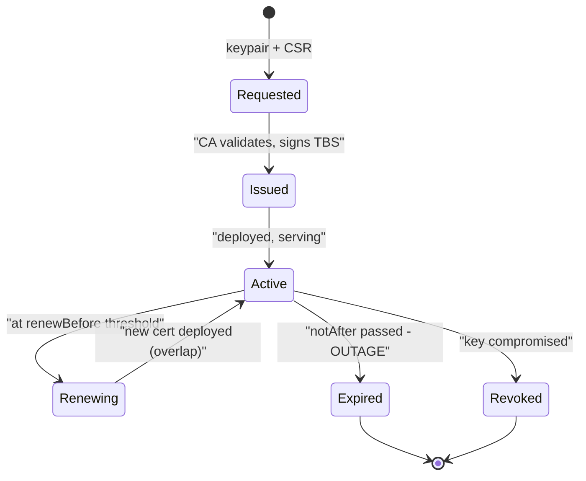

## Before you start

Read `pki-and-certificate-authorities` first — who issues certificates, and why short lifetimes beat revocation. `tls-and-certificates` establishes the fact this topic builds on: expiry is checked by every client independently, so a lapsed certificate is an instant total outage.

## In one sentence

Every certificate has a fixed expiry date that nothing can extend, so running services safely means replacing certificates *before* that date with **overlapping validity windows**, automatically, monitored from outside.

## Why it matters

Certificate expiry is the most predictable outage in software, and it still takes down major services every year. The operational consequences are worse than "it stops working" suggests.

There is nothing to catch early. At 00:00 the service is fine; at 00:01 every new connection fails. No rising error rate, no canary that goes bad first.

Your own monitoring will probably say everything is healthy: the process is up, memory is normal, its health check passes — because *the server is not the thing rejecting the certificate*. The clients are, so the failure lives on the other side of a boundary your dashboards may not cross.

Retries amplify it. Every client reconnects, fails, and backs off into a thundering herd; pools drain and cannot refill. On an internal service the failure fans out — every caller fails, then their callers — and looks like a cascade with no obvious origin.

Recovery is slow too: distribute the new certificate to every host, reload every process, wait for pools to re-establish. Tens of minutes, not seconds.

## The intuition

A certificate is a passport, and rotation is renewing it while you are still travelling.

Nobody waits until the day their passport expires. You renew months early, so there is a window where you hold the old one, still valid, and the new one, also valid. Either document works.

That overlap is the entire technique. Certificates cannot be extended — the validity dates sit inside the signed bytes, so editing a date would invalidate the CA's signature. You do not renew a certificate; you obtain a *new* one and swap it in, and the only safe swap has both valid at once.

The analogy also shows the failure mode. If the old passport expired Monday and the new one starts Wednesday, you created a Tuesday where you cannot travel — even though you did the renewal.

## How it actually works



The lifecycle has one absorbing failure state and one healthy loop. Everything in operations is about staying in the `Active → Renewing → Active` loop and never touching `Expired`.

**Renew on a fraction of lifetime.** Renew when roughly one third remains — cert-manager's default is about two-thirds through, tunable via `renewBefore` or `renewBeforePercentage`. A fraction scales where a fixed number of days does not: the same policy gives a 90-day certificate 30 days of slack and a 24-hour certificate 8 hours. That slack is your retry budget when the CA is down or a challenge is misconfigured.

**Overlap, don't cut over.** A new certificate is a distinct file with its own dates, so overlap is automatic if you renew early — you break it only by deleting or revoking the old one immediately.

**Reload without dropping connections.** Restarting works and kills in-flight requests. Better is to reload the TLS context in place: existing connections keep the context they negotiated, new handshakes get the new certificate. Node.js exposes `server.setSecureContext()` for this. A certificate that renewed on disk but never reached memory expires just as hard as one never renewed.

**Rotate the key too.** Reusing the keypair is easier, but a key sitting in production memory for years keeps accumulating exposure. cert-manager's recommended `rotationPolicy: Always` generates a new one each issuance, and is the default from v1.18.0.

### Two credential slots is not rotation

This is the distinction most people conflate, and it is a genuinely good interview signal.

**Two slots** means the verifier accepts *either* of two currently-valid credentials. It is a property of the verifying side, and it exists to make cutover safe: add the new credential to slot B, migrate callers at whatever pace they manage, clear slot A once nothing uses it.

**Rotation** means replacing a credential before it expires. It is a property of the issuing and deployment pipeline: something notices the clock, obtains a replacement, installs it.

They are orthogonal. Two slots without rotation: a system accepts two API keys, both from 2019, neither ever replaced. Rotation without slots: ACME renews into a single file every 60 days.

The practical mistake is assuming a design for one gives you the other. A team ships dual credential slots, calls the epic "credential rotation", closes it — and two years later nothing has ever been rotated, because nobody built the thing that watches the clock. The reverse also bites: renewal is automated, but with one slot the swap must be simultaneous everywhere, so any straggler fails. Build both, separately. Slots give safe cutover; rotation gives freshness.

### "Rotated at" is a fact, not a flag

Rotation is often **one-time per credential**: a legacy secret migrated to a new format once, a session re-keyed once. For these you record a timestamp — `rotatedAt` — and check it before acting.

The trap is reading that timestamp as a control flag: "`rotatedAt` is set, which is *blocking* rotation, so clear it to make rotation run." No. `rotatedAt` states that something happened. Its being set means the rotation already occurred, and it correctly prevents a second run. Clearing it *falsifies the record*, and the one-time operation then re-runs on an already-migrated credential — double-migrating, invalidating live sessions, or overwriting what the first rotation produced.

If a field records an event, treat it as immutable history. When you need a switch, add an explicit one (`rotationEnabled`) rather than lying about the past. And when backfilling such a field, derive it from evidence the event occurred — for a session, its last-used timestamp — never from a default.

### Automate it

Manual renewal does not scale past a handful of certificates, and calendar reminders are not a control.

- **Public-facing:** ACME, the protocol behind Let's Encrypt. The client proves domain control — HTTP-01 serves a token at `/.well-known/acme-challenge/<TOKEN>`; DNS-01 publishes a TXT record and supports wildcards — and gets a 90-day certificate, renewed unattended.
- **In-cluster:** cert-manager. Declare a `Certificate` resource; it issues, stores the result in a Secret, and renews on schedule. Pair it with something that reloads pods when the Secret changes, or the renewal never reaches the process.
- **Service-to-service:** short-lived certificates measured in hours, issued by workload identity rather than hostname. At that lifetime rotation must be automatic, expiry replaces revocation, and a leaked key is worthless within hours. See `workload-identity-and-spiffe`.

### Monitor from outside

Alert on **days remaining**, not on failure — failure *is* the outage. A useful ladder: warn at 30 days, page at 7, incident under 3.

Alert from **outside the system being monitored**. A checker running inside the cluster whose ingress certificate expired cannot report its own failure, and because it likely talks to services over TLS itself, the expiry often breaks the monitor first. Probe from an independent host, connecting the way a real client does: open a TLS connection to the endpoint and read the certificate off the wire. The file on disk tells you what *should* be served, not what is.

## Worked example

An external expiry checker. It dials the endpoint like a client would, so it sees exactly what clients see.

```js
const tls = require('node:tls');

const WARN = 30, CRIT = 7;

function checkExpiry(host, port = 443) {
  return new Promise((resolve) => {
    // rejectUnauthorized:false ONLY so we still get days-left on an
    // already-broken cert. We inspect dates; we send no data.
    const socket = tls.connect({ host, port, servername: host, rejectUnauthorized: false }, () => {
      const cert = socket.getPeerCertificate();
      const days = Math.floor((new Date(cert.valid_to) - Date.now()) / 86400000);
      socket.end();
      resolve({
        host,
        subject: cert.subject.CN,
        issuer: cert.issuer.CN,
        validTo: cert.valid_to,
        daysLeft: days,
        // authorized reflects the FULL trust decision, not just dates
        authorized: socket.authorized,
        level: days < 0 ? 'EXPIRED' : days <= CRIT ? 'CRITICAL' : days <= WARN ? 'WARN' : 'OK',
      });
    });
    socket.on('error', (e) => resolve({ host, level: 'UNREACHABLE', error: e.code }));
  });
}

(async () => {
  for (const host of ['example.com', 'nodejs.org', 'letsencrypt.org']) {
    const r = await checkExpiry(host);
    console.log(
      `${r.level.padEnd(9)} ${host.padEnd(18)} ` +
      (r.error ?? `${String(r.daysLeft).padStart(4)}d  issuer=${r.issuer}`),
    );
  }
})();
```

Output (values move as certificates rotate):

```
OK            example.com          48d  issuer=Cloudflare TLS Issuing ECC CA 3
OK            nodejs.org           73d  issuer=WE1
WARN          letsencrypt.org      21d  issuer=E7
```

Three things to notice. The check needs no credentials and no cooperation from the target. `daysLeft` comes from the same `notAfter` field every client reads, so your number *is* the client's number. And `authorized` catches what a date check misses — a certificate with 60 days left but a broken chain reports `daysLeft: 60, authorized: false`, which is already an outage.

For the local side of the same job, `X509Certificate` reads the file:

```js
const { X509Certificate } = require('node:crypto');
const { readFileSync } = require('node:fs');

const cert = new X509Certificate(readFileSync('certs/client.crt', 'utf8'));
const total = (cert.validToDate - cert.validFromDate) / 86400000;
const left  = (cert.validToDate - Date.now()) / 86400000;
console.log(`lifetime ${total.toFixed(0)}d, ${left.toFixed(0)}d left`);
console.log(`renew at 1/3 remaining:`, left < total / 3 ? 'YES — renew now' : 'not yet');
```

Run both. If the file on disk says 80 days and the wire says 12, you have found a renewed certificate that was never reloaded — a failure mode neither check finds alone.

## A second example — when it gets harder

The hard cases are the ones where a correct renewal still causes an outage.

**Renewed on disk, never reloaded.** cert-manager updates the Secret, the mounted file changes, and the process carries on with the certificate it parsed at boot — a projected volume takes up to a minute to refresh, and your process may not be watching it at all. Fix by watching the file and calling `setSecureContext()`, or forcing a rolling restart when the Secret changes. The tell: file fresh, wire stale.

**Client trust stores lag.** Rotating a *leaf* is easy when clients trust a CA — the new leaf is trusted the moment it is signed. Rotating the **CA** is where two slots become mandatory: clients must trust both old and new during the transition, and the order is fixed. Distribute the new CA to every trust bundle, confirm every client has it, then issue from the new CA, then remove the old. Reverse those steps and every client that has not updated breaks.

**Pinning.** A client pinning a specific certificate or public key breaks on routine rotation, because pinning deliberately removes the CA's ability to vouch for a replacement. Pin the CA instead, or accept that every rotation is a coordinated client release.

**Clock skew.** Validity is checked against each client's local clock. A client 10 minutes fast rejects a brand-new certificate as not-yet-valid; one running slow accepts an expired one. This is why CAs backdate `notBefore` slightly, and why "works everywhere except one host" is usually NTP.

**Short lifetimes remove the slack.** Hour-long certificates make a leaked key nearly worthless, but a renewal pipeline broken for four hours becomes an outage where a 90-day certificate would have given you a month. A good trade only if you monitor the *pipeline*, not just the expiry date.

## Quick reference

| Lifetime | Renew at | Slack if renewal breaks |
|---|---|---|
| 1 year | 4 months left | ~4 months |
| 90 days (ACME) | 30 days left | ~30 days |
| 30 days | 10 days left | ~10 days |
| 24 hours | 8 hours left | ~8 hours |
| 1 hour | 20 min left | ~20 minutes |

| | Two credential slots | Rotation |
|---|---|---|
| Question answered | "Which values do I accept?" | "When is this replaced?" |
| Lives on | The verifying side | The issuing/deploy pipeline |
| Gives you | Zero-downtime cutover | Freshness, bounded exposure |
| Without it | Cutover must be simultaneous | Credentials age until they expire |
| Common error | Calling it "rotation" and stopping | One slot, so no safe overlap |

| Failure | Where it shows | What actually went wrong |
|---|---|---|
| Expired certificate | All clients at once; server looks healthy | Renewal never ran, or never alerted |
| Renewed but stale on wire | File fresh, endpoint stale | Process never reloaded the context |
| New CA rejected | Some clients only | Trust bundle not distributed first |
| Not-yet-valid | One host | Clock skew, not the certificate |
| Pin mismatch | One client, every rotation | Pinned the leaf instead of the CA |
| Monitor silent | Nothing alerted | Checker ran inside the broken system |

## Common mistakes

- Renewing on a calendar reminder. Reminders get missed and their owners change teams. Renewal must be a running process, and a *failing* renewal must page.
- Cutting over instead of overlapping — deleting or revoking the old certificate the moment the new one exists, creating a window where a straggler client has nothing valid.
- Monitoring from inside the system you are monitoring, so the expiry that breaks your ingress also silences the checker behind it.
- Alerting on handshake failure instead of days remaining. By then it is an outage, not a warning.
- Confusing two credential slots with rotation, then closing the rotation work because the slots shipped.
- Treating a `rotatedAt` timestamp as a control flag and clearing it to "re-enable" rotation, which re-runs a one-time operation on an already-migrated credential.
- Renewing the certificate but never reloading it into the running process.

## What interviewers ask

- **Why is certificate expiry an outage rather than a degradation?** — Every client checks `notAfter` independently on every new connection, so the instant it passes, all clients reject simultaneously. The server is fine and reports healthy, which is why in-system monitoring misses it.
- **How do you rotate a certificate with zero downtime?** — Issue the new one while the old is still valid so the windows overlap, deploy it, reload the TLS context in place rather than restarting, and only then retire the old one.
- **What is the difference between having two credential slots and having rotation?** — Slots let the verifier accept either of two values, which makes cutover safe; rotation replaces a credential before it expires. They are independent, and shipping one does not give you the other. This one separates people who have operated a system from people who have read about one.
- **You store a `rotatedAt` timestamp and rotation is not running. Do you clear it?** — No. It records that rotation already happened, and for a one-time rotation it correctly prevents a repeat. Clearing it falsifies history and re-runs the operation. If you need a switch, add an explicit one.
- **How would you monitor expiry across a hundred services?** — Probe each endpoint from outside on a schedule, read the certificate off the wire, and alert on days remaining with escalating thresholds. Compare wire against disk to catch renewed-but-not-reloaded.
- **Why are certificate lifetimes getting shorter?** — Revocation soft-fails, so a short lifetime becomes the real bound on a leaked key's usefulness. The trade is a hard dependency on automated renewal.
- **When does correct rotation still break clients?** — When you rotate the CA and clients lack the new trust bundle, when a client pins the leaf, or when a client's clock is skewed enough to reject a valid window.

## Practice

1. Write the external expiry checker for a list of hosts and have it exit non-zero when anything is under 7 days. Point it at `expired.badssl.com` and explain why `rejectUnauthorized: false` is acceptable here but nowhere else.
2. Serve HTTPS with `node:https`, then replace the certificate files and call `setSecureContext()` while a client holds an open connection in a loop. Confirm the existing connection survives and new ones get the new certificate. Repeat with a process restart and count the dropped requests.
3. Design the CA-rotation runbook for a fleet you cannot restart all at once. Write the exact step ordering, state which step requires two trust slots, and identify the one reordering that breaks every client.
4. Model a credential with a one-time `rotatedAt` field. Write the check that skips already-rotated records, then the backfill for existing records — deciding what evidence you derive the timestamp from, and why a default would be wrong.
5. Optional hands-on: the `mtls-demo` lab's experiment 3 reissues a certificate with `-days -1` so you can watch validation fail, and `inspect-pem.js` prints `daysLeft` with an `*** EXPIRED ***` marker.

## Where to go next

Go to `workload-identity-and-spiffe`, where certificates live for hours and rotate continuously — the logical conclusion of everything here. To see what breaks in practice, `mtls-failure-modes` catalogues the errors.
