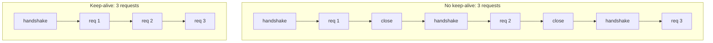

## Before you start

You need [connection-pooling](connection-pooling) — the reason a pool exists is that opening a connection is expensive, and this topic is about exactly how expensive and why. [tls-and-certificates](tls-and-certificates) covers the handshake itself; here we only care what it *costs*.

## In one sentence

A TLS handshake costs round trips and expensive asymmetric cryptography, but it is paid **once per connection** — so the fix is never faster crypto, it is opening fewer connections.

## Why it matters

There is a production failure that looks nothing like its cause. Throughput drops. p99 latency climbs from 40ms to 300ms. CPU is up on both sides. Nothing errors, no exception is thrown, no alert names a component. Every dashboard says "the network is slow" or "the upstream is slow", and a team spends two days on the upstream.

The actual cause is that a client stopped reusing connections and now performs a full TLS handshake for every single request. It is invisible because a handshake is not an error — it is normal work, just done thousands of times more often than needed.

Knowing the cost model tells you where to look. Knowing the specific trap below tells you what to look for.

## The intuition

A locked building where you meet the same colleague repeatedly.

Each visit: you buzz, they check the intercom, you show ID, they verify it, they buzz you in. Two exchanges through the door before a word of business. Then the meeting itself takes thirty seconds.

Setup dwarfs the work. And the fix is not a faster intercom. The fix is **not leaving**. Stay inside, have twenty conversations, walk out once. The door ritual is paid once instead of twenty times.

That is keep-alive. The expensive part is *arriving*, not *talking* — so stop re-arriving.

## How it actually works

Two separate costs, and conflating them is where the wrong fixes come from.

**Round trips.** A TLS 1.2 handshake needs two round trips before application data flows. TLS 1.3 cut that to one. On top of the TCP three-way handshake, a new HTTPS connection to a server 80ms away costs roughly 240ms on TLS 1.2 and 160ms on TLS 1.3 before your request even starts. This is pure latency — no faster hardware helps, because it is the speed of light and the distance.

**Asymmetric CPU.** The handshake does public-key operations: a signature over the key exchange, certificate verification, and under mTLS a *second* signature from the client. These are orders of magnitude more expensive than symmetric encryption. A server that handles bulk encryption for gigabits can be pinned by a few thousand handshakes per second.

After the handshake, both sides switch to a **symmetric** key — AES-GCM or ChaCha20 — which is fast and hardware-accelerated. Encrypting a megabyte over an established connection is nearly free.

So the shape of the cost is: **large fixed cost per connection, negligible marginal cost per byte.** That single sentence tells you the entire optimisation strategy. Not "encrypt less data". Not "use a faster cipher". **Open fewer connections.**



Three mechanisms drive the cost down, in order of how much they help:

**Keep-alive and pooling** amortise it toward zero. One handshake, then thousands of requests on that socket. A pool of ten sockets serving a million requests pays the cost ten times. This is the big win and everything else is a rounding error beside it.

**Session resumption** helps when you genuinely must reconnect. The server issues a session ticket; presenting it on a later connection skips certificate verification and the expensive asymmetric work, cutting a TLS 1.2 handshake to one round trip.

**0-RTT** goes further on TLS 1.3: the client sends its request *with* the first packet, alongside the resumption ticket, paying no round trip at all. The catch is that 0-RTT data is replayable by design, so it is safe only for idempotent requests — see [idempotency-and-retries](idempotency-and-retries).

## Worked example

Two clients, one server, same requests — one reusing a connection and one not. This runs as-is:

```js
const https = require('node:https');
const fs = require('node:fs');
const { execFileSync } = require('node:child_process');

// A throwaway self-signed cert, so the demo needs no setup files.
execFileSync('openssl', ['req', '-x509', '-newkey', 'rsa:2048', '-nodes', '-days', '1',
  '-subj', '/CN=localhost', '-keyout', '/tmp/hs.key', '-out', '/tmp/hs.crt']);
const selfsigned = {
  key: fs.readFileSync('/tmp/hs.key'),
  cert: fs.readFileSync('/tmp/hs.crt'),
};

let handshakes = 0;
const server = https.createServer(selfsigned, (req, res) => res.end('ok'));
server.on('secureConnection', () => handshakes++);   // ONE per TLS handshake

const N = 50;

async function run(label, agent) {
  handshakes = 0;
  const start = Date.now();
  for (let i = 0; i < N; i++) {
    await new Promise((resolve, reject) => {
      const req = https.request(
        { host: 'localhost', port: 8443, path: '/', agent, rejectUnauthorized: false },
        (res) => { res.resume(); res.on('end', resolve); });
      req.on('error', reject);
      req.end();
    });
  }
  const ms = Date.now() - start;
  console.log(`${label.padEnd(12)} ${N} requests  handshakes=${String(handshakes).padStart(2)}  ` +
              `total=${ms}ms  per-request=${(ms / N).toFixed(1)}ms`);
}

server.listen(8443, async () => {
  // keepAlive:false is Node's default for a *new* Agent — a fresh socket per request.
  await run('no keep-alive', new https.Agent({ keepAlive: false }));
  await run('keep-alive',    new https.Agent({ keepAlive: true, maxSockets: 1 }));
  server.close();
});
```

Output (loopback, so latency here is almost entirely handshake CPU — over a real network the gap is far larger):

```
no keep-alive 50 requests  handshakes=50  total=90ms  per-request=1.8ms
keep-alive    50 requests  handshakes= 1  total=10ms  per-request=0.2ms
```

The number that matters is `handshakes`. Fifty versus one for identical work. And note this is **loopback** — zero network latency, no round trips to pay, so that 9× gap is pure handshake CPU. In production, add two round trips of RTT per handshake: against a server 80ms away, the no-keep-alive run pays about 240ms of setup *per request* and the keep-alive run pays it once.

`server.on('secureConnection')` is the instrumentation to remember. It fires exactly once per completed TLS handshake, so `handshakes / requests` is a ratio you can graph. Healthy is near zero. At 1.0, you are handshaking on every request.

## A second example — when it gets harder

Now the trap, and it is the reason this topic exists.

You need mTLS to an upstream: a client certificate and a custom CA. So you build an agent to carry those TLS options:

```js
// BROKEN — and it will pass code review.
const agent = new https.Agent({
  cert: fs.readFileSync('client.crt'),
  key: fs.readFileSync('client.key'),
  ca: fs.readFileSync('ca.crt'),
});
```

Correct certificates. Working mTLS. Every call succeeds. And **`keepAlive` defaults to `false` on a newly constructed Agent**, so every request opens a fresh socket and performs a full mutual TLS handshake — now with *two* signatures instead of one, because the client authenticates too.

Nothing errors. There is no warning. Throughput quietly collapses and p99 climbs, and because you changed "auth configuration" rather than "connection handling", nobody connects the deploy to the symptom.

The general shape, which is worth memorising because it recurs far beyond TLS:

> **When you replace a default with a custom implementation, you inherit responsibility for every default you did not copy.**

The bespoke agent was created for one property — TLS options — and silently discarded a different one. It also happens with a custom pool losing timeouts, a custom logger losing redaction, a custom serialiser losing depth limits. The replacement is judged against the reason it was built, and the properties it dropped are invisible because they were never mentioned.

The fix is one line:

```js
const agent = new https.Agent({
  keepAlive: true,          // the property the bespoke path dropped
  maxSockets: 50,
  cert, key, ca,
});
```

It appears in other clients too. In `undici`, TLS options go in `new Agent({ connect: { cert, key, ca } })` — and if a code path builds that per call, or falls back to a non-pooling fetch helper when TLS options are present, you get the same silent full handshake per request. **Any time custom TLS options push you onto a different code path, check whether that path pools.**

**How to detect it.** This is the diagnostic sequence, in the order you should apply it:

1. **Count handshakes against requests.** Server-side, `secureConnection` per request. Client-side, listen for `secureConnect` on the socket. A ratio approaching 1.0 is the diagnosis, not a hint.
2. **Watch socket reuse events.** Node's agent emits `reuse` when a request gets a pooled socket. No `reuse` events under sustained load means no pooling.
3. **Compare socket count to request rate.** `netstat`/`ss` showing established connections roughly equal to requests per second means one connection per request. Ten steady sockets serving 5,000 rps is healthy; 5,000 sockets is not.
4. **Watch TIME_WAIT.** Thousands of sockets in `TIME_WAIT` on the client is the fingerprint of connection churn, and it eventually exhausts ephemeral ports too.
5. **Warm the pool and measure.** Fire a few requests, then measure. If latency drops sharply after the first few, setup cost is your latency. If it stays flat, the upstream really is slow — and you have just cleared the upstream instead of guessing.

Step 5 is the one that ends the argument, because it distinguishes "our client is churning connections" from "their service is slow" with one experiment.

## Quick reference

| Cost | Paid | Reduced by |
|---|---|---|
| TCP handshake (1 RTT) | Per connection | Keep-alive, pooling |
| TLS 1.2 handshake (2 RTT) | Per connection | TLS 1.3, resumption, pooling |
| TLS 1.3 handshake (1 RTT) | Per connection | Resumption, 0-RTT, pooling |
| Asymmetric crypto | Per handshake | Pooling, resumption |
| mTLS second signature | Per handshake | Pooling |
| Symmetric encryption | Per byte | Nothing — already cheap |

| Signal | Healthy | Broken |
|---|---|---|
| handshakes / requests | near 0 | approaching 1.0 |
| Agent `reuse` events | frequent | none |
| Established sockets | small, steady | tracks request rate |
| `TIME_WAIT` count | low | thousands |
| Latency after warming pool | unchanged | drops sharply |

## Tools & frameworks

| Tool | What it's for | Reach for it when |
|---|---|---|
| [Node.js `http.Agent`](https://nodejs.org/api/http.html#new-agentoptions) | `keepAlive` and pool sizing | Your handshake count is high and you have not yet checked the default agent |
| [undici](https://undici.nodejs.org/) | Pooled HTTP client with explicit dispatchers | You need real control over pooling and pipelining rather than agent defaults |
| [OpenSSL `s_client`](https://docs.openssl.org/) | Observe a full handshake against a resumed one | You need to prove session resumption is or is not happening |
| [Wireshark](https://www.wireshark.org/docs/) | Count handshakes on the wire | The client library claims it reuses connections and you want evidence |
| [k6](https://grafana.com/docs/k6/latest/) | Measure latency with and without reuse | You need to quantify what the handshake is actually costing you |

The reason this list is measurement-heavy is that a client can silently leave the pooled path, so measure handshakes rather than trusting configuration.

## Common mistakes

- Building a custom agent for TLS options and not setting `keepAlive: true`, so every request pays a full mutual handshake with nothing in the logs.
- Trying to fix handshake cost with a faster cipher or smaller payloads. The cost is per connection; payload size barely enters it.
- Creating a new agent per request, which defeats pooling even with `keepAlive: true` — the pool must outlive the request to be a pool.
- Concluding "the upstream is slow" without warming the pool first, when one experiment separates the two causes.
- Enabling 0-RTT for non-idempotent requests. Early data is replayable by design, so a replayed `POST /charge` charges twice.
- Setting `maxSockets` too low under concurrency, converting handshake cost into queueing delay — the same failure as an undersized database pool in [connection-pooling](connection-pooling).

## What interviewers ask

- **What does a TLS handshake actually cost?** — One or two round trips depending on version, plus asymmetric public-key operations that are far more expensive than bulk encryption. It is paid per new connection, not per request or per byte, which is why symmetric traffic afterwards is nearly free.
- **A service got slower after you added mTLS to an upstream and nothing errors. Where do you look?** — At whether the custom agent built for the certificate and CA kept connection reuse. A bespoke TLS path with `keepAlive` unset does a full mutual handshake per request, silently, so measure handshakes against requests before touching the upstream.
- **How do you prove connection churn rather than a slow upstream?** — Count handshakes per request and socket reuse events, compare established sockets to request rate, and warm the pool before measuring. If latency collapses after warming, setup cost was the latency; if it does not, the upstream genuinely is slow.
- **When is 0-RTT unsafe?** — Early data can be replayed by an attacker who captures it, so only idempotent requests are safe. A replayed state-changing request executes twice.
- **What is the general lesson from the custom-agent trap?** — Replacing a default makes you responsible for every default you did not copy. The replacement gets judged against the reason it was built, so the properties it silently dropped stay invisible until they show up as a performance mystery.

## Practice

1. Run the worked example, then add a third client that creates a *new* agent inside the loop with `keepAlive: true`. Predict the handshake count before running it, and explain the result.
2. Add `requestCert: true` and a client certificate so the demo does full mTLS. Compare the no-keep-alive timing against the one-way TLS run and account for the difference.
3. Add a fixed 60ms delay to loopback (`tc qdisc` on Linux, or a proxy that sleeps) and re-run both clients. Work out from first principles how much of the added per-request time is round trips versus CPU, then check your arithmetic against the measurement.

## Where to go next

Read [secure-defaults-and-common-footguns](secure-defaults-and-common-footguns) — the custom-agent trap is one instance of a pattern where a security-motivated change quietly removes a non-security property, and that topic collects the rest. For the operational side of the certificates that agent loads, see [certificate-lifecycle-and-rotation](certificate-lifecycle-and-rotation).
