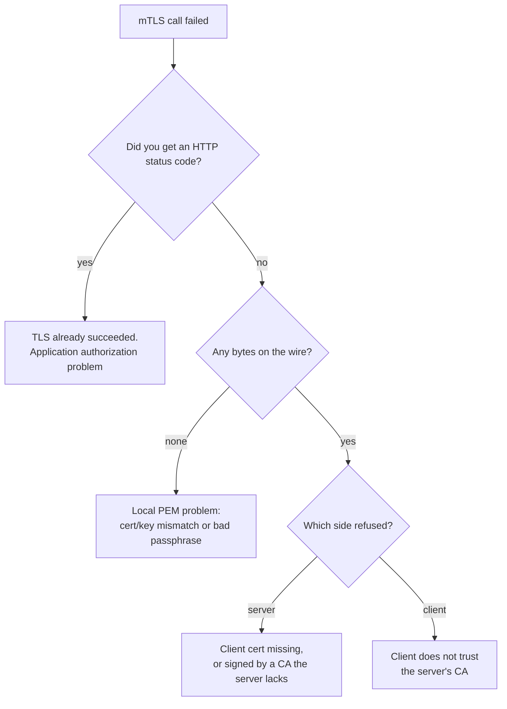

## Before you start

Read `mutual-tls-explained` first — this topic assumes you know what `CertificateRequest`, `CertificateVerify` and the two server switches are. `tls-and-certificates` covers chains and CAs, which are not re-explained here.

## In one sentence

When an mTLS call fails, the first question is not "which certificate is wrong" but **"did the handshake finish at all"** — because a handshake error and an HTTP error code point at completely different layers and completely different people.

## Why it matters

mTLS failures are notorious for producing errors that name the symptom and hide the cause. `ECONNRESET` tells you a socket closed. `SELF_SIGNED_CERT_IN_CHAIN` sounds like the wrong file is self-signed when nothing is. Teams lose hours swapping certificates at random because both sides hold three files each and any of the six can be wrong.

The failures are also asymmetric in a way that matters during an incident. Some happen on the client before a single packet leaves the machine. Some happen at the server's TLS layer, where your request handler never runs and your application logs stay completely silent. Some happen after the certificate already worked, in your own authorization code. Knowing which of those three you are in eliminates two thirds of the search space in one step.

## The intuition

Think of a secure building with a door and a receptionist.

The **door** is the TLS handshake. Guards check your ID and their own. If either check fails you never get inside, and the receptionist has no record you came — because you never reached the desk.

The **receptionist** is your application. Reaching the desk at all means the door already accepted your ID. If you are turned away here, it is not about who you are but about what you are allowed to do.

That gives you the split that organises everything else:

> **A handshake error is a certificate problem. An HTTP status code means the certificate already worked** — so a 401 or 403 is an application-layer authorization problem, not a TLS one.

The corollary is the part people miss in production. Rejected connections never reach the request handler. In Node.js they surface on a separate server event, `tlsClientError`. If you only log inside your handler, a server rejecting every client on earth looks completely idle.

## How it actually works

There are three distinct places an mTLS call can die, and they fail at different times.

**Before the socket opens (client-side, local).** Node parses your PEM material when it builds a secure context, before any network I/O. A certificate that does not pair with its key, or an encrypted key with no passphrase, throws *synchronously* right there. This is why the error never reaches an `error` event — it is a thrown exception, not a network event, and you must wrap the call in `try/catch` to see it cleanly. It also means zero bytes were sent, so packet captures show nothing.

**During the handshake (either side's trust).** Both sides are verifying. Either can refuse:

- The **server** refuses because the client sent no certificate, or sent one signed by a CA the server's `ca` option does not contain.
- The **client** refuses because it does not trust the *server's* certificate — the mirror-image failure, and the one people misdiagnose most often, because they are debugging client authentication and the failure is actually about server authentication.

**After the handshake (application layer).** You have an HTTP status code. TLS is done and it worked. A 403 here means your code looked at the verified identity and decided it was not allowed.



To tell *which* side refused, look at both ends at once. The server's `tlsClientError` fires when the server refuses; the client's error fires when the client refuses. If the server logged nothing and the client errored, the client rejected the server. If the server logged a rejection, the client's error is downstream of it.

## Worked example

Here is a server that logs at every layer, so you can see which one fires. Run it, then run each failing client against it.

```js
const https = require('node:https');
const fs = require('node:fs');
const P = (f) => fs.readFileSync(`./certs/${f}`, 'utf8');

const server = https.createServer(
  { cert: P('server-a.crt'), key: P('server-a.key'), ca: P('ca.crt'),
    requestCert: true, rejectUnauthorized: true },
  (req, res) => {
    // Layer 3: only reached if the handshake already succeeded.
    console.log('[REQ] handler ran');
    res.end('ok');
  },
);

// Layer 2a: handshake finished.
server.on('secureConnection', (s) =>
  console.log('[TLS] ok  authorized =', s.authorized, s.authorizationError ?? ''));

// Layer 2b: handshake REJECTED. The request handler above never runs.
server.on('tlsClientError', (err) =>
  console.log('[TLS] REJECTED:', err.code || err.message));

server.listen(4443, '127.0.0.1', () => console.log('listening'));
```

Now the client side. Wrapping in `try/catch` is not defensive noise — one scenario genuinely throws instead of emitting an error.

```js
const https = require('node:https');
const fs = require('node:fs');
const P = (f) => fs.readFileSync(`./certs/${f}`, 'utf8');

function call(label, tls) {
  return new Promise((resolve) => {
    let req;
    try {
      req = https.request(
        { host: '127.0.0.1', port: 4443, path: '/', servername: 'localhost', ...tls },
        (res) => { res.resume(); console.log(label, '-> HTTP', res.statusCode); resolve(); },
      );
      req.on('error', (e) => { console.log(label, '-> network error', e.code); resolve(); });
      req.end();
    } catch (e) {
      // Thrown SYNCHRONOUSLY: no socket was ever opened.
      console.log(label, '-> threw locally', e.code, '(no connection made)');
      resolve();
    }
  });
}

const good = { cert: P('client.crt'), key: P('client.key'), ca: P('ca.crt') };

(async () => {
  await call('1 happy path      ', good);
  await call('3 no client cert  ', { ca: P('ca.crt') });
  await call('5 cert/key mismatch', { cert: P('client.crt'), key: P('server-a.key'), ca: P('ca.crt') });
  await call('6 client distrusts ', { cert: P('client.crt'), key: P('client.key') });
})();
```

Client output:

```
1 happy path       -> HTTP 200
3 no client cert   -> network error ERR_SSL_TLSV13_ALERT_CERTIFICATE_REQUIRED
5 cert/key mismatch -> threw locally ERR_OSSL_X509_KEY_VALUES_MISMATCH (no connection made)
6 client distrusts  -> network error SELF_SIGNED_CERT_IN_CHAIN
```

Server output for the same run:

```
[TLS] ok  authorized = true
[REQ] handler ran
[TLS] REJECTED: ERR_SSL_PEER_DID_NOT_RETURN_A_CERTIFICATE
[TLS] REJECTED: ERR_SSL_TLSV1_ALERT_UNKNOWN_CA
```

Read the two logs together and the diagnosis falls out. Scenario 1 appears in both, at both layers. Scenario 3 appears on both sides — the server names the real cause (`PEER_DID_NOT_RETURN_A_CERTIFICATE`) while the client only sees the alert it was sent. **Scenario 5 appears in the client log only, and not even as a network error** — the server never saw a connection, because there was none. Scenario 6 is the mirror image: the client refused the server, and the client's message says `SELF_SIGNED_CERT_IN_CHAIN` even though nothing here is self-signed — it means "the chain ends at a certificate I have no root for", which is what happens when you forget to pass `ca`.

Scenario 5 deserves the extra emphasis. It fails before any network I/O because the PEM material is parsed up front. That is a feature, not a quirk: it means a platform can validate an uploaded certificate bundle at save time, offline, without contacting anything. The check is simply that the public key inside the certificate is byte-identical to the public key derived from the private key file. That is all "the cert and key are a pair" means.

## A second example — when it gets harder

Two cases break the naive model.

**A genuine certificate from the wrong CA.** The client presents a perfectly valid, unexpired, correctly-paired certificate — issued by a different CA than the one in the server's `ca` option. Nothing is malformed. Every field is right. The server still refuses, because validity and trust are different properties: `valid cert != trusted cert`. The tell is that the client-side error is often just `ECONNRESET` — a bare socket close with no explanation — while the *server* log carries the actual reason. This is the strongest argument for always checking both sides' logs before touching a single file.

**Two auth layers failing independently.** A request can carry a client certificate at TLS *and* a bearer token at HTTP. They are independent, so you get four outcomes: both fine (200), certificate fine and token bad (**401 or 403** — and this is now emphatically not a TLS problem, since the handshake demonstrably succeeded), certificate bad (handshake error, and the token never even gets read because HTTP never starts), or both bad (you see only the handshake error, since TLS fails first). The order matters: a bad certificate masks a bad token completely. Fix the layer that fails first or you will chase a phantom.

Finally, the encrypted-key case. If the private key file is passphrase-protected and you pass no `passphrase`, you get a local `ERR_OSSL_UNSUPPORTED` or a bad-decrypt error at secure-context creation — again before any socket. Many platforms simply reject encrypted keys at upload rather than store a passphrase, which is why "works with `openssl`, fails in my app" often comes down to `openssl` prompting you interactively for something your app was never given.

## Quick reference

| Scenario | Error you see | Which layer | Whose trust is missing |
|---|---|---|---|
| Valid cert, valid token | `200` | none | — |
| Valid cert, bad token | `401` / `403` | application | none — TLS worked |
| No client cert | `ERR_SSL_TLSV13_ALERT_CERTIFICATE_REQUIRED` (client) / `ERR_SSL_PEER_DID_NOT_RETURN_A_CERTIFICATE` (server) | TLS handshake | server wanted a cert |
| Cert from wrong CA | `ECONNRESET` (client) / `ALERT_UNKNOWN_CA` (server) | TLS handshake | server's `ca` lacks that issuer |
| Cert and key mismatched | `ERR_OSSL_X509_KEY_VALUES_MISMATCH` | **local, pre-socket** | nobody — bad file pairing |
| Encrypted key, no passphrase | `ERR_OSSL_UNSUPPORTED` / bad decrypt | **local, pre-socket** | nobody — unreadable key |
| Client distrusts server | `SELF_SIGNED_CERT_IN_CHAIN` | TLS handshake | client's `ca` is missing |
| `rejectUnauthorized: false` on client | `200` (silently insecure) | none | client verified nothing |

## Tools & frameworks

| Tool | What it's for | Reach for it when |
|---|---|---|
| [OpenSSL `s_client`](https://docs.openssl.org/) | Reproduce the handshake outside your app | First move in any mTLS incident — it separates the client from the application |
| [Wireshark](https://www.wireshark.org/docs/) | See which side sent the alert | You need to know whether the client or the server did the rejecting |
| [testssl.sh](https://testssl.sh/) | Enumerate accepted certificates, CAs and ciphers | You want to confirm what the server will actually accept, not what it is configured to accept |
| [cert-manager](https://cert-manager.io/docs/) | Inspect Certificate and Order status | The real failure is that the certificate was never issued, not a handshake bug |
| [crt.sh](https://crt.sh/) | Certificate Transparency search | You need to verify a public certificate exists and check the SANs it carries |

## Common mistakes

- Debugging only the client. Half the failures are only explained by the server's log, and `ECONNRESET` is exactly the case where the client knows nothing.
- Logging only inside the request handler. Rejected connections never get there; you need `tlsClientError`.
- Reading `SELF_SIGNED_CERT_IN_CHAIN` literally. It usually means you forgot to pass `ca`, not that any certificate is self-signed.
- Treating a 403 as a certificate problem. A status code proves the handshake succeeded — look at your authorization code.
- Not wrapping the request in `try/catch`, then concluding "nothing happened" when a cert/key mismatch threw synchronously past your `error` handler.
- Swapping certificates before checking pairing. Verify the cert/key public keys match first; it is a local, instant, offline check.
- Reaching for `rejectUnauthorized: false` to make the error go away. It converts a loud failure into a silent insecurity — see `secure-defaults-and-common-footguns`.

## What interviewers ask

- **An mTLS call fails. What is your first question?** — Did I get an HTTP status code? A status code means TLS already succeeded and this is an authorization bug; no status code means a certificate problem at the handshake.
- **Your server rejects every client but the application logs are empty. Why?** — Rejections happen at the TLS layer and never reach the request handler; you have to listen on `tlsClientError`.
- **The client sends a valid, unexpired certificate and still gets rejected. How?** — It was signed by a CA the server does not trust. Validity and trust are different properties, and the client often sees only `ECONNRESET` while the server logs `unknown CA`.
- **What does `SELF_SIGNED_CERT_IN_CHAIN` on the client actually mean?** — The chain ended at a certificate for which the client has no trusted root — typically because `ca` was not passed — not that anything is genuinely self-signed.
- **Why does a mismatched cert and key produce no network traffic?** — The PEM material is parsed when the secure context is created, before a socket opens, so it throws synchronously and nothing is ever sent.
- **You have both a client certificate and a bearer token and get a 401. Which do you investigate?** — The token. The 401 proves the handshake completed, so the certificate is fine.

## Practice

1. Stand up the logging server above and reproduce all four client scenarios. For each, write down which of the three layers fired and which side's log named the real cause.
2. Issue a second CA and a certificate signed by it. Present that certificate to the original server. Capture both sides' errors and explain why the client's message is less informative than the server's.
3. Encrypt a private key with `openssl rsa -aes256`, point your client at it without a passphrase, and confirm from a packet capture that zero bytes crossed the wire.
4. Given only the string `ERR_SSL_PEER_DID_NOT_RETURN_A_CERTIFICATE` from a server log, write the three-step check you would run, in order, before changing any configuration.
5. Optional hands-on: the runnable lab at `mtls-demo` ships all seven scenarios in `client.js`, including the wrong-CA and insecure-escape-hatch cases, with both servers logging at handshake and request level so you can watch the split live.

## Where to go next

Continue to `secure-defaults-and-common-footguns`. Every failure here was loud — an error told you something was wrong. The more dangerous configurations are the ones that *succeed* while enforcing nothing, and that topic is about recognising them before they reach production.
