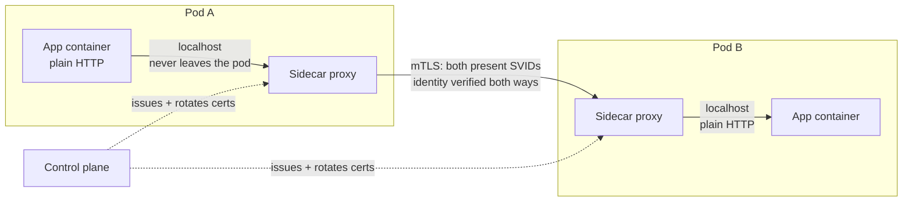

## Before you start

You need [workload-identity-and-spiffe](workload-identity-and-spiffe) — the certificates in this topic are SVIDs, issued by attestation and rotated automatically. [service-discovery-and-mesh](service-discovery-and-mesh) covers what a sidecar, a data plane, and a control plane are, and what a mesh costs in general; this topic assumes all of that and focuses only on the encryption and authentication part.

## In one sentence

A mesh gives you mutual TLS between every pair of services by putting a proxy beside each one and having the *proxies* do the handshake — so your application keeps making plain HTTP calls and gets authenticated, encrypted traffic anyway.

## Why it matters

Adding mTLS to twelve services by hand means twelve codebases each loading a certificate and key, each with its own HTTP client configuration, each needing a rotation story, in whatever languages you happen to use. Some team will get `rejectUnauthorized` wrong. Some service will pin a certificate that expires on a Sunday. Some Python service will do it differently from the Go one.

The mesh removes the work rather than distributing it. Encryption and caller authentication become properties of the platform, applied identically everywhere, changed by editing configuration instead of shipping code in twelve repositories.

That is the promise. The interesting part is how the traffic actually flows, and how you get there without breaking a running fleet.

## The intuition

Think of two office buildings that need to exchange confidential documents.

You could train every employee in encryption: each person seals their own envelopes, verifies signatures, and manages their own wax seal. Twelve departments, twelve interpretations, one person who forgets.

Instead you put a **mail room** at each building's exit. Employees drop unsealed documents into an internal chute — no training, no keys, nothing to get wrong. The mail room seals everything, verifies the receiving mail room's credentials before handing anything over, and refuses unrecognised couriers. The receiving mail room unseals and delivers plain documents internally.

Every employee still thinks they are dropping paper down a chute. All confidentiality lives in the mail rooms.

The chute matters: it never leaves the building. Documents travel unsealed only *inside* the building, where physical security already applies. That is the sidecar model precisely — plaintext on loopback, encrypted the moment it touches the network.

## How it actually works

Your application makes a request to `http://billing:8080`. No TLS, no certificate, no code change. Here is what really happens:



Traffic is redirected into the sidecar transparently — usually by iptables rules or an eBPF hook installed when the pod starts — so the application's outbound connection is intercepted without it knowing. The app connects to what it thinks is `billing`; the connection actually terminates in its own sidecar on loopback.

The sidecar resolves a real endpoint, then opens a **mutual TLS** connection to the destination sidecar. Both proxies present certificates. Both verify the other's. Each side ends up knowing the other's workload identity, which is the whole point — encryption you could get from one-way TLS, but *knowing which service is calling* requires the client certificate.

On the receiving side the destination sidecar terminates TLS and forwards plain HTTP over loopback to its own application container.

So there are three hops, and only the middle one is encrypted. The two plaintext hops never touch the network — they stay inside a pod's network namespace, where anything able to read them already has code execution in your pod.

**Certificates are the mesh's problem, not yours.** The control plane issues each sidecar a short-lived certificate carrying its workload identity, and rotates it in the background — typically every 24 hours or less, often hourly. No developer opens a certificate file. No PEM lands in a Git repository. Expiry stops being an incident class, because nothing lives long enough to be forgotten.

Now the part that decides whether your rollout succeeds.

**STRICT versus PERMISSIVE.** In **STRICT** mode a workload accepts *only* mTLS; plaintext connections are refused. In **PERMISSIVE** mode it accepts both, using mTLS when the caller offers it and falling back to plaintext otherwise. PERMISSIVE is normally the default, and that default is deliberate.

You cannot flip a live fleet to STRICT at once. The moment you do, every caller that does not yet have a sidecar — a legacy VM, a service whose injection failed, a monitoring agent, a job in another namespace — is refused. Those callers had been working a second earlier, and they break simultaneously.

So the migration is ordered, and the ordering is the exam question:

1. **Inject sidecars everywhere first**, while everything stays PERMISSIVE. Nothing changes behaviourally: mTLS starts happening between pods that both have proxies, plaintext still works for those that do not.
2. **Verify** that no plaintext traffic remains — this is the step people skip and the reason rollouts fail. Mesh telemetry labels each connection's security posture, so you query for plaintext connections *to* the workload you intend to lock down. Zero plaintext, sustained across a full traffic cycle including nightly batch jobs and weekly reports, is your gate.
3. **Tighten narrowly.** Set STRICT on one workload, or one namespace, and watch it. Not mesh-wide.
4. **Widen** once each step holds, finishing with a mesh-wide policy.

Reverse steps 1 and 2 and you have an outage. Skip step 2 and you have a *scheduled* outage, appearing whenever that once-a-week plaintext caller next runs.

**What zero trust means here, concretely.** Perimeter thinking says: put a firewall or VPN at the boundary, and treat anything inside as trusted. Being on the network *is* the credential. One compromised pod, one misconfigured security group, one contractor's laptop on the VPN, and the attacker moves laterally through a flat trusted interior.

Zero trust says network position grants nothing. Every connection is authenticated on its own merits, at every hop, regardless of where it came from. A mesh implements this literally: a compromised pod trying to reach the billing service must present a valid workload identity that policy permits, and "I am inside the cluster" is not an argument. That is why mTLS everywhere is the foundational mechanism rather than a nice extra — without authenticated identity on every hop, there is nothing for policy to act on.

## Worked example

The two modes as an accept-or-refuse decision, which is all they are:

```js
const MODE = { STRICT: 'STRICT', PERMISSIVE: 'PERMISSIVE' };

function sidecarAccepts(mode, conn) {
  if (conn.mtls) return { allowed: true, peer: conn.peerIdentity };
  // Plaintext: refused under STRICT, allowed with NO identity under PERMISSIVE.
  if (mode === MODE.STRICT) {
    return { allowed: false, reason: 'plaintext rejected: STRICT requires mTLS' };
  }
  return { allowed: true, peer: null };   // null peer -> no caller identity at all
}

const fromMeshedPod  = { mtls: true,  peerIdentity: 'spiffe://prod/ns/orders/sa/api' };
const fromLegacyVm   = { mtls: false };

for (const mode of [MODE.PERMISSIVE, MODE.STRICT]) {
  console.log(mode, 'meshed :', sidecarAccepts(mode, fromMeshedPod));
  console.log(mode, 'legacy :', sidecarAccepts(mode, fromLegacyVm));
}
```

Output:

```
PERMISSIVE meshed : { allowed: true, peer: 'spiffe://prod/ns/orders/sa/api' }
PERMISSIVE legacy : { allowed: true, peer: null }
STRICT meshed : { allowed: true, peer: 'spiffe://prod/ns/orders/sa/api' }
STRICT legacy : { allowed: false, reason: 'plaintext rejected: STRICT requires mTLS' }
```

The line to stare at is `PERMISSIVE legacy`. It is `allowed: true` with `peer: null` — the connection succeeded and **carries no caller identity whatsoever**. Any authorisation policy written in terms of caller identity cannot evaluate it. Depending on how your policy handles a missing principal, that request is either denied confusingly or allowed silently.

This is why PERMISSIVE is a migration state and not a destination. Everything looks healthy, dashboards are green, and you have a plaintext bypass around the security model you believe you deployed.

## A second example — when it gets harder

The subtle trap: **the application makes its own TLS connection.**

Say `orders` was hardened last year and calls `https://billing:8443` directly, with its own certificate and CA bundle. Now you add the mesh. The sidecar intercepts an outbound connection whose payload is already a TLS handshake — bytes it cannot read, route on, or add mTLS to. Depending on configuration you get one of three outcomes, and all three confuse people:

- The proxy passes it through opaquely as TCP. It still works, but you have **no mesh mTLS on that path** and no Layer 7 telemetry. Your dashboard shows 100% mTLS coverage for services you can actually see, and this one is invisible.
- The proxy tries to originate its own TLS to a port already expecting a handshake, and you get double encryption or a handshake failure that looks like a certificate problem in the wrong place.
- It works fine but you are paying two handshakes and two encryption passes for one hop.

The fix is to let the application speak plain HTTP to the mesh and delete its bespoke TLS code, which feels wrong ("we are removing encryption!") and is right — the plaintext hop is loopback-only, and the network hop is now mTLS with real workload identity instead of one-way TLS with a hand-managed certificate.

The related trap is **traffic that bypasses the sidecar entirely**. Interception is done by rules matching ports and protocols. Traffic on an excluded port, to an IP outside the mesh's range, or on a protocol the proxy is not configured to handle, leaves the pod without ever entering the sidecar — unencrypted, unauthenticated, uncounted. It does not appear as a violation, because from the mesh's point of view it never happened.

Both traps have the same shape and it is worth naming: **the mesh secures the traffic it sees, and your dashboard measures the traffic it sees.** Coverage metrics cannot report on flows that never reached a proxy. So before tightening to STRICT, verify from the *destination* side — what did this workload actually accept? — rather than trusting an aggregate coverage number.

## Quick reference

| Hop | Encrypted? | Why |
|---|---|---|
| App → own sidecar | No | Loopback; never leaves the pod's namespace |
| Sidecar → sidecar | Yes, mTLS | The only hop crossing the network |
| Sidecar → own app | No | Loopback again |

| Mode | Accepts mTLS | Accepts plaintext | Caller identity | Use for |
|---|---|---|---|---|
| STRICT | Yes | No | Always present | The end state |
| PERMISSIVE | Yes | Yes | Missing on plaintext | Migration only |
| DISABLE | No | Yes | Never | Narrow exceptions, e.g. health probes |

| mTLS-specific cost | Effect |
|---|---|
| Handshakes at scale | Asymmetric crypto per new connection; proxies pool to amortise it |
| Symmetric encryption | Cheap per byte, but nonzero at high throughput |
| Certificate rotation traffic | Every pod talks to the control plane on a cycle |
| Control plane on critical path | Cannot issue certs → new pods cannot authenticate |
| Debugging | `curl` from a shell bypasses the sidecar and behaves differently from real traffic |

## Common mistakes

- Enabling STRICT mesh-wide before verifying zero plaintext, breaking every un-meshed caller at once.
- Treating PERMISSIVE as a finished state. Plaintext connections still succeed with no caller identity, so the security model you believe you have is bypassable.
- Verifying with a coverage dashboard instead of destination-side telemetry, so traffic that never entered a proxy is silently excluded from the number that gates your rollout.
- Leaving application-level TLS in place under the mesh, producing opaque pass-through, double encryption, or handshake errors that point at the wrong layer.
- Assuming mTLS gives you authorisation. It authenticates the caller; deciding whether that caller may call this path is a separate policy layer that consumes the identity.
- Debugging with `curl` from inside a container and concluding mTLS is broken, when the shell's traffic took a different interception path than the application's.

## What interviewers ask

- **How does an application get mTLS without any code change?** — Traffic is transparently redirected into a sidecar proxy in the same pod. The app talks plain HTTP over loopback; the sidecar opens mutual TLS to the destination sidecar, which terminates it and forwards plaintext over loopback to its app. Only the network hop is encrypted, and the plaintext hops never leave a pod.
- **What is the difference between STRICT and PERMISSIVE, and why is PERMISSIVE the default?** — STRICT accepts only mTLS; PERMISSIVE accepts both. PERMISSIVE is default because you cannot convert a live fleet atomically: it lets meshed pods use mTLS while un-meshed callers keep working during rollout.
- **Walk me through migrating a live fleet to STRICT.** — Inject sidecars everywhere while staying PERMISSIVE, then verify from destination-side telemetry that no plaintext connections remain across a full traffic cycle including batch jobs, then set STRICT on one workload or namespace and observe, then widen. Verification before tightening is the step that makes it safe.
- **What does zero trust mean concretely here?** — Network location grants no privilege. Every hop is authenticated with a workload identity and authorised by policy, so a compromised pod inside the cluster cannot move laterally just by being inside — unlike perimeter or VPN models where the interior is implicitly trusted.
- **What are the mTLS-specific costs?** — Handshake CPU per new connection, ongoing symmetric encryption, certificate rotation traffic to every pod, a control plane whose failure stops new pods from getting usable identities, and debugging that is harder because a proxy sits between every two services and shell traffic does not follow the same path.

## Practice

1. Extend `sidecarAccepts` with an authorisation step that only allows peers matching `spiffe://prod/ns/orders/*`. Then feed it the PERMISSIVE plaintext connection and decide what your policy should do with a null principal. Justify deny-by-default.
2. Write the migration runbook for a 40-service fleet where three services run on VMs outside the mesh. State the order, the exact verification gate before each tightening, and the rollback step.
3. A workload shows 100% mTLS in the coverage dashboard but a weekly job still reaches it in plaintext. Explain how both facts can be true, and describe a check that would have caught it.

## Where to go next

Continue to [tls-termination-and-passthrough](tls-termination-and-passthrough) — inside the mesh identity flows on the connection, but at the edge a load balancer or CDN terminates TLS and that identity is destroyed unless you deliberately carry it forward. For what breaks when this is misconfigured, read [mtls-failure-modes](mtls-failure-modes).
